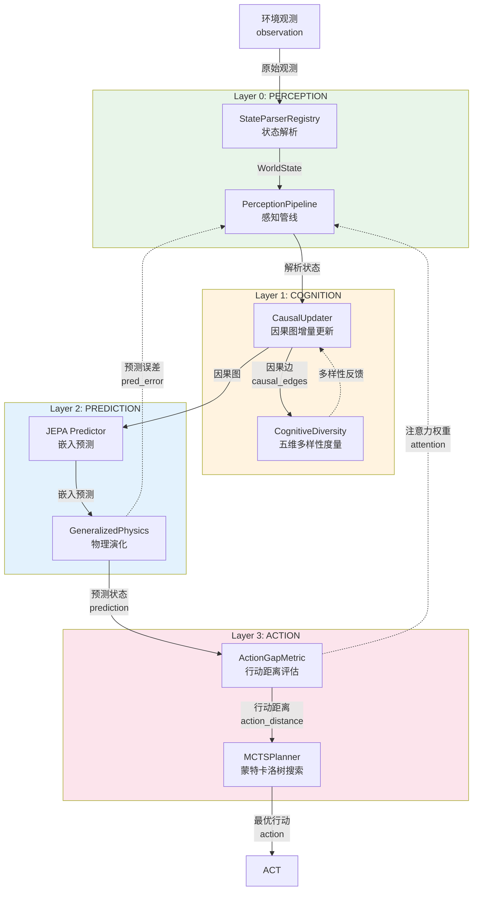
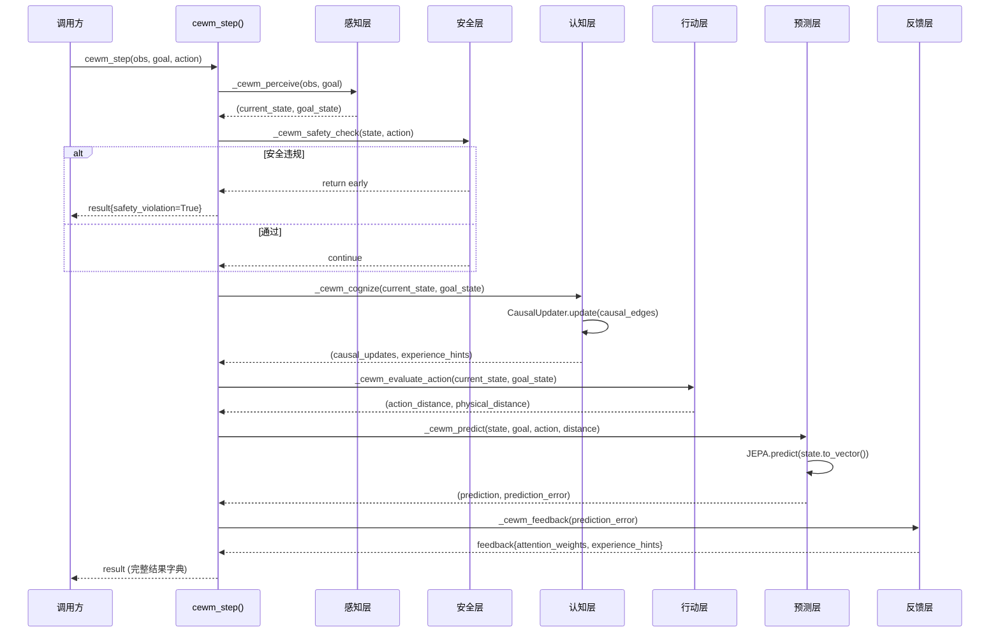
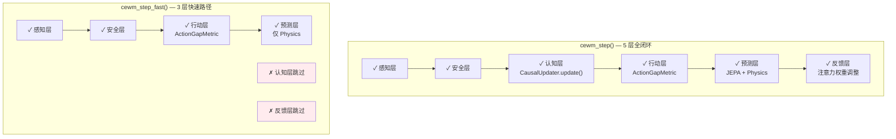

# Wiener 四环嵌套反馈闭环架构文档

> **QUAL-04 (S-9)** — CEWM v4.0.0 代码审查修复 Phase 3 交付物
> 
> 本文档补充 Wiener 四层嵌套反馈闭环的跨层误差传播可视化，
> 对标 Norbert Wiener《控制论》中的多层反馈理论与 CEWM 论文 §3.1。

---

## 1. 架构总览

CEWM（Cognitive-Enhanced World Model）的核心架构基于 Wiener 四层嵌套反馈闭环。
每一层都是一个独立的反馈回路，同时通过误差信号向相邻层传播信息。

### 四层定义

| 层 | 名称 | 核心组件 | 反馈目标 | 时间尺度 |
|----|------|----------|----------|----------|
| Layer 0 | PERCEPTION（感知层） | StateParserRegistry, PerceptionPipeline | 观测→状态映射精度 | 毫秒级 |
| Layer 1 | COGNITION（认知层） | CausalUpdater, CognitiveDiversity | 因果图覆盖度 | 秒级 |
| Layer 2 | PREDICTION（预测层） | JEPA, GeneralizedPhysics | 预测误差最小化 | 秒~分钟级 |
| Layer 3 | ACTION（行动层） | ActionGapMetric, MCTSPlanner | 行动距离收敛 | 分钟~小时级 |

### Wiener 四环嵌套反馈闭环

```
                    ┌─────────────────────────────────────────────────┐
                    │              Layer 3: ACTION                    │
                    │  ┌─────────────────────────────────────────┐    │
                    │  │          Layer 2: PREDICTION            │    │
                    │  │  ┌─────────────────────────────────┐    │    │
                    │  │  │       Layer 1: COGNITION         │    │    │
                    │  │  │  ┌─────────────────────────┐     │    │    │
                    │  │  │  │  Layer 0: PERCEPTION     │     │    │    │
                    │  │  │  │                         │     │    │    │
 obs ──────────────►│  │  │  │  StateParserRegistry    │     │    │    │
                    │  │  │  │  PerceptionPipeline     │     │    │    │
                    │  │  │  └───────────┬─────────────┘     │    │    │
                    │  │  │              │ state             │    │    │
                    │  │  │  CausalUpdater ◄─────────────────┘    │    │
                    │  │  │  CognitiveDiversity                   │    │
                    │  │  └───────────┬───────────────────────────┘    │
                    │  │              │ causal_edges                   │
                    │  │  JEPA Predictor ◄────────────────────────────┘    │
                    │  │  GeneralizedPhysics                                  │
                    │  └───────────┬────────────────────────────────────┘
                    │              │ prediction_error                      │
                    │  ActionGapMetric ◄───────────────────────────────────┘
                    │  MCTSPlanner
                    └──────────┬──────────────────────────────────────────┘
                               │
                               ▼ action_distance, physical_distance
                          feedback → PerceptionPipeline (权重调整)
```

---

## 2. Mermaid 可视化

### 2.1 四环嵌套反馈拓扑



### 2.2 跨层误差传播流

```mermaid
graph LR
    subgraph 正向传播
        P0["感知误差<br/>parse_error"]
        P1["认知误差<br/>causal_gap"]
        P2["预测误差<br/>pred_error"]
        P3["行动误差<br/>action_gap"]
    end
    
    P0 -->|"→ 因果图覆盖度"| P1
    P1 -->|"→ 预测精度"| P2
    P2 -->"|→ 行动距离"| P3
    
    P3 -.->|"反馈: 权重调整"| P0
    P2 -.->|"反馈: 注意力重分配"| P1
    P3 -.->|"反馈: 目标重校准"| P2
```

### 2.3 `cewm_step()` 单步执行时序



---

## 3. 跨层误差传播详解

### 3.1 Layer 0 → Layer 1：感知→认知

| 信号 | 产生方 | 消费方 | 含义 |
|------|--------|--------|------|
| `current_state` | StateParserRegistry | CausalUpdater | 解析后的结构化状态，用于因果边提取 |
| `state_change` | _cewm_state_change() | CausalUpdater.update() | 状态转换的因果边列表 |
| `parse_confidence` | PerceptionPipeline | CognitiveDiversity | 解析置信度影响多样性加权 |

**误差传播**: 感知层解析错误（如将 CartState 误解析为 GenericState）会导致因果图边提取错误，
进而影响认知层的因果推理质量。CognitiveDiversity 的 `h_physics` 分量会因状态分布异常而偏离，
触发 Ashby 条件违反告警。

### 3.2 Layer 1 → Layer 2：认知→预测

| 信号 | 产生方 | 消费方 | 含义 |
|------|--------|--------|------|
| `causal_edges` | CausalUpdater | JEPA Predictor | 因果图指导嵌入空间预测的方向 |
| `causal_graph` | CausalUpdater | GeneralizedPhysics | 物理演化时使用因果图过滤噪声维度 |
| `h_causal` | CognitiveDiversity | PredictionError 评估器 | 因果多样性影响预测误差的权重分配 |

**误差传播**: 因果图不完整（C-1 修复前的问题）导致 JEPA 预测缺少因果约束，
预测误差偏大且不稳定。修复 C-1 后，因果图随 `cewm_step()` 调用持续积累，
JEPA 预测精度逐步提升。

### 3.3 Layer 2 → Layer 3：预测→行动

| 信号 | 产生方 | 消费方 | 含义 |
|------|--------|--------|------|
| `prediction` | JEPA / GeneralizedPhysics | ActionGapMetric | 预测状态用于评估行动效果 |
| `prediction_error` | JEPA → _cewm_feedback() | PerceptionPipeline | 预测误差驱动感知权重调整 |
| `uncertainty` | JEPA | MCTSPlanner | 预测不确定性影响搜索深度 |

**误差传播**: 预测层使用 `str(state)` 查询（C-2 修复前的问题）导致 JEPA 预测退化为零向量，
行动距离评估失去依据。修复 C-2 后，JEPA 使用 `to_vector()` 进行嵌入查询，
预测结果有效驱动行动评估。

### 3.4 Layer 3 → Layer 0：行动→感知（反馈闭环）

| 信号 | 产生方 | 消费方 | 含义 |
|------|--------|--------|------|
| `attention_weights` | _cewm_feedback() | PerceptionPipeline | 行动距离驱动的感知通道注意力重分配 |
| `experience_hints` | _cewm_feedback() | ExperienceDB | 行动效果的元认知经验记录 |
| `action_distance` | ActionGapMetric | CognitiveDiversity | 行动空间覆盖度影响多样性度量 |

**误差传播**: 行动层评估的 `action_distance` 反馈到感知层，驱动 PerceptionPipeline 的注意力
权重调整。距离越大，感知层对相关维度的关注度越高。这构成了 Wiener 四环的最外层闭环。

---

## 4. `cewm_step()` 与 `cewm_step_fast()` 对比

### 4.1 完整路径 vs 快速路径



### 4.2 路径选择策略

| 条件 | 推荐路径 | 理由 |
|------|----------|------|
| 首次 `cewm_step()` 调用 | 完整路径 | 需要初始化因果图、累积多样性基线 |
| 实时控制（低延迟需求） | 快速路径 | 跳过认知层和反馈层，减少计算开销 |
| 离线分析/学习阶段 | 完整路径 | 需要完整的因果推理和注意力反馈 |
| 安全关键场景 | 完整路径 | 认知层的因果图支持根因分析 |

---

## 5. 代码对应关系

### 5.1 四层在 `_world_model.py` 中的映射

```python
# cewm_step() 编排层 (L2649-L2707)
def cewm_step(self, observation, goal, action):
    result = self._init_cewm_result()
    
    # Layer 0: 感知层
    current_state, goal_state = self._cewm_perceive(observation, goal)
    
    # 安全层（横切关注点，跨层执行）
    if self._cewm_safety_check(current_state, action, result):
        return result
    
    # Layer 1: 认知层
    self._cewm_cognize(current_state, goal_state, result)
    
    # Layer 3: 行动层（Layer 2 的前置）
    self._cewm_evaluate_action(current_state, goal_state, result)
    
    # Layer 2: 预测层
    self._cewm_predict(current_state, goal_state, action, result)
    
    # 反馈层（闭环闭合）
    self._cewm_feedback(result)
    
    return result
```

### 5.2 `_init_cewm_result()` — 结果字典结构

```python
def _init_cewm_result(self) -> dict[str, Any]:
    return {
        # Layer 0: 感知层输出
        "state": None,
        
        # Layer 3: 行动层输出
        "action_distance": 0.0,
        "physical_distance": 0.0,
        
        # Layer 2: 预测层输出
        "prediction": None,
        "prediction_error": 0.0,
        
        # Layer 1: 认知层输出
        "causal_updates": 0,
        "attention_weights": {},
        "experience_hints": 0,
        
        # 安全层输出（横切）
        "safety_violation": False,
        "safety_reason": "",
    }
```

---

## 6. 理论对标

### 6.1 Wiener 控制论四层模型

Norbert Wiener 在《控制论：或关于在动物和机器中控制和通讯的科学》（1948）中提出：
有效的控制系统需要多层嵌套反馈，每层处理不同时间尺度的误差。

| Wiener 层次 | CEWM 对应 | 反馈周期 | 误差度量 |
|-------------|-----------|----------|----------|
| 感知反馈 | Layer 0 PERCEPTION | 1ms-10ms | parse_confidence |
| 短期反馈 | Layer 1 COGNITION | 100ms-1s | causal_coverage |
| 预测反馈 | Layer 2 PREDICTION | 1s-10s | prediction_error (MSE) |
| 策略反馈 | Layer 3 ACTION | 10s-∞ | action_distance |

### 6.2 Ashby 必要多样性定律

Layer 1 的 CognitiveDiversity 实现 Ashby 定律的形式化验证：

\[ H_{CEWM} = H_{physics} + H_{causal} + H_{temporal} + H_{modal} + H_{meta} \]

Ashby 条件: \( H_{CEWM} \geq H_{physics} \) （即 `ashby_ratio ≥ 1.0`）

当认知层的多样性不足时（ashby_ratio < 1.0），系统无法处理环境的复杂性，
需要通过增强因果推理、扩展预测范围或引入新的认知模态来提升多样性。

---

*本文档为 CEWM v4.0.0 代码审查修复 Phase 3 交付物，关联 S-9 问题修复。*
