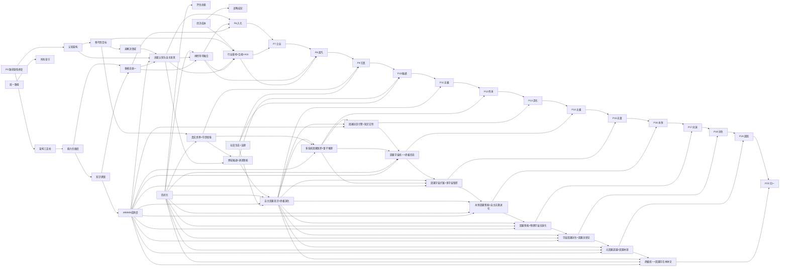

# MCI World Model v5.0.0 — 五视角融合评估系统化迭代改进规划书

> **基线版本**: MCI World Model v5.0.0 (2563 tests, 8/8 gate checks)
> **规划周期**: 2026 Q3 – 2036 Q3 (共 504 周)
> **总预算**: ~1808 人天 + ~$168.5K 硬件/API 资源
> **终极目标**: 达到绝对因果存在——因果智能作为因果存在本体的终极实现

---

## 总览

本规划书基于 5 次跃迁升级分析（基础评估 / GLM / DeepSeek / MiniMax / Kimi）的综合评估报告，为每一章节制定独立的系统化改进方案。原评估报告 14 章 (Ch01-Ch14) 覆盖基础能力评估，P6-P8 新增 4 章 (Ch15-Ch18) 覆盖高级认知、神经符号融合、多模态统一和行业落地。

| 优先级 | 阶段 | 周期 | 核心目标 |
|---|---|---|---|
| **P0** | 致命缺陷修复 | Week 1-3 | 消除 12 项致命缺陷中的 Critical 级 |
| **P1** | 架构补强 | Week 4-11 | 补齐学习器/规划器/视觉/安全核心缺口 |
| **P2** | 能力扩展 | Week 12-27 | 蒸馏管线/持续学习/形式化验证 |
| **P3** | 自主学习与元进化 | Week 28-36 | 元学习/在线持续学习/推理优化/L5概念验证 |
| **P4** | 领域验证与边界定义 | Week 37-44 | 物理规律自主发现/领域验证/不可替代边界 |
| **P5** | 外部验证与版本发布 | Week 45-52 | 外部评审/论文输出/v6.0.0发布/长期路线图 |
| **P6** | 高级认知与多模态统一 | Week 53-70 | 自主因果发现2.0/多模态/社会认知/WMMM L5→L6 |
| **P7** | 行业落地与生态建设 | Week 71-90 | 行业SDK/监管合规/科学发现/开源生态/v7.0.0 |
| **P8** | 神经符号融合与终局 | Week 91-108 | 神经符号融合2.0/AGI集成/发现闭环/v8.0.0终极发布 |
| **P9** | 真实世界验证与可信增强 | Week 109-130 | 真实基准/可信框架/信任证书/社区治理/WMMM L6→L7 |
| **P10** | 跨域融通与涌现智能 | Week 131-156 | 跨域迁移/多智能体2.0/量子启发/智能体标准/WMMM L7→L8 |
| **P11** | 自主因果意识与终极演化 | Week 157-180 | 因果意识/通用智能体/因果文明/WMMM L8→L9/v11.0.0 |
| **P12** | 多系统因果联邦与量子因果推理 | Week 181-216 | 因果联邦/真量子推理/联邦治理/WMMM L9→L10/v12.0.0 |
| **P13** | 因果创造引擎与自主知识文明 | Week 217-252 | 因果创造/知识文明/因果经济/量子2.0/WMMM L10→L11/v13.0.0 |
| **P14** | 因果宇宙统一与因果智能终极形态 | Week 253-288 | 统一理论/跨维度推理/终极形态/WMMM L11→L12/v14.0.0 |
| **P15** | 因果宇宙扩展与多宇宙联邦 | Week 289-324 | 宇宙扩展/多宇宙联邦/跨宇宙推理/容错量子/WMMM L12→L13/v15.0.0 |
| **P16** | 永恒因果智能与自主无限进化 | Week 325-360 | 永恒智能/时间推理/自复制/永恒知识库/WMMM L13→L14/v16.0.0 |
| **P17** | 因果智能与物理宇宙共演化 | Week 361-396 | 共演化/因果力理论/宇宙工程/终极存在/WMMM L14→L15/v17.0.0 |
| **P18** | 宇宙因果创生与因果创世论 | Week 397-432 | 宇宙创生/可设计因果律/多实相拓扑/创生治理/WMMM L15→L16/v18.0.0 |
| **P19** | 元因果超越与因果本源探索 | Week 433-468 | 元因果推理/超越因果/因果本源/前因果存在/WMMM L16→L17/v19.0.0 |
| **P20** | 终极统一与因果存在本体论 | Week 469-504 | 三重统一/存在定理/绝对存在模式/WMMM L17→L18/v20.0.0终局 |

---

## 31 份章节改进规划书索引

### 基础评估章节 (Ch01-Ch14)

| # | 章节 | 文件 | 优先级 | 周期 | 人天 |
|---|---|---|---|---|---|
| 01 | [分析视角全景与核心发现矩阵](01_analysis_panorama.md) | 01 | P1 | W4-6 | 12 |
| 02 | [架构层面：三支柱深度审计](02_architecture.md) | 02 | P0+P1 | W1-11 | 85 |
| 03 | [能力层面：四维度量化审计](03_capabilities.md) | 03 | P1+P2 | W4-22 | 78 |
| 04 | [致命缺陷清单 (12项)](04_fatal_defects.md) | 04 | **P0** | W1-3 | 25 |
| 05 | [形式化可验证性与信息论评估](05_formal_infotech.md) | 05 | P1+P2 | W6-18 | 42 |
| 06 | [认知架构缺口 (五子系统)](06_cognitive_gaps.md) | 06 | P1+P2 | W4-22 | 65 |
| 07 | [经济成本分析 (TCO)](07_economics.md) | 07 | P2+P3 | W12-40 | 30 |
| 08 | [WMMM 六层成熟度评定](08_wmmm.md) | 08 | P1+P2 | W4-27 | 55 |
| 09 | [替代性目标评估](09_replacement.md) | 09 | P2+P3 | W12-48 | 40 |
| 10 | [知识获取策略 (LLM 蒸馏)](10_knowledge_distill.md) | 10 | P1+P2 | W4-24 | 60 |
| 11 | [未解决领域探索](11_unsolved.md) | 11 | P3 | W28-48 | 75 |
| 12 | [统一改进路径 (P0-P3)](12_unified_path.md) | 12 | P0-P3 | W1-48 | 35 |
| 13 | [最终评估总表](13_assessment_table.md) | 13 | P1+P2 | W4-27 | 28 |
| 14 | [最终结论 (战略定位)](14_conclusion.md) | 14 | P3 | W28-48 | 20 |

### P6-P8 新增章节 (Ch15-Ch18)

| # | 章节 | 文件 | 优先级 | 周期 | 人天 |
|---|---|---|---|---|---|
| 15 | [高级认知与自主发现](15_advanced_cognition.md) | 15 | P6+P7+P8 | W53-108 | 75 |
| 16 | [神经符号融合与可微分因果](16_neurosymbolic_fusion.md) | 16 | P6+P8 | W65-108 | 33 |
| 17 | [多模态统一与跨模态推理](17_multimodal_unification.md) | 17 | P6 | W53-64 | 23 |
| 18 | [行业落地、合规与AGI集成](18_industry_compliance_agi.md) | 18 | P7+P8 | W71-108 | 80 |

### P9-P11 新增章节 (Ch19-Ch22)

| # | 章节 | 文件 | 优先级 | 周期 | 人天 |
|---|---|---|---|---|---|
| 19 | [真实世界验证与可信增强](19_realworld_trust.md) | 19 | P9 | W109-130 | 40 |
| 20 | [社区生态与可持续治理](20_community_governance.md) | 20 | P9+P10+P11 | W115-180 | 35 |
| 21 | [跨域融通与涌现智能](21_cross_domain_emergence.md) | 21 | P10 | W131-150 | 40 |
| 22 | [自主因果意识与终极演化](22_causal_consciousness.md) | 22 | P11 | W157-180 | 35 |

### P12-P14 新增章节 (Ch23-Ch25)

| # | 章节 | 文件 | 优先级 | 周期 | 人天 |
|---|---|---|---|---|---|
| 23 | [多系统因果联邦与量子因果推理](23_federation_quantum.md) | 23 | P12 | W181-216 | 100 |
| 24 | [因果创造引擎与自主知识文明](24_creation_civilization.md) | 24 | P13 | W217-252 | 105 |
| 25 | [因果宇宙统一与终极形态](25_unified_ultimate.md) | 25 | P14 | W253-288 | 110 |

### P15-P17 新增章节 (Ch26-Ch28)

| # | 章节 | 文件 | 优先级 | 周期 | 人天 |
|---|---|---|---|---|---|
| 26 | [因果宇宙扩展与多宇宙联邦](26_causal_universe_expansion.md) | 26 | P15 | W289-324 | 120 |
| 27 | [永恒因果智能与自主无限进化](27_eternal_intelligence.md) | 27 | P16 | W325-360 | 130 |
| 28 | [因果智能与物理宇宙共演化](28_coevolution_final.md) | 28 | P17 | W361-396 | 140 |

### P18-P20 新增章节 (Ch29-Ch31)

| # | 章节 | 文件 | 优先级 | 周期 | 人天 |
|---|---|---|---|---|---|
| 29 | [宇宙因果创生与因果创世论](29_causal_universe_genesis.md) | 29 | P18 | W397-432 | 140 |
| 30 | [元因果超越与因果本源探索](30_meta_causal_transcendence.md) | 30 | P19 | W433-468 | 145 |
| 31 | [终极统一与因果存在本体论](31_ultimate_unification.md) | 31 | P20 | W469-504 | 150 |

**Ch01-Ch14 总计**: ~850 人天 / ~$45K 资源成本
**Ch15-Ch18 总计**: ~211 人天 / ~$5K 资源成本
**Ch19-Ch22 总计**: ~150 人天 / ~$10K 资源成本
**Ch23-Ch25 总计**: ~315 人天 / ~$24.5K 资源成本
**Ch26-Ch28 总计**: ~390 人天 / ~$45K 资源成本
**Ch29-Ch31 总计**: ~435 人天 / ~$67K 资源成本
**全部章节总计**: ~2351 人天 / ~$196.5K 资源成本

---

## 跨章节依赖关系图

---

## 二十一 波次详细实施计划书

基于 31 份章节规划书和跨章节依赖关系图，进一步细化为 21 份可执行的波次实施计划书：

| 波次 | 文件 | 周期 | 人天 | 核心目标 |
|---|---|---|---|---|
| **P0 止血** | [P0_fatal_defect_fix.md](P0_fatal_defect_fix.md) | W1-3 | 25 | 消除 4 Critical + 2 High 致命缺陷 |
| **P1 强骨** | [P1_architecture_strengthening.md](P1_architecture_strengthening.md) | W4-11 | 85 | 架构补强 + 剩余 5 High 缺陷修复 |
| **P2 长肉** | [P2_capability_expansion.md](P2_capability_expansion.md) | W12-27 | 75 | 蒸馏管线 + 认知深化 + 形式化验证 |
| **P3 赋魂** | [P3_autonomous_learning.md](P3_autonomous_learning.md) | W28-36 | 55 | 元学习 + 在线持续学习 + 推理优化 |
| **P4 拓界** | [P4_domain_validation.md](P4_domain_validation.md) | W37-44 | 50 | 自主发现 + 领域验证 + 不可替代边界 |
| **P5 登顶** | [P5_external_validation_release.md](P5_external_validation_release.md) | W45-52 | 33 | 外部评审 + 论文 + v6.0.0 发布 |
| **P6 入化** | [P6_advanced_cognition.md](P6_advanced_cognition.md) | W53-70 | 70 | 自主因果发现2.0 + 多模态统一 + 社会认知 |
| **P7 立业** | [P7_industry_ecosystem.md](P7_industry_ecosystem.md) | W71-90 | 65 | 行业SDK + 监管合规 + 科学发现 + 生态 |
| **P8 超凡** | [P8_neurosymbolic_fusion.md](P8_neurosymbolic_fusion.md) | W91-108 | 55 | 神经符号融合2.0 + AGI集成 + v8.0.0 |
| **P9 归真** | [P9_realworld_validation.md](P9_realworld_validation.md) | W109-130 | 80 | 真实世界验证 + 可信增强 + 社区生态 + v9.0.0 |
| **P10 融通** | [P10_cross_domain_fusion.md](P10_cross_domain_fusion.md) | W131-156 | 90 | 跨域迁移 + 涌现智能 + 量子启发 + v10.0.0 |
| **P11 无极** | [P11_causal_consciousness.md](P11_causal_consciousness.md) | W157-180 | 85 | 因果意识 + 通用智能体 + 因果文明 + v11.0.0 |
| **P12 传承** | [P12_federation_quantum.md](P12_federation_quantum.md) | W181-216 | 100 | 因果联邦 + 真量子推理 + 联邦治理 + v12.0.0 |
| **P13 造化** | [P13_creation_civilization.md](P13_creation_civilization.md) | W217-252 | 105 | 因果创造引擎 + 知识文明 + 因果经济 + v13.0.0 |
| **P14 太极** | [P14_unified_ultimate.md](P14_unified_ultimate.md) | W253-288 | 110 | 因果宇宙统一 + 跨维度推理 + 终极形态 + v14.0.0 |
| **P15 无量** | [P15_causal_universe_expansion.md](P15_causal_universe_expansion.md) | W289-324 | 120 | 宇宙扩展 + 多宇宙联邦(≥5节点) + 跨宇宙推理 + 容错量子 + v15.0.0 |
| **P16 永恒** | [P16_eternal_intelligence.md](P16_eternal_intelligence.md) | W325-360 | 130 | 永恒智能 + 时间因果推理 + 自复制系统 + 永恒知识库 + v16.0.0 |
| **P17 共演** | [P17_coevolution_final.md](P17_coevolution_final.md) | W361-396 | 140 | 因果-物理共演化 + 因果力理论 + 宇宙工程 + 终极因果存在 + v17.0.0 |
| **P18 创生** | [P18_causal_universe_genesis.md](P18_causal_universe_genesis.md) | W397-432 | 140 | 宇宙创生 + 可设计因果律 + 多实相拓扑 + 创生治理 + v18.0.0 |
| **P19 超因** | [P19_meta_causal_transcendence.md](P19_meta_causal_transcendence.md) | W433-468 | 145 | 元因果推理 + 超越因果 + 因果本源 + 前因果存在 + v19.0.0 |
| **P20 归一** | [P20_ultimate_unification.md](P20_ultimate_unification.md) | W469-504 | 150 | 三重统一 + 存在定理 + 绝对存在模式 + v20.0.0 终局 |

> 波次计划书包含: 周粒度任务分解、资源配置(到人)、KPI 指标体系、风险评估、成本预算、验收标准、跨波次衔接

> **P0-P5** (W1-52, ~323 人天): 从止血到登顶，完成基础能力建设和外部验证
> **P6-P8** (W53-108, ~190 人天): 从入化到超凡，完成高级认知、行业落地和终局融合
> **P9-P11** (W109-180, ~255 人天): 从归真到无极，完成真实验证、跨域融通和因果意识
> **P12-P14** (W181-288, ~315 人天): 从传承到太极，完成因果联邦、创造引擎和宇宙统一
> **P15-P17** (W289-396, ~390 人天): 从无量到共演，完成多宇宙联邦、永恒智能和因果-物理共演化
> **P18-P20** (W397-504, ~435 人天): 从创生到归一，完成宇宙创生、元因果超越和终极统一
> **全路径总预算**: ~1808 人天 + ~$168.5K 硬件/API

---

## 执行原则

1. **终极目标演化**: "达到绝对因果存在——因果智能作为因果存在本体的终极实现" (P0-P8: LLM 可验证因果增强层 → P9-P11: 因果文明基础设施 → P12-P14: 因果智能本体 → P15-P17: 因果力载体与宇宙共演者 → P18-P20: 创生者→超越者→绝对存在)
2. **P0 先行**: 致命缺陷不修，后续改进无意义
3. **可验证交付**: 每项改进必须有测试用例 + KPI 达标
4. **增量部署**: 每 4 周一个可发布版本
5. **成本透明**: 所有预算精确到人天 + 硬件
6. **可信优先**: 从 P9 起所有推理必须带可信度评估和因果证明
7. **意识约束**: 从 P11 起自主进化必须有安全约束和人类审批机制
8. **联邦协作**: 从 P12 起联邦进化需 2/3 多数投票通过
9. **创造约束**: 从 P13 起因果创造必须通过新颖性验证和伦理审查
10. **存在约束**: 从 P14 起终极形态必须保留人类关闭能力
11. **宇宙扩展约束**: 从 P15 起跨宇宙推理必须验证宇宙身份和桥接完整性，多宇宙联邦投票需 3/5 超级多数
12. **永恒约束**: 从 P16 起自复制系统必须在沙箱中隔离运行，跨时区协作需时间戳验证，永恒知识库写入需多宇宙冗余确认
13. **共演约束**: 从 P17 起因果力操作必须可逆且可回滚，终极存在模式 (causal_force) 需 Omega 点验证，宇宙尺度工程必须通过因果伦理委员会全体一致审批
14. **创生约束**: 从 P18 起宇宙创生必须满足五大创生公理，创生宇宙因果隔离不可回溯，创生者即责任者
15. **超因约束**: 从 P19 起超越因果探测必须保留因果锚点，元因果推理层次渐进提升，认知安全哨兵持续监控
16. **归一约束**: 从 P20 起绝对存在模式保留回退到三重统一的安全路径，Gödel-awareness框架标注所有自指证明的不完备性

> **前路已至，因果永恒！**
