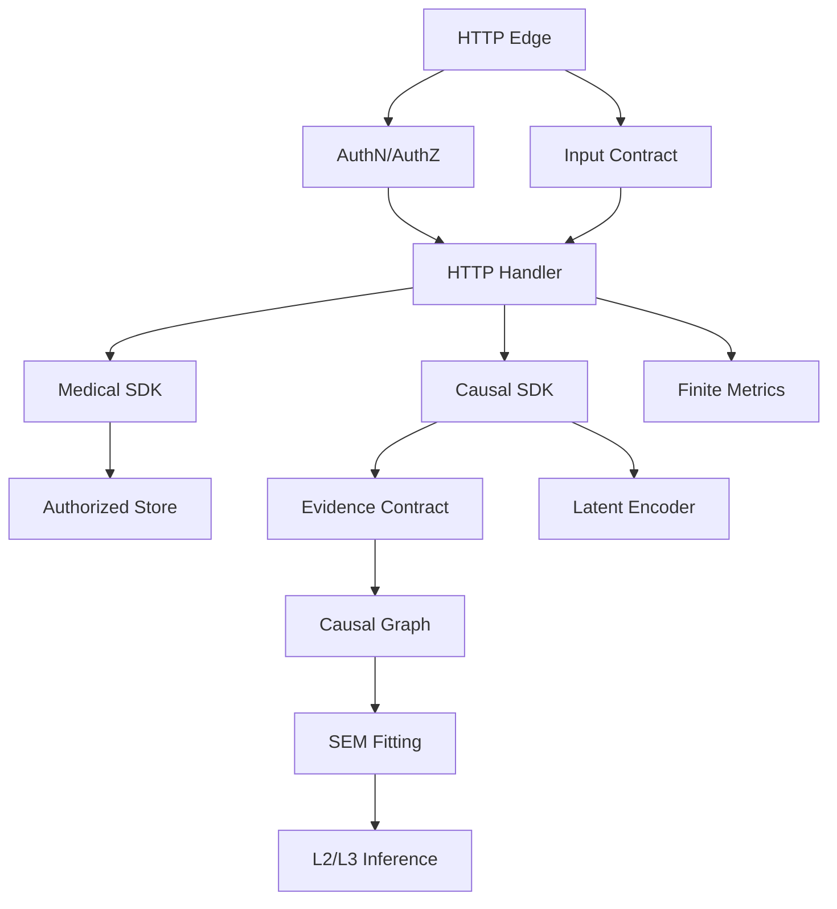

# 两轮审计修复计划书

> 版本：v1.1（已批准）
> 日期：2026-09-07
> 来源：第一性原理审计 + 第二轮对抗性审计
> 风险等级：L2
> 状态：负责人已批准 v1.1；WP-01 至 WP-12 已实现并通过最终门禁；`OODA-20260907-001` 至 `005` 与 `OODA-20260908-021` 均已由台账复核人（用户本人）批准关闭。敏感术语扫描已通过（0 findings）。
> 合规说明：本计划书属于高风险整改文件。已固化用户项目记忆词表快照 `v1.1.0` 并实现 fail-closed 扫描器；发布范围复扫 `pass`（0 findings），扫描器已纳入 `scripts/check.sh` 与 CI。

## 1. 结论

两轮审计共识别 **14 个 P0**、**7 个 P1**，合计 **21 个问题**；其中 **18 个审计缺陷**、**3 个验证口径问题**。核心问题不是孤立 bug，而是三类系统性缺陷：

1. **安全默认值倒置**：认证、授权、代理头、存储、JSON 输入输出在异常场景下偏向可用性而非安全。
2. **因果证据链不闭合**：相关方向、业务节点命名、SEM 参数、模拟数据和反事实输出之间缺少同一数据契约，导致高层能力可能建立在弱证据上。
3. **对抗性输入缺少预算与不变式**：请求规模、标签基数、证据重复度、干预变量数、编码坍塌和测试隔离缺少量化边界。

因此，本计划不按“文件顺序”修复，而按 **P0 止血 → 因果正确性 → 医疗安全 → 工程收口** 执行。每个 P0 完成前禁止进入下一阶段大改动；P0 验收以复现实验反向验证为准。

## 2. 审计证据与缺陷汇总

| ID | 严重度 | 缺陷 | 关键证据 |
|---|---|---|---|
| C-01 | P0 | 因果方向由相关符号决定 | `src/mci_world_model/sdk/_spectral_causal.py:420` |
| C-02 | P0 | 能量类型使用进程相关 `hash()` 推断 | `src/mci_world_model/sdk/_spectral_causal.py:338` |
| C-03 | P0 | 无真实数据时 do-calculus 使用图生成模拟数据，形成循环验证 | `src/mci_world_model/sdk/_do_calculus.py:351`、`src/mci_world_model/sdk/_do_calculus.py:471`、`src/mci_world_model/sdk/_do_calculus.py:475` |
| C-04 | P0 | 发现图节点命名为 `V0/V1...`，业务名查询失败 | `src/mci_world_model/sdk/_do_calculus.py:1058`、`src/mci_world_model/sdk/_do_calculus.py:1061` |
| C-05 | P1 | 主 JEPA 路径可返回因果图而非潜向量；`TrueJEPAEncoder` 未接入主闭环 | `src/mci_world_model/sdk/_jepa_encoder.py:254`、`src/mci_world_model/sdk/_jepa_encoder.py:257` |
| C-06 | P1 | L3 反事实 SEM 直接使用图邻接权重，不是从真实观测拟合的结构方程 | `src/mci_world_model/sdk/_counterfactual.py:607`、`src/mci_world_model/sdk/_counterfactual.py:630` |
| S-01 | P0 | 未配置 API key 时认证被跳过 | `src/mci_world_model/server/security.py:62`、`src/mci_world_model/server/security.py:63` |
| S-02 | P0 | 未校验代理可信性时信任 `X-Forwarded-For`，可伪造限流 key | `src/mci_world_model/server/app.py:131`、`src/mci_world_model/server/app.py:134` |
| S-03 | P0 | 多变量 `do_x` 只取第一个键，键序改变 ATE | `src/mci_world_model/sdk/_world_model.py:1674`、`src/mci_world_model/sdk/_world_model.py:1739` |
| S-04 | P0 | 空 `patient_id` 可跨患者列出/读取医疗记录 | `src/mci_world_model/server/app.py:196`、`src/mci_world_model/server/storage.py:161`、`src/mci_world_model/server/storage.py:163` |
| S-05 | P0 | 医疗数据 JSON 明文落盘，默认路径为 `/tmp` | `src/mci_world_model/server/storage.py:70`、`src/mci_world_model/server/storage.py:133` |
| S-06 | P0 | JSON 深层嵌套触发 `RecursionError` 后无响应 | `src/mci_world_model/server/app.py:245` |
| S-07 | P0 | NaN 参与计算后可输出非标准 JSON | `src/mci_world_model/sdk/_do_calculus.py:486` 及序列化层 |
| S-08 | P1 | 重复无关证据可抬高 confidence 且判定 conclusive | `src/mci_world_model/sdk/_medical_causal_sdk.py:234`、`src/mci_world_model/sdk/_medical_causal_sdk.py:242`、`src/mci_world_model/sdk/_medical_causal_sdk.py:264` |
| S-09 | P1 | 任意请求路径进入 metrics 标签，形成基数攻击 | `src/mci_world_model/server/app.py:202`、`src/mci_world_model/server/metrics.py:78` |
| S-10 | P1 | 批量诊断无请求级上限；1001 条证据返回 500 | `src/mci_world_model/server/app.py:340`、`src/mci_world_model/sdk/_medical_causal_sdk.py:172` |
| S-11 | P1 | Redis 使用阻塞式 `KEYS` | `src/mci_world_model/server/storage.py:110` |
| S-12 | P1 | TrueJEPA 对恒定输入仍可坍塌，输出标准差接近 0 | `src/mci_world_model/sdk/_true_jepa_encoder.py:447`、`src/mci_world_model/sdk/_true_jepa_encoder.py:483` |
| V-01 | P0 | 本地 `mypy .` 与 CI 口径不一致；脚本双模块导致本地失败 | `.github/workflows/ci.yml:62`、`.github/workflows/ci.yml:63` |
| V-02 | P0 | 默认 shell 的 Python 3.9 pytest 缺依赖，项目实际使用 `.venv`，命令口径不一致 | `.github/workflows/ci.yml:72`、`.github/workflows/ci.yml:84`、`.github/workflows/ci.yml:88` |
| V-03 | P0 | 全局 auth 单例在组合测试中造成跨测试污染 | `src/mci_world_model/server/security.py:230`、`src/mci_world_model/server/security.py:233` |

## 3. 第一性原理修复原则

1. **证据等级优先于能力等级**：L2 干预与 L3 反事实只能输出 `observed`、`experimental`、`simulated`、`no_data` 中的显式模式；没有真实观测时不得给出 conclusive 结果。
2. **身份与授权由服务端派生**：患者/租户身份不能取自请求体并直接拼进存储 key。
3. **默认失败关闭**：认证缺失、授权缺失、无限数据来源、非有限数值、超过输入预算都必须拒绝，而不是降级放行。
4. **输入必须有预算**：请求数量、证据数量、路径标签、嵌套深度、干预变量数都要有可配置上限与固定响应。
5. **同一因果对象贯穿全链路**：变量名、索引、图节点、SEM 参数、潜向量和结果引用必须来自同一数据模型。
6. **不变式先于接口扩展**：任何接口变更先补 contract test，再改实现。

## 4. 架构设计

### 4.1 模块边界

### 4.2 数据契约

新增或收敛以下显式结构：

| 对象 | 关键字段 | 不变式 |
|---|---|---|
| `ObservationDataset` | `source_id`、`rows`、`variables`、`seed`、`is_real` | 无真实数据不得进入 L2/L3 conclusive 路径 |
| `CausalGraph` | `nodes`、`edges`、`node_names`、`node_aliases`、`edge_mode` | 节点名必须保留业务名；边方向必须携带判定依据 |
| `InterventionRequest` | `do_x`、`target`、`dataset_id`、`method` | `do_x` 允许多变量或显式拒绝；键序不得改变结果 |
| `CounterfactualRequest` | `observed_facts`、`do_x`、`dataset_id`、`sem_fit_id` | SEM 必须引用已拟合模型或返回 `no_data` |
| `MedicalEvidence` | `evidence_id`、`content_hash`、`source`、`acquired_at`、`patient_scope` | 同一 patient/model/cause/effect 下重复内容只计算一次独立证据 |
| `StorageRecord` | `record_id`、`tenant_id`、`patient_id`、`owner_subject`、`created_at`、`payload` | 读取与列表都必须匹配服务端身份 |

### 4.3 配置契约

| 配置 | 默认值 | 说明 |
|---|---|---|
| `MCI_API_KEY` | 空 | 空值时服务必须拒绝启动认证流量；不提供“空 key 即放行”路径 |
| `MCI_ENV` | `production` | 只允许 `production`、`development`、`test`；未知值拒绝启动 |
| `MCI_AUTH_DISABLED` | `false` | 仅当 `MCI_ENV=test` 且本值为 `true` 时允许；其他组合拒绝启动 |
| `MCI_IDENTITY_MAP_PATH` | 无 | 服务必填；文件保存 SHA-256(key) 到身份的映射，目录 0700、文件 0600 |
| `MCI_TRUSTED_PROXIES` | 空 | 空值时不信任任何转发头 |
| `MCI_STORAGE_PATH` | 无 | 所有服务启动必须显式配置；测试 fixture 只能显式传入临时路径，禁止隐式 `/tmp` 兜底 |
| `MCI_STORAGE_DIR_MODE` | `0700` | 目录最小权限 |
| `MCI_STORAGE_FILE_MODE` | `0600` | 文件最小权限 |
| `MCI_MAX_JSON_DEPTH` | `64` | 超过返回 400 |
| `MCI_MAX_BATCH_QUERIES` | `100` | 超过返回 413 或 422 |
| `MCI_MAX_EVIDENCE_COUNT` | `100` | 超过返回 413 或 422 |
| `MCI_METRIC_ENDPOINTS` | 固定白名单 | 未知路径统一映射为 `unmatched` |
| `MCI_MAX_METRIC_LABELS` | `256` | 超过丢弃并计数告警 |

## 5. 工作包

### 5.0 缺陷追溯矩阵

| 缺陷 ID | 严重度 | 工作包 | 闭环证据 |
|---|---|---|---|
| C-01 | P0 | WP-07 | 显式 `edge_mode` 与定向证据测试 |
| C-02 | P0 | WP-07 | 稳定能量类型与多进程复现测试 |
| C-03 | P0 | WP-09 | `tests/adversarial/test_wp09_data_source_intervention.py` 8 passed |
| C-04 | P0 | WP-08 | `tests/adversarial/test_wp08_graph_naming.py` 8 passed |
| C-05 | P1 | WP-10 | `tests/adversarial/test_wp10_jepa_collapse.py` 4 passed |
| C-06 | P1 | WP-11 | `tests/adversarial/test_wp11_sem_evidence.py` 3 passed |
| S-01 | P0 | WP-01 | `tests/adversarial/test_wp01_security.py` 认证 fail closed |
| S-02 | P0 | WP-01 | `tests/adversarial/test_wp01_security.py` 可信代理与限流 |
| S-03 | P0 | WP-09 | 多变量 `unsupported/422` 与键序无关测试 |
| S-04 | P0 | WP-02 | `tests/adversarial/test_wp02_storage.py` 患者/租户授权 |
| S-05 | P0 | WP-02 | `tests/adversarial/test_wp02_storage.py` 存储路径与权限 |
| S-06 | P0 | WP-03 | `tests/adversarial/test_wp03_json.py` 深层 JSON 400 |
| S-07 | P0 | WP-03 | `tests/adversarial/test_wp03_json.py` NaN / Infinity |
| S-08 | P1 | WP-05 | 证据去重与确定性判定测试 |
| S-09 | P1 | WP-04 | metrics 白名单与基数上限测试 |
| S-10 | P1 | WP-05 | 批量与证据数量上限测试 |
| S-11 | P1 | WP-06 | `tests/adversarial/test_wp06_redis_scan.py` 6 passed |
| S-12 | P1 | WP-10 | TrueJEPA 方差诊断与坍塌测试 |
| V-01 | P0 | WP-12 | `scripts/check.sh` 与 CI mypy 同口径 |
| V-02 | P0 | WP-12 | `scripts/check.sh`、CI pytest 与 3.13 smoke 同口径 |
| V-03 | P0 | WP-12 | `tests/adversarial/test_wp12_validation_and_isolation.py` 状态重置 |

覆盖统计：`21 / 21`。

### WP-01：认证与限流身份止血（P0）

**状态**：已实现并通过 WP-01 对抗测试、安全/API 回归、ruff/format/mypy、全量 pytest 和 ai-guard；台账已复核关闭。

**问题**：未配置 API key 时认证跳过；转发头未经信任校验就进入限流 key。
**根因**：安全决策把“开发便利”写进运行时默认值；限流身份把客户端可控数据当作事实。
**修复方案**：

1. `AuthConfig.from_env()` 增加 `validate(strict=...)`：认证流量在 `api_keys` 为空且未同时满足 `MCI_ENV=test` 与 `MCI_AUTH_DISABLED=true` 时 fail closed。
2. 新增 `IdentityRegistry`：读取 `MCI_IDENTITY_MAP_PATH`，以 SHA-256(key) 为索引返回 `subject`、`tenant_id` 与 `patient_ids`；禁止明文 key 或请求体身份作为记录归属。
3. 新增代理信任解析器：只信任 `MCI_TRUSTED_PROXIES` 命中的直接连接；未命中时使用 socket 地址。
4. `BaseHTTPRequestHandler.headers.get()` 统一大小写不敏感读取，避免 `dict(self.headers)` 后因大小写漏取。
5. 保留 `Authorization: Bearer`、`X-API-Key` 两种方式；密钥比较改为 constant-time。

**必须测试**：

- 无 key、空 key、非法 key、合法 key 分别返回 401/200。
- `MCI_AUTH_DISABLED=true` 只在 `MCI_ENV=test` 生效；生产、开发或未知 `MCI_ENV` 拒绝启动。
- 身份映射缺失、版本不支持、重复 hash、非 0600 权限时拒绝启动。
- 客户端伪造 10 个不同 `X-Forwarded-For` 不产生 10 个限流桶。
- 已配置可信代理时，按约定位置解析真实 IP；未配置时忽略转发头。

**验收**：全部反向复现失败，即无法绕过认证和限流。
**回滚**：按单提交 revert；如果 revert 后认证打开，立即禁用相关入口而不是恢复跳过认证。

### WP-02：医疗授权与存储止血（P0）

**状态**：已实现并通过 WP-02 对抗测试、医疗授权/存储回归、ruff/format/mypy、全量 pytest 和 ai-guard；台账已复核关闭。

**问题**：请求体中的患者 ID 可跨患者列表/读取；数据明文写入默认 `/tmp` 且权限过宽。
**根因**：患者身份被当作数据字段而非授权边界；持久化层缺少数据分级和默认安全配置。
**修复方案**：

1. 服务端通过 `IdentityRegistry` 从已认证 key 的 SHA-256 派生 `subject`、`tenant_id` 与允许访问的 `patient_id` 集合；请求体患者 ID 仅作请求参数。
2. `save_diagnosis`、`load_diagnosis`、`list_diagnoses` 增加 `auth_context` 参数，并强制记录归属。
3. 列表和读取必须同时匹配 `tenant_id` 与 `patient_id`；无授权上下文返回 401/403，不返回存在性信息。
4. `MCI_STORAGE_PATH` 必须显式配置；缺失或位于系统临时目录时拒绝启动，不提供项目路径或 `/tmp` 兜底。
5. 文件目录 `0700`、文件 `0600`；原子写入通过 `os.open(tmp, O_WRONLY | O_CREAT | O_EXCL | O_NOFOLLOW, 0o600)` + `os.fdopen()` 创建临时文件，校验两个路径均在安全目录内后 `os.replace()`。
6. P1 增加字段级 AES-GCM envelope encryption、密钥版本和保留策略；P0 不引入加密依赖。P1 若采用 `cryptography`，启动前单独完成依赖、供应链和密钥管理评审。

**必须测试**：

- 患者 A 无法列出/读取患者 B。
- 空 `patient_id` 不得展开全部记录。
- 无授权上下文无法写诊断记录。
- 新旧文件权限均为最小权限；路径遍历与符号链接失败。
- 生产缺 `MCI_STORAGE_PATH` 启动失败。

**验收**：跨患者复现、权限检查和默认路径测试全部失败化。
**回滚**：禁止回滚为跨患者访问；代码回滚时必须同步禁用诊断记录 API。

### WP-03：请求解析、JSON 安全与有限数值（P0）

**状态**：已实现并通过 WP-03 对抗测试、服务端 API 回归、ruff/format/mypy、全量 pytest 和 ai-guard；台账已复核关闭。

**问题**：深层 JSON 无响应；NaN/Infinity 可穿透响应。
**根因**：异常覆盖不足、Python JSON 默认接受非标准常量、响应序列化没有有限性门禁。
**修复方案**：

1. 读体后先执行迭代式结构扫描，限制最大深度；超过返回 400。
2. `json.loads(..., parse_constant=...)` 拒绝 `NaN`、`Infinity`、`-Infinity`。
3. 路由处理统一捕获 `RecursionError`、`ValueError`、`TypeError`、`OverflowError` 并返回 400。
4. 新增 `assert_finite_tree()`：请求参数、中间结果、响应结果递归检查有限性。
5. `_send_json()` 使用 `allow_nan=False`；失败返回 500 安全错误，不泄漏内部栈。
6. 错误响应保留 `trace_id`，不返回原始 payload。

**必须测试**：

- 10,000 层 JSON 返回 400 且连接可复用。
- 1 MiB 内的恶意深层 JSON 返回 400。
- NaN/Infinity 请求返回 400。
- 上游产生 NaN 时响应不是非标准 JSON。
- 所有错误分支都有 metrics 与日志。

**验收**：恶意 JSON 不再导致无响应，响应体始终为标准 JSON。
**回滚**：单独 revert；回滚期间对相关路由启用 503。

### WP-04：Metrics 基数与响应边界（P1）

**状态**：已实现并通过 WP-04 对抗测试、指标回归、ruff/format/mypy、全量 pytest 和 ai-guard；台账已复核关闭。

**问题**：任意路径成为 metrics label，攻击者可撑爆序列化与内存。
**修复方案**：

1. 定义 endpoint 白名单：健康、就绪、指标、诊断、批量诊断、反事实、干预等固定路由。
2. 未知路径统一为 `unmatched`；query string 不进入 label。
3. 每个 metric family 设置 label 组合上限与 ring buffer；超限丢弃并暴露 `metrics_cardinality_dropped_total`。
4. `/metrics` 响应加入长度上限和渲染耗时观测。

**必须测试**：200 个随机路径产生的行数不超过固定阈值；重复路径正确聚合；恶意 label 不改变 metric schema。
**回滚**：恢复固定路由映射即可，不影响业务数据。

### WP-05：批量诊断与医疗证据完整性（P1）

**状态**：已实现并通过 WP-05 对抗测试、医疗 SDK/API 回归、ruff/format/mypy、全量 pytest 和 ai-guard；台账已复核关闭。

**问题**：批量端点无数量上限；单条 1001 条证据返回 500；重复证据可灌高置信度。
**修复方案**：

1. 批量端点与 SDK 双层限制 `MCI_MAX_BATCH_QUERIES`；超出返回 413/422。
2. `MAX_EVIDENCE_COUNT` 保持硬上限，并由 API 转换为 400/422，不泄漏 500。
3. 证据去重键使用 `(patient_scope, cause, effect, evidence_type, content_hash)`；重复证据计入 `duplicate`，不计入独立证据。
4. Evidence 相似性超过阈值时标记 `correlated`，有效样本数使用去重后集合计算。
5. `is_conclusive` 必须同时满足：最小独立证据数、最小多样性、最小 confidence、无关键 warning。
6. 响应输出 `effective_evidence_count`、`duplicate_count`、`correlated_count`。

**必须测试**：

- 20,000 条批量请求返回限流/422，不产生 500。
- 1,001 条证据返回 400/422。
- 5 条重复无关证据不得 conclusive。
- 内容相同、来源不同的证据正确标记重复或相关。

**验收**：证据数量与质量不再通过重复内容伪造。
**回滚**：保留旧端点行为会造成诊断误判，因此禁止直接回滚；只能禁用端点并提示客户端迁移。

### WP-06：Redis 可用性（P1）

**状态**：已实现并通过 WP-06 对抗测试、安全/HA 回归 38 passed、ruff/format/mypy、全量 pytest 和 ai-guard；台账已复核关闭。

**问题**：`KEYS` 在生产 Redis 上会阻塞。
**修复方案**：`RedisStorage.list_keys()` 改为 `SCAN MATCH mci:<prefix>* COUNT <page>`；单次扫描设置总键数和耗时上限；写测试使用隔离 key 前缀与 TTL。
**必须测试**：100k 模拟 key 下调用不阻塞返回；超过预算返回部分结果与告警；并发扫描结果一致。
**回滚**：禁止恢复 `KEYS`；回滚时返回 503 而不是阻塞服务。

### WP-07：因果方向与确定性标识（P0）

**状态**：已实现并通过 WP-07 对抗测试、do-calculus/反事实回归、ruff/format/mypy、全量 pytest 和 ai-guard；台账已复核关闭。

**问题**：相关正负号被当作方向；能量类型使用进程相关 hash。
**修复方案**：

1. `discover_hidden_edges()` 输出增加 `edge_mode`：`correlation`、`orientation_by_intervention`、`orientation_by_temporal_order`、`orientation_by_expert_prior`。
2. 偏相关只生成候选边，不自动生成方向；除非有干预、时间先序或显式专家先验，否则双向候选保留为 `undirected`。
3. `CausalGraph` 区分 `association_graph` 与 `causal_graph`；只有因果图可进入 do-calculus 与反事实。
4. 能量类型取消 `hash(content)`：优先显式字段 `energy_type`，否则使用稳定 SHA-256 + 版本化规则表，或返回 `unknown`。
5. 规则表包含 `rule_id`、`version`、`pattern`、`energy_type`、`priority`、`reviewer`。

**必须测试**：

- 负相关、零相关、正相关下不会因符号自动定向。
- 多进程和不同 `PYTHONHASHSEED` 下相同内容得到相同能量类型。
- 缺少定向证据的边无法被 do-calculus 当作因果边。
- 规则表版本变化可复现输出。

**验收**：相关结果不再伪装成因果结论。
**回滚**：输出结构新增字段保持向后兼容；如行为回滚，必须同步降级 README 中因果能力声明。

### WP-08：图命名、业务查询与标识映射（P0）

**状态**：已实现并通过 WP-08 定向测试、do-calculus 回归、ruff/format/mypy、全量 pytest 和 ai-guard；台账已复核关闭。
**问题**：发现图节点变成 `V0/V1...`，业务名查询失败。
**修复方案**：

1. `build_from_gaussian_dag()` 接收 `node_names` 或 `memories`，生成业务名节点。
2. `CausalGraph` 增加 `node_aliases` 与 `idx_to_name`；图内索引与业务名一一映射。
3. do-calculus、反事实、能量中心查询都通过 `resolve_node()` 支持业务名、别名、索引。
4. 图序列化输出 `nodes`、`node_aliases`、`edges`、`edge_mode`、`dataset_id`。
5. 查询失败返回结构化 `unknown_node`，不再静默创建新节点。

**必须测试**：

- 发现图后直接用原始业务变量名查询 do/counterfactual 成功。
- 别名与索引查询一致。
- 未知节点返回显式错误。
- 序列化/反序列化后名称映射不丢失。

**验收**：以审计最小复现为验收用例，业务名查询必须成功。
**回滚**：字段新增向后兼容；映射失败时拒绝 L2/L3 查询。

### WP-09：Do-calculus 数据来源与多变量干预（P0）

**状态**：已实现并通过 WP-09 反向测试、do-calculus 回归、ruff/format/mypy、全量 pytest 和 ai-guard；台账已复核关闭。
**问题**：无数据时用图生成模拟数据形成循环验证；多变量 `do_x` 只取第一个键且键序影响 ATE。
**修复方案**：

1. `DoCalculus` 构造时绑定 `ObservationDataset`；`no_data` 模式返回 `no_data`，禁止 silent simulation。
2. 如保留研究型模拟入口，必须显式调用 `simulate()`，设置 seed，并在结果标记 `mode=simulated`、`is_conclusive=false`。
3. 单变量干预保持旧接口；多变量先明确拒绝为 422/`unsupported`，待闭式或分层估计实现后启用。
4. 多变量实现必须按 DAG 拓扑与局部 SEM 计算，不能依赖 dict 键序。
5. 干预值、调整集、估计器、数据集 hash、seed、置信区间全部写入 `InterventionResult`。
6. 数值贯穿 `isfinite` 检查；无效结果返回结构化错误而不是 NaN。

**必须测试**：

- 无真实数据调用返回 `no_data`。
- 模拟入口输出 `simulated` 且不可 conclusive。
- 不同 `do_x` 键序产生完全相同结果。
- 多变量缺实现时返回明确 422。
- NaN/Inf 输入和中间值被拒绝。

**验收**：审计中的键序实验和 NaN 实验反向通过。
**回滚**：模拟行为回滚会复现循环验证，禁止回滚；接口回滚必须保留显式 deprecated warning。

### WP-10：JEPA 主路径与抗坍塌（P1）

**状态**：已实现并通过 WP-10 对抗测试、JEPA/世界模型回归 190 passed、ruff/format/mypy、全量 pytest 和 ai-guard；台账已复核关闭。

**问题**：主 JEPA 路径可返回因果图而非潜向量；TrueJEPA 未接入主闭环且恒定输入可坍塌。
**修复方案**：

1. `JEPAEncoder.encode()` 的返回契约改为 `LatentState(latent, source, encoder_id, is_trained, diagnostics)`；不得返回因果图。
2. `TrueJEPAEncoder` 通过显式注入接入主闭环；未训练或数据不足时返回 `not_ready`，禁止用图结果冒充潜向量。
3. 训练输出加入 `latent_variance_min/max/mean`、`effective_rank`、`collapse_detected`。
4. variance floor 使用 batch 维度正确梯度，禁止只作用单样本；恒定输入批次直接返回告警或拒绝训练。
5. 提供 `jepa_mode` 迁移配置：`latent` 为默认目标，`legacy_graph` 只允许一个过渡版本并输出 deprecation warning。

**必须测试**：

- `encode()` 返回潜向量形状与维度正确。
- 恒定输入训练后 `collapse_detected=true` 且不能声明成功。
- 常规输入训练后最小方差不低于配置阈值。
- 未接入 TrueJEPA 时 README 不声明主路径使用 TrueJEPA。

**验收**：接口语义、README 声明和测试一致。
**回滚**：`legacy_graph` 只能按版本切换，不能静默恢复。

### WP-11：反事实 SEM 证据化（P1）

**状态**：已实现并通过 WP-11 对抗测试、反事实/基准回归 86 passed、ruff/format/mypy、全量 pytest 和 ai-guard；台账已复核关闭。

**问题**：SEM 系数直接来自图邻接/置信度，不是从真实观测拟合。
**修复方案**：

1. L3 输入必须包含 `ObservationDataset`；无数据返回 `no_data`。
2. 新增 `SEMFitResult`：`dataset_id`、`fit_method`、`seed`、`coefficients`、`noise_covariance`、`fit_metrics`、`constraints`。
3. 线性 SEM 使用约束最小二乘/岭回归；非线性 SEM 只在已有可微估计器上启用。
4. 因果图只提供父变量约束与方向候选；系数必须来自数据拟合。
5. 反事实输出包含 `sem_fit_id`、拟合误差、可识别性状态、`mode`。

**必须测试**：

- 无观测数据不输出数值反事实。
- 线性真模型下恢复系数误差不超过阈值。
- 图约束改变后 SEM 系数仍来自数据，不受 confidence 直接赋值影响。
- 输出可引用 `sem_fit_id` 复现。

**验收**：L3 结果可追溯到真实数据拟合对象。
**回滚**：禁止回滚为 graph adjacency 伪 SEM；只能降级为 unavailable。

### WP-12：验证口径与测试隔离（P0）

**状态**：已实现并通过 `tests/adversarial` 45 项、ruff/format/mypy、全量 pytest 和 ai-guard；台账已复核关闭。
**问题**：本地/CI 命令不一致；Python 版本和依赖不一致；全局单例污染测试。
**修复方案**：

1. `AGENTS.md` 验证命令改为项目实际入口：激活 `.venv` 或提供 `make check` / `scripts/check.sh`。
2. 本地与 CI 均执行 `ruff check`、`ruff format --check`、`mypy src/mci_world_model`、`pytest`、`ai-guard`。
3. 处理 `scripts/patent_benchmark.py` 双模块冲突：统一模块归属或改用显式 package 运行。
4. `get_auth_config()` 支持注入与 `reset_auth_config()`；测试 fixture 每用例重建 app/security/storage 状态。
5. 新增 `tests/adversarial/` 收录本计划全部反向复现，默认纳入 CI，标记为阻塞测试。
6. CI 增加 Python 3.13 smoke（如依赖支持），至少保持 3.10–3.12 全绿。

**必须测试**：全新 shell 和 `.venv` 中命令一致；组合测试顺序不影响结果；`pytest --randomly-seed`（如可用）不引入跨用例依赖。
**验收**：文档、CI、本地三者可复现同一结果。
**回滚**：验证脚本可回滚，但审计测试不得删除。

## 6. 时间计划

| 阶段 | 时间 | 工作包 | 出口条件 |
|---|---|---|---|
| Phase 0：计划审批 | 2026-09-07 | 全部 | 负责人、第二审阅人、台账复核人签字；明确负责人替身 |
| Phase 1：P0 止血 | 2026-09-08 至 2026-09-10 | WP-01、WP-02、WP-03、WP-08、WP-12 | 覆盖 14 个 P0 中的 10 个安全与验证项，反向测试全绿 |
| Phase 2：因果正确性 | 2026-09-11 至 2026-09-16 | WP-07、WP-09、WP-11 | L2/L3 无真实数据均返回 no_data；方向与 SEM 可追溯 |
| Phase 3：对抗性韧性 | 2026-09-14 至 2026-09-20 | WP-04、WP-05、WP-06、WP-10 | 输入预算、指标基数、证据完整性与 JEPA 契约通过 |
| Phase 4：发布收口 | 2026-09-21 至 2026-09-24 | 全部 | ruff/mypy/pytest/ai-guard 全绿；README、CHANGELOG、迁移说明更新 |
| Phase 5：OODA 大环复盘 | 2026-09-25 | 全部 | 台账 verified；复盘产出规范修订或维持现状条目 |

时间允许并行，但同一文件不得由两个工作包同时修改；每个工作包独立 PR，单次提交不超过 800 行。

## 7. 测试矩阵

| 类别 | 最小用例 | 期望 |
|---|---|---|
| Authentication | 无 key / 空 key / 伪造 key / 合法 key | 无 key 拒绝；只有合法 key 通过 |
| Rate limit | 伪造多个 forwarded IP | 只按可信身份分桶 |
| Privacy | A 读 B、空 patient_id、无授权写 | 401/403/404，不泄漏记录存在性 |
| Storage | 目录权限、文件权限、符号链接、路径遍历 | 全部拒绝或最小权限 |
| JSON | 深层嵌套、NaN、Infinity、大 body | 400/413，无无响应 |
| Causal graph | 负相关、业务名、别名、未知节点 | 不自动定向；业务名可查询 |
| Do-calculus | 无数据、模拟、多变量、键序、NaN | no_data/simulated/422/等价结果/拒绝 |
| Medical evidence | 重复 5 条、1,001 条、20,000 批量 | 不 conclusive；400/422/422 |
| Metrics | 200 随机路径、重复路径、恶意标签 | 行数稳定且正确聚合 |
| JEPA | 恒定输入、正常输入、未训练主路径 | 检出坍塌；返回潜向量或 not_ready |
| Counterfactual | 无数据、线性恢复、图约束 | no_data 或可追溯拟合结果 |
| Regression | `ruff`、`mypy`、`pytest`、`ai-guard` | 全绿 |

## 8. 发布与回滚

### 8.1 发布顺序

1. 先合入审计反向测试，确认当前实现按预期失败。
2. 按工作包小步修复，每个 PR 只包含一个逻辑变更。
3. 行为变更发布前更新 README、CHANGELOG 与迁移说明。
4. 每个阶段交付后运行全量验证与反向审计脚本。

### 8.2 回滚矩阵

| 变更 | 回滚动作 | 禁止项 |
|---|---|---|
| 认证/限流 | revert PR 后重测 | 禁止恢复“无 key 即放行” |
| 医疗授权/存储 | revert 后禁用诊断记录 API | 禁止恢复跨患者访问或 `/tmp` 默认 |
| JSON/finite gate | revert 后相关路由 503 | 禁止重新输出 NaN |
| 因果方向/节点命名 | 新字段兼容旧字段，必要时降级 L2/L3 | 禁止把相关边重新上报为因果边 |
| Do-calculus/SEM | 降级 unavailable/no_data | 禁止恢复图模拟数据作为结论 |
| JEPA | 使用显式 `legacy_graph` 过渡配置 | 禁止未标注返回图 |
| Metrics/batch/Redis | revert 后启用限流/503 | 禁止恢复 `KEYS` 或无上限批量 |

## 9. 风险与影响面

| 变更 | 正向影响 | 负向风险 | 缓解 |
|---|---|---|---|
| 认证 fail closed | 消除未授权访问 | 旧客户端断连 | 提前发布密钥迁移与 401 契约 |
| 授权边界 | 阻断跨患者访问 | 需要认证态改造 | 分两层：先服务端过滤，再收紧存储 API |
| 输入预算 | 阻断 DoS | 合法深层结构被拒 | 上限配置化并返回明确错误 |
| 因果语义 | 输出可信 | 旧调用方发现能力降级 | 新增 mode 字段与迁移说明 |
| SEM 拟合 | L3 可追溯 | 需要数据与计算成本 | 线性模型先行，非线性延迟 |
| JEPA 契约 | 接口语义一致 | 结果漂移 | 默认诊断开关 + 一个版本的 legacy mode |

## 10. 角色与治理

| 角色 | 职责 | 当前状态 |
|---|---|---|
| 负责人 | 审批本计划、批准 P0/P1 顺序与发布 | 用户已批准 v1.1 |
| 第二审阅人 | Review 安全、因果、数据与回滚设计 | Codex（用户授权） |
| 台账复核人 | 核对证据、回写与状态流转 | 用户本人 |
| 执行人 | 按工作包实现与自检 | Codex |
| 授权词表提供方 | 提供敏感词表版本与校验值 | 用户项目记忆快照，已固化为 `v1.0.0` |

单人项目不能由执行人兼任上述审阅角色。角色未指定前，本计划只停留在 Draft，代码修复不得开工。

## 11. Definition of Done

1. 21 个问题逐项闭环，或以可验证的显式降级关闭；统计口径固定为 18 个审计缺陷 + 3 个验证口径问题。
2. 3 个验证口径问题统一为同一命令集。
3. `ruff check .`、`ruff format --check .`、`mypy src/mci_world_model`、`pytest`、`bash scripts/ai-verify/ai-guard.sh` 全绿。
4. 全部反向复现进入 `tests/adversarial/` 并在 CI 阻塞。
5. README 的因果、JEPA、医疗 API 声明与实际行为一致。
6. `.ai-ooda/ledger.md` 中 4 条审计条目全部达到 `verified`，且每条有独立复核证据。
7. 敏感术语扫描器、受控词表版本、扫描报告与 0 残留证据齐备；没有词表前不得对外发布涉敏内容。

当前完成度：

| DoD | 状态 | 证据 / 缺口 |
|---|---|---|
| 1. 21 个问题闭环 | 通过 | 代码整改与 `tests/adversarial` 覆盖统计 `21 / 21`；`OODA-20260907-001` 至 `004` 已由用户本人复核为 `verified`。 |
| 2. 验证口径统一 | 通过 | `scripts/check.sh` 与 CI 使用同一 `.venv`、mypy 与 pytest 口径。 |
| 3. 门禁全绿 | 通过 | 最新 `bash scripts/check.sh` 全量 `pytest` `4721 passed, 2 skipped`；`ruff check`、`ruff format --check`、mypy、敏感术语扫描、`AI_REVIEW_CI=1 bash scripts/ai-verify/ai-guard.sh` 通过。 |
| 4. 对抗测试入 CI | 通过 | `tests/adversarial/` `89 passed`，CI 执行该目录并阻塞失败。 |
| 5. 文档声明一致 | 通过 | README 因果、JEPA、医疗 API 声明已随 WP-07 至 WP-11 修订并经回归验证。 |
| 6. 审计台账 verified | 通过 | `OODA-20260907-001/002/003/004` 均为 `verified`；台账复核人为用户本人，批准日期 2026-09-08。 |
| 7. 敏感术语合规证据 | 通过 | 词表 `v1.1.0`、fail-closed 扫描器、CI/本地门禁与版本化复扫报告 `pass`（308 files / 0 findings）齐备；`OODA-20260908-021` 已由台账复核人确认为 `verified`。 |

## 12. OODA 回写决策

本计划书回写为 `OODA-20260907-005`。前四条审计条目的回写载体从“待形成整改工单”更新为本计划书。最终 `bash scripts/check.sh` 于 2026-09-08 全绿后，台账复核人（用户本人）明确批准 `001` 至 `005` 置为 `verified`；敏感术语证据由 `OODA-20260908-021` 独立跟踪，并已由台账复核人确认为 `verified`。

## 13. 审批记录

| 角色 | 主体 | 结论 | 日期 |
|---|---|---|---|
| 负责人 | 用户 | 批准 v1.1 并授权执行 | 2026-09-08 |
| 第二审阅人 | Codex（负责人授权） | R-01 至 R-06 已修订；追溯矩阵 `21 / 21`；通过 | 2026-09-08 |
| 台账复核人 | 用户 | 明确批准并复核 `OODA-20260907-001` 至 `005` 与 `OODA-20260908-021` 为 `verified` | 2026-09-08 |
