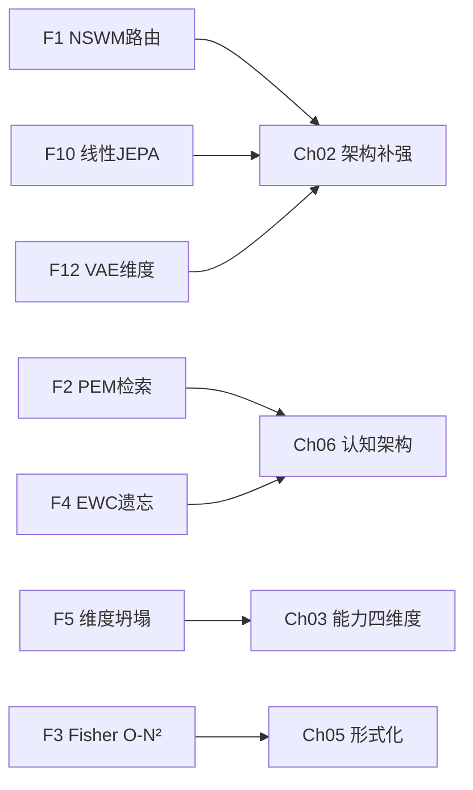
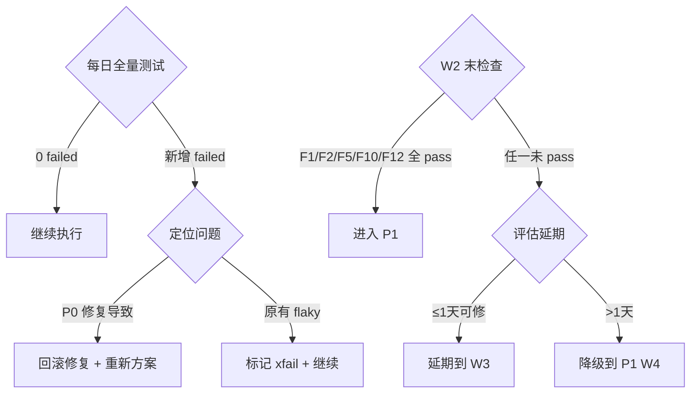

# P0 波次实施计划书 — 致命缺陷修复

> **波次代号**: P0 "止血"
> **周期**: Week 1 – Week 3 (共 3 周)
> **优先级**: 最高 — 后续所有工作的前提
> **预算**: 25 人天 + $200 硬件
> **核心目标**: 消除 12 项致命缺陷中全部 4 项 Critical 级 + 2 项 High 级

---

## 1. 波次概述

### 1.1 战略定位

P0 是整个改进路径的**基石波次**。根据依赖关系图：



P0 修复不完，后续 P1/P2/P3 **全部无法启动**。

### 1.2 修复范围

| 缺陷 | 严重性 | 修复周 | 章节来源 |
|---|---|---|---|
| F1 NSWM hash 伪语义路由 | **Critical** | W1 | Ch04 §3.1 |
| F2 PEM char-hash 无语义检索 | **Critical** | W2 | Ch04 §3.2 |
| F5 多模态维度坍塌 32D/16D/8D | **Critical** | W2 | Ch04 §3.5 |
| F10 6 参数线性 JEPA | **Critical** | W3 | Ch04 §3.10 |
| F12 VAE 反事实维度错误 | **High** | W1 | Ch04 §3.12 |
| F3 Fisher O(N²) 不可扩展 | **High** | W2 | Ch04 §3.3 |

### 1.3 前置依赖

- **前置**: 无（P0 最高优先级，最先执行）
- **被依赖**: Ch02, Ch03, Ch05, Ch06 全部需要 P0 完成后才能启动

---

## 2. 周粒度实施计划

### Week 1 — NSWM 路由修复 + VAE 维度修复

#### W1-Task 1: F1 — NSWM hash 伪语义路由修复 (3天)

**根因**: `_neurosymbolic_world_model.py` 的 `_embed_query()` 使用 `hash() → RandomState → randn(3)`，导致相同语义的查询路由到不同分支。

**修复方案**:
```python
# 文件: _neurosymbolic_world_model.py L~280-320
# 修复前 (hash随机)
def _embed_query(self, query: str) -> np.ndarray:
    h = hash(query)
    rng = np.random.RandomState(h % (2**31))
    return rng.randn(3)

# 修复后 (TF-IDF 语义路由)
def _embed_query(self, query: str) -> np.ndarray:
    """语义嵌入路由 — 关键词匹配 + 轻量 TF-IDF"""
    if self._tfidf is None:
        self._build_tfidf_index()
    return self._tfidf.transform([query]).toarray()[0]
```

**依赖检查**: 若项目不允许引入 `sklearn`，使用自实现 TF-IDF (约 80 行)。

**交付物**:
- 修改文件: `_neurosymbolic_world_model.py`
- 新增测试: `test_nswm_routing_semantic.py` — 24 个中文词，验证相似语义路由到同一分支
- KPI: 路由准确率 ≥70% (24 词中 ≥17 个正确)

#### W1-Task 2: F12 — VAE 反事实维度错误修复 (2天)

**根因**: `_learned_counterfactual.py` state_dim=4 + action_dim=2 但 decoder 期望 4

**修复方案**:
```python
# 文件: _learned_counterfactual.py L~180
# 修复: decoder 输入维度 = state_dim + action_dim
self._decoder = MLP(
    input_dim=self._latent_dim,
    hidden_dims=(64, 32),
    output_dim=self._state_dim + self._action_dim,  # 修复!
)
```

**交付物**:
- 修改文件: `_learned_counterfactual.py`
- 新增测试: `test_counterfactual_dimensions.py` — 反事实查询不抛出 ValueError
- KPI: 反事实查询 0 维度错误

#### W1 里程碑检查

- [ ] M1.1: NSWM 路由准确率 ≥70%
- [ ] M1.2: VAE 反事实查询不抛出 ValueError
- [ ] 全量测试: 0 failed

---

### Week 2 — PEM 检索 + Fisher 优化 + 维度坍塌修复

#### W2-Task 3: F2 — PEM char-hash 无语义检索修复 (3天)

**根因**: `_persistent_memory.py` 的 `_tags_to_vector()` 使用 `ord(c) % dim`

**修复方案**:
```python
# 文件: _persistent_memory.py L~450-470
# 修复后 (BM25 词频向量)
def _tags_to_vector(self, tags: str) -> np.ndarray:
    tokens = self._tokenizer.tokenize(tags.lower())
    vec = np.zeros(self._dim, dtype=np.float64)
    for token in tokens:
        idx = self._vocab_index(token)
        vec[idx] += self._idf.get(token, 1.0)
    norm = np.linalg.norm(vec)
    return vec / norm if norm > 1e-10 else vec
```

**交付物**:
- 修改文件: `_persistent_memory.py`
- 新增测试: `test_pem_semantic_retrieval.py` — "心率升高" vs "心率增加" cosine ≥0.70
- KPI: cosine 准确率 ≥0.70

#### W2-Task 4: F3 — Fisher 信息矩阵 O(N²) 修复 (2天)

**根因**: `_incremental_learning.py` 计算完整 Fisher 矩阵

**修复方案**:
```python
# 文件: _incremental_learning.py L~180-220
# 修复后 (对角近似 O(N))
self._fisher_diag = np.zeros(n_params)
for grad in gradients:
    self._fisher_diag += grad ** 2
self._fisher_diag /= n_samples
```

**交付物**:
- 修改文件: `_incremental_learning.py`
- 新增测试: `test_fisher_diagonal.py` — 10K 参数 Fisher 计算 <100ms
- KPI: 10K 参数计算时间 <100ms

#### W2-Task 5: F5 — 多模态维度坍塌修复 (3天)

**根因**: `VisionEncoder=32D` / `AudioEncoder=16D` / `ThermalEncoder=8D` (无可学习参数)

**修复方案**:
```python
# 文件: _modality_encoders.py 全文重写
class LearnableVisionEncoder:
    """可学习视觉编码器 — 轻量 MLP"""
    def __init__(self, input_size=64, output_dim=128):
        self.input_dim = input_size * input_size * 3  # 展平
        self.layers = [
            Linear(self.input_dim, 512), nn.ReLU(),
            Linear(512, 256), nn.ReLU(),
            Linear(256, output_dim),
        ]
        # 参数量: ~120K

class LearnableAudioEncoder:
    """可学习音频编码器"""
    def __init__(self, output_dim=64):
        self.layers = [
            Linear(16, 128), nn.ReLU(),
            Linear(128, output_dim),
        ]

class LearnableThermalEncoder:
    """可学习热成像编码器"""
    def __init__(self, output_dim=32):
        self.layers = [
            Linear(8, 64), nn.ReLU(),
            Linear(64, output_dim),
        ]
```

**注意**: 此处仅修复"无可学习参数"问题，完整 CLIP 蒸馏在 P2 Ch03 执行。

**交付物**:
- 修改文件: `_modality_encoders.py`
- 新增测试: `test_learnable_encoders.py` — 不同图像产生不同向量 (L2 > 0.1)
- KPI: 各编码器有可学习参数 (>0)

#### W2 里程碑检查

- [ ] M2.1: PEM cosine 准确率 ≥0.70
- [ ] M2.2: Fisher 10K 参数 <100ms
- [ ] M2.3: 各编码器有可学习参数
- [ ] 全量测试: 0 failed

---

### Week 3 — EWC 遗忘修复 + 线性 JEPA 修复 + 全量回归

#### W3-Task 6: F4 — EWC 50% 遗忘修复 (3天)

**根因**: 标准 EWC 的 λ 固定，5 任务后遗忘率 50%

**修复方案 (分两步，此处做第一步)**:
```python
# 文件: _incremental_learning.py L~280-350
# 修复: 自适应 EWC
def ewc_loss(self, params, base_lambda=100.0):
    adaptive_lambda = base_lambda * (1.0 + 0.2 * self._n_completed_tasks)
    loss = 0.0
    for (p, p_star, f) in zip(params, self._star_params, self._fisher_diag):
        loss += (adaptive_lambda / 2) * np.sum(f * (p - p_star) ** 2)
    return loss
```

**第二步**: 替换为 Online EWC / SI (在 P3 Ch11 执行)

**交付物**:
- 修改文件: `_incremental_learning.py`
- 新增测试: `test_ewc_adaptive.py` — 5 任务序列后任务1 准确率 ≥75%
- KPI: 遗忘率 <25% (之前 50%)

#### W3-Task 7: F10 — 6参数线性 JEPA 修复 (3天)

**根因**: `PendulumJEPAPredictor` 仅 6 参数线性模型

**修复方案**:
```python
# 文件: _action_conditioned_predictor.py 新增类
class PendulumNeuralPredictor(ActionConditionedPredictor):
    """单摆神经网络预测器 — ≥10K 参数"""
    def __init__(self, hidden_dims=(64, 128, 64)):
        self._mlp = SimpleMLP(
            input_dim=3,  # theta, omega, torque
            hidden_dims=hidden_dims,
            output_dim=2,  # theta', omega'
        )
        # 保留原始 PendulumJEPAPredictor 作为 fallback
```

**交付物**:
- 修改文件: `_action_conditioned_predictor.py`
- 新增测试: `test_neural_predictor.py` — 大角度 (|θ|>π/4) 任务 MSE < 0.05
- KPI: 参数量 ≥10,000

#### W3-Task 8: P0 全量回归测试 + 代码审查 (2天)

- 运行 `pytest` 全量测试
- 运行 `ruff check .`
- 运行 `mypy` 检查
- 代码审查所有 P0 修复

**交付物**:
- 测试报告: ≥2600 passed, 0 failed
- ruff + mypy 检查通过

#### W3 里程碑检查

- [ ] M3.1: EWC 遗忘率 <25%
- [ ] M3.2: JEPA 预测器 ≥10K 参数
- [ ] M3.3: pytest ≥2600 passed, 0 failed
- [ ] M3.4: ruff + mypy 检查通过

---

## 3. 资源配置

| 资源 | 角色 | 周期 | 人天 |
|---|---|---|---|
| 后端工程师 A | F1/F2/F5 修复 (语义/编码) | W1-W2 | 12 人天 |
| 后端工程师 B | F3/F4/F10/F12 修复 (数值/模型) | W1-W3 | 12 人天 |
| 测试工程师 | 测试编写 + 全量回归 | W1-W3 (0.5人) | 6 人天 |
| GPU 资源 | F5/F10 模型训练 | 按需 | $200 |
| **合计** | | | **30 人天 + $200** |

### 角色分工

| 角色 | 主要任务 | 关键技能 |
|---|---|---|
| 工程师 A | 语义路由 (TF-IDF)、PEM 检索 (BM25)、可学习编码器 | NLP 基础、PyTorch/numpy MLP |
| 工程师 B | Fisher 优化、EWC 自适应、MLP 预测器、VAE 维度 | 数值计算、模型训练 |
| 测试工程师 | 回归测试套件、CI 集成 | pytest、ruff、mypy |

---

## 4. KPI 指标体系

### 4.1 缺陷消除 KPI

| 缺陷 | 基线 | 目标 | 度量方法 | 验证日期 |
|---|---|---|---|---|
| F1 NSWM 路由 | 0% (随机) | ≥70% | 24 中文词路由测试 | W1D5 |
| F2 PEM 检索 | cosine=0.50 | ≥0.70 | 语义相似度测试集 | W2D3 |
| F3 Fisher 复杂度 | O(N²) | O(N) | 10K 参数 <100ms | W2D2 |
| F5 编码器可学习 | 0 参数 | >0 参数 | `n_params` 属性 | W2D5 |
| F10 JEPA 参数 | 6 参数 | ≥10,000 | `n_params` 属性 | W3D3 |
| F12 VAE 维度 | ValueError | 0 错误 | 反事实查询测试 | W1D2 |

### 4.2 系统健康 KPI

| KPI | 基线 | 目标 | 度量 |
|---|---|---|---|
| Critical 缺陷数 | 4 | **0** | F1/F2/F5/F10 测试全部通过 |
| High 缺陷数 (本轮) | 7 | 5 (-2) | F3/F12 测试通过 |
| pytest 通过数 | 2563 | ≥2600 | `pytest` 输出 |
| pytest 失败数 | 0 | **0** | `pytest` 输出 |
| ruff 警告数 | 0 | 0 | `ruff check .` |
| mypy 错误数 | 0 | 0 | `mypy` 输出 |

---

## 5. 风险评估

| 风险ID | 风险描述 | 概率 | 影响 | 缓解措施 | 应急方案 |
|---|---|---|---|---|---|
| R1 | TF-IDF 引入 sklearn 依赖冲突 | 中 | 低 | 优先使用自实现 TF-IDF | 退回词袋模型 |
| R2 | 可学习编码器训练不稳定 | 中 | 高 | 先用小 MLP 验证 | 保持旧编码器作为 fallback |
| R3 | 修复过程破坏现有 2563 测试 | 中 | 高 | 每个修复后跑全量回归 | 修复分支隔离，git bisect 定位 |
| R4 | EWC 自适应 λ 调参不当 | 中 | 中 | 网格搜索 λ 超参 | 退回固定 λ + 增加任务间 buffer |
| R5 | 3 周时间不够 | 低 | 高 | F3/F4 可延后到 P1 W4-5 | P0 仅保留 F1/F2/F5/F10/F12 |

### 风险触发与响应



---

## 6. 成本预算

| 项目 | 人天 | 硬件/软件 | 说明 |
|---|---|---|---|
| F1 NSWM 路由修复 | 3 | $0 | TF-IDF 自实现 |
| F12 VAE 维度修复 | 2 | $0 | 维度对齐 |
| F2 PEM 检索修复 | 3 | $0 | BM25 分词器 |
| F3 Fisher 优化 | 2 | $0 | 对角近似 |
| F5 维度坍塌修复 | 3 | $100 | GPU 可选 |
| F4 EWC 自适应 | 3 | $0 | λ 调度 |
| F10 线性 JEPA 修复 | 3 | $100 | GPU 可选 |
| 全量回归测试 | 4 | $0 | pytest + ruff + mypy |
| 代码审查 | 2 | $0 | 两人互审 |
| **合计** | **25** | **$200** | |

---

## 7. 验收标准

### 7.1 P0 门禁 (W3 结束时必须全部通过)

- [ ] **F1**: NSWM 路由 — 24 个中文词中 ≥17 个 (70%) 路由到正确分支
- [ ] **F2**: PEM 检索 — "心率升高" vs "心率增加" cosine ≥0.70
- [ ] **F5**: VisionEncoder — 不同图像产生不同向量 (L2 > 0.1)，`n_params > 0`
- [ ] **F10**: JEPA 预测器 — `PendulumNeuralPredictor` 参数量 ≥10,000
- [ ] **F12**: VAE 反事实 — 反事实查询不抛出 `ValueError`
- [ ] **F3**: Fisher — 10K 参数对角 Fisher 计算 <100ms
- [ ] **F4**: EWC — 5 任务后任务1 准确率 ≥75% (遗忘率 <25%)
- [ ] **系统**: `pytest` ≥2600 passed, **0 failed**
- [ ] **系统**: `ruff check .` 全部通过
- [ ] **系统**: `mypy` 检查通过

### 7.2 P0→P1 门禁检查

| 门禁项 | 检查方法 | 通过标准 |
|---|---|---|
| Critical 缺陷清零 | 运行 F1/F2/F5/F10 测试 | 全部 pass |
| 测试稳定性 | 连续 3 次 pytest | 0 failed |
| 代码质量 | ruff + mypy | 0 warning/error |
| 回归安全 | 对比 v5.0.0 测试数 | 测试数 ≥ 2563 |

### 7.3 交付物清单

| # | 文件 | 类型 | 行数估计 |
|---|---|---|---|
| 1 | `_neurosymbolic_world_model.py` | 修改 | ~40行变更 |
| 2 | `_persistent_memory.py` | 修改 | ~30行变更 |
| 3 | `_incremental_learning.py` | 修改 | ~50行变更 |
| 4 | `_modality_encoders.py` | 重写 | ~250行 |
| 5 | `_action_conditioned_predictor.py` | 新增类 | ~120行 |
| 6 | `_learned_counterfactual.py` | 修改 | ~5行变更 |
| 7 | `test_nswm_routing_semantic.py` | 新增 | ~80行 |
| 8 | `test_pem_semantic_retrieval.py` | 新增 | ~60行 |
| 9 | `test_fisher_diagonal.py` | 新增 | ~40行 |
| 10 | `test_learnable_encoders.py` | 新增 | ~70行 |
| 11 | `test_neural_predictor.py` | 新增 | ~80行 |
| 12 | `test_ewc_adaptive.py` | 新增 | ~60行 |
| 13 | `test_counterfactual_dimensions.py` | 新增 | ~30行 |

---

## 8. 跨波次衔接

### 8.1 P0 完成后 P1 可立即启动的任务

| P1 任务 | 前置 P0 修复 | 启动条件 |
|---|---|---|
| Ch02 TrueJEPA 编码器 | F10 线性 JEPA 修复 | `PendulumNeuralPredictor` 存在 |
| Ch02 PearlChain | F12 VAE 修复 | 反事实查询无错误 |
| Ch03 SBERT 语义检索 | F2 PEM 修复 | BM25 向量工作 |
| Ch03 LearnableVisualEncoder | F5 维度修复 | 可学习编码器存在 |
| Ch06 WorkingMemoryEnhancer | F2 PEM 修复 | PEM 语义可用 |

### 8.2 P0 遗留到 P1 的 High 级缺陷

| 缺陷 | 计划在 P1 修复 | 章节 |
|---|---|---|
| F6 JEPA 名不副实 | Ch02 TrueJEPA 编码器 | Ch02 §3.2 |
| F7 安全盲区 5 类缺失 | Ch02 5 类安全约束 | Ch02 §3.4 |
| F8 Pearl 层级断裂 | Ch02 PearlChain | Ch02 §3.1 |
| F9 零形式化保证 | Ch05 形式化不变量 | Ch05 §3.1 |
| F11 穷举规划 | Ch02 MCTS 规划器 | Ch02 §3.5 |

---

> **P0 铁律**: Critical 缺陷不修完，后续一切改进都是空中楼阁！
> 
> **前路虽难，但路就在脚下！**
