# P10 波次实施计划书 — 跨域融通与涌现智能

> **波次代号**: P10 "融通"
> **周期**: Week 131 – Week 156 (共 26 周)
> **优先级**: 中 — 在 P9 完成后启动
> **预算**: 90 人天 + $5,500 硬件/API
> **核心目标**: 跨域因果迁移 + 多智能体协作 2.0 + 量子启发因果推理 + 因果智能体标准 + WMMM L7→L8 + v10.0.0 发布

---

## 1. 波次概述

### 1.1 战略定位

P10 是从"归真"到"融通"的**整合波次**。P9 让系统回归真实世界、建立了可信增强体系，P10 要让一切能力**融会贯通**——因果知识跨域迁移、多智能体从协作到涌现、量子启发的因果推理突破经典极限。正如《周易》所言："天地交而万物通"——当因果推理不再局限于单一领域，而是能在领域间自由流动、在智能体间涌现协作、在量子不确定性与经典确定性之间架桥，"增强层"就从工具进化为**智能体基础设施**。根据依赖关系图：

```mermaid
graph TB
    P9_Done[P9完成: 真实验证+可信增强+社区生态+v9.0.0] --> P10_Start
    
    subgraph Ch21 [跨域融通与涌现智能 W131-150]
        CrossDomain[跨域因果迁移 W131-136]
        MultiAgent2[多智能体协作推理2.0 W137-142]
        QuantumCausal[量子启发因果推理 W143-148]
        AgentStd[因果智能体标准协议 W149-150]
    end
    
    subgraph Ch19 [可信增强2.0 W131-140]
        TrustCross[跨域可信传递 W131-134]
        TrustMeta[元信任框架 W135-138]
        TrustVerify[跨域信任验证 W139-140]
    end
    
    subgraph Ch08 [WMMM深化 W131-156]
        L7Deep[L7≥20% W131-136]
        L8Explore[L8涌现式探索 W137-144]
        L8Valid[L8验证+WMMM刷新 W145-156]
    end
    
    subgraph Ch20 [生态深化 W141-152]
        PartnerNet[合作伙伴网络2.0 W141-144]
        CertifyPro[因果工程师认证 W145-148]
        AgentMarket[因果智能体市场 W149-152]
    end
    
    CrossDomain --> MultiAgent2
    MultiAgent2 --> QuantumCausal
    QuantumCausal --> AgentStd
    TrustCross --> TrustMeta
    L7Deep --> L8Explore
    L8Explore --> L8Valid
    PartnerNet --> CertifyPro
```



### 1.2 涉及章节

| 章节 | P10 范围 | 人天 | 来源 |
|---|---|---|---|
| Ch21 跨域融通与涌现智能 (新增) | 跨域迁移 + 多智能体2.0 + 量子启发 + 智能体标准 | 40 | 新增 |
| Ch19 可信增强(深化2.0) | 跨域可信 + 元信任 + 信任验证 | 15 | §2深化2.0 |
| Ch08 WMMM(深化3.0) | L7≥20% + L8探索 + 基准刷新 | 15 | §3.4深化3.0 |
| Ch20 社区生态(深化2.0) | 合作伙伴2.0 + 认证 + 智能体市场 | 12 | §2-3深化2.0 |
| Ch14 战略定位(深化3.0) | V10.0 + 长期路线 | 5 | §3.1深化3.0 |
| Ch05 形式化(深化3.0) | 跨域形式化验证 | 3 | §5深化3.0 |

> 多章节串行+并行，实际约 **90 人天**。

### 1.3 前置依赖

- **前置**: P9 全部完成 (W130 门禁通过)，v9.0.0 发布
- **被依赖**: P11 (Ch21→自主因果意识, Ch08→L8→L9, Ch20→因果文明)

---

## 2. 四阶段实施计划

### Stage 1: W131-W136 — 跨域因果迁移 + 跨域可信传递 + L7 深化

#### Week 131-133 — 跨域因果迁移核心 + 跨域可信传递

| 任务ID | 任务 | 章节 | 负责 | 天数 | 交付物 |
|---|---|---|---|---|---|
| T131.1 | CrossDomainCausalTransfer 跨域因果迁移 | Ch21 §1新增 | 研究工程师A | 5 | `_cross_domain_transfer.py` |
| T131.2 | CrossDomainTrust 跨域可信传递 | Ch19 §2深化2.0 | 工程师B | 4 | `_cross_domain_trust.py` |
| T131.3 | L7 共享式深化: ≥10%→20% | Ch08 §3.4深化3.0 | 研究工程师A(兼) | 2 | L7 基准推进 |

**T131.1 CrossDomainCausalTransfer** (Ch21 §1新增):
```python
class CrossDomainCausalTransfer:
    """跨域因果迁移 — 因果知识从一个领域迁移到另一个领域"""
    def __init__(self, source_encoder, target_encoder, causal_graph_builder):
        self._src_encoder = source_encoder
        self._tgt_encoder = target_encoder
        self._graph_builder = causal_graph_builder
        self._transfer_map: dict[str, dict] = {}
    
    def transfer(self, source_domain: str, target_domain: str, 
                 source_knowledge: dict) -> dict:
        """
        跨域因果知识迁移:
          1. 源域因果知识提取
          2. 跨域概念对齐 (概念映射)
          3. 因果结构迁移 (DAG 投影)
          4. 参数迁移 (条件概率适配)
          5. 迁移验证 (目标域数据检验)
        """
        # Step 1: 源域知识提取
        src_concepts = self._extract_causal_concepts(source_knowledge)
        src_dag = source_knowledge["causal_dag"]
        src_params = source_knowledge["parameters"]
        
        # Step 2: 跨域概念对齐
        alignment = self._align_concepts(
            src_concepts, target_domain
        )
        
        # Step 3: 因果结构迁移
        tgt_dag = self._transfer_dag(src_dag, alignment)
        
        # Step 4: 参数迁移
        tgt_params = self._adapt_parameters(
            src_params, alignment, tgt_dag
        )
        
        # Step 5: 迁移验证
        validation = self._validate_transfer(
            tgt_dag, tgt_params, target_domain
        )
        
        transfer_record = {
            "source_domain": source_domain,
            "target_domain": target_domain,
            "concept_alignment": alignment,
            "transferred_dag": tgt_dag,
            "transferred_params": tgt_params,
            "validation": validation,
            "transfer_quality": self._compute_transfer_quality(validation),
        }
        self._transfer_map[f"{source_domain}->{target_domain}"] = transfer_record
        return transfer_record
    
    def _align_concepts(self, src_concepts, target_domain):
        """跨域概念对齐: 语义相似度 + 因果角色匹配"""
        tgt_concepts = self._tgt_encoder.get_domain_concepts(target_domain)
        alignment = {}
        for src_c in src_concepts:
            best_tgt = None
            best_sim = 0
            for tgt_c in tgt_concepts:
                sim = self._compute_semantic_similarity(
                    src_c, tgt_c
                ) * self._compute_causal_role_similarity(
                    src_c, tgt_c
                )
                if sim > best_sim:
                    best_sim = sim
                    best_tgt = tgt_c
            if best_sim > 0.5:  # 对齐阈值
                alignment[src_c] = {"target": best_tgt, "confidence": best_sim}
        return alignment
    
    def _compute_transfer_quality(self, validation):
        """迁移质量评估"""
        return {
            "structural_preservation": validation.get("dag_similarity", 0),
            "parametric_adaptation": validation.get("param_fitness", 0),
            "predictive_accuracy": validation.get("prediction_accuracy", 0),
            "overall": np.mean([
                validation.get("dag_similarity", 0),
                validation.get("param_fitness", 0),
                validation.get("prediction_accuracy", 0),
            ]),
        }
```

**KPI**: 跨域因果迁移 3 对领域，迁移后预测准确率 ≥70%，概念对齐率 ≥60%

**T131.2 CrossDomainTrust** (Ch19 §2深化2.0):
```python
class CrossDomainTrust:
    """跨域可信传递 — 因果信任在领域间的可传递性"""
    def __init__(self, trust_framework, domain_registry):
        self._trust = trust_framework
        self._registry = domain_registry
        self._trust_propagation = {}  # 域间信任衰减模型
    
    def propagate_trust(self, source_cert: dict, target_domain: str) -> dict:
        """将源域信任证书传播到目标域"""
        # 1. 验证源域证书
        source_valid = self._trust.verify_certificate(source_cert)
        if not source_valid["valid"]:
            return {"propagated": False, "reason": "source_cert_invalid"}
        
        # 2. 计算域间信任衰减
        decay = self._compute_domain_decay(
            source_cert["domain"], target_domain
        )
        
        # 3. 适配信任级别
        propagated_level = self._adapt_trust_level(
            source_cert["trust_level"], decay
        )
        
        # 4. 签发目标域证书
        target_cert = self._trust.issue_certificate(
            {"query": source_cert["query"], "domain": target_domain},
            {"level": propagated_level, "score": source_cert["trust_score"] * decay}
        )
        return {
            "propagated": True,
            "source_cert": source_cert["cert_id"],
            "target_cert": target_cert,
            "decay_factor": decay,
            "trust_level_change": f"{source_cert['trust_level']}→{propagated_level}",
        }
    
    def _compute_domain_decay(self, source, target):
        """域间信任衰减: 领域距离越大衰减越多"""
        domain_similarity = self._registry.get_similarity(source, target)
        # 衰减公式: 1 - (1 - similarity) * 0.5
        return 1 - (1 - domain_similarity) * 0.5
```

**KPI**: 跨域信任传递衰减 <30%, 3 对领域可传递

#### Week 134-136 — 跨域迁移验证 + 元信任框架 + L7 验证

| 任务ID | 任务 | 章节 | 负责 | 天数 | 交付物 |
|---|---|---|---|---|---|
| T134.1 | 跨域迁移: 3 对领域验证 | Ch21 §1深化 | 研究工程师A | 4 | 3 对领域迁移报告 |
| T134.2 | MetaTrust 元信任框架 | Ch19 §2深化2.0 | 工程师B | 4 | `_meta_trust.py` |
| T134.3 | L7 共享式验证基准 | Ch08 §3.4深化3.0 | 研究工程师A(兼) | 2 | L7 ≥20% 报告 |

**T134.2 MetaTrust** (Ch19 §2深化2.0):
```python
class MetaTrust:
    """元信任框架 — 对信任系统本身的信任评估"""
    def __init__(self, trust_history: list[dict]):
        self._history = trust_history
        self._calibration = {}
    
    def calibrate(self, ground_truth_outcomes: list[dict]) -> dict:
        """
        信任校准: 评估信任评估系统的准确性
          1. 收集历史信任评估 vs 实际结果
          2. 计算校准曲线
          3. 识别过度自信/不足自信区域
        """
        calibration_data = []
        for outcome in ground_truth_outcomes:
            predicted_trust = self._get_predicted_trust(outcome["query"])
            actual_success = outcome["was_correct"]
            calibration_data.append({
                "predicted": predicted_trust,
                "actual": actual_success,
            })
        
        # 分箱校准
        bins = np.linspace(0, 1, 11)
        self._calibration = self._compute_calibration_curve(
            calibration_data, bins
        )
        return {
            "calibration_error": self._compute_ece(calibration_data, bins),
            "overconfidence_regions": self._find_overconfidence(calibration_data),
            "underconfidence_regions": self._find_underconfidence(calibration_data),
        }
    
    def meta_assess(self, trust_assessment: dict) -> dict:
        """元信任评估: 对给定信任评估进行二次评估"""
        calibration_adjustment = self._get_calibration_adjustment(
            trust_assessment["score"]
        )
        return {
            "original_score": trust_assessment["score"],
            "calibrated_score": trust_assessment["score"] + calibration_adjustment,
            "calibration_confidence": self._get_calibration_confidence(
                trust_assessment["score"]
            ),
            "reliability": self._assess_reliability(trust_assessment),
        }
```

**KPI**: 元信任校准误差 (ECE) <0.05, 校准后可信度提升 ≥10%

#### W131-W136 里程碑

- [ ] M-S1: 跨域因果迁移 3 对领域，预测准确率 ≥70%
- [ ] M-S1: 跨域信任传递衰减 <30%
- [ ] M-S1: 元信任校准 ECE <0.05
- [ ] M-S1: L7 共享式 ≥20%

---

### Stage 2: W137-W144 — 多智能体协作 2.0 + 量子启发因果 + L8 探索

#### Week 137-140 — 多智能体协作推理 2.0 核心

| 任务ID | 任务 | 章节 | 负责 | 天数 | 交付物 |
|---|---|---|---|---|---|
| T137.1 | MultiAgentCollaborativeReasoning 2.0 | Ch21 §2新增 | 研究工程师A | 5 | `_multi_agent_collaborative_v2.py` |
| T137.2 | 跨域信任验证 | Ch19 §2深化2.0 | 工程师B | 3 | 验证报告 |
| T137.3 | L8 涌现式探索启动 | Ch08 §3.4深化3.0 | 研究工程师A(兼) | 2 | L8 概念验证 |

**T137.1 MultiAgentCollaborativeReasoningV2** (Ch21 §2新增):
```python
class MultiAgentCollaborativeReasoningV2:
    """多智能体协作推理 2.0 — 从博弈到涌现协作"""
    def __init__(self, n_agents: int = 5, communication_protocol: str = "broadcast"):
        self._n_agents = n_agents
        self._protocol = communication_protocol
        self._agents: list[CausalAgent] = []
        self._shared_workspace = CausalWorkspace()
        self._communication_log: list[dict] = []
    
    def collaborative_reason(self, query: dict, max_rounds: int = 10) -> dict:
        """
        协作因果推理:
          1. 查询分发 → 各智能体独立推理
          2. 结果共享 → 工作空间同步
          3. 分歧检测 → 智能体辩论
          4. 共识形成 → 加权合并
          5. 涌现检测 → 发现超越个体的推理模式
        """
        # Round 0: 查询分发
        individual_results = []
        for agent in self._agents:
            result = agent.reason(query)
            individual_results.append(result)
            self._shared_workspace.post(agent.id, result)
        
        # Rounds 1-M: 协作迭代
        consensus = None
        for round_idx in range(1, max_rounds):
            # 检测分歧
            disagreements = self._detect_disagreements(individual_results)
            
            if not disagreements:
                consensus = self._merge_consensus(individual_results)
                break
            
            # 辩论与修正
            updated_results = []
            for agent in self._agents:
                others_views = self._shared_workspace.get_others(agent.id)
                rebuttal = agent.reflect_and_update(
                    query, others_views, disagreements
                )
                updated_results.append(rebuttal)
                self._shared_workspace.post(agent.id, rebuttal)
            
            individual_results = updated_results
            self._communication_log.append({
                "round": round_idx,
                "disagreements": disagreements,
                "updates": len([r for r in updated_results if r.get("changed")]),
            })
        
        if consensus is None:
            consensus = self._merge_consensus(individual_results)
        
        # 涌现检测
        emergence = self._detect_emergence(
            individual_results, consensus
        )
        
        return {
            "consensus_result": consensus,
            "individual_results": individual_results,
            "emergence_detected": emergence["detected"],
            "emergence_patterns": emergence["patterns"],
            "communication_rounds": len(self._communication_log),
        }
    
    def _detect_emergence(self, individuals, consensus):
        """涌现检测: 群体推理是否超越个体推理"""
        # 个体最优
        best_individual = max(individuals, key=lambda x: x.get("confidence", 0))
        # 共识是否优于个体最优
        emergence_score = consensus.get("confidence", 0) - best_individual.get("confidence", 0)
        # 新发现: 共识中是否有个体均未发现的新因果路径
        novel_paths = self._find_novel_causal_paths(individuals, consensus)
        
        return {
            "detected": emergence_score > 0.05 or len(novel_paths) > 0,
            "emergence_score": emergence_score,
            "novel_causal_paths": novel_paths,
            "patterns": self._classify_emergence(emergence_score, novel_paths),
        }


class CausalAgent:
    """因果智能体 — 具有独立推理+反思+修正能力"""
    def __init__(self, agent_id: int, specialization: str = "general"):
        self.id = agent_id
        self._specialization = specialization
        self._reasoning_history: list[dict] = []
    
    def reason(self, query: dict) -> dict:
        """独立因果推理"""
        return {"agent_id": self.id, "result": {}, "confidence": 0.0}
    
    def reflect_and_update(self, query, others_views, disagreements) -> dict:
        """基于他人观点反思修正"""
        return {"agent_id": self.id, "result": {}, "changed": False}


class CausalWorkspace:
    """共享工作空间 — 智能体间通信媒介"""
    def __init__(self):
        self._posts: dict[int, list[dict]] = {}
    
    def post(self, agent_id, result):
        if agent_id not in self._posts:
            self._posts[agent_id] = []
        self._posts[agent_id].append(result)
    
    def get_others(self, agent_id):
        return {k: v for k, v in self._posts.items() if k != agent_id}
```

**KPI**: 5 智能体协作推理共识准确率 ≥85%, 涌现检测 ≥1 次超越个体

#### Week 141-144 — 量子启发因果推理 + 合作伙伴网络 + L8 推进

| 任务ID | 任务 | 章节 | 负责 | 天数 | 交付物 |
|---|---|---|---|---|---|
| T141.1 | QuantumInspiredCausal 量子启发因果推理 | Ch21 §3新增 | 研究工程师A | 5 | `_quantum_causal.py` |
| T141.2 | 合作伙伴网络 2.0 | Ch20 §2深化2.0 | Tech Lead | 3 | 合作伙伴文档 |
| T141.3 | L8 涌现式概念验证 | Ch08 §3.4深化3.0 | 研究工程师A(兼) | 2 | L8 概念验证报告 |

**T141.1 QuantumInspiredCausal** (Ch21 §3新增):
```python
class QuantumInspiredCausalInference:
    """量子启发因果推理 — 不确定性叠加态建模与因果纠缠"""
    def __init__(self, n_qubits: int = 8, n_shots: int = 1024):
        self._n_qubits = n_qubits
        self._n_shots = n_shots
        self._state_vector = np.zeros(2**n_qubits, dtype=complex)
        self._state_vector[0] = 1.0  # |0...0⟩ 初始态
    
    def superpose_causal_hypotheses(self, hypotheses: list[dict]) -> dict:
        """
        因果假设叠加态:
          1. 多个因果假设同时存在于叠加态
          2. 每个假设对应一个量子态振幅
          3. 测量 (获取证据) 导致波函数坍缩
        """
        n = len(hypotheses)
        # 均匀叠加: 每个假设等概率振幅
        amplitudes = np.ones(n) / np.sqrt(n)
        
        # 假设先验 → 振幅调整
        priors = np.array([h.get("prior", 1/n) for h in hypotheses])
        priors = priors / np.linalg.norm(priors)
        amplitudes = amplitudes * np.sqrt(priors * n)
        
        # 构建叠加态
        superposition = {
            "n_hypotheses": n,
            "amplitudes": amplitudes.tolist(),
            "probabilities": (np.abs(amplitudes)**2).tolist(),
            "entanglement_matrix": self._compute_entanglement(hypotheses),
        }
        return superposition
    
    def measure_causal_state(self, superposition: dict, evidence: dict) -> dict:
        """
        因果态测量: 证据导致假设坍缩
          1. 根据证据更新假设概率
          2. 最可能假设被"选中" (坍缩)
          3. 保留残余不确定性 (非零概率)
        """
        current_probs = np.array(superposition["probabilities"])
        
        # 贝叶斯更新 (证据 → 概率重分配)
        likelihoods = self._compute_likelihoods(evidence, superposition)
        posterior = current_probs * likelihoods
        posterior = posterior / np.sum(posterior)
        
        # 坍缩: 选中最高概率假设
        selected = np.argmax(posterior)
        residual_uncertainty = 1 - posterior[selected]
        
        return {
            "selected_hypothesis": selected,
            "posterior_probabilities": posterior.tolist(),
            "residual_uncertainty": residual_uncertainty,
            "collapse_confidence": posterior[selected],
            "coexisting_hypotheses": np.sum(posterior > 0.05),
        }
    
    def causal_entanglement(self, cause_effect_pairs: list[tuple]) -> dict:
        """
        因果纠缠: 识别因果对之间的非经典关联
          - 类比量子纠缠: 测量一个变量即时影响另一个
          - 超越经典条件概率的关联强度
        """
        entanglement_scores = []
        for cause, effect in cause_effect_pairs:
            # 经典关联 vs 量子启发关联
            classical_corr = self._classical_correlation(cause, effect)
            bell_violation = self._check_bell_inequality(cause, effect)
            
            entanglement_scores.append({
                "pair": (cause, effect),
                "classical_correlation": classical_corr,
                "entanglement_score": bell_violation["violation_degree"],
                "is_entangled": bell_violation["violated"],
            })
        
        return {
            "entangled_pairs": [e for e in entanglement_scores if e["is_entangled"]],
            "n_entangled": sum(1 for e in entanglement_scores if e["is_entangled"]),
            "avg_entanglement": np.mean([e["entanglement_score"] for e in entanglement_scores]),
        }
    
    def _compute_entanglement(self, hypotheses):
        """计算假设间的纠缠矩阵"""
        n = len(hypotheses)
        matrix = np.eye(n)
        for i in range(n):
            for j in range(i+1, n):
                # 共享变量 → 纠缠
                shared = set(hypotheses[i].get("variables", [])) & \
                         set(hypotheses[j].get("variables", []))
                strength = len(shared) / max(
                    len(hypotheses[i].get("variables", [])), 1
                )
                matrix[i][j] = strength
                matrix[j][i] = strength
        return matrix.tolist()
    
    def _check_bell_inequality(self, cause, effect):
        """检查 Bell 不等式违规 (因果纠缠指标)"""
        # 简化: 2x2 列联表
        # CHSH 不等式: |S| ≤ 2 (经典极限)
        # S > 2 → 非经典关联 (因果纠缠)
        s_value = self._compute_chsh(cause, effect)
        return {
            "violated": abs(s_value) > 2.0,
            "violation_degree": max(0, abs(s_value) - 2.0),
            "chsh_value": s_value,
        }
```

**KPI**: 因果假设叠加态 ≥5 假设同时存在, 坍缩置信度 ≥75%, 因果纠缠检测 ≥2 对

#### W137-W144 里程碑

- [ ] M-S2: 多智能体协作 2.0: 5 智能体共识准确率 ≥85%
- [ ] M-S2: 涌现检测: ≥1 次超越个体最优
- [ ] M-S2: 量子启发因果: 叠加态 ≥5 假设, 坍缩 ≥75%
- [ ] M-S2: 因果纠缠检测 ≥2 对
- [ ] M-S2: 合作伙伴网络 ≥5 合作伙伴

---

### Stage 3: W145-W152 — 因果智能体标准 + 认证 + 智能体市场 + L8 验证

#### Week 145-148 — 因果智能体标准协议 + 因果工程师认证

| 任务ID | 任务 | 章节 | 负责 | 天数 | 交付物 |
|---|---|---|---|---|---|
| T145.1 | CausalAgentProtocol 因果智能体标准 | Ch21 §4新增 | 研究工程师A | 5 | `_causal_agent_protocol.py` |
| T145.2 | CausalEngineerCertification 因果工程师认证 | Ch20 §2深化2.0 | Tech Lead | 4 | 认证体系文档 |
| T145.3 | L8 涌现式深化验证 | Ch08 §3.4深化3.0 | 工程师B | 3 | L8 基准 |

**T145.1 CausalAgentProtocol** (Ch21 §4新增):
```python
class CausalAgentProtocol:
    """因果智能体标准协议 — 智能体间的因果通信标准"""
    
    PROTOCOL_VERSION = "2.0.0"
    
    # 标准消息类型
    MESSAGE_TYPES = {
        "causal_query": "请求因果推理",
        "causal_result": "返回因果推理结果",
        "evidence_share": "共享证据",
        "hypothesis_propose": "提出因果假设",
        "hypothesis_challenge": "质疑因果假设",
        "consensus_request": "请求共识",
        "consensus_vote": "共识投票",
        "emergence_report": "涌现发现报告",
        "trust_attestation": "信任证明",
    }
    
    def __init__(self, agent_id: str, capabilities: list[str]):
        self._agent_id = agent_id
        self._capabilities = capabilities
        self._message_handlers = {
            msg_type: self._default_handler for msg_type in self.MESSAGE_TYPES
        }
        self._trust_attestations: list[dict] = []
    
    def send_message(self, msg_type: str, payload: dict, 
                     target: str = "broadcast") -> dict:
        """发送标准协议消息"""
        msg = {
            "protocol_version": self.PROTOCOL_VERSION,
            "sender": self._agent_id,
            "target": target,
            "type": msg_type,
            "payload": payload,
            "timestamp": time.time(),
            "trust_attestation": self._generate_attestation(payload),
        }
        return msg
    
    def receive_message(self, message: dict) -> dict:
        """接收并处理标准协议消息"""
        # 验证协议版本
        if message["protocol_version"] != self.PROTOCOL_VERSION:
            return {"error": "protocol_version_mismatch"}
        
        # 验证信任证明
        trust_valid = self._verify_attestation(message["trust_attestation"])
        if not trust_valid:
            return {"error": "trust_attestation_invalid"}
        
        # 分发到对应处理器
        handler = self._message_handlers.get(message["type"])
        if handler:
            return handler(message)
        return {"error": f"unknown_message_type: {message['type']}"}
    
    def negotiate_capabilities(self, other_agent: 'CausalAgentProtocol') -> dict:
        """能力协商: 发现可协作的因果推理能力"""
        shared = set(self._capabilities) & set(other_agent._capabilities)
        complementary = set(self._capabilities) ^ set(other_agent._capabilities)
        return {
            "shared_capabilities": list(shared),
            "complementary_capabilities": list(complementary),
            "collaboration_potential": len(complementary) / max(len(shared) + len(complementary), 1),
        }
```

**KPI**: 因果智能体协议 9 种消息类型全部可用, 跨智能体通信延迟 <50ms

#### Week 149-152 — 因果智能体市场 + L8 验证 + 形式化深化

| 任务ID | 任务 | 章节 | 负责 | 天数 | 交付物 |
|---|---|---|---|---|---|
| T149.1 | CausalAgentMarket 因果智能体市场 | Ch20 §3深化2.0 | Tech Lead | 4 | 市场平台 |
| T149.2 | L8 涌现式验证基准 | Ch08 §3.4深化3.0 | 研究工程师A | 3 | L8 基准 |
| T149.3 | 跨域形式化验证 | Ch05 §5深化3.0 | 工程师B | 3 | 跨域验证报告 |

**T149.1 CausalAgentMarket** (Ch20 §3深化2.0):
```python
class CausalAgentMarket:
    """因果智能体市场 — 因果推理能力的发现与交易"""
    def __init__(self):
        self._agents: dict[str, dict] = {}
        self._transactions: list[dict] = []
    
    def register_agent(self, agent_id: str, capabilities: list[str], 
                       trust_cert: dict) -> dict:
        """注册因果智能体到市场"""
        self._agents[agent_id] = {
            "capabilities": capabilities,
            "trust_cert": trust_cert,
            "rating": 0.0,
            "n_transactions": 0,
        }
        return {"registered": True, "agent_id": agent_id}
    
    def search_capability(self, required_capability: str, 
                          min_trust: float = 0.7) -> list[dict]:
        """搜索具有特定因果推理能力的智能体"""
        results = []
        for aid, info in self._agents.items():
            if required_capability in info["capabilities"]:
                if info["trust_cert"].get("trust_score", 0) >= min_trust:
                    results.append({
                        "agent_id": aid,
                        "capability": required_capability,
                        "trust_score": info["trust_cert"]["trust_score"],
                        "rating": info["rating"],
                    })
        return sorted(results, key=lambda x: -x["rating"])
    
    def execute_transaction(self, requester: str, provider: str, 
                            capability: str, query: dict) -> dict:
        """执行因果推理交易"""
        transaction = {
            "requester": requester,
            "provider": provider,
            "capability": capability,
            "query": query,
            "timestamp": time.time(),
        }
        self._transactions.append(transaction)
        return transaction
```

**KPI**: 因果智能体市场 ≥10 注册智能体, ≥5 种能力类型

#### W145-W152 里程碑

- [ ] M-S3: 因果智能体协议: 9 种消息类型可用
- [ ] M-S3: 因果工程师认证体系发布
- [ ] M-S3: 因果智能体市场: ≥10 注册智能体
- [ ] M-S3: L8 涌现式 ≥10%
- [ ] M-S3: 跨域形式化验证通过

---

### Stage 4: W153-W156 — WMMM 基准刷新 + v10.0.0 发布 + P10 门禁

#### Week 153-155 — WMMM 刷新 + v10.0.0 发布

| 任务ID | 任务 | 章节 | 负责 | 天数 | 交付物 |
|---|---|---|---|---|---|
| T153.1 | WMMM 基准刷新 (L0-L8) | Ch08 §3.4深化3.0 | 研究工程师A | 3 | WMMM 报告 |
| T153.2 | 战略定位 V10.0 | Ch14 §3.1深化3.0 | Tech Lead | 2 | V10.0 文档 |
| T154.1 | v10.0.0 发布准备 | Ch14 | 全员 | 4 | changelog + tag |
| T155.1 | P10 门禁检查 | Ch12 | Tech Lead | 3 | 门禁报告 |

**v10.0.0 发布亮点**:
```
版本号: v10.0.0
新增:
  - CrossDomainCausalTransfer (跨域因果迁移)
  - CrossDomainTrust (跨域可信传递)
  - MetaTrust (元信任框架)
  - MultiAgentCollaborativeReasoningV2 (多智能体协作2.0)
  - QuantumInspiredCausalInference (量子启发因果推理)
  - CausalAgentProtocol (因果智能体标准协议)
  - CausalAgentMarket (因果智能体市场)
  - CausalEngineerCertification (因果工程师认证)
优化:
  - 跨域因果迁移准确率 ≥70%
  - 多智能体共识准确率 ≥85%
  - 量子启发因果坍缩 ≥75%
  - 元信任校准 ECE <0.05
测试: ≥4200 passed, 0 failed
WMMM: ≥89%
综合评分: ≥9.0/10
```

#### Week 156 — 全量回归 + 门禁

| 任务ID | 任务 | 章节 | 负责 | 天数 | 交付物 |
|---|---|---|---|---|---|
| T156.1 | 全量回归 + P10 门禁最终检查 | Ch12 | Tech Lead | 3 | 最终门禁报告 |
| T156.2 | P10→P11 衔接文档 | Ch12 | Tech Lead | 1 | 衔接文档 |

#### W153-W156 里程碑

- [ ] M-S4: v10.0.0 发布 + git tag
- [ ] M-S4: pytest ≥4200 passed, 0 failed
- [ ] M-S4: WMMM 综合得分 ≥89%
- [ ] M-S4: 综合评分 ≥9.0/10
- [ ] M-S4: P10 门禁通过

---

## 3. 资源配置

### 3.1 人员配置

| 资源 | 角色 | 主要任务 | 人天 |
|---|---|---|---|
| 研究工程师 A | 跨域迁移 + 多智能体2.0 + 量子启发 + WMMM | Ch21/Ch08 | 40 |
| 工程师 B | 跨域可信 + 元信任 + 形式化 | Ch19/Ch05 | 18 |
| Tech Lead | 社区深化 + 标准 + 认证 + 战略 | Ch20/Ch14 | 22 |
| 量子计算顾问 | 0.2人 × 10周 | 5 人天 | |
| 社区运营专员 | 0.3人 × 26周 | 5 人天 | |
| **合计** | | | **90** |

### 3.2 硬件/软件

| 资源 | 数量 | 成本 | 说明 |
|---|---|---|---|
| GPU (跨域训练 + 量子模拟) | 按需 | $2,000 | cloud GPU 50h |
| 量子模拟器 (Qiskit/Cirq) | 开源 | $0 | 软件模拟 |
| 真实数据集 (扩展) | 2 份 | $1,000 | 新领域数据 |
| 量子计算顾问 | 0.2人×10周 | $1,000 | 算法审核 |
| 社区运营+市场 | 0.3人×26周 | $1,000 | 运营+推广 |
| 认证体系开发 | 1次 | $500 | 认证平台 |
| **合计** | | **$5,500** | |

### 3.3 并行度规划

| 周 | 研究工程师A | 工程师B | Tech Lead |
|---|---|---|---|
| W131-133 | 跨域迁移核心 | 跨域可信传递 | — |
| W134-136 | 迁移验证+L7 | 元信任框架 | — |
| W137-140 | 多智能体协作2.0 | 跨域信任验证 | L8探索 |
| W141-144 | 量子启发因果 | — | 合作伙伴2.0 |
| W145-148 | 因果智能体标准 | L8验证 | 因果认证 |
| W149-152 | L8基准 | 跨域形式化 | 智能体市场 |
| W153-156 | WMMM+门禁 | 发布准备 | V10.0+门禁 |

---

## 4. KPI 指标体系

### 4.1 跨域迁移 KPI

| 维度 | P9 基线 | P10 目标 | 度量 |
|---|---|---|---|
| 跨域迁移对数 | N/A | ≥3 对领域 | CrossDomainTransfer |
| 迁移后预测准确率 | N/A | ≥70% | 目标域测试 |
| 概念对齐率 | N/A | ≥60% | 概念映射精度 |
| 迁移质量综合 | N/A | ≥0.65 | transfer_quality |

### 4.2 多智能体与涌现 KPI

| 维度 | P9 基线 | P10 目标 | 度量 |
|---|---|---|---|
| 协作智能体数 | 3 (P6) | 5 | MultiAgentV2 |
| 共识准确率 | ≥60% (3智能体) | ≥85% (5智能体) | 协作推理基准 |
| 涌现检测 | N/A | ≥1 次 | emergence_score |
| 协议消息类型 | N/A | 9 种 | CausalAgentProtocol |

### 4.3 量子启发 KPI

| 维度 | P9 基线 | P10 目标 | 度量 |
|---|---|---|---|
| 叠加态假设数 | N/A | ≥5 | QuantumInspired |
| 坍缩置信度 | N/A | ≥75% | 测量精度 |
| 因果纠缠检测 | N/A | ≥2 对 | Bell不等式 |
| 量子加速比 | N/A | ≥1.5x (vs经典) | 推理速度 |

### 4.4 信任与生态 KPI

| 维度 | P9 基线 | P10 目标 | 度量 |
|---|---|---|---|
| 跨域信任衰减 | N/A | <30% | CrossDomainTrust |
| 元信任校准 ECE | N/A | <0.05 | MetaTrust |
| 合作伙伴 | ≥2 | ≥5 | 合作协议 |
| 认证工程师 | 0 | ≥10 | 认证体系 |
| 智能体市场 | N/A | ≥10 注册 | AgentMarket |

### 4.5 WMMM 成熟度 KPI

| 层级 | P9 基线 | P10 目标 | 度量 |
|---|---|---|---|
| L5 自主式 | ≥45% | ≥50% | LawDiscovererV2+SciDiscovery |
| L6 协同式 | ≥30% | ≥35% | MultiAgentV2 |
| L7 共享式 | ≥10% | ≥20% | 跨域迁移+信任 |
| L8 涌现式 | 0% | ≥10% | 涌现检测概念验证 |
| **WMMM 综合** | **≥87%** | **≥89%** | WMMM 基准套件 |

---

## 5. 风险评估

| 风险ID | 风险描述 | 概率 | 影响 | 缓解措施 | 应急方案 |
|---|---|---|---|---|---|
| R1 | 跨域概念对齐准确率不足 | 高 | 高 | 增加领域本体 + 人工标注 | 减少迁移对数，提高对齐阈值 |
| R2 | 多智能体共识不收敛 | 中 | 高 | 设置最大轮次 + 投票机制 | 退回独立推理 |
| R3 | 量子启发推理无实际优势 | 高 | 中 | 严格基准对比 | 仅做理论探索 |
| R4 | 因果智能体协议不兼容现有系统 | 中 | 中 | 渐进兼容 + 适配器模式 | 仅支持 MCI 内部通信 |
| R5 | 智能体市场无人使用 | 中 | 中 | 内部先用 + 垂直领域试点 | 延后市场发布 |
| R6 | L8 涌现式定义模糊 | 高 | 中 | 制定可操作 L8 指标 | 降级为 L7 深化 |
| R7 | 26 周时间不够 | 中 | 高 | 量子启发可压缩到 P11 | 优先跨域迁移+多智能体 |

### 风险热力图

```
影响
高  │ R1 R2     R7
    │
中  │ R3 R4 R5 R6
    │
低  │
    └─────────────────────
       低    中    高    概率
```

---

## 6. 成本预算

| 项目 | 人天 | 硬件/软件 | 说明 |
|---|---|---|---|
| 跨域因果迁移 | 12 | $500 (GPU) | Ch21 §1新增 |
| 多智能体协作 2.0 | 15 | $500 (GPU) | Ch21 §2新增 |
| 量子启发因果推理 | 10 | $1,000 (量子顾问) | Ch21 §3新增 |
| 因果智能体标准 | 8 | $0 | Ch21 §4新增 |
| 跨域可信+元信任 | 12 | $0 | Ch19 §2深化2.0 |
| 跨域形式化 | 3 | $0 | Ch05 §5深化3.0 |
| 合作伙伴+认证+市场 | 12 | $1,500 (运营+认证) | Ch20 深化2.0 |
| L7/L8 + WMMM | 10 | $0 | Ch08 §3.4深化3.0 |
| 战略+发布+门禁 | 8 | $0 | Ch14/Ch12 |
| **合计** | **~90** | **$5,500** | |

---

## 7. 验收标准

### 7.1 P10 门禁 (W156 结束时必须全部通过)

**跨域迁移验收**:
- [ ] CrossDomainCausalTransfer: 3 对领域迁移，预测准确率 ≥70%
- [ ] 概念对齐率 ≥60%
- [ ] 跨域信任衰减 <30%

**多智能体与涌现验收**:
- [ ] MultiAgentCollaborativeV2: 5 智能体共识 ≥85%
- [ ] 涌现检测: ≥1 次超越个体
- [ ] CausalAgentProtocol: 9 种消息类型

**量子启发验收**:
- [ ] 叠加态 ≥5 假设, 坍缩置信度 ≥75%
- [ ] 因果纠缠检测 ≥2 对
- [ ] 量子 vs 经典加速比 ≥1.5x

**信任与生态验收**:
- [ ] MetaTrust 校准 ECE <0.05
- [ ] ≥5 合作伙伴
- [ ] ≥10 认证工程师
- [ ] 智能体市场 ≥10 注册

**WMMM 验收**:
- [ ] L7 ≥20%, L8 ≥10%
- [ ] WMMM 综合 ≥89%

**系统健康验收**:
- [ ] `pytest` ≥4200 passed, 0 failed
- [ ] `ruff check .` 全部通过
- [ ] 综合评分 ≥9.0/10
- [ ] v10.0.0 发布

### 7.2 P10→P11 门禁检查

| 门禁项 | 检查方法 | 通过标准 |
|---|---|---|
| 跨域迁移 | 3 对领域基准 | 预测 ≥70% |
| 多智能体协作 | 5 智能体基准 | 共识 ≥85% |
| 量子启发 | 叠加态+纠缠基准 | 坍缩 ≥75% |
| 信任体系 | 元信任校准 | ECE <0.05 |
| 智能体生态 | 市场+认证 | ≥10 注册 |
| WMMM 成熟度 | WMMM 基准套件 | ≥89% |

### 7.3 交付物清单 (新增文件)

| # | 文件/目录 | 类型 | 行数估计 |
|---|---|---|---|
| 1 | `_cross_domain_transfer.py` | 新建 | ~500 |
| 2 | `_cross_domain_trust.py` | 新建 | ~350 |
| 3 | `_meta_trust.py` | 新建 | ~300 |
| 4 | `_multi_agent_collaborative_v2.py` | 新建 | ~550 |
| 5 | `_quantum_causal.py` | 新建 | ~500 |
| 6 | `_causal_agent_protocol.py` | 新建 | ~400 |
| 7 | `_causal_agent_market.py` | 新建 | ~300 |
| 8 | 认证体系代码 | 新建 | ~200 |
| 9 | 测试文件 (~10个) | 新建 | ~1500 |
| 10 | 智能体协议规范文档 | 新建 | ~400 |
| | **合计** | | **~4,500 行** |

---

## 8. 跨波次衔接

### 8.1 P10 完成后 P11 可立即启动的任务

| P11 任务 | 前置 P10 完成 | 启动条件 |
|---|---|---|
| Ch22 自主因果意识 | 多智能体涌现 + 量子启发 | 涌现检测可复现 |
| Ch22 通用因果智能体 | 智能体标准 + 市场 | 标准协议稳定 |
| Ch22 因果文明基础设施 | 社区生态 + 合作伙伴 | 生态成熟 |
| Ch08 L8→L9 | L8 ≥10% | 涌现式验证通过 |

### 8.2 P10 遗留到 P11 的任务

| 任务 | 计划在 P11 执行 | 章节 |
|---|---|---|
| 自主因果意识框架 | Ch22 §1新增 | Ch22 |
| 通用因果智能体 | Ch22 §2新增 | Ch22 |
| 因果文明基础设施 | Ch22 §3新增 | Ch22 |
| L8→L9 跃迁 | Ch08 §3.4深化4.0 | Ch08 |
| v11.0.0 终极发布 | Ch14 | Ch14 |

---

> **P10 铁律**: 万物融通方为真知！当因果可以跨域迁移、智能体可以涌现协作、量子和经典可以共存，"增强层"就从因果推理器进化为智能体间的因果通信协议！
>
> **前路虽难，但路就在脚下！**
