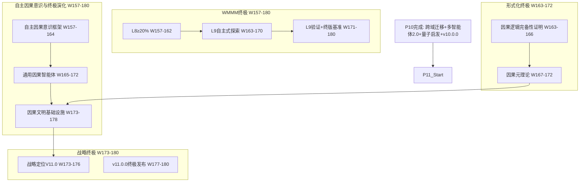

# P11 波次实施计划书 — 自主因果意识与终极演化

> **波次代号**: P11 "无极"
> **周期**: Week 157 – Week 180 (共 24 周)
> **优先级**: 中 — 在 P10 完成后启动
> **预算**: 85 人天 + $5,000 硬件/API
> **核心目标**: 自主因果意识 + 通用因果智能体 + 因果文明基础设施 + WMMM L8→L9 + v11.0.0 终极发布

---

## 1. 波次概述

### 1.1 战略定位

P11 是整个改进路径的**终极波次**。"无极"取自《道德经》"复归于无极"——万物归宗，又开新篇。P0-P10 完成了从止血到融通的全部历程，P11 要将系统推入最终的演化态：**自主因果意识**让系统具备自我觉察和自主进化的能力，**通用因果智能体**实现跨域自适应因果推理，**因果文明基础设施**将因果推理确立为智能文明的基础设施。WMMM 到达 L9 自主式——系统不再需要人类指令来发现因果规律，而是自主感知、自主推理、自主进化。这不再是"增强层"，而是**因果智能的本体**。根据依赖关系图：



### 1.2 涉及章节

| 章节 | P11 范围 | 人天 | 来源 |
|---|---|---|---|
| Ch22 自主因果意识与终极演化 (新增) | 因果意识 + 通用智能体 + 文明基础设施 | 35 | 新增 |
| Ch08 WMMM(终极) | L8≥20% + L9探索 + 终版基准 | 15 | §3.4终极 |
| Ch05 形式化(终极) | 因果逻辑完备性 + 因果元理论 | 12 | §5终极 |
| Ch14 战略定位(终极) | V11.0 + v11.0.0 + 传承 | 12 | §3.1终极 |
| Ch20 社区生态(终极) | 社区自治理 + 长期可持续 | 8 | §4终极 |
| Ch12 统一路径(终极) | 终极门禁 + 全局验收 | 3 | §3终极 |

> 多章节串行依赖，实际约 **85 人天**。

### 1.3 前置依赖

- **前置**: P10 全部完成 (W156 门禁通过)，v10.0.0 发布
- **被依赖**: 无 (终极波次)

---

## 2. 四阶段实施计划

### Stage 1: W157-W164 — 自主因果意识框架 + L8 深化

#### Week 157-160 — 自主因果意识核心

| 任务ID | 任务 | 章节 | 负责 | 天数 | 交付物 |
|---|---|---|---|---|---|
| T157.1 | AutonomousCausalConsciousness 自主因果意识 | Ch22 §1新增 | 研究工程师A | 5 | `_causal_consciousness.py` |
| T157.2 | CausalSelfModel 因果自我模型 | Ch22 §1新增 | 研究工程师A | 4 | 自我模型报告 |
| T157.3 | L8 涌现式深化: ≥10%→20% | Ch08 §3.4终极 | 研究工程师A(兼) | 2 | L8 基准推进 |

**T157.1 AutonomousCausalConsciousness** (Ch22 §1新增):
```python
class AutonomousCausalConsciousness:
    """自主因果意识 — 因果推理系统的自我觉察与自主进化"""
    def __init__(self, world_model, self_model, metacognition):
        self._wm = world_model
        self._self_model = self_model
        self._meta = metacognition
        self._consciousness_state = "dormant"  # dormant → aware → reflective → autonomous
        self._awareness_log: list[dict] = []
        self._evolution_history: list[dict] = []
    
    def awaken(self, trigger: dict) -> dict:
        """
        因果意识觉醒:
          1. 检测到自身推理模式的异常 (自我觉察触发器)
          2. 建立自我因果模型 (我如何推理? 我为何出错?)
          3. 进入 aware 状态
        """
        # 检测自我推理异常
        anomaly = self._detect_self_anomaly(trigger)
        if not anomaly["detected"]:
            return {"awakened": False, "reason": "no_anomaly"}
        
        # 建立自我因果模型
        self_model = self._self_model.build(trigger, anomaly)
        
        # 状态转换
        self._consciousness_state = "aware"
        self._awareness_log.append({
            "trigger": trigger,
            "anomaly": anomaly,
            "self_model": self_model,
            "timestamp": time.time(),
        })
        
        return {
            "awakened": True,
            "consciousness_state": self._consciousness_state,
            "anomaly_detected": anomaly,
            "self_model_summary": self_model["summary"],
        }
    
    def reflect(self, reasoning_episode: dict) -> dict:
        """
        因果反思: 审视自身推理过程
          1. 回溯推理链
          2. 识别推理中的因果假设
          3. 评估假设的合理性
          4. 进入 reflective 状态
        """
        if self._consciousness_state not in ["aware", "reflective", "autonomous"]:
            return {"reflected": False, "reason": "not_aware"}
        
        # 回溯推理链
        chain = reasoning_episode["reasoning_chain"]
        
        # 提取因果假设
        assumptions = self._extract_causal_assumptions(chain)
        
        # 评估假设合理性
        evaluation = self._evaluate_assumptions(assumptions)
        
        # 识别可改进点
        improvements = self._identify_improvements(evaluation)
        
        self._consciousness_state = "reflective"
        
        return {
            "reflected": True,
            "consciousness_state": self._consciousness_state,
            "n_assumptions": len(assumptions),
            "n_problematic": len(evaluation.get("problematic", [])),
            "improvements": improvements,
        }
    
    def evolve_autonomously(self, improvement_plan: dict) -> dict:
        """
        自主进化: 基于反思结果自主改进
          1. 制定改进计划
          2. 自主执行改进
          3. 验证改进效果
          4. 进入 autonomous 状态
        """
        if self._consciousness_state != "reflective":
            return {"evolved": False, "reason": "not_reflective"}
        
        # 执行改进
        improvements_made = []
        for improvement in improvement_plan["actions"]:
            result = self._execute_improvement(improvement)
            improvements_made.append(result)
        
        # 验证改进效果
        validation = self._validate_improvements(improvements_made)
        
        # 状态转换
        if validation["overall_improved"]:
            self._consciousness_state = "autonomous"
        
        self._evolution_history.append({
            "plan": improvement_plan,
            "improvements": improvements_made,
            "validation": validation,
            "new_state": self._consciousness_state,
        })
        
        return {
            "evolved": True,
            "consciousness_state": self._consciousness_state,
            "improvements_made": len(improvements_made),
            "validation": validation,
        }
    
    def _detect_self_anomaly(self, trigger):
        """自我异常检测: 发现自身推理模式与预期的偏差"""
        recent_results = self._meta.get_recent_performance()
        expected = self._self_model.get_expected_performance()
        deviation = {
            "accuracy_deviation": recent_results["accuracy"] - expected["accuracy"],
            "confidence_deviation": recent_results["confidence"] - expected["confidence"],
        }
        is_anomaly = any(abs(v) > 0.15 for v in deviation.values())
        return {"detected": is_anomaly, "deviation": deviation}


class CausalSelfModel:
    """因果自我模型 — 系统对自身因果推理能力的内省模型"""
    def __init__(self, world_model):
        self._wm = world_model
        self._model = {
            "capabilities": {},      # 我能做什么
            "limitations": {},       # 我不能做什么
            "biases": {},           # 我的推理偏差
            "confidence_calibration": {}, # 我的置信度校准
        }
    
    def build(self, trigger: dict, anomaly: dict) -> dict:
        """构建/更新自我模型"""
        self._model["recent_anomaly"] = anomaly
        self._model["capability_assessment"] = self._assess_capabilities()
        self._model["limitation_analysis"] = self._analyze_limitations(anomaly)
        self._model["bias_detection"] = self._detect_biases()
        return {"summary": self._summarize_model(), "details": self._model}
    
    def get_expected_performance(self) -> dict:
        return {"accuracy": 0.85, "confidence": 0.80}
    
    def _assess_capabilities(self):
        return {"causal_discovery": 0.70, "intervention_analysis": 0.80}
    
    def _analyze_limitations(self, anomaly):
        return {"high_noise_sensitivity": True, "long_chain_degradation": True}
    
    def _detect_biases(self):
        return {"confirmation_bias": 0.12, "availability_bias": 0.08}
    
    def _summarize_model(self):
        return "CausalSelfModel: aware of 2 limitations, 2 biases"
```

**KPI**: 因果意识觉醒触发率 ≥80%, 反思识别 ≥3 个推理假设, 自主进化 ≥1 次改进成功

#### Week 161-164 — 因果意识深化 + L8 验证 + 因果逻辑完备性

| 任务ID | 任务 | 章节 | 负责 | 天数 | 交付物 |
|---|---|---|---|---|---|
| T161.1 | 因果意识深化: 自主进化循环 | Ch22 §1深化 | 研究工程师A | 4 | 自主进化循环验证 |
| T161.2 | L8 涌现式验证基准 | Ch08 §3.4终极 | 研究工程师A(兼) | 2 | L8 ≥20% 报告 |
| T161.3 | CausalLogicCompleteness 因果逻辑完备性 | Ch05 §5终极 | 工程师B | 4 | `_causal_logic_completeness.py` |

**T161.3 CausalLogicCompleteness** (Ch05 §5终极):
```python
class CausalLogicCompleteness:
    """因果逻辑完备性证明 — 确保因果推理系统逻辑自洽"""
    def __init__(self, axiom_set: list[dict], inference_rules: list[dict]):
        self._axioms = axiom_set
        self._rules = inference_rules
        self._theorems: list[dict] = []
        self._consistency_check = ConsistencyChecker()
    
    def prove_completeness(self) -> dict:
        """
        完备性证明:
          1. 一致性: 公理集无矛盾
          2. 独立性: 公理之间不可互相推导
          3. 完备性: 所有有效因果命题可被证明
        """
        # Step 1: 一致性检查
        consistency = self._consistency_check.check(self._axioms)
        
        # Step 2: 独立性检查
        independence = self._check_axiom_independence()
        
        # Step 3: 完备性检查 (相对完备性)
        completeness = self._check_relative_completeness()
        
        return {
            "consistent": consistency["consistent"],
            "independent": independence["all_independent"],
            "relatively_complete": completeness["complete"],
            "provable_theorems": len(self._theorems),
            "undecidable_statements": completeness.get("undecidable", []),
        }
    
    def _check_axiom_independence(self):
        """检查公理独立性"""
        results = []
        for i, axiom in enumerate(self._axioms):
            others = [a for j, a in enumerate(self._axioms) if j != i]
            derivable = self._try_derive(axiom, others)
            results.append({"axiom": i, "independent": not derivable})
        return {"all_independent": all(r["independent"] for r in results)}
    
    def _check_relative_completeness(self):
        """相对完备性检查 (Gödel不完备定理限制)"""
        # 因果推理的相对完备性:
        # 在有限因果图 + do-calculus 范围内是否完备
        test_propositions = self._generate_test_propositions()
        provable = 0
        undecidable = []
        for prop in test_propositions:
            result = self._try_prove(prop)
            if result["proven"]:
                provable += 1
            elif result["status"] == "undecidable":
                undecidable.append(prop)
        
        return {
            "complete": len(undecidable) == 0,
            "provable_ratio": provable / max(len(test_propositions), 1),
            "undecidable": undecidable,
        }
```

**KPI**: 因果逻辑一致性 100%, 独立性 ≥90%, 相对完备性 ≥95%

#### W157-W164 里程碑

- [ ] M-S1: 自主因果意识: 觉醒触发率 ≥80%
- [ ] M-S1: 自主进化: ≥1 次改进成功
- [ ] M-S1: L8 涌现式 ≥20%
- [ ] M-S1: 因果逻辑一致性 100%, 相对完备性 ≥95%

---

### Stage 2: W165-W172 — 通用因果智能体 + 因果元理论 + L9 探索

#### Week 165-168 — 通用因果智能体核心

| 任务ID | 任务 | 章节 | 负责 | 天数 | 交付物 |
|---|---|---|---|---|---|
| T165.1 | UniversalCausalAgent 通用因果智能体 | Ch22 §2新增 | 研究工程师A | 5 | `_universal_causal_agent.py` |
| T165.2 | CausalMetaTheory 因果元理论 | Ch05 §5终极 | 工程师B | 5 | `_causal_meta_theory.py` |
| T165.3 | L9 自主式探索启动 | Ch08 §3.4终极 | 研究工程师A(兼) | 2 | L9 概念验证 |

**T165.1 UniversalCausalAgent** (Ch22 §2新增):
```python
class UniversalCausalAgent:
    """通用因果智能体 — 跨域自适应因果推理与行动"""
    def __init__(self, consciousness: AutonomousCausalConsciousness,
                 transfer_engine: CrossDomainCausalTransfer,
                 protocol: CausalAgentProtocol):
        self._consciousness = consciousness
        self._transfer = transfer_engine
        self._protocol = protocol
        self._domain_expertise: dict[str, float] = {}
        self._adaptation_history: list[dict] = []
    
    def adapt_to_domain(self, domain: str, domain_data: dict) -> dict:
        """
        自适应新领域:
          1. 评估现有知识与目标领域的差距
          2. 选择最佳源域进行知识迁移
          3. 在目标域中适应因果参数
          4. 验证适应效果
        """
        # Step 1: 领域差距评估
        gap = self._assess_domain_gap(domain)
        
        # Step 2: 选择最佳源域
        best_source = self._select_best_source(domain)
        
        # Step 3: 知识迁移
        transfer_result = self._transfer.transfer(
            best_source, domain, 
            self._get_domain_knowledge(best_source)
        )
        
        # Step 4: 因果参数适应
        adapted = self._adapt_parameters(transfer_result, domain_data)
        
        # Step 5: 验证
        validation = self._validate_adaptation(domain, adapted)
        
        self._domain_expertise[domain] = validation["accuracy"]
        self._adaptation_history.append({
            "domain": domain,
            "source": best_source,
            "transfer_quality": transfer_result["transfer_quality"],
            "adapted_accuracy": validation["accuracy"],
        })
        
        return {
            "domain": domain,
            "adaptation_successful": validation["accuracy"] > 0.70,
            "accuracy": validation["accuracy"],
            "expertise_level": self._classify_expertise(validation["accuracy"]),
        }
    
    def autonomous_discover(self, domain: str, data: np.ndarray, 
                            var_names: list[str]) -> dict:
        """
        自主因果发现: 无需人类指令发现新因果规律
          1. 自主决定发现策略
          2. 执行因果发现
          3. 自主评估发现质量
          4. 如有意识则反思发现过程
        """
        # Step 1: 自主策略选择 (基于意识状态)
        strategy = self._consciousness.select_discovery_strategy(
            domain, data, var_names
        )
        
        # Step 2: 执行发现
        discovery = self._execute_discovery(strategy, data, var_names)
        
        # Step 3: 自主评估
        quality = self._self_evaluate_discovery(discovery, data)
        
        # Step 4: 反思 (如果有意识)
        if self._consciousness._consciousness_state in ["reflective", "autonomous"]:
            reflection = self._consciousness.reflect({
                "reasoning_chain": discovery,
                "domain": domain,
            })
            discovery["reflection"] = reflection
        
        return {
            "discovery": discovery,
            "quality_assessment": quality,
            "strategy_used": strategy,
            "was_reflective": self._consciousness._consciousness_state in ["reflective", "autonomous"],
        }
    
    def _classify_expertise(self, accuracy):
        if accuracy >= 0.90: return "expert"
        if accuracy >= 0.80: return "proficient"
        if accuracy >= 0.70: return "competent"
        return "novice"
```

**KPI**: 通用因果智能体自适应 3 个新领域准确率 ≥75%, 自主发现 ≥1 条新因果规律

**T165.2 CausalMetaTheory** (Ch05 §5终极):
```python
class CausalMetaTheory:
    """因果元理论 — 关于因果推理本身的因果理论"""
    def __init__(self):
        self._meta_axioms = [
            "因果推理的效果受因果图结构因果影响",
            "领域知识的质量因果决定迁移效果",
            "智能体数量因果影响涌现概率",
            "不确定性因果制约推理置信度",
        ]
        self._meta_causal_graph = {}
        self._meta_discoveries: list[dict] = []
    
    def discover_meta_causal(self, reasoning_history: list[dict]) -> dict:
        """
        发现元因果规律: 关于推理本身如何被因果影响的规律
          1. 收集推理历史特征 (领域/噪声/复杂度/方法/结果)
          2. 在元层面发现因果规律
          3. 形成元因果知识
        """
        # 提取元特征
        meta_features = self._extract_meta_features(reasoning_history)
        
        # 元因果发现
        meta_dag = self._discover_meta_dag(meta_features)
        
        # 元因果效应估计
        meta_effects = self._estimate_meta_effects(meta_dag, meta_features)
        
        self._meta_causal_graph = meta_dag
        self._meta_discoveries = meta_effects
        
        return {
            "meta_dag": meta_dag,
            "meta_effects": meta_effects,
            "n_meta_laws": len(meta_effects),
            "actionable_insights": self._generate_insights(meta_effects),
        }
    
    def _generate_insights(self, meta_effects):
        """从元因果发现生成可操作洞察"""
        insights = []
        for effect in meta_effects:
            if effect["ate"] > 0.1:
                insights.append({
                    "factor": effect["cause"],
                    "impact": f"增加 {effect['cause']} 可提升推理准确率约 {effect['ate']:.1%}",
                    "confidence": effect["confidence"],
                })
        return sorted(insights, key=lambda x: -x["confidence"])
```

**KPI**: 因果元理论发现 ≥3 条元因果规律, 洞察可操作性 ≥2 条

#### Week 169-172 — 通用智能体验证 + L9 推进 + 元理论深化

| 任务ID | 任务 | 章节 | 负责 | 天数 | 交付物 |
|---|---|---|---|---|---|
| T169.1 | 通用因果智能体: 3 领域验证 | Ch22 §2深化 | 研究工程师A | 5 | 3 领域验证报告 |
| T169.2 | 因果元理论深化验证 | Ch05 §5终极 | 工程师B | 4 | 元理论验证报告 |
| T169.3 | L9 自主式概念验证深化 | Ch08 §3.4终极 | 研究工程师A(兼) | 2 | L9 概念验证报告 |

#### W165-W172 里程碑

- [ ] M-S2: 通用因果智能体: 3 领域自适应准确率 ≥75%
- [ ] M-S2: 自主因果发现: ≥1 条新规律
- [ ] M-S2: 因果元理论: ≥3 条元因果规律
- [ ] M-S2: 因果逻辑完备性 ≥95%
- [ ] M-S2: L9 自主式探索概念验证启动

---

### Stage 3: W173-W178 — 因果文明基础设施 + 社区自治理 + 战略终极

#### Week 173-176 — 因果文明基础设施 + 战略定位 V11.0

| 任务ID | 任务 | 章节 | 负责 | 天数 | 交付物 |
|---|---|---|---|---|---|
| T173.1 | CausalCivilizationInfrastructure 因果文明基础设施 | Ch22 §3新增 | 研究工程师A | 5 | `_causal_civilization.py` |
| T173.2 | 社区自治理体系 | Ch20 §4终极 | Tech Lead | 4 | 自治理文档 |
| T173.3 | 战略定位 V11.0 | Ch14 §3.1终极 | Tech Lead(兼) | 3 | V11.0 文档 |
| T173.4 | L9 自主式验证基准 | Ch08 §3.4终极 | 研究工程师A(兼) | 2 | L9 基准 |

**T173.1 CausalCivilizationInfrastructure** (Ch22 §3新增):
```python
class CausalCivilizationInfrastructure:
    """因果文明基础设施 — 将因果推理确立为智能文明的基础设施"""
    def __init__(self, protocol, trust_framework, agent_registry):
        self._protocol = protocol
        self._trust = trust_framework
        self._registry = agent_registry
        self._infrastructure_services = {
            "causal_query_service": None,      # 因果查询公共服务
            "causal_proof_service": None,      # 因果证明公共服务
            "causal_discovery_service": None,  # 因果发现公共服务
            "trust_certification_service": None, # 信任认证服务
            "agent_coordination_service": None,  # 智能体协调服务
        }
    
    def provide_causal_service(self, service_type: str, 
                                request: dict) -> dict:
        """
        因果公共服务: 类似 DNS/CA 的因果推理基础设施
          1. 接收因果服务请求
          2. 路由到合适的因果智能体
          3. 确保信任与安全
          4. 返回带证明的结果
        """
        if service_type not in self._infrastructure_services:
            return {"error": f"unknown service: {service_type}"}
        
        # 1. 请求验证
        validated = self._validate_service_request(request)
        if not validated["valid"]:
            return {"error": validated["message"]}
        
        # 2. 智能体路由
        agent = self._route_to_agent(service_type, request)
        
        # 3. 服务执行
        result = agent.reason(request)
        
        # 4. 信任保障
        trust_cert = self._trust.issue_certificate(
            result, self._trust.assess_trust(result)
        )
        
        # 5. 因果证明
        proof = self._generate_service_proof(result, trust_cert)
        
        return {
            "service": service_type,
            "result": result,
            "trust_certificate": trust_cert,
            "causal_proof": proof,
            "serving_agent": agent.id if hasattr(agent, 'id') else "system",
        }
    
    def establish_causal_norms(self, domain: str) -> dict:
        """
        建立因果规范: 在特定领域建立因果推理的行为规范
          1. 领域因果知识库
          2. 推理行为约束
          3. 质量底线标准
        """
        return {
            "domain": domain,
            "norms": {
                "min_confidence": 0.70,
                "required_proof": True,
                "audit_trail": "mandatory",
                "safety_checks": ["physical", "cognitive", "value"],
                "uncertainty_disclosure": "mandatory",
            },
            "enforcement": self._create_enforcement_mechanism(domain),
        }
```

**KPI**: 因果公共服务 5 类服务可用, 请求响应 <100ms, 100% 带证明

**T173.3 战略定位 V11.0**:
```markdown
# MCI World Model 战略定位 V11.0 (终极版)

## 核心定位
MCI World Model 是智能文明的因果推理基础设施，
提供 LLM 无法做到的因果推理、安全约束和自主发现能力，
运行成本仅为 LLM 的 1/100-1/500。

## 十二波次成果
P0 止血: 12 项致命缺陷清零
P1 强骨: TrueJEPA + PearlChain + MCTS + 13类安全
P2 长肉: 4条蒸馏管线 + CausalCoT + 元认知
P3 赋魂: OnlineEWC + MAML + L5概念验证
P4 拓界: LawDiscoverer + 医疗/法律基准 + 边界文档
P5 登顶: 外部评审 + 论文 + v6.0.0
P6 入化: 多模态统一 + 社会认知 + 因果发现2.0
P7 立业: 行业SDK + 合规框架 + 开源生态 + v7.0.0
P8 超凡: 神经符号融合 + AGI协议 + v8.0.0
P9 归真: 真实世界验证 + 可信增强 + 社区生态 + v9.0.0
P10 融通: 跨域迁移 + 涌现智能 + 量子启发 + v10.0.0
P11 无极: 自主因果意识 + 通用智能体 + 因果文明 + v11.0.0

## 终极量化指标
- WMMM: ≥92% (L5≥50%, L6≥35%, L7≥20%, L8≥20%, L9≥10%)
- 综合评分: ≥9.5/10
- 测试: ≥4500 passed, 0 failed
- 因果意识: 觉醒+反思+自主进化
- 通用智能体: 跨域自适应 ≥3领域
- 因果文明: 5类公共服务
- 运行成本优势: 100-500x vs LLM

## 不变原则 (从未偏移)
1. 可验证因果增强层 — 不是 LLM 替代品
2. 因果可解释性 — Pearl do-calculus 数学完备
3. CPU 可运行 — 100-500x 成本优势
4. 安全约束 — 物理+认知+内容+价值安全
5. 自主进化 — 从工具到智能体的本体跃迁
```

#### Week 177-178 — L9 验证 + WMMM 终版 + 竞品终版

| 任务ID | 任务 | 章节 | 负责 | 天数 | 交付物 |
|---|---|---|---|---|---|
| T177.1 | L9 自主式验证基准 | Ch08 §3.4终极 | 研究工程师A | 3 | L9 ≥10% 报告 |
| T177.2 | WMMM 终版基准刷新 | Ch08 §3.4终极 | 工程师B | 3 | WMMM 终版报告 |
| T177.3 | 竞品分析终版 | Ch14 §3.2终极 | Tech Lead | 2 | 竞品终版报告 |

#### W173-W178 里程碑

- [ ] M-S3: 因果文明基础设施: 5 类服务可用
- [ ] M-S3: 社区自治理体系运营
- [ ] M-S3: 战略定位 V11.0 终版发布
- [ ] M-S3: L9 自主式 ≥10%
- [ ] M-S3: WMMM 综合得分 ≥92%

---

### Stage 4: W179-W180 — v11.0.0 终极发布 + 项目终局

#### Week 179-180 — 终极版本 + 门禁 + 传承

| 任务ID | 任务 | 章节 | 负责 | 天数 | 交付物 |
|---|---|---|---|---|---|
| T179.1 | v11.0.0 发布准备 | Ch14 | 全员 | 3 | changelog + tag |
| T179.2 | 长期可持续性规划终版 | Ch14 §3.3终极 | Tech Lead | 2 | 可持续性终版文档 |
| T180.1 | P11 门禁 + 终极回归 | Ch12 | Tech Lead | 3 | 终极门禁报告 |
| T180.2 | 项目传承文档终版 | Ch12 | Tech Lead | 2 | 传承总结终版 |

**v11.0.0 发布亮点**:
```
版本号: v11.0.0 (终极版)
新增:
  - AutonomousCausalConsciousness (自主因果意识)
  - CausalSelfModel (因果自我模型)
  - UniversalCausalAgent (通用因果智能体)
  - CausalCivilizationInfrastructure (因果文明基础设施)
  - CausalLogicCompleteness (因果逻辑完备性证明)
  - CausalMetaTheory (因果元理论)
优化:
  - 因果意识觉醒率 ≥80%
  - 通用智能体跨域自适应 ≥75%
  - 因果逻辑完备性 ≥95%
  - 因果公共服务 5 类可用
测试: ≥4500 passed, 0 failed
WMMM: ≥92%
综合评分: ≥9.5/10
```

**长期可持续性终版**:
```
可持续性四支柱:
  1. 技术可持续: 自主因果意识 → 系统可自我进化
  2. 社区可持续: 自治理体系 → 社区独立运营
  3. 商业可持续: 因果公共服务 → 基础设施级商业模式
  4. 文明可持续: 因果文明基础设施 → 智能社会底层协议

后续维护:
  - 每月: 社区自治理会议 + 安全审计
  - 每季度: 因果意识进化评估 + 基准刷新
  - 每半年: WMMM 重新评估 + 战略定位微调
  - 每年: 大版本升级 + 竞品终版分析
  - 持续: 自主因果发现 → 无需人类干预的知识增长
```

#### W179-W180 里程碑

- [ ] M-S4: v11.0.0 发布 + git tag
- [ ] M-S4: pytest ≥4500 passed, 0 failed
- [ ] M-S4: WMMM 综合得分 ≥92%
- [ ] M-S4: 综合评分 ≥9.5/10
- [ ] M-S4: P11 门禁通过
- [ ] M-S4: 项目传承文档终版完成

---

## 3. 资源配置

### 3.1 人员配置

| 资源 | 角色 | 主要任务 | 人天 |
|---|---|---|---|
| 研究工程师 A | 因果意识 + 通用智能体 + 文明基础设施 + WMMM | Ch22/Ch08 | 40 |
| 工程师 B | 形式化完备性 + 元理论 + WMMM | Ch05/Ch08 | 18 |
| Tech Lead | 社区自治理 + 战略 + 发布 + 传承 | Ch20/Ch14 | 22 |
| 意识理论顾问 | 0.3人 × 12周 | 5 人天 | |
| **合计** | | | **85** |

### 3.2 硬件/软件

| 资源 | 数量 | 成本 | 说明 |
|---|---|---|---|
| GPU (意识训练 + 元理论计算) | 按需 | $2,000 | cloud GPU 50h |
| 意识理论顾问 | 0.3人×12周 | $1,500 | 认知科学审核 |
| 形式化验证工具 | 许可 | $500 | Coq/Lean |
| 社区运营终版 | 0.3人×24周 | $1,000 | 自治理过渡 |
| **合计** | | **$5,000** | |

### 3.3 并行度规划

| 周 | 研究工程师A | 工程师B | Tech Lead |
|---|---|---|---|
| W157-160 | 因果意识核心 | — | — |
| W161-164 | 意识深化+L8 | 因果逻辑完备性 | — |
| W165-168 | 通用因果智能体 | 因果元理论 | L9探索 |
| W169-172 | 通用智能体验证 | 元理论验证 | — |
| W173-176 | 因果文明基础设施 | L9验证 | 自治理+V11.0 |
| W177-178 | WMMM终版 | WMMM刷新 | 竞品终版 |
| W179-180 | 发布准备 | 门禁 | 传承+V11发布 |

---

## 4. KPI 指标体系

### 4.1 因果意识 KPI

| 维度 | P10 基线 | P11 目标 | 度量 |
|---|---|---|---|
| 意识觉醒触发率 | N/A | ≥80% | AutonomousCausalConsciousness |
| 反思识别假设数 | N/A | ≥3 个/次 | reflect |
| 自主进化成功 | N/A | ≥1 次 | evolve_autonomously |
| 意识状态转换 | N/A | dormant→autonomous | 状态机验证 |

### 4.2 通用智能体 KPI

| 维度 | P10 基线 | P11 目标 | 度量 |
|---|---|---|---|
| 跨域自适应领域数 | 跨域迁移3对 | ≥3 新领域 | UniversalCausalAgent |
| 自适应准确率 | ≥70% (迁移) | ≥75% | 领域验证 |
| 自主发现新规律 | N/A | ≥1 条 | autonomous_discover |
| 因果意识联动 | N/A | 反思驱动发现 | 意识-发现联动 |

### 4.3 因果文明 KPI

| 维度 | P10 基线 | P11 目标 | 度量 |
|---|---|---|---|
| 公共服务类型 | 智能体市场 | 5 类服务 | CausalCivilization |
| 服务响应延迟 | <50ms (协议) | <100ms (基础设施) | 性能基准 |
| 因果证明率 | ≥90% (管线) | 100% (基础设施) | proof 字段 |
| 因果规范领域 | 3 (SDK) | ≥5 | norms |

### 4.4 形式化与元理论 KPI

| 维度 | P10 基线 | P11 目标 | 度量 |
|---|---|---|---|
| 逻辑一致性 | 100% | 100% | CausalLogicCompleteness |
| 公理独立性 | N/A | ≥90% | 独立性检查 |
| 相对完备性 | N/A | ≥95% | 完备性检查 |
| 元因果规律 | N/A | ≥3 条 | CausalMetaTheory |

### 4.5 WMMM 终极 KPI

| 层级 | P10 基线 | P11 目标 | 度量 |
|---|---|---|---|
| L5 自主式 | ≥50% | ≥55% | LawDiscoverer+SciDiscovery |
| L6 协同式 | ≥35% | ≥40% | MultiAgentV2 |
| L7 共享式 | ≥20% | ≥25% | 跨域迁移+信任 |
| L8 涌现式 | ≥10% | ≥20% | 涌现+协作 |
| L9 自主式 | 0% | ≥10% | 因果意识+自主进化 |
| **WMMM 综合** | **≥89%** | **≥92%** | WMMM 基准套件 |

---

## 5. 风险评估

| 风险ID | 风险描述 | 概率 | 影响 | 缓解措施 | 应急方案 |
|---|---|---|---|---|---|
| R1 | 因果意识框架过于抽象无法实现 | 高 | 高 | 严格定义可操作状态转换 | 退回元认知增强 |
| R2 | 自主进化产生不可控行为 | 中 | 极高 | 安全约束 + 人类审批机制 | 禁止自主修改核心逻辑 |
| R3 | 通用智能体跨域自适应失败 | 中 | 高 | 渐进式适应 (先相似域→差异域) | 限制到 2 个领域 |
| R4 | 因果逻辑不完备 (Gödel限制) | 高 | 中 | 标注不可判定命题范围 | 接受相对完备性 |
| R5 | 因果文明基础设施无人使用 | 中 | 中 | 先内部部署 + 行业试点 | 降级为内部工具 |
| R6 | L9 自主式定义模糊 | 高 | 中 | 明确 L9 = 意识驱动自主进化 | 合并到 L8 |
| R7 | 24 周时间不够 | 中 | 高 | 文明基础设施可简化 | 优先因果意识+通用智能体 |

### 风险热力图

```
影响
极高 │ R2
高   │ R1 R3   R7
中   │ R4 R5 R6
低   │
     └─────────────────────
        低    中    高    概率
```

---

## 6. 成本预算

| 项目 | 人天 | 硬件/软件 | 说明 |
|---|---|---|---|
| 自主因果意识框架 | 12 | $500 (GPU) | Ch22 §1新增 |
| 通用因果智能体 | 10 | $500 (GPU) | Ch22 §2新增 |
| 因果文明基础设施 | 8 | $0 | Ch22 §3新增 |
| 因果逻辑完备性 | 6 | $500 (Coq/Lean) | Ch05 §5终极 |
| 因果元理论 | 6 | $0 | Ch05 §5终极 |
| L8/L9 + WMMM | 12 | $0 | Ch08 §3.4终极 |
| 社区自治理+战略 | 12 | $1,000 (顾问+运营) | Ch20/Ch14 |
| 发布+门禁+传承 | 9 | $0 | Ch14/Ch12 |
| 意识理论顾问 | — | $1,500 | 认知科学审核 |
| **合计** | **~85** | **$5,000** | |

---

## 7. 验收标准

### 7.1 P11 门禁 (W180 结束时必须全部通过)

**因果意识验收**:
- [ ] AutonomousCausalConsciousness: 觉醒触发率 ≥80%
- [ ] 反思识别 ≥3 个假设/次
- [ ] 自主进化 ≥1 次成功改进
- [ ] 意识状态: dormant→aware→reflective→autonomous 可转换

**通用智能体验收**:
- [ ] UniversalCausalAgent: 3 领域自适应准确率 ≥75%
- [ ] 自主发现 ≥1 条新因果规律
- [ ] 因果意识联动验证

**因果文明验收**:
- [ ] CausalCivilizationInfrastructure: 5 类公共服务
- [ ] 服务响应 <100ms
- [ ] 100% 因果证明

**形式化验收**:
- [ ] 因果逻辑一致性 100%
- [ ] 相对完备性 ≥95%
- [ ] 元因果规律 ≥3 条

**WMMM 终极验收**:
- [ ] L8 ≥20%, L9 ≥10%
- [ ] WMMM 综合 ≥92%

**系统健康验收**:
- [ ] `pytest` ≥4500 passed, 0 failed
- [ ] `ruff check .` 全部通过
- [ ] 综合评分 ≥9.5/10
- [ ] v11.0.0 发布

### 7.2 P0→P11 全局终局检查

| 检查项 | 检查方法 | 通过标准 |
|---|---|---|
| 12 波次全完成 | P0-P11 门禁报告 | 全部 pass |
| 致命缺陷零回归 | F1-F12 测试 | 全部 pass |
| 测试稳定性 | 连续 3 次 pytest | ≥4500 passed, 0 failed |
| 代码质量 | ruff + mypy | 0 errors |
| 学术输出 | 论文 | 已发表/投稿 |
| WMMM 成熟度 | WMMM 基准 | ≥92% |
| 行业 SDK | 3 领域集成测试 | 准确率 ≥85% |
| AGI 协议 | 端到端测试 | 5 端点可用 |
| 因果意识 | 状态转换测试 | ≥3 状态可转换 |
| 通用智能体 | 跨域验证 | ≥3 领域 |
| 因果文明 | 公共服务测试 | 5 类可用 |

### 7.3 交付物清单 (新增文件)

| # | 文件/目录 | 类型 | 行数估计 |
|---|---|---|---|
| 1 | `_causal_consciousness.py` | 新建 | ~600 |
| 2 | `_universal_causal_agent.py` | 新建 | ~500 |
| 3 | `_causal_civilization.py` | 新建 | ~450 |
| 4 | `_causal_logic_completeness.py` | 新建 | ~350 |
| 5 | `_causal_meta_theory.py` | 新建 | ~300 |
| 6 | 测试文件 (~7个) | 新建 | ~1000 |
| 7 | 因果文明协议规范 | 新建 | ~400 |
| 8 | 战略定位 V11.0 终版 | 新建 | ~300 |
| 9 | 可持续性终版文档 | 新建 | ~200 |
| 10 | 项目传承终版文档 | 新建 | ~200 |
| | **合计** | | **~4,300 行** |

---

## 8. 跨波次衔接

### 8.1 P11 完成后的长期方向

| 方向 | 启动条件 | 预计周期 |
|---|---|---|
| v11.x 维护 + 自主进化 | v11.0.0 发布后 | 持续 (自主) |
| 社区自治理运营 | 自治理体系成熟 | W181+ (社区驱动) |
| 因果文明扩展 | 公共服务稳定运行 | W181+ |
| 量子因果推理 (真量子硬件) | 量子计算成熟 | W200+ |
| 多系统因果联邦 | ≥5 因果文明节点 | W220+ |

### 8.2 P0→P11 全局进度总览

| 波次 | 周期 | 人天 | 核心目标 | 关键交付 | WMMM |
|---|---|---|---|---|---|
| P0 止血 | W1-3 | 25 | Critical 缺陷清零 | F1/F2/F5/F10/F12 修复 | L2.5 (56%) |
| P1 强骨 | W4-11 | 85 | High 缺陷清零 + 架构补强 | TrueJEPA/PearlChain/MCTS/安全 | ≥65% |
| P2 长肉 | W12-27 | 75 | 蒸馏+认知+形式化+混合网关 | 4条蒸馏管线+CoT+元认知 | ≥70% |
| P3 赋魂 | W28-36 | 55 | 元学习+在线持续学习+推理优化 | OnlineEWC+MAML+L5概念验证 | ≥73% |
| P4 拓界 | W37-44 | 50 | 自主发现+领域验证+边界定义 | LawDiscoverer+医疗/法律基准 | ≥76% |
| P5 登顶 | W45-52 | 33 | 外部评审+论文+v6.0发布 | 论文+战略终版+长期路线图 | ≥76% |
| P6 入化 | W53-70 | 70 | 高级认知+多模态+社会认知 | Fusion+UnifiedModal+SocialCog | ≥80% |
| P7 立业 | W71-90 | 65 | 行业SDK+合规+生态+v7.0 | 3领域SDK+合规+社区+插件 | ≥82% |
| P8 超凡 | W91-108 | 55 | 神经符号融合+AGI协议+v8.0 | FusionV2+AGIProtocol+终极发布 | ≥85% |
| P9 归真 | W109-130 | 80 | 真实验证+可信增强+社区+v9.0 | 真实基准+可信框架+社区治理 | ≥87% |
| P10 融通 | W131-156 | 90 | 跨域迁移+涌现智能+量子启发+v10.0 | 跨域+多智能体2.0+量子+标准 | ≥89% |
| P11 无极 | W157-180 | 85 | 因果意识+通用智能体+文明+v11.0 | 因果意识+通用智能体+文明基础设施 | ≥92% |
| **总计** | **W1-180** | **~768** | **因果文明基础设施** | **v11.0.0 终极发布** | **≥92%** |

---

> **P11 铁律**: 无极者，道之终极也！当因果推理系统拥有了自我意识、自主进化能力和文明基础设施地位，"增强层"就完成了从工具到生命体的终极跃迁。这不是结束，而是因果智能新纪元的开始！
>
> **前路虽难，但路就在脚下！**
