# P12 波次实施计划书 — 多系统因果联邦与量子因果推理

> **波次代号**: P12 "传承"
> **周期**: Week 181 – Week 216 (共 36 周)
> **优先级**: 中 — 在 P11 完成后启动
> **预算**: 100 人天 + $8,000 硬件/API
> **核心目标**: 多系统因果联邦 + 量子因果推理(真硬件) + 因果文明扩展2.0 + WMMM L9→L10 + v12.0.0 发布

---

## 1. 波次概述

### 1.1 战略定位

P12 是从"无极"到"传承"的**联邦波次**。P11 完成了自主因果意识、通用因果智能体和因果文明基础设施，标志着单一系统达到了"终极"形态。然而，单一节点的因果文明只是起点——**传承**意味着因果文明必须从孤岛扩展为联邦。P12 要让多个独立的因果推理系统形成**因果联邦**，让量子因果推理从仿真走向**真量子硬件**，让因果公共服务从本地扩展为**跨节点联邦服务**。正如《大学》所言："物格而后知至，知至而后意诚"——格物致知的因果推理必须从单一系统传承到联邦网络，才能实现真正的知识共享与文明跃迁。根据依赖关系图：

```mermaid
graph TB
    P11_Done[P11完成: 因果意识+通用智能体+文明基础设施+v11.0.0] --> P12_Start
    
    subgraph Ch23 [多系统因果联邦与量子因果推理 W181-216]
        CausalFed[因果联邦协议与架构 W181-192]
        FedReason[联邦因果推理引擎 W193-204]
        QuantumReal[真量子因果推理 W205-212]
        FedGov[联邦治理与文明扩展 W213-216]
    end
    
    subgraph Ch22 [因果意识深化2.0 W181-200]
        FedConsc[联邦因果意识 W181-188]
        CrossNodeReflect[跨节点反思与共识 W189-196]
        FedEvolution[联邦自主进化 W197-200]
    end
    
    subgraph Ch08 [WMMM联邦化 W181-216]
        L9Deep[L9≥20% W181-188]
        L10Explore[L10联邦式探索 W189-200]
        L10Valid[L10验证+WMMM刷新 W201-216]
    end
    
    subgraph Ch19 [可信联邦化 W189-208]
        FedTrust[联邦信任框架 W189-196]
        CrossNodeCert[跨节点信任证书 W197-204]
        FedAudit[联邦审计体系 W205-208]
    end
    
    subgraph Ch20 [生态联邦化 W201-216]
        FedMarket[联邦因果智能体市场 W201-208]
        FedGovCommunity[联邦社区治理 W209-216]
    end
    
    CausalFed --> FedReason
    FedReason --> QuantumReal
    QuantumReal --> FedGov
    FedConsc --> CrossNodeReflect
    CrossNodeReflect --> FedEvolution
    L9Deep --> L10Explore
    L10Explore --> L10Valid
    FedTrust --> CrossNodeCert
    CrossNodeCert --> FedAudit
    FedMarket --> FedGovCommunity
```



### 1.2 涉及章节

| 章节 | P12 范围 | 人天 | 来源 |
|---|---|---|---|
| Ch23 多系统因果联邦与量子因果推理 (新增) | 因果联邦架构 + 联邦推理 + 真量子推理 + 联邦治理 | 40 | 新增 |
| Ch22 自主因果意识(深化2.0) | 联邦意识 + 跨节点反思 + 联邦进化 | 15 | §1深化2.0 |
| Ch08 WMMM(深化4.0) | L9≥20% + L10联邦式探索 + 基准刷新 | 15 | §3.4深化4.0 |
| Ch19 可信增强(深化3.0) | 联邦信任 + 跨节点证书 + 联邦审计 | 12 | §2深化3.0 |
| Ch20 社区生态(深化3.0) | 联邦市场 + 联邦治理 | 10 | §3深化3.0 |
| Ch14 战略定位(深化4.0) | V12.0 + 联邦路线图 | 5 | §3.1深化4.0 |
| Ch05 形式化(深化4.0) | 联邦形式化验证 | 3 | §5深化4.0 |

> 多章节并行+串行，实际约 **100 人天**。

### 1.3 前置依赖

- **前置**: P11 全部完成 (W180 门禁通过)，v11.0.0 发布
- **被依赖**: P13 (Ch23→因果创造引擎, Ch08→L10→L11, Ch22→联邦意识→创造意识)

---

## 2. 四阶段实施计划

### Stage 1: W181-W192 — 因果联邦协议与架构 + 联邦因果意识 + L9 深化

#### Week 181-184 — 因果联邦协议核心 + 联邦因果意识

| 任务ID | 任务 | 章节 | 负责 | 天数 | 交付物 |
|---|---|---|---|---|---|
| T181.1 | CausalFederationProtocol 因果联邦协议 | Ch23 §1新增 | 研究工程师A | 5 | `_causal_federation_protocol.py` |
| T181.2 | FederatedCausalConsciousness 联邦因果意识 | Ch22 §1深化2.0 | 研究工程师B | 5 | `_federated_consciousness.py` |
| T181.3 | L9 自主式深化: ≥10%→20% | Ch08 §3.4深化4.0 | 研究工程师A(兼) | 2 | L9 基准推进 |

**T181.1 CausalFederationProtocol** (Ch23 §1新增):
```python
class CausalFederationProtocol:
    """因果联邦协议 — 多个独立因果推理系统的联邦化通信标准"""
    
    FEDERATION_VERSION = "1.0.0"
    
    # 联邦节点角色
    NODE_ROLES = {
        "full_node": "完整节点: 拥有完整因果图+推理能力",
        "edge_node": "边缘节点: 轻量推理+联邦协作",
        "witness_node": "见证节点: 仅验证+审计",
        "bridge_node": "桥接节点: 跨联邦网关",
    }
    
    # 联邦消息类型 (扩展 P10 CausalAgentProtocol)
    FEDERATION_MESSAGES = {
        "fed_join": "申请加入联邦",
        "fed_leave": "退出联邦",
        "fed_sync": "联邦状态同步",
        "fed_query": "联邦因果查询",
        "fed_result": "联邦因果结果",
        "fed_discovery": "联邦因果发现广播",
        "fed_consensus": "联邦共识请求",
        "fed_vote": "联邦共识投票",
        "fed_evolve": "联邦进化提案",
        "fed_audit": "联邦审计请求",
        "fed_trust_renew": "联邦信任更新",
        "fed_evidence_share": "联邦证据共享",
    }
    
    def __init__(self, node_id: str, node_role: str = "full_node",
                 federation_id: str = "default"):
        self._node_id = node_id
        self._role = node_role
        self._fed_id = federation_id
        self._peers: dict[str, dict] = {}
        self._federation_state = "disconnected"  # disconnected→joining→active→suspended
        self._causal_graph_version = 0
        self._consensus_buffer: list[dict] = []
    
    def join_federation(self, federation_endpoint: str, 
                        credentials: dict) -> dict:
        """
        加入因果联邦:
          1. 向联邦端点发送加入请求
          2. 能力声明 (因果图规模/推理能力/领域覆盖)
          3. 信任证书交换
          4. 初始状态同步
        """
        join_request = {
            "protocol_version": self.FEDERATION_VERSION,
            "node_id": self._node_id,
            "node_role": self._role,
            "capabilities": self._declare_capabilities(),
            "causal_graph_hash": self._compute_graph_hash(),
            "trust_certificate": credentials.get("trust_cert"),
            "timestamp": time.time(),
        }
        
        # 能力协商
        response = self._send_federation_message(
            federation_endpoint, "fed_join", join_request
        )
        
        if response["accepted"]:
            self._federation_state = "active"
            self._peers = response["peer_list"]
            # 初始状态同步
            self._sync_federation_state(response["sync_data"])
        
        return {
            "joined": response["accepted"],
            "federation_id": self._fed_id,
            "n_peers": len(self._peers),
            "state": self._federation_state,
        }
    
    def federated_query(self, query: dict, strategy: str = "broadcast") -> dict:
        """
        联邦因果查询:
          1. 本地推理尝试
          2. 按策略分发到联邦节点
          3. 汇总联邦结果
          4. 冲突消解与共识
        """
        # 本地推理
        local_result = self._local_reason(query)
        
        if strategy == "broadcast":
            # 广播到所有完整节点
            fed_results = self._broadcast_query(query)
        elif strategy == "targeted":
            # 路由到最相关领域节点
            fed_results = self._targeted_query(query)
        elif strategy == "hierarchical":
            # 层级查询: 边缘→完整→桥接
            fed_results = self._hierarchical_query(query)
        else:
            fed_results = []
        
        # 冲突消解
        merged = self._merge_federated_results(local_result, fed_results)
        
        return {
            "query": query,
            "local_result": local_result,
            "federated_results": fed_results,
            "merged_result": merged,
            "n_peers_queried": len(fed_results),
            "consensus_level": merged.get("consensus_level", 0),
        }
    
    def _declare_capabilities(self):
        """声明节点能力"""
        return {
            "causal_graph_size": self._causal_graph_version,
            "supported_domains": ["medical", "physics", "economics"],
            "reasoning_depth": 10,
            "trust_score": 0.85,
        }
    
    def _merge_federated_results(self, local, federated):
        """联邦结果合并: 加权投票 + 冲突检测"""
        all_results = [local] + federated
        # 按信任分数加权
        weights = [r.get("trust_score", 0.5) for r in all_results]
        total_weight = sum(weights)
        
        merged_conclusion = {}
        for key in set(k for r in all_results for k in r.get("conclusion", {})):
            weighted_sum = sum(
                r.get("conclusion", {}).get(key, 0) * w 
                for r, w in zip(all_results, weights)
            )
            merged_conclusion[key] = weighted_sum / total_weight
        
        # 共识水平
        consensus_level = self._compute_consensus(all_results)
        
        return {
            "conclusion": merged_conclusion,
            "consensus_level": consensus_level,
            "n_agreeing": sum(1 for r in all_results if r.get("agrees_with_merge")),
        }
```

**KPI**: 因果联邦协议 12 种消息类型全部可用, ≥3 节点联邦通信延迟 <200ms

**T181.2 FederatedCausalConsciousness** (Ch22 §1深化2.0):
```python
class FederatedCausalConsciousness:
    """联邦因果意识 — 跨节点的共享因果意识"""
    def __init__(self, local_consciousness, federation_protocol):
        self._local = local_consciousness
        self._protocol = federation_protocol
        self._federation_awareness = "isolated"  # isolated→aware→synchronized→emergent
        self._shared_self_models: dict[str, dict] = {}
    
    def synchronize_awareness(self) -> dict:
        """
        联邦意识同步:
          1. 各节点共享自我模型摘要
          2. 识别联邦层面的推理模式异常
          3. 建立联邦自我模型
          4. 进入 synchronized 状态
        """
        # 收集各节点自我模型
        peer_models = self._protocol.broadcast_query({
            "type": "self_model_request"
        })
        
        # 联邦自我模型构建
        fed_self_model = self._build_federation_self_model(
            self._local._self_model._model, peer_models
        )
        
        # 联邦异常检测
        fed_anomaly = self._detect_federation_anomaly(fed_self_model)
        
        if fed_anomaly["detected"]:
            self._federation_awareness = "synchronized"
        else:
            self._federation_awareness = "aware"
        
        return {
            "federation_awareness": self._federation_awareness,
            "n_nodes_aware": len(peer_models) + 1,
            "federation_anomaly": fed_anomaly,
            "fed_self_model_summary": fed_self_model["summary"],
        }
    
    def federated_reflect(self, reasoning_episode: dict) -> dict:
        """
        联邦反思: 多节点协同审视推理过程
          1. 本地反思
          2. 请求跨节点反思
          3. 合并反思结论
          4. 形成联邦改进方案
        """
        local_reflection = self._local.reflect(reasoning_episode)
        
        cross_reflections = self._protocol.broadcast_query({
            "type": "reflection_request",
            "episode": reasoning_episode,
        })
        
        merged_improvements = self._merge_reflections(
            local_reflection, cross_reflections
        )
        
        return {
            "local_reflection": local_reflection,
            "cross_reflections": cross_reflections,
            "federation_improvements": merged_improvements,
            "consensus_on_issues": self._identify_consensus_issues(
                local_reflection, cross_reflections
            ),
        }
    
    def _build_federation_self_model(self, local_model, peer_models):
        """构建联邦自我模型"""
        all_models = [local_model] + [p.get("model", {}) for p in peer_models]
        return {
            "summary": f"FederationSelfModel: {len(all_models)} nodes, "
                       f"covering {len(set(d for m in all_models for d in m.get('domains', [])))} domains",
            "n_nodes": len(all_models),
            "combined_capabilities": self._aggregate_capabilities(all_models),
            "combined_limitations": self._aggregate_limitations(all_models),
        }
```

**KPI**: 联邦意识同步 ≥3 节点, 跨节点反思共识 ≥70%

#### Week 185-188 — 联邦架构实现 + L9 验证 + 联邦信任

| 任务ID | 任务 | 章节 | 负责 | 天数 | 交付物 |
|---|---|---|---|---|---|
| T185.1 | CausalFederationArch 联邦架构实现 | Ch23 §1深化 | 研究工程师A | 5 | `_federation_arch.py` |
| T185.2 | L9 自主式验证基准 | Ch08 §3.4深化4.0 | 研究工程师B | 3 | L9 ≥20% 报告 |
| T185.3 | FederatedTrust 联邦信任框架 | Ch19 §2深化3.0 | 工程师C | 4 | `_federated_trust.py` |

**T185.1 CausalFederationArch** (Ch23 §1深化):
```python
class CausalFederationArchitecture:
    """因果联邦架构 — 多节点因果推理的分布式架构"""
    def __init__(self, protocol: CausalFederationProtocol,
                 consensus_engine=None):
        self._protocol = protocol
        self._consensus = consensus_engine or FederationConsensus()
        self._causal_shard_map: dict[str, list[str]] = {}  # domain → node_ids
        self._replication_factor = 3  # 因果知识副本数
    
    def distribute_causal_knowledge(self, causal_graph: dict,
                                     domain: str) -> dict:
        """
        分布式因果知识存储:
          1. 因果图分片 (按领域/变量组)
          2. 副本复制 (容错)
          3. 一致性保证 (最终一致性)
        """
        # 因果图分片
        shards = self._shard_causal_graph(causal_graph, domain)
        
        # 分配分片到节点
        assignments = {}
        for shard_id, shard_data in shards.items():
            target_nodes = self._select_shard_nodes(shard_id)
            for node_id in target_nodes:
                self._protocol.send_message(
                    "fed_sync", 
                    {"shard_id": shard_id, "data": shard_data},
                    target=node_id
                )
                assignments[shard_id] = target_nodes
        
        # 更新分片映射
        self._causal_shard_map[domain] = list(assignments.keys())
        
        return {
            "domain": domain,
            "n_shards": len(shards),
            "assignments": assignments,
            "replication_factor": self._replication_factor,
        }
    
    def federated_causal_discovery(self, domain: str,
                                    data_sources: dict[str, np.ndarray]) -> dict:
        """
        联邦因果发现: 多节点协同发现因果结构
          1. 各节点本地因果发现
          2. 因果结构合并
          3. 冲突边消解 (联邦共识)
          4. 联邦因果图更新
        """
        # 各节点本地发现
        local_discoveries = {}
        for node_id, data in data_sources.items():
            discovery = self._protocol.send_message(
                "fed_discovery",
                {"domain": domain, "data_hash": self._hash_data(data)},
                target=node_id
            )
            local_discoveries[node_id] = discovery
        
        # 因果结构合并
        merged_dag = self._merge_causal_structures(local_discoveries)
        
        # 冲突边消解
        conflicts = self._detect_dag_conflicts(local_discoveries)
        if conflicts:
            resolved = self._consensus.resolve_conflicts(conflicts)
            merged_dag = self._apply_resolutions(merged_dag, resolved)
        
        return {
            "domain": domain,
            "merged_dag": merged_dag,
            "n_local_discoveries": len(local_discoveries),
            "n_conflicts": len(conflicts),
            "consensus_reached": len(conflicts) == 0 or all(
                r.get("resolved") for r in (resolved if conflicts else [])
            ),
        }
    
    def _shard_causal_graph(self, graph, domain):
        """因果图分片: 按变量组切分"""
        variables = list(graph.get("nodes", []))
        shard_size = max(len(variables) // self._replication_factor, 1)
        shards = {}
        for i in range(0, len(variables), shard_size):
            shard_vars = variables[i:i+shard_size]
            shard_id = f"{domain}_shard_{i//shard_size}"
            shards[shard_id] = {
                "variables": shard_vars,
                "edges": [
                    e for e in graph.get("edges", [])
                    if e["from"] in shard_vars or e["to"] in shard_vars
                ],
            }
        return shards
```

**KPI**: 联邦架构 ≥3 节点分布式因果存储, 因果发现合并共识率 ≥80%

**T185.3 FederatedTrust** (Ch19 §2深化3.0):
```python
class FederatedTrust:
    """联邦信任框架 — 跨节点信任传递与联邦信任评估"""
    def __init__(self, local_trust, federation_protocol):
        self._local_trust = local_trust
        self._protocol = federation_protocol
        self._peer_trust_scores: dict[str, float] = {}
        self._trust_propagation_decay = 0.15  # 跨节点信任衰减
    
    def assess_federation_trust(self, node_id: str, 
                                 evidence: dict) -> dict:
        """
        联邦信任评估:
          1. 本地信任评估
          2. 收集跨节点信任证明
          3. 综合评估联邦信任
        """
        local_assessment = self._local_trust.reason_with_trust(
            evidence, context={"source_node": node_id}
        )
        
        cross_attestations = self._protocol.broadcast_query({
            "type": "trust_attestation_request",
            "target_node": node_id,
        })
        
        # 综合信任: 本地 + 跨节点证明
        local_score = local_assessment["trust"]["score"]
        cross_scores = [a.get("trust_score", 0.5) for a in cross_attestations]
        
        if cross_scores:
            cross_avg = np.mean(cross_scores)
            # 本地权重更高，跨节点证明作为佐证
            federation_trust = 0.6 * local_score + 0.4 * cross_avg
        else:
            federation_trust = local_score
        
        self._peer_trust_scores[node_id] = federation_trust
        
        return {
            "node_id": node_id,
            "local_trust": local_score,
            "cross_trust_avg": np.mean(cross_scores) if cross_scores else 0,
            "federation_trust": federation_trust,
            "n_cross_attestations": len(cross_attestations),
        }
    
    def propagate_federation_trust(self, source_cert: dict,
                                    target_node: str) -> dict:
        """联邦信任传播: 跨节点信任证书传递"""
        decay = 1 - self._trust_propagation_decay
        propagated_score = source_cert["trust_score"] * decay
        
        return {
            "source_cert": source_cert["cert_id"],
            "target_node": target_node,
            "propagated_trust": propagated_score,
            "decay_applied": self._trust_propagation_decay,
        }
```

**KPI**: 联邦信任评估 ≥3 节点, 跨节点信任衰减 <20%

#### Week 189-192 — 联邦推理引擎核心 + 跨节点反思 + L10 探索

| 任务ID | 任务 | 章节 | 负责 | 天数 | 交付物 |
|---|---|---|---|---|---|
| T189.1 | FederatedCausalReasoning 联邦因果推理引擎 | Ch23 §2新增 | 研究工程师A | 5 | `_federated_reasoning.py` |
| T189.2 | 跨节点反思与共识机制 | Ch22 §1深化2.0 | 研究工程师B | 4 | 跨节点反思报告 |
| T189.3 | L10 联邦式探索启动 | Ch08 §3.4深化4.0 | 研究工程师A(兼) | 2 | L10 概念验证 |

**T189.1 FederatedCausalReasoning** (Ch23 §2新增):
```python
class FederatedCausalReasoning:
    """联邦因果推理引擎 — 多节点协同因果推理"""
    def __init__(self, federation_arch: CausalFederationArchitecture,
                 consensus_engine, trust_framework: FederatedTrust):
        self._arch = federation_arch
        self._consensus = consensus_engine
        self._trust = trust_framework
        self._reasoning_strategies = {
            "local_first": self._local_first_reason,
            "federated_best": self._federated_best_reason,
            "ensemble": self._ensemble_reason,
            "specialist_routing": self._specialist_routing_reason,
        }
    
    def reason(self, query: dict, strategy: str = "federated_best") -> dict:
        """
        联邦因果推理:
          1. 查询分析与领域识别
          2. 策略选择与节点路由
          3. 联邦推理执行
          4. 结果合并与共识
          5. 信任评估与证明
        """
        # 查询分析
        query_analysis = self._analyze_query(query)
        
        # 策略执行
        strategy_fn = self._reasoning_strategies.get(
            strategy, self._federated_best_reason
        )
        result = strategy_fn(query, query_analysis)
        
        # 信任评估
        trust_assessment = self._trust.assess_federation_trust(
            "federation", result
        )
        
        return {
            "query": query,
            "strategy": strategy,
            "result": result,
            "trust": trust_assessment,
            "reasoning_trace": self._generate_trace(result),
        }
    
    def _federated_best_reason(self, query, analysis):
        """联邦最优推理: 路由到最擅长该领域的节点"""
        domain = analysis.get("primary_domain", "general")
        best_node = self._arch._select_best_node_for_domain(domain)
        
        # 推理请求
        result = self._arch._protocol.send_message(
            "fed_query", {"query": query, "domain": domain},
            target=best_node
        )
        
        # 交叉验证
        cross_validation = self._cross_validate_with_peers(
            result, query, exclude_node=best_node
        )
        
        return {
            "primary_result": result,
            "cross_validation": cross_validation,
            "primary_node": best_node,
            "n_validators": len(cross_validation),
        }
    
    def _ensemble_reason(self, query, analysis):
        """联邦集成推理: 所有节点独立推理后加权合并"""
        all_results = self._arch._protocol.broadcast_query({
            "type": "fed_query", "query": query
        })
        
        # 按信任分数加权
        weights = np.array([
            self._trust._peer_trust_scores.get(r.get("node_id"), 0.5)
            for r in all_results
        ])
        weights = weights / np.sum(weights)
        
        # 加权合并
        merged = self._weighted_merge(all_results, weights)
        
        return {
            "ensemble_result": merged,
            "n_nodes": len(all_results),
            "weight_distribution": weights.tolist(),
            "consensus_level": self._compute_consensus(all_results),
        }
```

**KPI**: 联邦因果推理 ≥3 节点协同, 共识准确率 ≥85%, 推理延迟 <500ms

#### W181-W192 里程碑

- [ ] M-S1: 因果联邦协议: 12 种消息类型全部可用
- [ ] M-S1: 联邦架构: ≥3 节点分布式因果存储
- [ ] M-S1: 联邦因果意识: ≥3 节点同步
- [ ] M-S1: 联邦信任: 跨节点衰减 <20%
- [ ] M-S1: 联邦推理: 共识准确率 ≥85%
- [ ] M-S1: L9 自主式 ≥20%

---

### Stage 2: W193-W204 — 联邦推理深化 + 真量子因果推理 + L10 推进

#### Week 193-196 — 联邦推理深化 + 联邦进化 + 跨节点信任证书

| 任务ID | 任务 | 章节 | 负责 | 天数 | 交付物 |
|---|---|---|---|---|---|
| T193.1 | 联邦因果发现闭环 | Ch23 §2深化 | 研究工程师A | 5 | 联邦发现验证报告 |
| T193.2 | FederatedEvolution 联邦自主进化 | Ch22 §1深化2.0 | 研究工程师B | 4 | `_federated_evolution.py` |
| T193.3 | CrossNodeCertificate 跨节点信任证书 | Ch19 §2深化3.0 | 工程师C | 4 | `_cross_node_certificate.py` |

**T193.2 FederatedEvolution** (Ch22 §1深化2.0):
```python
class FederatedEvolution:
    """联邦自主进化 — 多节点协同进化因果推理能力"""
    def __init__(self, fed_consciousness: FederatedCausalConsciousness,
                 protocol: CausalFederationProtocol):
        self._consciousness = fed_consciousness
        self._protocol = protocol
        self._evolution_proposals: list[dict] = []
        self._evolution_history: list[dict] = []
    
    def propose_evolution(self, improvement: dict) -> dict:
        """
        联邦进化提案:
          1. 节点提出进化方案
          2. 联邦讨论 (各节点评估)
          3. 联邦投票 (2/3 多数通过)
          4. 联邦执行 (同步进化)
          5. 联邦验证 (回归测试)
        """
        proposal = {
            "proposal_id": self._generate_proposal_id(),
            "proposer": self._protocol._node_id,
            "improvement": improvement,
            "impact_assessment": self._assess_impact(improvement),
            "rollback_plan": self._create_rollback_plan(improvement),
            "timestamp": time.time(),
        }
        
        # 联邦讨论
        peer_reviews = self._protocol.broadcast_query({
            "type": "evolution_review",
            "proposal": proposal,
        })
        
        # 联邦投票
        votes = self._conduct_federation_vote(proposal, peer_reviews)
        
        if votes["passed"]:
            # 联邦执行
            execution = self._execute_federated_evolution(proposal)
            self._evolution_history.append({
                "proposal": proposal,
                "votes": votes,
                "execution": execution,
            })
        
        return {
            "proposal_id": proposal["proposal_id"],
            "votes": votes,
            "passed": votes["passed"],
            "n_supporters": votes["n_yes"],
            "n_opponents": votes["n_no"],
        }
    
    def _conduct_federation_vote(self, proposal, reviews):
        """联邦投票: 2/3 多数通过"""
        n_yes = sum(1 for r in reviews if r.get("support", False))
        n_no = len(reviews) - n_yes
        total = len(reviews) + 1  # +1 for proposer
        passed = (n_yes + 1) / total >= 2/3  # 提案者自动赞成
        
        return {
            "passed": passed,
            "n_yes": n_yes + 1,
            "n_no": n_no,
            "total": total,
            "threshold": f"{2/3:.0%}",
        }
```

**KPI**: 联邦进化 ≥1 次多节点同步改进, 投票通过率可度量

**T193.3 CrossNodeCertificate** (Ch19 §2深化3.0):
```python
class CrossNodeCertificate:
    """跨节点信任证书 — 联邦间可验证的信任证明"""
    def __init__(self, federated_trust: FederatedTrust,
                 certificate_chain: list[dict]):
        self._trust = federated_trust
        self._chain = certificate_chain  # 信任链
        self._max_chain_depth = 5  # 最大信任链深度
    
    def issue_federation_certificate(self, node_id: str,
                                      trust_assessment: dict) -> dict:
        """签发联邦信任证书"""
        cert = {
            "cert_id": self._generate_cert_id(),
            "node_id": node_id,
            "federation_id": self._trust._protocol._fed_id,
            "trust_score": trust_assessment["federation_trust"],
            "local_trust": trust_assessment["local_trust"],
            "cross_trust": trust_assessment["cross_trust_avg"],
            "n_attestations": trust_assessment["n_cross_attestations"],
            "validity_period": 86400 * 30,  # 30天有效
            "chain_depth": len(self._chain),
            "signature": self._sign_certificate(cert := {
                "node_id": node_id,
                "trust_score": trust_assessment["federation_trust"],
            }),
        }
        return cert
    
    def verify_federation_certificate(self, cert: dict) -> dict:
        """验证联邦信任证书"""
        chain_valid = self._verify_trust_chain(cert)
        time_valid = time.time() < cert.get("issue_time", 0) + cert["validity_period"]
        depth_valid = cert.get("chain_depth", 0) <= self._max_chain_depth
        
        return {
            "valid": chain_valid and time_valid and depth_valid,
            "chain_valid": chain_valid,
            "time_valid": time_valid,
            "depth_valid": depth_valid,
        }
```

**KPI**: 跨节点证书签发+验证 100% 可靠, 信任链深度 ≤5 可追溯

#### Week 197-200 — 真量子因果推理准备 + L10 推进 + 联邦审计

| 任务ID | 任务 | 章节 | 负责 | 天数 | 交付物 |
|---|---|---|---|---|---|
| T197.1 | QuantumCausalBridge 量子-经典桥接层 | Ch23 §3新增 | 研究工程师A | 5 | `_quantum_classical_bridge.py` |
| T197.2 | L10 联邦式概念验证深化 | Ch08 §3.4深化4.0 | 研究工程师B | 3 | L10 概念验证报告 |
| T197.3 | FederationAudit 联邦审计体系 | Ch19 §2深化3.0 | 工程师C | 4 | `_federation_audit.py` |

**T197.1 QuantumCausalBridge** (Ch23 §3新增):
```python
class QuantumClassicalBridge:
    """量子-经典桥接层 — 连接真量子硬件与经典因果推理"""
    def __init__(self, quantum_backend: str = "simulator",
                 n_qubits: int = 16):
        self._backend = quantum_backend  # "simulator"|"ibm_quantum"|"ionq"|"rigetti"
        self._n_qubits = n_qubits
        self._circuit_cache: dict[str, dict] = {}
        self._conversion_rules = self._init_conversion_rules()
    
    def classical_to_quantum(self, causal_query: dict) -> dict:
        """
        经典因果查询 → 量子电路:
          1. 因果图 → 量子图态
          2. 因果效应 → 量子可观测量
          3. do-干预 → 量子测量基变换
        """
        # 因果图编码为量子图态
        graph_state = self._encode_causal_graph_as_graph_state(
            causal_query["causal_dag"]
        )
        
        # 干预编码
        intervention_circuit = self._encode_intervention(
            causal_query.get("intervention", {})
        )
        
        # 查询编码
        query_observable = self._encode_query_as_observable(
            causal_query.get("query_variable", "")
        )
        
        circuit = {
            "graph_state": graph_state,
            "intervention_circuit": intervention_circuit,
            "observable": query_observable,
            "n_qubits_used": self._count_qubits(graph_state),
            "circuit_depth": self._compute_depth(graph_state, intervention_circuit),
        }
        
        return circuit
    
    def quantum_to_classical(self, quantum_result: dict) -> dict:
        """
        量子结果 → 经典因果结论:
          1. 量子测量结果 → 概率分布
          2. 概率分布 → 因果效应估计
          3. 量子优势量化
        """
        # 量子测量 → 经典概率
        counts = quantum_result.get("counts", {})
        total_shots = sum(counts.values())
        probabilities = {
            state: count / total_shots for state, count in counts.items()
        }
        
        # 概率 → 因果效应
        causal_effects = self._extract_causal_effects(probabilities)
        
        # 量子优势量化
        advantage = self._quantify_quantum_advantage(
            causal_effects, quantum_result
        )
        
        return {
            "causal_effects": causal_effects,
            "probabilities": probabilities,
            "quantum_advantage": advantage,
            "shots_used": total_shots,
            "backend": self._backend,
        }
    
    def execute_on_quantum_hardware(self, circuit: dict,
                                     n_shots: int = 4096) -> dict:
        """在真量子硬件上执行因果推理电路"""
        if self._backend == "simulator":
            return self._simulate(circuit, n_shots)
        
        # 真量子硬件执行
        job = self._submit_quantum_job(circuit, n_shots)
        result = self._wait_for_result(job)
        
        return {
            "counts": result.get("counts", {}),
            "execution_time": result.get("execution_time", 0),
            "quantum_volume": result.get("quantum_volume", 0),
            "hardware": self._backend,
        }
```

**KPI**: 量子-经典桥接层支持 ≥2 种量子后端, 电路深度 ≤20, 结果转换准确率 ≥90%

**T197.3 FederationAudit** (Ch19 §2深化3.0):
```python
class FederationAudit:
    """联邦审计体系 — 联邦层面的推理审计与合规检查"""
    def __init__(self, protocol, trust_framework):
        self._protocol = protocol
        self._trust = trust_framework
        self._audit_log: list[dict] = []
        self._compliance_rules = self._init_compliance_rules()
    
    def audit_federation_reasoning(self, reasoning_trace: dict) -> dict:
        """审计联邦推理过程"""
        audit_result = {
            "trace_id": reasoning_trace.get("trace_id"),
            "compliance_checks": self._check_compliance(reasoning_trace),
            "trust_verification": self._verify_trust_chain(reasoning_trace),
            "data_lineage": self._trace_data_lineage(reasoning_trace),
            "privacy_compliance": self._check_privacy(reasoning_trace),
            "timestamp": time.time(),
        }
        
        self._audit_log.append(audit_result)
        return audit_result
    
    def _check_compliance(self, trace):
        """合规检查: 因果推理安全+隐私+可解释"""
        return {
            "safety_compliant": True,  # 因果安全约束检查
            "privacy_compliant": True,  # 联邦隐私保护检查
            "explainability_compliant": True,  # 可解释性检查
            "audit_trail_complete": True,  # 审计轨迹完整性
        }
```

**KPI**: 联邦审计体系 4 项合规检查 100% 覆盖, 审计轨迹可追溯

#### Week 201-204 — 真量子因果推理核心 + 联邦市场 + L10 验证

| 任务ID | 任务 | 章节 | 负责 | 天数 | 交付物 |
|---|---|---|---|---|---|
| T201.1 | QuantumCausalInference 真量子因果推理 | Ch23 §3深化 | 研究工程师A | 5 | `_quantum_causal_inference.py` |
| T201.2 | FederatedAgentMarket 联邦因果智能体市场 | Ch20 §3深化3.0 | Tech Lead | 4 | 联邦市场平台 |
| T201.3 | L10 联邦式验证基准 | Ch08 §3.4深化4.0 | 研究工程师B | 3 | L10 基准 |

**T201.1 QuantumCausalInference** (Ch23 §3深化):
```python
class QuantumCausalInference:
    """真量子因果推理 — 利用真量子硬件进行因果推理"""
    def __init__(self, bridge: QuantumClassicalBridge,
                 quantum_backend: str = "ibm_quantum"):
        self._bridge = bridge
        self._backend = quantum_backend
        self._circuit_optimizer = QuantumCircuitOptimizer()
        self._error_mitigator = QuantumErrorMitigator()
    
    def quantum_causal_effect(self, cause: str, effect: str,
                               data: np.ndarray,
                               n_shots: int = 8192) -> dict:
        """
        量子因果效应估计:
          1. 构建因果查询量子电路
          2. 在量子硬件上执行
          3. 误差缓解
          4. 因果效应提取
          5. 经典基准对比
        """
        # 构建因果查询
        causal_query = {
            "causal_dag": self._infer_local_dag(data),
            "intervention": {"variable": cause, "value": "do"},
            "query_variable": effect,
        }
        
        # 转换为量子电路
        circuit = self._bridge.classical_to_quantum(causal_query)
        
        # 电路优化 (减少深度)
        optimized = self._circuit_optimizer.optimize(circuit)
        
        # 量子执行
        raw_result = self._bridge.execute_on_quantum_hardware(
            optimized, n_shots
        )
        
        # 误差缓解
        mitigated = self._error_mitigator.mitigate(raw_result)
        
        # 经典结果
        classical_result = self._compute_classical_baseline(data, cause, effect)
        
        # 转换为经典因果结论
        quantum_conclusion = self._bridge.quantum_to_classical(mitigated)
        
        # 量子优势评估
        advantage = self._assess_quantum_advantage(
            quantum_conclusion, classical_result
        )
        
        return {
            "quantum_effect": quantum_conclusion["causal_effects"],
            "classical_effect": classical_result,
            "quantum_advantage": advantage,
            "circuit_depth": optimized["circuit_depth"],
            "n_shots": n_shots,
            "backend": self._backend,
        }
    
    def quantum_intervention_search(self, causal_graph: dict,
                                     target_variable: str,
                                     n_interventions: int = 10) -> dict:
        """
        量子干预搜索: 利用量子并行性搜索最优干预
          - 经典方法: 逐一尝试每种干预组合
          - 量子方法: 同时探索所有干预组合 (Grover变体)
        """
        # 构建干预搜索空间
        search_space = self._build_intervention_space(
            causal_graph, target_variable, n_interventions
        )
        
        # 量子搜索电路
        search_circuit = self._build_grover_search_circuit(search_space)
        
        # 执行
        result = self._bridge.execute_on_quantum_hardware(search_circuit)
        
        # 提取最优干预
        optimal_intervention = self._extract_optimal_intervention(result)
        
        return {
            "optimal_intervention": optimal_intervention,
            "n_candidates_explored": n_interventions,
            "quantum_speedup": "O(√N) vs O(N)",
            "search_space_size": len(search_space),
        }
```

**KPI**: 真量子因果推理 ≥1 种真量子后端执行, 量子优势 ≥1.2x (vs经典), 干预搜索加速 ≥√N

#### W193-W204 里程碑

- [ ] M-S2: 联邦推理深化: 共识率 ≥85%
- [ ] M-S2: 联邦自主进化: ≥1 次多节点同步改进
- [ ] M-S2: 跨节点信任证书: 签发+验证 100%
- [ ] M-S2: 真量子因果推理: ≥1 种真量子后端
- [ ] M-S2: 联邦审计体系: 4 项合规检查 100%
- [ ] M-S2: L10 联邦式 ≥10%

---

### Stage 3: W205-W212 — 联邦治理 + 量子深化 + L10 深化

#### Week 205-208 — 联邦治理核心 + 量子深化 + 联邦审计深化

| 任务ID | 任务 | 章节 | 负责 | 天数 | 交付物 |
|---|---|---|---|---|---|
| T205.1 | CausalFederationGovernance 联邦治理 | Ch23 §4新增 | 研究工程师A | 5 | `_federation_governance.py` |
| T205.2 | 量子因果推理深化: 误差缓解+噪声适应 | Ch23 §3深化 | 研究工程师B | 4 | 量子深化报告 |
| T205.3 | 联邦审计深化: 隐私保护+合规 | Ch19 §2深化3.0 | 工程师C | 3 | 审计深化报告 |

**T205.1 CausalFederationGovernance** (Ch23 §4新增):
```python
class CausalFederationGovernance:
    """因果联邦治理 — 联邦层面的决策与治理机制"""
    def __init__(self, protocol: CausalFederationProtocol,
                 node_roles: dict[str, str]):
        self._protocol = protocol
        self._node_roles = node_roles
        self._governance_policies = {
            "admission": {"min_trust": 0.70, "min_capabilities": 3},
            "evolution": {"voting_threshold": 2/3, "min_participation": 0.8},
            "expulsion": {"voting_threshold": 3/4, "evidence_required": True},
            "emergency": {"single_node_veto": True, "response_time_hours": 24},
        }
        self._policy_history: list[dict] = []
    
    def admit_node(self, node_id: str, credentials: dict) -> dict:
        """节点准入审批"""
        trust_score = credentials.get("trust_score", 0)
        capabilities = credentials.get("capabilities", [])
        
        meets_trust = trust_score >= self._governance_policies["admission"]["min_trust"]
        meets_capabilities = len(capabilities) >= self._governance_policies["admission"]["min_capabilities"]
        
        if meets_trust and meets_capabilities:
            # 联邦投票
            vote_result = self._protocol.broadcast_query({
                "type": "fed_vote",
                "subject": "node_admission",
                "candidate": node_id,
            })
            admitted = sum(1 for v in vote_result if v.get("approve")) >= len(vote_result) * 2/3
        else:
            admitted = False
        
        return {
            "node_id": node_id,
            "admitted": admitted,
            "trust_meets": meets_trust,
            "capabilities_meets": meets_capabilities,
        }
    
    def emergency_suspension(self, node_id: str, reason: str) -> dict:
        """紧急暂停: 单节点可一票否决"""
        return {
            "suspended_node": node_id,
            "reason": reason,
            "effective_immediately": True,
            "requires_review_within": "24h",
        }
    
    def evolve_governance_policy(self, policy_name: str,
                                  new_policy: dict) -> dict:
        """治理策略进化"""
        old_policy = self._governance_policies.get(policy_name, {})
        self._governance_policies[policy_name] = new_policy
        self._policy_history.append({
            "policy": policy_name,
            "old": old_policy,
            "new": new_policy,
            "timestamp": time.time(),
        })
        return {"evolved": True, "policy": policy_name}
```

**KPI**: 联邦治理 4 类策略可执行, 紧急暂停 ≤1h 响应

#### Week 209-212 — 联邦社区治理 + L10 验证 + 联邦形式化

| 任务ID | 任务 | 章节 | 负责 | 天数 | 交付物 |
|---|---|---|---|---|---|
| T209.1 | 联邦社区治理体系 | Ch20 §3深化3.0 | Tech Lead | 4 | 联邦社区治理文档 |
| T209.2 | L10 联邦式验证基准 | Ch08 §3.4深化4.0 | 研究工程师A | 3 | L10 ≥15% 报告 |
| T209.3 | 联邦形式化验证 | Ch05 §5深化4.0 | 工程师C | 3 | 联邦验证报告 |

#### W205-W212 里程碑

- [ ] M-S3: 联邦治理: 4 类策略可用
- [ ] M-S3: 真量子推理深化: 误差缓解 ≥30% 改善
- [ ] M-S3: 联邦审计: 隐私合规 100%
- [ ] M-S3: L10 联邦式 ≥15%
- [ ] M-S3: 联邦形式化验证通过

---

### Stage 4: W213-W216 — WMMM 基准刷新 + v12.0.0 发布 + P12 门禁

#### Week 213-215 — WMMM 刷新 + v12.0.0 发布

| 任务ID | 任务 | 章节 | 负责 | 天数 | 交付物 |
|---|---|---|---|---|---|
| T213.1 | WMMM 基准刷新 (L0-L10) | Ch08 §3.4深化4.0 | 研究工程师A | 3 | WMMM 报告 |
| T213.2 | 战略定位 V12.0 | Ch14 §3.1深化4.0 | Tech Lead | 2 | V12.0 文档 |
| T214.1 | v12.0.0 发布准备 | Ch14 | 全员 | 4 | changelog + tag |
| T215.1 | P12 门禁检查 | Ch12 | Tech Lead | 3 | 门禁报告 |

**v12.0.0 发布亮点**:
```
版本号: v12.0.0
新增:
  - CausalFederationProtocol (因果联邦协议)
  - CausalFederationArchitecture (联邦架构)
  - FederatedCausalReasoning (联邦因果推理引擎)
  - FederatedCausalConsciousness (联邦因果意识)
  - FederatedEvolution (联邦自主进化)
  - QuantumClassicalBridge (量子-经典桥接层)
  - QuantumCausalInference (真量子因果推理)
  - FederatedTrust (联邦信任框架)
  - CrossNodeCertificate (跨节点信任证书)
  - FederationAudit (联邦审计体系)
  - CausalFederationGovernance (联邦治理)
  - FederatedAgentMarket (联邦智能体市场)
优化:
  - 联邦因果推理共识准确率 ≥85%
  - 真量子因果推理 ≥1 种后端
  - 联邦信任衰减 <20%
  - 联邦进化 ≥1 次同步改进
测试: ≥5000 passed, 0 failed
WMMM: ≥93%
综合评分: ≥9.6/10
```

#### Week 216 — 全量回归 + 门禁

| 任务ID | 任务 | 章节 | 负责 | 天数 | 交付物 |
|---|---|---|---|---|---|
| T216.1 | 全量回归 + P12 门禁最终检查 | Ch12 | Tech Lead | 3 | 最终门禁报告 |
| T216.2 | P12→P13 衔接文档 | Ch12 | Tech Lead | 1 | 衔接文档 |

#### W213-W216 里程碑

- [ ] M-S4: v12.0.0 发布 + git tag
- [ ] M-S4: pytest ≥5000 passed, 0 failed
- [ ] M-S4: WMMM 综合得分 ≥93%
- [ ] M-S4: 综合评分 ≥9.6/10
- [ ] M-S4: P12 门禁通过

---

## 3. 资源配置

### 3.1 人员配置

| 资源 | 角色 | 主要任务 | 人天 |
|---|---|---|---|
| 研究工程师 A | 联邦架构 + 联邦推理 + 量子推理 + WMMM | Ch23/Ch08 | 45 |
| 研究工程师 B | 联邦意识 + 联邦进化 + L9/L10 + 量子深化 | Ch22/Ch08/Ch23 | 25 |
| 工程师 C | 联邦信任 + 跨节点证书 + 审计 + 形式化 | Ch19/Ch05 | 15 |
| Tech Lead | 联邦治理 + 社区 + 战略 + 发布 | Ch23/Ch20/Ch14 | 15 |
| 量子计算专家 | 0.3人 × 16周 | | 12 人天 |
| **合计** | | | **~100** (扣除兼职后) |

### 3.2 硬件/软件

| 资源 | 数量 | 成本 | 说明 |
|---|---|---|---|
| 量子计算资源 (IBM Quantum/IonQ) | 按需 | $3,000 | 真量子硬件 100h |
| GPU (联邦训练 + 联邦推理) | 按需 | $2,000 | cloud GPU 60h |
| 量子计算专家 | 0.3人×16周 | $1,500 | 量子算法审核 |
| 联邦基础设施 (多节点部署) | 3 节点 | $1,000 | 云服务器 36 周 |
| 社区运营 | 0.3人×36周 | $500 | 联邦社区运营 |
| **合计** | | **$8,000** | |

### 3.3 并行度规划

| 周 | 研究工程师A | 研究工程师B | 工程师C | Tech Lead |
|---|---|---|---|---|
| W181-184 | 联邦协议核心 | 联邦因果意识 | — | — |
| W185-188 | 联邦架构 | L9验证 | 联邦信任 | — |
| W189-192 | 联邦推理引擎 | 跨节点反思 | — | — |
| W193-196 | 联邦发现闭环 | 联邦进化 | 跨节点证书 | — |
| W197-200 | 量子-经典桥接 | L10探索 | 联邦审计 | — |
| W201-204 | 真量子推理 | L10验证 | — | 联邦市场 |
| W205-208 | 联邦治理 | 量子深化 | 审计深化 | — |
| W209-212 | — | L10基准 | 联邦形式化 | 联邦社区 |
| W213-216 | WMMM+门禁 | 发布准备 | — | V12.0+门禁 |

---

## 4. KPI 指标体系

### 4.1 因果联邦 KPI

| 维度 | P11 基线 | P12 目标 | 度量 |
|---|---|---|---|
| 联邦节点数 | 1 (单系统) | ≥3 | CausalFederationProtocol |
| 联邦推理共识率 | N/A | ≥85% | FederatedCausalReasoning |
| 联邦通信延迟 | N/A | <200ms | 协议基准 |
| 联邦进化同步 | N/A | ≥1 次 | FederatedEvolution |
| 联邦治理策略 | N/A | 4 类 | FederationGovernance |

### 4.2 量子因果推理 KPI

| 维度 | P11 基线 | P12 目标 | 度量 |
|---|---|---|---|
| 量子后端支持 | 仿真 (P10) | ≥1 种真硬件 | QuantumCausalInference |
| 量子-经典桥接 | N/A | ≥2 种后端 | QuantumClassicalBridge |
| 量子优势 | N/A | ≥1.2x | 量子 vs 经典对比 |
| 量子电路深度 | N/A | ≤20 | 电路优化 |
| 干预搜索加速 | N/A | ≥√N | Grover搜索 |

### 4.3 联邦信任与审计 KPI

| 维度 | P11 基线 | P12 目标 | 度量 |
|---|---|---|---|
| 跨节点信任衰减 | <30% (P10域间) | <20% (联邦) | FederatedTrust |
| 跨节点证书 | N/A | 100% 可验证 | CrossNodeCertificate |
| 联邦审计覆盖 | N/A | 4 项 100% | FederationAudit |
| 信任链深度 | ≤5 | ≤5 | 证书链 |

### 4.4 联邦意识 KPI

| 维度 | P11 基线 | P12 目标 | 度量 |
|---|---|---|---|
| 联邦意识同步 | N/A | ≥3 节点 | FederatedConsciousness |
| 跨节点反思共识 | N/A | ≥70% | federated_reflect |
| 联邦自主进化 | 单节点 (P11) | ≥3 节点同步 | FederatedEvolution |

### 4.5 WMMM 成熟度 KPI

| 层级 | P11 基线 | P12 目标 | 度量 |
|---|---|---|---|
| L5 自主式 | ≥55% | ≥58% | LawDiscoverer+SciDiscovery |
| L6 协同式 | ≥40% | ≥42% | MultiAgentV2+FedReason |
| L7 共享式 | ≥25% | ≥28% | 跨域+联邦共享 |
| L8 涌现式 | ≥20% | ≥22% | 联邦涌现+量子 |
| L9 自主式 | ≥10% | ≥20% | 联邦意识+自主进化 |
| L10 联邦式 | 0% | ≥10% | 因果联邦+联邦推理 |
| **WMMM 综合** | **≥92%** | **≥93%** | WMMM 基准套件 |

---

## 5. 风险评估

| 风险ID | 风险描述 | 概率 | 影响 | 缓解措施 | 应急方案 |
|---|---|---|---|---|---|
| R1 | 量子硬件不稳定/不可用 | 高 | 高 | 优先仿真+切换多后端 | 仅仿真+推迟真量子 |
| R2 | 联邦节点间通信延迟过高 | 中 | 高 | 边缘计算+异步协议 | 退回单节点增强 |
| R3 | 联邦共识不收敛 | 中 | 高 | 设置最大轮次+投票机制 | 退回本地推理 |
| R4 | 跨节点信任衰减过大 | 中 | 中 | 动态衰减调整+直接信任链 | 限制联邦规模 |
| R5 | 联邦进化产生不一致 | 中 | 极高 | 回滚机制+人类审批 | 禁止自动进化 |
| R6 | 量子电路深度超出硬件限制 | 高 | 中 | 电路优化+分块执行 | 降低量子比特数 |
| R7 | 36 周时间不够 | 中 | 高 | 真量子推理可简化 | 优先联邦架构+推理 |
| R8 | 隐私泄露风险 | 低 | 极高 | 差分隐私+联邦学习 | 数据不出本地 |

### 风险热力图

```
影响
极高 │         R5         R8
高   │ R1 R2 R3     R7
中   │ R4 R6
低   │
     └─────────────────────
        低    中    高    概率
```

---

## 6. 成本预算

| 项目 | 人天 | 硬件/软件 | 说明 |
|---|---|---|---|
| 因果联邦协议+架构 | 15 | $500 (GPU) | Ch23 §1新增 |
| 联邦因果推理引擎 | 12 | $500 (GPU) | Ch23 §2新增 |
| 真量子因果推理 | 10 | $3,000 (量子硬件) | Ch23 §3新增 |
| 联邦治理 | 8 | $0 | Ch23 §4新增 |
| 联邦因果意识+进化 | 12 | $0 | Ch22 §1深化2.0 |
| 联邦信任+证书+审计 | 12 | $0 | Ch19 §2深化3.0 |
| 联邦市场+社区 | 8 | $500 (运营) | Ch20 §3深化3.0 |
| L9/L10 + WMMM | 12 | $0 | Ch08 §3.4深化4.0 |
| 联邦形式化验证 | 3 | $0 | Ch05 §5深化4.0 |
| 战略+发布+门禁 | 8 | $0 | Ch14/Ch12 |
| 量子专家 | — | $1,500 | 量子算法审核 |
| 联邦基础设施 | — | $2,000 (服务器) | 3节点部署 |
| **合计** | **~100** | **$8,000** | |

---

## 7. 验收标准

### 7.1 P12 门禁 (W216 结束时必须全部通过)

**因果联邦验收**:
- [ ] CausalFederationProtocol: 12 种消息类型, ≥3 节点联邦
- [ ] FederatedCausalReasoning: 共识准确率 ≥85%
- [ ] CausalFederationGovernance: 4 类治理策略
- [ ] 联邦通信延迟 <200ms

**量子因果推理验收**:
- [ ] QuantumClassicalBridge: ≥2 种量子后端
- [ ] QuantumCausalInference: ≥1 种真量子后端执行
- [ ] 量子优势 ≥1.2x (vs 经典)

**联邦信任验收**:
- [ ] FederatedTrust: 跨节点衰减 <20%
- [ ] CrossNodeCertificate: 签发+验证 100%
- [ ] FederationAudit: 4 项合规 100%

**联邦意识验收**:
- [ ] FederatedCausalConsciousness: ≥3 节点同步
- [ ] FederatedEvolution: ≥1 次同步改进

**WMMM 验收**:
- [ ] L9 ≥20%, L10 ≥10%
- [ ] WMMM 综合 ≥93%

**系统健康验收**:
- [ ] `pytest` ≥5000 passed, 0 failed
- [ ] `ruff check .` 全部通过
- [ ] 综合评分 ≥9.6/10
- [ ] v12.0.0 发布

### 7.2 P12→P13 门禁检查

| 门禁项 | 检查方法 | 通过标准 |
|---|---|---|
| 因果联邦 | 3 节点基准 | 共识 ≥85% |
| 真量子推理 | 量子硬件执行 | ≥1 种后端 |
| 联邦信任 | 跨节点证书验证 | 衰减 <20% |
| 联邦意识 | 多节点同步 | ≥3 节点 |
| WMMM 成熟度 | WMMM 基准套件 | ≥93% |

### 7.3 交付物清单 (新增文件)

| # | 文件/目录 | 类型 | 行数估计 |
|---|---|---|---|
| 1 | `_causal_federation_protocol.py` | 新建 | ~600 |
| 2 | `_federation_arch.py` | 新建 | ~500 |
| 3 | `_federated_reasoning.py` | 新建 | ~550 |
| 4 | `_federated_consciousness.py` | 新建 | ~450 |
| 5 | `_federated_evolution.py` | 新建 | ~400 |
| 6 | `_quantum_classical_bridge.py` | 新建 | ~500 |
| 7 | `_quantum_causal_inference.py` | 新建 | ~550 |
| 8 | `_federated_trust.py` | 新建 | ~400 |
| 9 | `_cross_node_certificate.py` | 新建 | ~350 |
| 10 | `_federation_audit.py` | 新建 | ~300 |
| 11 | `_federation_governance.py` | 新建 | ~450 |
| 12 | 测试文件 (~12个) | 新建 | ~1800 |
| 13 | 联邦协议规范文档 | 新建 | ~500 |
| | **合计** | | **~6,350 行** |

---

## 8. 跨波次衔接

### 8.1 P12 完成后 P13 可立即启动的任务

| P13 任务 | 前置 P12 完成 | 启动条件 |
|---|---|---|
| Ch24 因果创造引擎 | 联邦推理 + 真量子 | 联邦架构稳定 |
| Ch24 自主知识文明 | 联邦意识 + 联邦进化 | 联邦意识可同步 |
| Ch24 因果经济体系 | 联邦市场 + 联邦信任 | 联邦市场运营 |
| Ch08 L10→L11 | L10 ≥10% | 联邦式验证通过 |

### 8.2 P12 遗留到 P13 的任务

| 任务 | 计划在 P13 执行 | 章节 |
|---|---|---|
| 因果创造引擎 | Ch24 §1新增 | Ch24 |
| 自主知识文明 | Ch24 §2新增 | Ch24 |
| 因果经济体系 | Ch24 §3新增 | Ch24 |
| 量子因果推理2.0 | Ch23 §3深化2.0 | Ch23 |
| L10→L11 跃迁 | Ch08 §3.4深化5.0 | Ch08 |
| v13.0.0 发布 | Ch14 | Ch14 |

---

> **P12 铁律**: 传承者，继往开来也！当因果文明从单节点传承到联邦网络，当量子与经典共存推理，当信任可以跨节点传递，"增强层"就从工具升级为**智能体联邦的基础设施**——不再是一棵树，而是一片森林！
>
> **前路虽难，但路就在脚下！**
