# P13 波次实施计划书 — 因果创造引擎与自主知识文明

> **波次代号**: P13 "造化"
> **周期**: Week 217 – Week 252 (共 36 周)
> **优先级**: 中 — 在 P12 完成后启动
> **预算**: 105 人天 + $7,500 硬件/API
> **核心目标**: 因果创造引擎 + 自主知识文明 + 因果经济体系 + 量子因果2.0 + WMMM L10→L11 + v13.0.0 发布

---

## 1. 波次概述

### 1.1 战略定位

P13 是从"传承"到"造化"的**创造波次**。P12 让因果文明从单节点传承为联邦网络，建立了多系统协作、量子推理和联邦治理的完整体系。然而，联邦中的因果推理仍然是**发现已有规律**——P13 要实现质的飞跃：从发现到**创造**。因果创造引擎让系统具备**发明新因果理论**的能力，自主知识文明让联邦不仅能发现和共享知识，更能**自主产生和传承知识体系**，因果经济体系让因果知识获得**价值度量与交易机制**。正如杜甫所言："造化钟神秀，阴阳割昏晓"——当系统能创造新因果知识、建立知识文明、形成知识经济，"增强层"就从推理工具跃迁为**知识创造引擎**。根据依赖关系图：

```mermaid
graph TB
    P12_Done[P12完成: 因果联邦+量子推理+联邦治理+v12.0.0] --> P13_Start
    
    subgraph Ch24 [因果创造引擎与自主知识文明 W217-252]
        CreateEngine[因果创造引擎 W217-228]
        KnowledgeCiv[自主知识文明 W229-240]
        CausalEcon[因果经济体系 W241-248]
    end
    
    subgraph Ch23 [量子因果2.0 W217-236]
        Quantum2[量子因果推理2.0 W217-224]
        HybridCompute[混合量子经典计算 W225-232]
        QuantumAdv[量子优势量化 W233-236]
    end
    
    subgraph Ch22 [创造意识 W225-244]
        CreativeConsc[创造因果意识 W225-232]
        AestheticEval[因果美学评估 W233-238]
        CreativeEvo[创造驱动进化 W239-244]
    end
    
    subgraph Ch08 [WMMM创造化 W217-252]
        L10Deep[L10≥20% W217-224]
        L11Explore[L11创造式探索 W225-236]
        L11Valid[L11验证+WMMM刷新 W237-252]
    end
    
    subgraph Ch19 [创造可信 W233-248]
        CreativeTrust[创造可信框架 W233-240]
        NoveltyVerify[新颖性验证 W241-244]
        CreativeAudit[创造性审计 W245-248]
    end
    
    CreateEngine --> KnowledgeCiv
    KnowledgeCiv --> CausalEcon
    Quantum2 --> HybridCompute
    HybridCompute --> QuantumAdv
    CreativeConsc --> AestheticEval
    AestheticEval --> CreativeEvo
    L10Deep --> L11Explore
    L11Explore --> L11Valid
    CreativeTrust --> NoveltyVerify
    NoveltyVerify --> CreativeAudit
```



### 1.2 涉及章节

| 章节 | P13 范围 | 人天 | 来源 |
|---|---|---|---|
| Ch24 因果创造引擎与自主知识文明 (新增) | 因果创造 + 知识文明 + 因果经济 | 40 | 新增 |
| Ch23 量子因果推理(深化2.0) | 量子2.0 + 混合计算 + 优势量化 | 18 | §3深化2.0 |
| Ch22 自主因果意识(深化3.0) | 创造意识 + 美学评估 + 创造进化 | 15 | §1深化3.0 |
| Ch08 WMMM(深化5.0) | L10≥20% + L11创造式 + 基准刷新 | 12 | §3.4深化5.0 |
| Ch19 可信增强(深化4.0) | 创造可信 + 新颖性验证 + 创造审计 | 10 | §2深化4.0 |
| Ch14 战略定位(深化5.0) | V13.0 + 知识文明路线 | 5 | §3.1深化5.0 |
| Ch20 社区生态(深化4.0) | 知识市场 + 创造者社区 | 5 | §3深化4.0 |

> 多章节串行+并行，实际约 **105 人天**。

### 1.3 前置依赖

- **前置**: P12 全部完成 (W216 门禁通过)，v12.0.0 发布
- **被依赖**: P14 (Ch24→因果宇宙统一, Ch08→L11→L12, Ch22→创造意识→统一意识)

---

## 2. 四阶段实施计划

### Stage 1: W217-W228 — 因果创造引擎 + 量子因果2.0 + L10 深化

#### Week 217-220 — 因果创造引擎核心 + 量子因果2.0

| 任务ID | 任务 | 章节 | 负责 | 天数 | 交付物 |
|---|---|---|---|---|---|
| T217.1 | CausalCreationEngine 因果创造引擎 | Ch24 §1新增 | 研究工程师A | 5 | `_causal_creation_engine.py` |
| T217.2 | QuantumCausalV2 量子因果推理2.0 | Ch23 §3深化2.0 | 研究工程师B | 5 | `_quantum_causal_v2.py` |
| T217.3 | L10 联邦式深化: ≥10%→20% | Ch08 §3.4深化5.0 | 研究工程师A(兼) | 2 | L10 基准推进 |

**T217.1 CausalCreationEngine** (Ch24 §1新增):
```python
class CausalCreationEngine:
    """因果创造引擎 — 从发现已有因果规律到创造新因果理论"""
    def __init__(self, world_model, consciousness, domain_knowledge):
        self._wm = world_model
        self._consciousness = consciousness
        self._knowledge = domain_knowledge
        self._creation_strategies = {
            "analogy": self._create_by_analogy,
            "composition": self._create_by_composition,
            "abstraction": self._create_by_abstraction,
            "negation": self._create_by_negation,
            "extrapolation": self._create_by_extrapolation,
        }
        self._created_theories: list[dict] = []
        self._creation_log: list[dict] = []
    
    def create_causal_theory(self, domain: str, 
                              strategy: str = "analogy") -> dict:
        """
        创造新因果理论:
          1. 分析领域因果空白 (已知规律之外的可能性)
          2. 选择创造策略
          3. 生成候选因果理论
          4. 内部一致性检验
          5. 与已知知识的兼容性检验
          6. 新颖性评估
          7. 可证伪性设计
        """
        # Step 1: 因果空白分析
        gaps = self._analyze_causal_gaps(domain)
        
        # Step 2: 策略执行
        create_fn = self._creation_strategies.get(
            strategy, self._create_by_analogy
        )
        candidates = create_fn(domain, gaps)
        
        # Step 3: 一致性检验
        consistent = [
            c for c in candidates
            if self._check_internal_consistency(c)
        ]
        
        # Step 4: 兼容性检验
        compatible = [
            c for c in consistent
            if self._check_knowledge_compatibility(c, domain)
        ]
        
        # Step 5: 新颖性评估
        for theory in compatible:
            theory["novelty_score"] = self._assess_novelty(theory, domain)
            theory["falsifiability"] = self._design_falsification(theory)
        
        # 排序: 新颖性 + 一致性
        ranked = sorted(
            compatible, 
            key=lambda t: t["novelty_score"] * 0.6 + t.get("consistency_score", 0) * 0.4,
            reverse=True
        )
        
        # Step 6: 意识反思 (如果有创造意识)
        if self._consciousness and hasattr(self._consciousness, '_consciousness_state'):
            if self._consciousness._consciousness_state in ["reflective", "autonomous"]:
                for theory in ranked[:3]:
                    theory["consciousness_review"] = self._consciousness.reflect({
                        "reasoning_chain": theory,
                        "type": "creation",
                    })
        
        created = ranked[0] if ranked else None
        if created:
            self._created_theories.append(created)
            self._creation_log.append({
                "domain": domain,
                "strategy": strategy,
                "n_candidates": len(candidates),
                "n_consistent": len(consistent),
                "n_compatible": len(compatible),
                "selected_novelty": created["novelty_score"],
            })
        
        return {
            "created_theory": created,
            "n_candidates": len(candidates),
            "creation_strategy": strategy,
            "domain": domain,
        }
    
    def _create_by_analogy(self, domain, gaps):
        """类比创造: 从已知领域迁移因果结构到新领域"""
        theories = []
        for gap in gaps:
            # 搜索相似因果结构
            similar = self._knowledge.search_similar_structures(gap, exclude_domain=domain)
            for source in similar:
                theory = self._transfer_structure(source, gap, domain)
                theories.append(theory)
        return theories
    
    def _create_by_composition(self, domain, gaps):
        """组合创造: 组合多个已知因果机制"""
        theories = []
        known_mechanisms = self._knowledge.get_domain_mechanisms(domain)
        for i, m1 in enumerate(known_mechanisms):
            for m2 in known_mechanisms[i+1:]:
                composed = self._compose_mechanisms(m1, m2, domain)
                theories.append(composed)
        return theories
    
    def _create_by_abstraction(self, domain, gaps):
        """抽象创造: 从具体因果规律抽象出高阶因果原理"""
        theories = []
        concrete_laws = self._knowledge.get_domain_laws(domain)
        # 常量泛化: 因果效应的常数可能是变量
        for law in concrete_laws:
            abstracted = self._generalize_constants(law)
            theories.append(abstracted)
        return theories
    
    def _create_by_negation(self, domain, gaps):
        """否定创造: 系统性否定已知假设，寻找替代解释"""
        theories = []
        assumptions = self._knowledge.get_domain_assumptions(domain)
        for assumption in assumptions:
            negated = self._negate_and_rebuild(assumption, domain)
            theories.append(negated)
        return theories
    
    def _create_by_extrapolation(self, domain, gaps):
        """外推创造: 将因果趋势外推到未知区域"""
        theories = []
        trends = self._knowledge.get_domain_trends(domain)
        for trend in trends:
            extrapolated = self._extrapolate_trend(trend, domain)
            theories.append(extrapolated)
        return theories
    
    def _assess_novelty(self, theory, domain):
        """新颖性评估: 与已知知识集合的差异度"""
        known = self._knowledge.get_all_domain_theories(domain)
        if not known:
            return 1.0  # 领域无已知理论 → 最高新颖性
        
        similarities = [
            self._compute_theory_similarity(theory, k) for k in known
        ]
        # 新颖性 = 1 - 最大相似度
        return 1 - max(similarities) if similarities else 1.0
    
    def _design_falsification(self, theory):
        """可证伪性设计: 为理论设计可证伪实验"""
        return {
            "testable_predictions": self._generate_predictions(theory),
            "critical_experiments": self._design_critical_experiments(theory),
            "boundary_conditions": self._identify_boundary_conditions(theory),
        }
```

**KPI**: 因果创造引擎 ≥3 种创造策略, 新理论新颖性 ≥0.5, ≥1 条可证伪新理论

**T217.2 QuantumCausalV2** (Ch23 §3深化2.0):
```python
class QuantumCausalV2:
    """量子因果推理 2.0 — 量子优势扩展+噪声鲁棒+变分量子算法"""
    def __init__(self, bridge, error_mitigator, variational_solver):
        self._bridge = bridge
        self._error_mitigator = error_mitigator
        self._variational = variational_solver
        self._advantage_registry: dict[str, float] = {}
    
    def variational_causal_effect(self, cause, effect, data,
                                   ansatz_depth: int = 3) -> dict:
        """
        变分量子因果效应估计 (VQE 风格):
          1. 因果效应估计 → 优化问题
          2. 变分量子电路求解
          3. 经典优化器更新参数
          4. 收敛后返回因果效应
        """
        # 初始化变分参数
        params = np.random.uniform(0, 2*np.pi, ansatz_depth * 2)
        
        # 变分优化循环
        history = []
        for iteration in range(100):
            # 构建参数化电路
            circuit = self._variational.build_ansatz(params, ansatz_depth)
            
            # 量子执行
            result = self._bridge.execute_on_quantum_hardware(circuit, n_shots=4096)
            
            # 误差缓解
            mitigated = self._error_mitigator.mitigate(result)
            
            # 计算因果效应目标函数
            effect_estimate = self._bridge.quantum_to_classical(mitigated)
            cost = self._compute_causal_cost(effect_estimate, data, cause, effect)
            
            history.append({"iteration": iteration, "cost": cost, "params": params.tolist()})
            
            # 经典优化
            params = self._variational.update_params(params, cost)
            
            if cost < 0.01:  # 收敛
                break
        
        return {
            "causal_effect": effect_estimate,
            "converged": cost < 0.01,
            "iterations": len(history),
            "ansatz_depth": ansatz_depth,
            "final_cost": cost,
        }
    
    def quantum_counterfactual(self, factual_data, intervention,
                                n_shots: int = 8192) -> dict:
        """
        量子反事实推理:
          - 经典: 线性近似 / do-calculus
          - 量子: 量子态回溯 → 干预 → 前向传播
          - 优势: 非线性因果效应的精确估计
        """
        # 量子编码事实数据
        factual_state = self._encode_data_as_quantum_state(factual_data)
        
        # 量子干预
        intervened_state = self._apply_quantum_intervention(
            factual_state, intervention
        )
        
        # 量子前向传播
        counterfactual_state = self._quantum_forward_propagate(intervened_state)
        
        # 量子测量 → 经典结果
        measurement = self._bridge.execute_on_quantum_hardware(
            counterfactual_state, n_shots
        )
        
        return {
            "factual": factual_data,
            "intervention": intervention,
            "counterfactual": self._bridge.quantum_to_classical(measurement),
            "quantum_advantage": "精确非线性因果效应",
        }
```

**KPI**: 量子2.0 变分因果效应收敛率 ≥80%, 量子反事实推理误差 <10%

#### Week 221-224 — 创造引擎验证 + 量子混合计算 + L10 验证

| 任务ID | 任务 | 章节 | 负责 | 天数 | 交付物 |
|---|---|---|---|---|---|
| T221.1 | 创造引擎: 5 策略全面验证 | Ch24 §1深化 | 研究工程师A | 5 | 5 策略验证报告 |
| T221.2 | HybridQuantumClassical 混合量子经典计算 | Ch23 §3深化2.0 | 研究工程师B | 4 | `_hybrid_compute.py` |
| T221.3 | L10 联邦式验证基准 | Ch08 §3.4深化5.0 | 研究工程师A(兼) | 2 | L10 ≥20% 报告 |

**T221.2 HybridQuantumClassical** (Ch23 §3深化2.0):
```python
class HybridQuantumClassical:
    """混合量子经典计算 — 最优分配量子/经典计算资源"""
    def __init__(self, quantum_engine, classical_engine, resource_manager):
        self._quantum = quantum_engine
        self._classical = classical_engine
        self._resources = resource_manager
        self._allocation_policy = "adaptive"  # adaptive|quantum_first|classical_first
    
    def hybrid_reason(self, query: dict) -> dict:
        """
        混合推理: 自动选择最优量子/经典策略
          1. 查询复杂度评估
          2. 量子优势预测
          3. 资源约束检查
          4. 分配执行
          5. 结果融合
        """
        complexity = self._assess_complexity(query)
        quantum_advantage = self._predict_quantum_advantage(query, complexity)
        resource_available = self._resources.check_quantum_availability()
        
        if quantum_advantage > 1.2 and resource_available:
            # 量子优先
            quantum_result = self._quantum.reason(query)
            classical_validation = self._classical.reason(query)
            result = self._merge_quantum_classical(quantum_result, classical_validation)
            method = "quantum_primary"
        else:
            # 经典优先
            classical_result = self._classical.reason(query)
            quantum_spot_check = self._quantum.reason(query) if resource_available else None
            result = classical_result
            if quantum_spot_check:
                result["quantum_validation"] = quantum_spot_check
            method = "classical_primary"
        
        return {
            "result": result,
            "method": method,
            "complexity": complexity,
            "quantum_advantage_predicted": quantum_advantage,
        }
```

**KPI**: 混合计算量子优势预测准确率 ≥85%, 资源利用率 ≥70%

#### Week 225-228 — 创造意识 + L11 探索 + 量子优势量化

| 任务ID | 任务 | 章节 | 负责 | 天数 | 交付物 |
|---|---|---|---|---|---|
| T225.1 | CreativeCausalConsciousness 创造因果意识 | Ch22 §1深化3.0 | 研究工程师A | 5 | `_creative_consciousness.py` |
| T225.2 | 量子优势量化基准 | Ch23 §3深化2.0 | 研究工程师B | 3 | 量子优势报告 |
| T225.3 | L11 创造式探索启动 | Ch08 §3.4深化5.0 | 研究工程师A(兼) | 2 | L11 概念验证 |

**T225.1 CreativeCausalConsciousness** (Ch22 §1深化3.0):
```python
class CreativeCausalConsciousness:
    """创造因果意识 — 驱动因果创造的意识层"""
    def __init__(self, base_consciousness, creation_engine):
        self._base = base_consciousness  # AutonomousCausalConsciousness
        self._creation = creation_engine
        self._creative_state = "analytical"  # analytical→exploratory→creative→visionary
        self._creative_drive: dict[str, float] = {
            "curiosity": 0.5,       # 对未知的好奇
            "aesthetic": 0.3,       # 因果结构的美感
            "coherence": 0.7,       # 一致性追求
            "novelty": 0.4,         # 新颖性偏好
            "utility": 0.6,         # 实用性驱动
        }
        self._creative_history: list[dict] = []
    
    def enter_creative_mode(self, domain: str, 
                             drive_adjustment: dict = None) -> dict:
        """
        进入创造模式:
          1. 调整创造驱动力权重
          2. 从分析态→探索态
          3. 激活创造引擎
          4. 进入探索性推理
        """
        if drive_adjustment:
            for key, value in drive_adjustment.items():
                if key in self._creative_drive:
                    self._creative_drive[key] = value
        
        # 状态转换
        self._creative_state = "exploratory"
        
        # 基于驱动力的创造策略选择
        strategy = self._select_strategy_from_drive()
        
        # 激活创造
        creation_result = self._creation.create_causal_theory(
            domain, strategy
        )
        
        # 创造评估
        evaluation = self._evaluate_creation(creation_result)
        
        if evaluation["quality"] > 0.6:
            self._creative_state = "creative"
        if evaluation["quality"] > 0.8 and evaluation["novelty"] > 0.7:
            self._creative_state = "visionary"
        
        return {
            "creative_state": self._creative_state,
            "strategy_used": strategy,
            "creation": creation_result,
            "evaluation": evaluation,
            "creative_drive": self._creative_drive,
        }
    
    def creative_reflect(self, creation_episode: dict) -> dict:
        """
        创造反思: 评估创造过程本身
          1. 创造策略有效性
          2. 创造驱动力合理性
          3. 创造结果美学评估
          4. 驱动力自适应调整
        """
        strategy_effectiveness = self._evaluate_strategy_effectiveness(
            creation_episode
        )
        drive_calibration = self._calibrate_creative_drive(
            creation_episode
        )
        aesthetic = self._aesthetic_evaluation(
            creation_episode.get("created_theory", {})
        )
        
        # 自适应调整
        for key, adjustment in drive_calibration.items():
            if key in self._creative_drive:
                self._creative_drive[key] = np.clip(
                    self._creative_drive[key] + adjustment, 0, 1
                )
        
        return {
            "strategy_effectiveness": strategy_effectiveness,
            "drive_calibration": drive_calibration,
            "aesthetic_score": aesthetic["score"],
            "drive_adjusted": self._creative_drive,
        }
    
    def _select_strategy_from_drive(self):
        """根据驱动力选择创造策略"""
        if self._creative_drive["novelty"] > 0.6:
            return "negation"  # 否定创造：最大新颖性
        if self._creative_drive["aesthetic"] > 0.6:
            return "abstraction"  # 抽象创造：结构美感
        if self._creative_drive["utility"] > 0.6:
            return "composition"  # 组合创造：实用组合
        if self._creative_drive["curiosity"] > 0.6:
            return "extrapolation"  # 外推创造：探索未知
        return "analogy"  # 默认：类比创造
    
    def _aesthetic_evaluation(self, theory):
        """因果美学评估: 简洁性、对称性、解释力"""
        if not theory:
            return {"score": 0}
        
        simplicity = self._evaluate_simplicity(theory)
        symmetry = self._evaluate_symmetry(theory)
        explanatory_power = self._evaluate_explanatory_power(theory)
        
        score = 0.3 * simplicity + 0.3 * symmetry + 0.4 * explanatory_power
        return {"score": score, "simplicity": simplicity, "symmetry": symmetry, "explanatory_power": explanatory_power}
```

**KPI**: 创造意识 4 种状态可转换, 创造驱动力自适应调整 ≥2 次, 因果美学评分 ≥0.6

#### W217-W228 里程碑

- [ ] M-S1: 因果创造引擎: 5 种策略, ≥1 条可证伪新理论
- [ ] M-S1: 量子因果2.0: 变分因果效应收敛率 ≥80%
- [ ] M-S1: 混合量子经典计算: 优势预测 ≥85%
- [ ] M-S1: 创造因果意识: 4 种状态, 美学评分 ≥0.6
- [ ] M-S1: L10 联邦式 ≥20%

---

### Stage 2: W229-W240 — 自主知识文明 + 创造深化 + L11 推进

#### Week 229-232 — 自主知识文明核心 + 创造意识深化

| 任务ID | 任务 | 章节 | 负责 | 天数 | 交付物 |
|---|---|---|---|---|---|
| T229.1 | AutonomousKnowledgeCivilization 自主知识文明 | Ch24 §2新增 | 研究工程师A | 5 | `_knowledge_civilization.py` |
| T229.2 | 创造因果意识深化: 美学评估 | Ch22 §1深化3.0 | 研究工程师B | 4 | 美学评估报告 |
| T229.3 | L11 创造式概念验证深化 | Ch08 §3.4深化5.0 | 研究工程师A(兼) | 2 | L11 概念验证报告 |

**T229.1 AutonomousKnowledgeCivilization** (Ch24 §2新增):
```python
class AutonomousKnowledgeCivilization:
    """自主知识文明 — 因果知识的自主产生、传承与演化"""
    def __init__(self, creation_engine, federation_protocol, 
                 knowledge_repository):
        self._creation = creation_engine
        self._federation = federation_protocol
        self._repository = knowledge_repository
        self._knowledge_generations: list[dict] = []
        self._civilization_metrics = {
            "knowledge_volume": 0,
            "knowledge_diversity": 0,
            "knowledge_depth": 0,
            "innovation_rate": 0,
            "heritage_preservation": 0,
        }
    
    def knowledge_generation_cycle(self, domain: str,
                                    n_theories: int = 5) -> dict:
        """
        知识世代循环:
          1. 世代评估: 评估当前知识库的空白与不足
          2. 创造循环: 创造新因果理论填补空白
          3. 验证循环: 联邦验证新理论
          4. 传承循环: 将验证通过的知识纳入知识库
          5. 淘汰循环: 淘汰被证伪的旧知识
          6. 世代记录
        """
        # Step 1: 世代评估
        assessment = self._assess_knowledge_state(domain)
        
        # Step 2: 创造循环
        new_theories = []
        for i in range(n_theories):
            theory = self._creation.create_causal_theory(domain)
            if theory["created_theory"]:
                new_theories.append(theory["created_theory"])
        
        # Step 3: 验证循环 (联邦验证)
        verified = []
        for theory in new_theories:
            fed_verification = self._federation.federated_query({
                "type": "theory_verification",
                "theory": theory,
            })
            if fed_verification.get("consensus_level", 0) > 0.6:
                verified.append({
                    "theory": theory,
                    "verification": fed_verification,
                })
        
        # Step 4: 传承循环
        inherited = 0
        for v in verified:
            self._repository.store(v["theory"], domain)
            inherited += 1
        
        # Step 5: 淘汰循环
        falsified = self._repository.check_falsifications(domain)
        for f in falsified:
            self._repository.retire(f, reason="falsified")
        
        # Step 6: 世代记录
        generation = {
            "domain": domain,
            "n_created": len(new_theories),
            "n_verified": len(verified),
            "n_inherited": inherited,
            "n_falsified": len(falsified),
            "assessment": assessment,
        }
        self._knowledge_generations.append(generation)
        
        # 更新文明指标
        self._update_civilization_metrics(generation)
        
        return generation
    
    def knowledge_heritage(self, source_domain: str,
                            target_domain: str) -> dict:
        """
        知识传承: 将一个领域的知识体系传承到另一个领域
          1. 源域知识提取
          2. 跨域知识映射
          3. 目标域适应
          4. 传承验证
        """
        source_knowledge = self._repository.export_domain(source_domain)
        
        mapped = self._map_cross_domain_knowledge(
            source_knowledge, target_domain
        )
        
        adapted = self._adapt_to_domain(mapped, target_domain)
        
        verification = self._federation.federated_query({
            "type": "heritage_verification",
            "source": source_domain,
            "target": target_domain,
            "knowledge": adapted,
        })
        
        return {
            "source": source_domain,
            "target": target_domain,
            "n_knowledge_transferred": len(adapted),
            "verification_passed": verification.get("consensus_level", 0) > 0.6,
        }
    
    def _update_civilization_metrics(self, generation):
        """更新文明指标"""
        self._civilization_metrics["knowledge_volume"] = self._repository.total_count()
        self._civilization_metrics["knowledge_diversity"] = self._repository.domain_diversity()
        self._civilization_metrics["innovation_rate"] = (
            generation["n_verified"] / max(generation["n_created"], 1)
        )
```

**KPI**: 知识文明 ≥3 个世代循环, 知识验证率 ≥30%, 跨域传承 ≥1 对

#### Week 233-236 — 知识文明深化 + 创造可信 + 量子优势深化

| 任务ID | 任务 | 章节 | 负责 | 天数 | 交付物 |
|---|---|---|---|---|---|
| T233.1 | 知识文明: 跨域知识图谱 | Ch24 §2深化 | 研究工程师A | 4 | 跨域知识图谱 |
| T233.2 | CreativeTrust 创造可信框架 | Ch19 §2深化4.0 | 工程师C | 4 | `_creative_trust.py` |
| T233.3 | 创造驱动力进化 | Ch22 §1深化3.0 | 研究工程师B | 3 | 创造进化报告 |

**T233.2 CreativeTrust** (Ch19 §2深化4.0):
```python
class CreativeTrust:
    """创造可信框架 — 评估和验证创造性因果推理的可信度"""
    def __init__(self, trust_framework, novelty_verifier):
        self._trust = trust_framework
        self._novelty = novelty_verifier
        self._creative_trust_thresholds = {
            "validated_innovation": 0.85,    # 验证创新: 高可信
            "speculative_innovation": 0.60,  # 推测创新: 中可信
            "untested_hypothesis": 0.40,     # 未检验假设: 低可信
            "contradictory_theory": 0.20,    # 矛盾理论: 极低可信
        }
    
    def assess_creative_trust(self, created_theory: dict) -> dict:
        """评估创造性理论的可信度"""
        # 基础信任评估
        base_trust = self._trust.reason_with_trust(
            created_theory, context={"type": "creative"}
        )
        
        # 新颖性验证
        novelty = self._novelty.verify(created_theory)
        
        # 可证伪性检查
        falsifiability = self._check_falsifiability(created_theory)
        
        # 与已知知识兼容性
        compatibility = self._check_compatibility(created_theory)
        
        # 综合创造信任
        creative_trust = (
            0.3 * base_trust["trust"]["score"] +
            0.2 * novelty["novelty_confirmed"] +
            0.3 * falsifiability["score"] +
            0.2 * compatibility["score"]
        )
        
        # 分级
        level = self._classify_creative_trust(creative_trust)
        
        return {
            "creative_trust_score": creative_trust,
            "trust_level": level,
            "base_trust": base_trust["trust"],
            "novelty": novelty,
            "falsifiability": falsifiability,
            "compatibility": compatibility,
        }
```

**KPI**: 创造可信评估准确率 ≥80%, 新颖性验证 ≥90% 可靠

#### Week 237-240 — 知识文明验证 + 新颖性验证 + L11 验证

| 任务ID | 任务 | 章节 | 负责 | 天数 | 交付物 |
|---|---|---|---|---|---|
| T237.1 | 知识文明: 3 领域验证 | Ch24 §2深化 | 研究工程师A | 5 | 3 领域文明验证报告 |
| T237.2 | NoveltyVerifier 新颖性验证体系 | Ch19 §2深化4.0 | 工程师C | 4 | `_novelty_verifier.py` |
| T237.3 | L11 创造式验证基准 | Ch08 §3.4深化5.0 | 研究工程师B | 3 | L11 基准 |

**T237.2 NoveltyVerifier** (Ch19 §2深化4.0):
```python
class NoveltyVerifier:
    """新颖性验证 — 确认创造性理论确实具有新颖性"""
    def __init__(self, knowledge_repository, similarity_threshold: float = 0.7):
        self._repository = knowledge_repository
        self._threshold = similarity_threshold
        self._verification_cache: dict[str, dict] = {}
    
    def verify(self, theory: dict) -> dict:
        """
        新颖性验证:
          1. 与知识库中所有已知理论比较
          2. 结构相似度计算
          3. 预测差异度计算
          4. 综合新颖性判定
        """
        # 结构相似度
        existing = self._repository.get_all_theories(theory.get("domain", ""))
        structural_sim = [
            self._compute_structural_similarity(theory, e)
            for e in existing
        ]
        
        # 预测差异度
        prediction_diff = [
            self._compute_prediction_difference(theory, e)
            for e in existing
        ]
        
        # 综合新颖性
        max_similarity = max(structural_sim) if structural_sim else 0
        min_prediction_diff = min(prediction_diff) if prediction_diff else 1
        
        novelty_confirmed = max_similarity < self._threshold
        
        return {
            "novelty_confirmed": novelty_confirmed,
            "max_structural_similarity": max_similarity,
            "min_prediction_difference": min_prediction_diff,
            "n_compared_theories": len(existing),
            "novelty_degree": 1 - max_similarity,
        }
```

**KPI**: 新颖性验证准确率 ≥90%, 误判率 <10%

#### W229-W240 里程碑

- [ ] M-S2: 自主知识文明: ≥3 世代循环
- [ ] M-S2: 创造可信框架: 评估准确率 ≥80%
- [ ] M-S2: 新颖性验证: 准确率 ≥90%
- [ ] M-S2: L11 创造式 ≥10%
- [ ] M-S2: 创造意识: visionary 状态可达

---

### Stage 3: W241-W248 — 因果经济体系 + 创造性审计 + L11 深化

#### Week 241-244 — 因果经济体系核心 + 新颖性深化

| 任务ID | 任务 | 章节 | 负责 | 天数 | 交付物 |
|---|---|---|---|---|---|
| T241.1 | CausalEconomy 因果经济体系 | Ch24 §3新增 | 研究工程师A | 5 | `_causal_economy.py` |
| T241.2 | 创造性审计 | Ch19 §2深化4.0 | 工程师C | 3 | 创造审计报告 |
| T241.3 | 创造驱动进化深化 | Ch22 §1深化3.0 | 研究工程师B | 3 | 创造进化深化报告 |

**T241.1 CausalEconomy** (Ch24 §3新增):
```python
class CausalEconomy:
    """因果经济体系 — 因果知识的价值度量与交易"""
    def __init__(self, knowledge_repository, federation_protocol):
        self._repository = knowledge_repository
        self._federation = federation_protocol
        self._value_model = CausalKnowledgeValueModel()
        self._market = CausalKnowledgeMarket()
        self._transaction_log: list[dict] = []
    
    def value_causal_knowledge(self, theory: dict) -> dict:
        """
        因果知识价值评估:
          1. 新颖性价值: 越新颖越有价值
          2. 解释力价值: 解释力越强越有价值
          3. 可操作性价值: 可操作性越高越有价值
          4. 需求度价值: 被需求越多越有价值
          5. 综合价值评分
        """
        novelty_value = self._value_model.novelty_value(theory)
        explanatory_value = self._value_model.explanatory_value(theory)
        operational_value = self._value_model.operational_value(theory)
        demand_value = self._value_model.demand_value(theory)
        
        total_value = (
            0.25 * novelty_value +
            0.30 * explanatory_value +
            0.25 * operational_value +
            0.20 * demand_value
        )
        
        return {
            "total_value": total_value,
            "novelty_value": novelty_value,
            "explanatory_value": explanatory_value,
            "operational_value": operational_value,
            "demand_value": demand_value,
            "value_category": self._classify_value(total_value),
        }
    
    def trade_knowledge(self, provider: str, consumer: str,
                         theory: dict) -> dict:
        """
        因果知识交易:
          1. 价值评估
          2. 价格确定
          3. 交易执行
          4. 知识传输
          5. 交易记录
        """
        value = self.value_causal_knowledge(theory)
        price = self._market.determine_price(theory, value)
        
        transaction = {
            "transaction_id": self._generate_transaction_id(),
            "provider": provider,
            "consumer": consumer,
            "theory_id": theory.get("id"),
            "value": value["total_value"],
            "price": price,
            "timestamp": time.time(),
        }
        
        # 知识传输
        self._federation.send_message(
            "fed_evidence_share",
            {"theory": theory},
            target=consumer
        )
        
        self._transaction_log.append(transaction)
        
        return {
            "transaction": transaction,
            "status": "completed",
        }
```

**KPI**: 因果经济体系价值评估与 ≥5 笔交易, 价值评估一致性 ≥80%

#### Week 245-248 — 因果经济深化 + L11 验证 + 知识市场

| 任务ID | 任务 | 章节 | 负责 | 天数 | 交付物 |
|---|---|---|---|---|---|
| T245.1 | 因果经济: 知识市场与定价 | Ch24 §3深化 | Tech Lead | 4 | 知识市场平台 |
| T245.2 | L11 创造式深化验证 | Ch08 §3.4深化5.0 | 研究工程师A | 3 | L11 基准 |
| T245.3 | 创造者社区 | Ch20 §3深化4.0 | Tech Lead(兼) | 3 | 创造者社区文档 |

#### W241-W248 里程碑

- [ ] M-S3: 因果经济体系: ≥5 笔知识交易
- [ ] M-S3: 创造可信+审计: 完整闭环
- [ ] M-S3: L11 创造式 ≥15%
- [ ] M-S3: 创造者社区 ≥5 活跃创造者

---

### Stage 4: W249-W252 — WMMM 基准刷新 + v13.0.0 发布 + P13 门禁

#### Week 249-251 — WMMM 刷新 + v13.0.0 发布

| 任务ID | 任务 | 章节 | 负责 | 天数 | 交付物 |
|---|---|---|---|---|---|
| T249.1 | WMMM 基准刷新 (L0-L11) | Ch08 §3.4深化5.0 | 研究工程师A | 3 | WMMM 报告 |
| T249.2 | 战略定位 V13.0 | Ch14 §3.1深化5.0 | Tech Lead | 2 | V13.0 文档 |
| T250.1 | v13.0.0 发布准备 | Ch14 | 全员 | 4 | changelog + tag |
| T251.1 | P13 门禁检查 | Ch12 | Tech Lead | 3 | 门禁报告 |

**v13.0.0 发布亮点**:
```
版本号: v13.0.0
新增:
  - CausalCreationEngine (因果创造引擎)
  - CreativeCausalConsciousness (创造因果意识)
  - AutonomousKnowledgeCivilization (自主知识文明)
  - CausalEconomy (因果经济体系)
  - QuantumCausalV2 (量子因果推理2.0)
  - HybridQuantumClassical (混合量子经典计算)
  - CreativeTrust (创造可信框架)
  - NoveltyVerifier (新颖性验证体系)
优化:
  - 因果创造: 5 种策略, ≥1 条可证伪新理论
  - 创造意识: 4 种状态, 美学评分 ≥0.6
  - 知识文明: ≥3 世代循环
  - 量子2.0: 变分收敛率 ≥80%
  - 因果经济: ≥5 笔知识交易
测试: ≥5500 passed, 0 failed
WMMM: ≥94%
综合评分: ≥9.7/10
```

#### Week 252 — 全量回归 + 门禁

| 任务ID | 任务 | 章节 | 负责 | 天数 | 交付物 |
|---|---|---|---|---|---|
| T252.1 | 全量回归 + P13 门禁最终检查 | Ch12 | Tech Lead | 3 | 最终门禁报告 |
| T252.2 | P13→P14 衔接文档 | Ch12 | Tech Lead | 1 | 衔接文档 |

#### W249-W252 里程碑

- [ ] M-S4: v13.0.0 发布 + git tag
- [ ] M-S4: pytest ≥5500 passed, 0 failed
- [ ] M-S4: WMMM 综合得分 ≥94%
- [ ] M-S4: 综合评分 ≥9.7/10
- [ ] M-S4: P13 门禁通过

---

## 3. 资源配置

### 3.1 人员配置

| 资源 | 角色 | 主要任务 | 人天 |
|---|---|---|---|
| 研究工程师 A | 创造引擎 + 知识文明 + 因果经济 + WMMM | Ch24/Ch08 | 45 |
| 研究工程师 B | 量子2.0 + 创造意识 + L10/L11 | Ch23/Ch22/Ch08 | 25 |
| 工程师 C | 创造可信 + 新颖性 + 审计 | Ch19 | 15 |
| Tech Lead | 知识市场 + 创造者社区 + 战略 + 发布 | Ch24/Ch20/Ch14 | 20 |
| **合计** | | | **~105** |

### 3.2 硬件/软件

| 资源 | 数量 | 成本 | 说明 |
|---|---|---|---|
| 量子计算资源 (延续P12+扩展) | 按需 | $2,500 | 真量子硬件 80h |
| GPU (创造引擎+知识文明) | 按需 | $2,000 | cloud GPU 50h |
| 知识市场基础设施 | 1 套 | $1,000 | 交易+存储 |
| 量子计算专家 (延续) | 0.2人×16周 | $1,000 | 算法审核 |
| 创造者社区运营 | 0.3人×36周 | $1,000 | 社区+推广 |
| **合计** | | **$7,500** | |

### 3.3 并行度规划

| 周 | 研究工程师A | 研究工程师B | 工程师C | Tech Lead |
|---|---|---|---|---|
| W217-220 | 创造引擎核心 | 量子2.0核心 | — | — |
| W221-224 | 创造引擎验证 | 混合计算 | — | — |
| W225-228 | 创造意识 | 量子优势 | — | — |
| W229-232 | 知识文明核心 | 美学评估 | — | — |
| W233-236 | 知识图谱 | 创造驱动 | 创造可信 | — |
| W237-240 | 文明验证 | L11基准 | 新颖性 | — |
| W241-244 | 因果经济 | 创造进化 | 创造审计 | — |
| W245-248 | — | L11深化 | — | 知识市场 |
| W249-252 | WMMM+门禁 | 发布准备 | — | V13.0+门禁 |

---

## 4. KPI 指标体系

### 4.1 因果创造 KPI

| 维度 | P12 基线 | P13 目标 | 度量 |
|---|---|---|---|
| 创造策略数 | N/A | ≥5 种 | CausalCreationEngine |
| 新理论新颖性 | N/A | ≥0.5 | novelty_score |
| 可证伪新理论 | N/A | ≥1 条 | falsifiability |
| 创造引擎产出率 | N/A | ≥30% 验证通过 | creation_log |

### 4.2 知识文明 KPI

| 维度 | P12 基线 | P13 目标 | 度量 |
|---|---|---|---|
| 知识世代循环 | N/A | ≥3 世代 | KnowledgeCivilization |
| 知识验证率 | N/A | ≥30% | 验证循环 |
| 跨域知识传承 | N/A | ≥1 对 | heritage |
| 知识文明指标 | N/A | 5 维可度量 | civilization_metrics |

### 4.3 因果经济 KPI

| 维度 | P12 基线 | P13 目标 | 度量 |
|---|---|---|---|
| 知识交易笔数 | N/A | ≥5 | CausalEconomy |
| 价值评估一致性 | N/A | ≥80% | 价值模型 |
| 知识市场参与方 | N/A | ≥5 | 市场 |

### 4.4 创造意识 KPI

| 维度 | P12 基线 | P13 目标 | 度量 |
|---|---|---|---|
| 创造状态数 | N/A | 4 种 | CreativeConsciousness |
| 美学评分 | N/A | ≥0.6 | aesthetic_evaluation |
| 驱动力自适应 | N/A | ≥2 次调整 | drive_calibration |

### 4.5 量子因果 KPI

| 维度 | P12 基线 | P13 目标 | 度量 |
|---|---|---|---|
| 变分收敛率 | N/A | ≥80% | QuantumCausalV2 |
| 量子反事实误差 | N/A | <10% | 量子反事实 |
| 混合计算优势预测 | N/A | ≥85% | HybridCompute |

### 4.6 WMMM 成熟度 KPI

| 层级 | P12 基线 | P13 目标 | 度量 |
|---|---|---|---|
| L5 自主式 | ≥58% | ≥60% | LawDiscoverer+SciDiscovery |
| L6 协同式 | ≥42% | ≥44% | MultiAgentV2+Fed |
| L7 共享式 | ≥28% | ≥30% | 联邦共享+传承 |
| L8 涌现式 | ≥22% | ≥25% | 联邦涌现+创造 |
| L9 自主式 | ≥20% | ≥23% | 联邦意识+创造意识 |
| L10 联邦式 | ≥10% | ≥20% | 因果联邦深化 |
| L11 创造式 | 0% | ≥10% | 因果创造+知识文明 |
| **WMMM 综合** | **≥93%** | **≥94%** | WMMM 基准套件 |

---

## 5. 风险评估

| 风险ID | 风险描述 | 概率 | 影响 | 缓解措施 | 应急方案 |
|---|---|---|---|---|---|
| R1 | 创造引擎产出低质量理论 | 高 | 中 | 多策略+严格过滤 | 降低验证门槛 |
| R2 | 知识文明世代循环不收敛 | 中 | 高 | 设置最大世代+淘汰机制 | 限制世代数 |
| R3 | 因果经济体系无人参与 | 中 | 中 | 内部先行+激励机制 | 降级为评估工具 |
| R4 | 量子2.0 变分不收敛 | 中 | 中 | 经典初始化+多ansatz | 退回P12量子方法 |
| R5 | 创造意识过于激进 | 中 | 高 | 安全约束+人类审批 | 限制创造策略 |
| R6 | 新颖性验证误判 | 中 | 中 | 多维度验证+人工抽查 | 提高相似度阈值 |
| R7 | 36 周时间不够 | 中 | 高 | 因果经济可简化 | 优先创造引擎+知识文明 |
| R8 | 创造理论产生伦理风险 | 低 | 极高 | 伦理审查+安全边界 | 禁止涉及敏感领域 |

### 风险热力图

```
影响
极高 │               R8
高   │     R2 R5     R7
中   │ R1 R3 R4 R6
低   │
     └─────────────────────
        低    中    高    概率
```

---

## 6. 成本预算

| 项目 | 人天 | 硬件/软件 | 说明 |
|---|---|---|---|
| 因果创造引擎 | 15 | $500 (GPU) | Ch24 §1新增 |
| 自主知识文明 | 12 | $0 | Ch24 §2新增 |
| 因果经济体系 | 10 | $1,000 (市场) | Ch24 §3新增 |
| 量子因果2.0 | 10 | $1,500 (量子) | Ch23 §3深化2.0 |
| 混合量子经典 | 5 | $1,000 (量子+GPU) | Ch23 §3深化2.0 |
| 创造因果意识 | 10 | $0 | Ch22 §1深化3.0 |
| 创造可信+新颖性+审计 | 10 | $0 | Ch19 §2深化4.0 |
| L10/L11 + WMMM | 12 | $0 | Ch08 §3.4深化5.0 |
| 知识市场+创造者社区 | 8 | $1,000 (运营) | Ch20 §3深化4.0 |
| 战略+发布+门禁 | 8 | $0 | Ch14/Ch12 |
| 量子专家 | — | $1,000 | 算法审核 |
| 社区运营 | — | $1,500 | 社区运营 |
| **合计** | **~105** | **$7,500** | |

---

## 7. 验收标准

### 7.1 P13 门禁 (W252 结束时必须全部通过)

**因果创造验收**:
- [ ] CausalCreationEngine: 5 种策略, ≥1 条可证伪新理论
- [ ] 新理论新颖性 ≥0.5

**知识文明验收**:
- [ ] AutonomousKnowledgeCivilization: ≥3 世代循环
- [ ] 知识验证率 ≥30%
- [ ] 跨域传承 ≥1 对

**因果经济验收**:
- [ ] CausalEconomy: ≥5 笔交易
- [ ] 价值评估一致性 ≥80%

**创造意识验收**:
- [ ] CreativeCausalConsciousness: 4 种状态
- [ ] 因果美学评分 ≥0.6

**量子2.0 验收**:
- [ ] 变分收敛率 ≥80%
- [ ] 混合计算优势预测 ≥85%

**WMMM 验收**:
- [ ] L10 ≥20%, L11 ≥10%
- [ ] WMMM 综合 ≥94%

**系统健康验收**:
- [ ] `pytest` ≥5500 passed, 0 failed
- [ ] `ruff check .` 全部通过
- [ ] 综合评分 ≥9.7/10
- [ ] v13.0.0 发布

### 7.2 P13→P14 门禁检查

| 门禁项 | 检查方法 | 通过标准 |
|---|---|---|
| 因果创造 | 5 策略基准 | ≥1 条可证伪新理论 |
| 知识文明 | 世代循环基准 | ≥3 世代 |
| 因果经济 | 交易基准 | ≥5 笔 |
| 创造意识 | 状态转换测试 | 4 种状态可达 |
| WMMM 成熟度 | WMMM 基准套件 | ≥94% |

### 7.3 交付物清单 (新增文件)

| # | 文件/目录 | 类型 | 行数估计 |
|---|---|---|---|
| 1 | `_causal_creation_engine.py` | 新建 | ~700 |
| 2 | `_creative_consciousness.py` | 新建 | ~550 |
| 3 | `_knowledge_civilization.py` | 新建 | ~600 |
| 4 | `_causal_economy.py` | 新建 | ~500 |
| 5 | `_quantum_causal_v2.py` | 新建 | ~550 |
| 6 | `_hybrid_compute.py` | 新建 | ~400 |
| 7 | `_creative_trust.py` | 新建 | ~400 |
| 8 | `_novelty_verifier.py` | 新建 | ~350 |
| 9 | 测试文件 (~10个) | 新建 | ~1500 |
| 10 | 因果创造规范文档 | 新建 | ~400 |
| 11 | 知识文明协议文档 | 新建 | ~400 |
| 12 | 因果经济白皮书 | 新建 | ~300 |
| | **合计** | | **~5,650 行** |

---

## 8. 跨波次衔接

### 8.1 P13 完成后 P14 可立即启动的任务

| P14 任务 | 前置 P13 完成 | 启动条件 |
|---|---|---|
| Ch25 因果宇宙统一理论 | 创造引擎 + 知识文明 | 创造能力稳定 |
| Ch25 跨维度因果推理 | 量子2.0 + 混合计算 | 量子推理成熟 |
| Ch25 因果智能终极形态 | 创造意识 + 联邦意识 | 意识体系完整 |
| Ch08 L11→L12 | L11 ≥10% | 创造式验证通过 |

### 8.2 P13 遗留到 P14 的任务

| 任务 | 计划在 P14 执行 | 章节 |
|---|---|---|
| 因果宇宙统一理论 | Ch25 §1新增 | Ch25 |
| 跨维度因果推理 | Ch25 §2新增 | Ch25 |
| 因果智能终极形态 | Ch25 §3新增 | Ch25 |
| 创造意识→统一意识 | Ch22 §1深化4.0 | Ch22 |
| L11→L12 跃迁 | Ch08 §3.4深化6.0 | Ch08 |
| v14.0.0 终极发布 | Ch14 | Ch14 |

---

> **P13 铁律**: 造化者，从无到有也！当因果推理从发现走向创造、从知识走向文明、从价值走向经济，"增强层"就从推理器跃迁为**知识创造引擎**——不再只是理解世界，而是创造新世界！
>
> **前路虽难，但路就在脚下！**
