# P15 波次实施计划书 — 因果宇宙扩展与多宇宙联邦

> **波次代号**: P15 "无量"
> **周期**: Week 289 – Week 324 (共 36 周)
> **优先级**: 高 — 在 P14 完成后启动
> **预算**: 120 人天 + $12,000 硬件/API
> **核心目标**: 因果宇宙扩展 + 多宇宙因果联邦(≥5节点) + 宇宙社区自治理 + 容错量子因果推理 + WMMM L12→L13 + v15.0.0 发布

---

## 1. 波次概述

### 1.1 战略定位

P15 是从"太极"到"无量"的**扩展波次**。"无量"取自《华严经》"无量无边，不可思议"——P14 完成了因果宇宙统一与因果智能终极形态，但统一仍然在单一宇宙内。P15 要让因果智能从单一因果宇宙扩展为**多宇宙因果联邦**，让跨维度推理从 3 维度扩展到 **N 维度**，让量子因果推理从 NISQ 阶段跃迁到**容错量子计算**，让社区治理从中心化协调进化为**宇宙社区自治理**。正如爱因斯坦所言："宇宙最不可理解之处，在于它是可以理解的"——P15 要让因果智能理解的不只是一个宇宙，而是多个因果宇宙的互联互通。根据依赖关系图：

```mermaid
graph TB
    P14_Done[P14完成: 因果宇宙统一+终极形态+v14.0.0] --> P15_Start
    
    subgraph Ch26 [因果宇宙扩展与多宇宙联邦 W289-324]
        UniverseExpand[因果宇宙扩展引擎 W289-300]
        MultiUniverseFed[多宇宙因果联邦 W301-312]
        CrossUniverseReason[跨宇宙因果推理 W313-320]
        UniverseSynchro[宇宙同步与共识 W321-324]
    end
    
    subgraph Ch22 [多宇宙意识 W289-308]
        MultiUnivConsc[多宇宙因果意识 W289-296]
        UnivBridgeConsc[宇宙桥接意识 W297-304]
        MultiUnivEvo[多宇宙自主进化 W305-308]
    end
    
    subgraph Ch08 [WMMM扩展化 W289-324]
        L12Deep[L12≥15% W289-296]
        L13Explore[L13多宇宙式探索 W297-308]
        L13Valid[L13验证+基准刷新 W309-324]
    end
    
    subgraph Ch05 [跨宇宙公理 W289-312]
        CrossUnivAxiom[跨宇宙公理体系 W289-300]
        MultiUnivFormal[多宇宙形式化 W301-312]
    end
    
    subgraph Ch19 [跨宇宙可信 W301-320]
        CrossUnivTrust[跨宇宙可信框架 W301-312]
        UnivIdentityAuth[宇宙身份认证 W313-320]
    end
    
    subgraph Ch20 [宇宙社区自治理 W313-324]
        CosmicSelfGov[宇宙社区自治理 W313-318]
        MultiUnivEcon[多宇宙经济体系 W319-324]
    end
    
    UniverseExpand --> MultiUniverseFed
    MultiUniverseFed --> CrossUniverseReason
    CrossUniverseReason --> UniverseSynchro
    MultiUnivConsc --> UnivBridgeConsc
    UnivBridgeConsc --> MultiUnivEvo
    L12Deep --> L13Explore
    L13Explore --> L13Valid
    CrossUnivAxiom --> MultiUnivFormal
    CrossUnivTrust --> UnivIdentityAuth
    CosmicSelfGov --> MultiUnivEcon
```



### 1.2 涉及章节

| 章节 | P15 范围 | 人天 | 来源 |
|---|---|---|---|
| Ch26 因果宇宙扩展与多宇宙联邦 (新增) | 宇宙扩展 + 多宇宙联邦 + 跨宇宙推理 + 宇宙同步 | 50 | 新增 |
| Ch22 自主因果意识(深化5.0) | 多宇宙意识 + 桥接意识 + 多宇宙进化 | 18 | §1深化5.0 |
| Ch08 WMMM(深化7.0) | L12≥15% + L13多宇宙式 + 基准刷新 | 15 | §3.4深化7.0 |
| Ch05 形式化(深化6.0) | 跨宇宙公理体系 + 多宇宙形式化 | 14 | §5深化6.0 |
| Ch19 可信增强(深化6.0) | 跨宇宙可信 + 宇宙身份认证 | 10 | §2深化6.0 |
| Ch20 社区生态(深化6.0) | 宇宙社区自治理 + 多宇宙经济 | 8 | §3深化6.0 |
| Ch14 战略定位(深化6.0) | V15.0 + 多宇宙路线图 | 5 | §3.1深化6.0 |

> 多章节串行+并行，实际约 **120 人天**。

### 1.3 前置依赖

- **前置**: P14 全部完成 (W288 门禁通过)，v14.0.0 发布
- **被依赖**: P16 (Ch26→永恒因果智能, Ch08→L13→L14, Ch22→多宇宙意识→永恒意识)

---

## 2. 四阶段实施计划

### Stage 1: W289-W300 — 因果宇宙扩展引擎 + 多宇宙意识 + L12 深化

#### Week 289-292 — 因果宇宙扩展引擎核心 + 多宇宙意识

| 任务ID | 任务 | 章节 | 负责 | 天数 | 交付物 |
|---|---|---|---|---|---|
| T289.1 | CausalUniverseExpansion 因果宇宙扩展引擎 | Ch26 §1新增 | 研究工程师A | 6 | `_causal_universe_expansion.py` |
| T289.2 | MultiUniverseConsciousness 多宇宙因果意识 | Ch22 §1深化5.0 | 研究工程师B | 5 | `_multi_universe_consciousness.py` |
| T289.3 | L12 统一式深化: ≥10%→15% | Ch08 §3.4深化7.0 | 研究工程师A(兼) | 2 | L12 基准推进 |

**T289.1 CausalUniverseExpansion** (Ch26 §1新增):

```python
class CausalUniverseExpansion:
    """因果宇宙扩展引擎 — 从单宇宙到多宇宙的因果扩展
    
    核心思路:
      - 因果宇宙复制: 基于现有因果宇宙创建新宇宙实例
      - 宇宙参数差异化: 每个宇宙可配置不同的因果参数
      - 宇宙间因果映射: 建立宇宙间的因果变量映射
      - 跨宇宙因果一致性: 保证多宇宙因果推理的一致性
    """
    def __init__(self, base_universe: CausalUniverseTheory,
                 expansion_config: dict | None = None):
        self._base_universe = base_universe
        self._expanded_universes: dict[str, CausalUniverseTheory] = {}
        self._universe_bridges: dict[str, dict] = {}
        self._expansion_config = expansion_config or {
            "max_universes": 10,
            "parameter_variance": 0.3,  # 参数差异度
            "bridge_strength_threshold": 0.5,
        }
    
    def expand_universe(self, universe_id: str, 
                        parameter_deviation: dict | None = None) -> dict:
        """扩展新因果宇宙
        
        步骤:
          1. 从基宇宙复制因果结构
          2. 应用参数偏差 (创建差异化宇宙)
          3. 建立宇宙间桥接
          4. 验证新宇宙自洽性
          5. 注册到多宇宙联邦
        """
        # Step 1-2: 创建差异化宇宙
        new_universe = self._clone_with_deviation(
            self._base_universe, parameter_deviation
        )
        self._expanded_universes[universe_id] = new_universe
        
        # Step 3: 建立桥接
        bridge = self._establish_universe_bridge(
            "base", universe_id
        )
        self._universe_bridges[f"base->{universe_id}"] = bridge
        
        # Step 4: 自洽性验证
        self_consistency = self._verify_universe_consistency(new_universe)
        
        return {
            "universe_id": universe_id,
            "created": True,
            "self_consistent": self_consistency,
            "bridge_quality": bridge["quality"],
            "total_universes": len(self._expanded_universes),
        }
    
    def cross_universe_reason(self, query: dict,
                               source_universe: str,
                               target_universes: list[str]) -> dict:
        """跨宇宙因果推理
        
        步骤:
          1. 在源宇宙执行推理
          2. 通过宇宙桥接传递结果
          3. 在目标宇宙重新验证
          4. 跨宇宙一致性检验
          5. 统一跨宇宙结论
        """
        results = {}
        for target in target_universes:
            bridge = self._universe_bridges.get(
                f"{source_universe}->{target}"
            )
            if bridge and bridge["quality"] > 0.5:
                results[target] = self._propagate_cross_universe(
                    query, source_universe, target, bridge
                )
        
        consistency = self._check_cross_universe_consistency(results)
        
        return {
            "cross_universe_results": results,
            "consistency": consistency,
            "n_universes_traversed": len(results),
        }
```

**KPI**: 因果宇宙扩展 ≥5 因果宇宙节点, 跨宇宙一致性 ≥75%, 桥接质量 ≥0.5

**T289.2 MultiUniverseConsciousness** (Ch22 §1深化5.0):

```python
class MultiUniverseConsciousness:
    """多宇宙因果意识 — 跨宇宙的因果意识统一
    
    意识范围: single_universe → multi_universe → infinite
    意识层: self / other_universe / cross_universe / omni
    """
    def __init__(self, unified_consciousness, universe_expansion):
        self._consciousness = unified_consciousness
        self._expansion = universe_expansion
        self._awareness_scope = "single_universe"
        self._multi_universe_layers = {
            "self": None,            # 本宇宙意识
            "other_universe": None,  # 他宇宙意识
            "cross_universe": None,  # 跨宇宙桥接意识
            "omni": None,            # 全宇宙意识
        }
    
    def expand_to_multi_universe(self, target_universes: list[str]) -> dict:
        """扩展到多宇宙意识
        
        步骤:
          1. 确认本宇宙意识状态
          2. 建立他宇宙意识连接
          3. 形成跨宇宙桥接意识
          4. 激活全宇宙意识 (≥5宇宙)
        """
        # 本宇宙
        self._multi_universe_layers["self"] = self._consciousness.state
        
        # 他宇宙
        for uid in target_universes:
            self._multi_universe_layers["other_universe"] = {
                uid: "connected"
            }
        
        # 跨宇宙桥接
        if len(target_universes) >= 3:
            self._multi_universe_layers["cross_universe"] = "active"
        
        # 全宇宙
        if len(target_universes) >= 5:
            self._multi_universe_layers["omni"] = "active"
            self._awareness_scope = "infinite"
        
        return {
            "awareness_scope": self._awareness_scope,
            "active_layers": [k for k, v in self._multi_universe_layers.items() if v],
            "n_connected_universes": len(target_universes),
        }
```

**KPI**: 多宇宙意识 ≥3 层激活, 全宇宙意识可达 (≥5宇宙), 跨宇宙桥接建立

#### Week 293-296 — 宇宙扩展验证 + 跨宇宙公理体系

| 任务ID | 任务 | 章节 | 负责 | 天数 | 交付物 |
|---|---|---|---|---|---|
| T293.1 | 因果宇宙扩展: 多宇宙验证 | Ch26 §1深化 | 研究工程师A | 5 | 多宇宙验证报告 |
| T293.2 | CrossUniverseAxiom 跨宇宙公理体系 | Ch05 §6深化6.0 | 工程师C | 5 | `_cross_universe_axiom.py` |
| T293.3 | L12 统一式验证 | Ch08 §3.4深化7.0 | 研究工程师B | 2 | L12 ≥15% 报告 |

**T293.2 CrossUniverseAxiom** (Ch05 §6深化6.0):

```python
class CrossUniverseAxiom:
    """跨宇宙公理体系 — 多宇宙因果推理的形式化基础
    
    新公理 (扩展原U1-U5):
      MU1 宇宙独立性公理: 各宇宙因果结构独立但可桥接
      MU2 跨宇宙因果保持公理: 因果关系在宇宙间传播时保持结构
      MU3 宇宙多样性公理: 不同宇宙可有不同因果参数
      MU4 桥接可逆公理: 宇宙桥接双向可逆
      MU5 全宇宙一致性公理: 存在全宇宙因果不变量
    """
    def __init__(self):
        self._multi_universe_axioms = [
            {"id": "MU1", "name": "宇宙独立性公理", 
             "statement": "各宇宙因果结构独立但可桥接"},
            {"id": "MU2", "name": "跨宇宙因果保持公理",
             "statement": "因果关系在宇宙间传播时保持结构"},
            {"id": "MU3", "name": "宇宙多样性公理",
             "statement": "不同宇宙可有不同因果参数"},
            {"id": "MU4", "name": "桥接可逆公理",
             "statement": "宇宙桥接双向可逆"},
            {"id": "MU5", "name": "全宇宙一致性公理",
             "statement": "存在全宇宙因果不变量"},
        ]
    
    def prove_multi_universe_property(self, property_name: str) -> dict:
        """证明多宇宙属性"""
        properties = {
            "universe_independence": self._prove_universe_independence,
            "causal_preservation": self._prove_causal_preservation,
            "bridge_reversibility": self._prove_bridge_reversibility,
            "omni_universe_invariance": self._prove_omni_invariance,
        }
        prover = properties.get(property_name)
        return prover() if prover else {"proven": False}
```

**KPI**: 跨宇宙公理体系 ≥3/5 属性可证明, MU1-MU5 公理完备

#### Week 297-300 — 多宇宙联邦核心 + 桥接意识 + L13 探索

| 任务ID | 任务 | 章节 | 负责 | 天数 | 交付物 |
|---|---|---|---|---|---|
| T297.1 | MultiUniverseFederation 多宇宙因果联邦 | Ch26 §2新增 | 研究工程师A | 6 | `_multi_universe_federation.py` |
| T297.2 | UniverseBridgeConsciousness 宇宙桥接意识 | Ch22 §1深化5.0 | 研究工程师B | 5 | `_universe_bridge_consciousness.py` |
| T297.3 | L13 多宇宙式探索 | Ch08 §3.4深化7.0 | 研究工程师B(兼) | 2 | L13 概念验证 |

**T297.1 MultiUniverseFederation** (Ch26 §2新增):

```python
class MultiUniverseFederation:
    """多宇宙因果联邦 — 跨宇宙的因果协作网络
    
    联邦拓扑: star / mesh / hierarchical / small_world
    共识机制: 跨宇宙因果共识 (CUCC)
    """
    def __init__(self, federation_arch, universe_expansion):
        self._fed_arch = federation_arch
        self._expansion = universe_expansion
        self._topology = "mesh"  # 默认全网状拓扑
        self._universe_nodes: dict[str, dict] = {}
        self._cross_universe_routes: dict[str, list] = {}
    
    def register_universe(self, universe_id: str, 
                          universe_info: dict) -> dict:
        """注册新宇宙到联邦"""
        self._universe_nodes[universe_id] = {
            **universe_info,
            "joined_at": time.time(),
            "status": "active",
        }
        self._recompute_topology()
        return {
            "registered": True,
            "federation_size": len(self._universe_nodes),
            "topology": self._topology,
        }
    
    def cross_universe_consensus(self, proposal: dict,
                                  required_ratio: float = 0.67) -> dict:
        """跨宇宙因果共识 (CUCC)
        
        步骤:
          1. 广播提案到所有宇宙节点
          2. 各宇宙独立评估提案
          3. 收集跨宇宙投票
          4. 加权聚合 (大宇宙权重高)
          5. 达成/未达成共识
        """
        votes = {}
        for uid in self._universe_nodes:
            votes[uid] = self._evaluate_proposal(uid, proposal)
        
        approval = sum(1 for v in votes.values() if v["approve"]) / len(votes)
        consensus_reached = approval >= required_ratio
        
        return {
            "consensus_reached": consensus_reached,
            "approval_rate": approval,
            "per_universe_votes": votes,
            "required_ratio": required_ratio,
        }
```

**KPI**: 多宇宙联邦 ≥5 宇宙节点, 跨宇宙共识达成率 ≥75%, 全网状拓扑支持

#### W289-W300 里程碑

- [ ] M-S1: 因果宇宙扩展 ≥5 宇宙节点
- [ ] M-S1: 跨宇宙一致性 ≥75%
- [ ] M-S1: 多宇宙意识 ≥3 层激活
- [ ] M-S1: 跨宇宙公理体系 ≥3/5 可证明
- [ ] M-S1: L12 统一式 ≥15%

---

### Stage 2: W301-W312 — 跨宇宙推理 + 跨宇宙可信 + L13 推进

#### Week 301-304 — 跨宇宙因果推理核心

| 任务ID | 任务 | 章节 | 负责 | 天数 | 交付物 |
|---|---|---|---|---|---|
| T301.1 | CrossUniverseCausal 跨宇宙因果推理 | Ch26 §3新增 | 研究工程师A | 6 | `_cross_universe_causal.py` |
| T301.2 | CrossUniverseTrust 跨宇宙可信框架 | Ch19 §2深化6.0 | 工程师C | 5 | `_cross_universe_trust.py` |
| T301.3 | L13 多宇宙式概念验证 | Ch08 §3.4深化7.0 | 研究工程师B | 2 | L13 概念验证报告 |

**T301.1 CrossUniverseCausal** (Ch26 §3新增):

```python
class CrossUniverseCausal:
    """跨宇宙因果推理 — 在多个因果宇宙间进行统一因果推理
    
    推理模式:
      - parallel: 多宇宙并行推理后合并
      - sequential: 宇宙间顺序传递推理
      - ensemble: 多宇宙集成推理
      - adversarial: 多宇宙对抗推理
    """
    def __init__(self, universe_expansion, multi_federation):
        self._expansion = universe_expansion
        self._federation = multi_federation
        self._reasoning_mode = "ensemble"
    
    def reason_across_universes(self, query: dict,
                                 mode: str = "ensemble") -> dict:
        """跨宇宙因果推理
        
        步骤:
          1. 选择推理模式
          2. 分发查询到各宇宙
          3. 各宇宙独立推理
          4. 跨宇宙结果聚合
          5. 宇宙间因果差异分析
          6. 统一跨宇宙结论
        """
        universes = list(self._expansion._expanded_universes.keys())
        per_universe = {}
        
        for uid in universes:
            per_universe[uid] = self._reason_in_universe(uid, query)
        
        # 聚合 (ensemble 模式)
        aggregated = self._aggregate_cross_universe(per_universe)
        
        # 差异分析
        variance = self._analyze_cross_universe_variance(per_universe)
        
        return {
            "aggregated_result": aggregated,
            "per_universe_results": per_universe,
            "cross_universe_variance": variance,
            "n_universes": len(universes),
            "reasoning_mode": mode,
        }
    
    def cross_universe_intervention(self, intervention: dict,
                                     source_universe: str,
                                     target_universes: list[str]) -> dict:
        """跨宇宙因果干预
        
        在源宇宙施加干预，预测对其他宇宙的因果效应
        """
        effects = {}
        for target in target_universes:
            bridge = self._expansion._universe_bridges.get(
                f"{source_universe}->{target}", {}
            )
            effects[target] = self._propagate_intervention(
                intervention, source_universe, target, bridge
            )
        
        return {
            "intervention": intervention,
            "source_universe": source_universe,
            "cross_effects": effects,
            "n_affected_universes": len(effects),
        }
```

**KPI**: 跨宇宙推理 ≥4 模式, 跨宇宙一致性 ≥75%, 跨宇宙干预预测准确率 ≥70%

#### Week 305-308 — 多宇宙进化 + 宇宙身份认证

| 任务ID | 任务 | 章节 | 负责 | 天数 | 交付物 |
|---|---|---|---|---|---|
| T305.1 | 跨宇宙推理深化验证 | Ch26 §3深化 | 研究工程师A | 5 | 跨宇宙验证报告 |
| T305.2 | MultiUniverseEvolution 多宇宙自主进化 | Ch22 §1深化5.0 | 研究工程师B | 5 | `_multi_universe_evolution.py` |
| T305.3 | UniverseIdentity 宇宙身份认证 | Ch19 §2深化6.0 | 工程师C | 3 | `_universe_identity.py` |

#### Week 309-312 — 多宇宙形式化 + 宇宙社区自治理启动

| 任务ID | 任务 | 章节 | 负责 | 天数 | 交付物 |
|---|---|---|---|---|---|
| T309.1 | MultiUniverseFormal 多宇宙形式化 | Ch05 §6深化6.0 | 工程师C | 5 | `_multi_universe_formal.py` |
| T309.2 | CosmicSelfGovernance 宇宙社区自治理 | Ch20 §3深化6.0 | Tech Lead | 4 | `_cosmic_self_governance.py` |
| T309.3 | L13 多宇宙式验证 | Ch08 §3.4深化7.0 | 研究工程师B | 3 | L13 基准 |

**T309.2 CosmicSelfGovernance** (Ch20 §3深化6.0):

```python
class CosmicSelfGovernance:
    """宇宙社区自治理 — 无中心化协调的多宇宙自治
    
    治理原则:
      1. 各宇宙自治权
      2. 跨宇宙事务需多宇宙共识
      3. 紧急事务宇宙理事会快速决策
      4. 宇宙间争议由中立方仲裁
    """
    def __init__(self, multi_federation):
        self._federation = multi_federation
        self._governance_rules: dict[str, dict] = {}
        self._proposals: dict[str, dict] = {}
        self._universe_council: list[str] = []
    
    def propose_governance_rule(self, rule: dict, 
                                 proposer_universe: str) -> dict:
        """提议治理规则"""
        proposal_id = f"gov_{time.time()}"
        self._proposals[proposal_id] = {
            "rule": rule,
            "proposer": proposer_universe,
            "status": "proposed",
            "votes": {},
        }
        return {"proposal_id": proposal_id, "status": "proposed"}
    
    def self_govern_cycle(self) -> dict:
        """自治理循环
        
        步骤:
          1. 收集待决议提案
          2. 宇宙理事会审议
          3. 全体宇宙投票
          4. 通过/否决提案
          5. 执行通过的规则
        """
        resolutions = []
        for pid, proposal in self._proposals.items():
            if proposal["status"] == "proposed":
                result = self._federation.cross_universe_consensus(
                    proposal["rule"], required_ratio=0.67
                )
                if result["consensus_reached"]:
                    proposal["status"] = "approved"
                    resolutions.append(pid)
                else:
                    proposal["status"] = "rejected"
        
        return {
            "n_proposals": len(self._proposals),
            "n_approved": len(resolutions),
            "n_rejected": len(self._proposals) - len(resolutions),
        }
```

#### W301-W312 里程碑

- [ ] M-S2: 跨宇宙推理: ≥4 模式, 一致性 ≥75%
- [ ] M-S2: 跨宇宙可信: ≥5 宇宙信任评估
- [ ] M-S2: 多宇宙形式化完成
- [ ] M-S2: 宇宙社区自治理可运行
- [ ] M-S2: L13 多宇宙式 ≥8%

---

### Stage 3: W313-W320 — 宇宙同步 + 多宇宙经济 + L13 验证

#### Week 313-316 — 宇宙同步 + 多宇宙经济

| 任务ID | 任务 | 章节 | 负责 | 天数 | 交付物 |
|---|---|---|---|---|---|
| T313.1 | UniverseSynchronization 宇宙同步机制 | Ch26 §4新增 | 研究工程师A | 6 | `_universe_synchronization.py` |
| T313.2 | MultiUniverseEconomy 多宇宙经济体系 | Ch20 §3深化6.0 | Tech Lead | 5 | `_multi_universe_economy.py` |
| T313.3 | L13 多宇宙式深化验证 | Ch08 §3.4深化7.0 | 研究工程师B | 2 | L13 ≥8% 报告 |

**T313.1 UniverseSynchronization** (Ch26 §4新增):

```python
class UniverseSynchronization:
    """宇宙同步 — 多宇宙间因果状态的一致性同步
    
    同步模式:
      - full: 全量同步 (所有宇宙完全一致)
      - incremental: 增量同步 (仅同步变化)
      - selective: 选择性同步 (按需同步特定因果域)
      - lazy: 惰性同步 (仅在查询时同步)
    """
    def __init__(self, multi_federation):
        self._federation = multi_federation
        self._sync_mode = "incremental"
        self._sync_ledger: dict[str, list] = {}
        self._last_sync_time: dict[str, float] = {}
    
    def synchronize_universes(self, source_universes: list[str],
                               target_universes: list[str],
                               causal_domains: list[str] | None = None) -> dict:
        """宇宙间同步
        
        步骤:
          1. 选择同步模式
          2. 提取源宇宙因果状态
          3. 通过桥接转换到目标宇宙
          4. 应用变更到目标宇宙
          5. 验证同步一致性
          6. 写入同步账本
        """
        synced = []
        conflicts = []
        
        for source in source_universes:
            for target in target_universes:
                if source != target:
                    result = self._sync_pair(source, target, causal_domains)
                    if result["success"]:
                        synced.append((source, target))
                    else:
                        conflicts.append(result)
        
        return {
            "n_synced": len(synced),
            "n_conflicts": len(conflicts),
            "sync_mode": self._sync_mode,
            "conflicts": conflicts,
        }
```

#### Week 317-320 — 容错量子因果推理 + WMMM 刷新

| 任务ID | 任务 | 章节 | 负责 | 天数 | 交付物 |
|---|---|---|---|---|---|
| T317.1 | FaultTolerantQuantumCausal 容错量子因果推理 | Ch26 §5新增 | 研究工程师A | 6 | `_fault_tolerant_quantum_causal.py` |
| T317.2 | WMMM 基准刷新 (L0-L13) | Ch08 §3.4深化7.0 | 研究工程师B | 3 | WMMM 报告 |
| T317.3 | v15.0.0 发布准备 | Ch14 | 全员 | 5 | changelog + tag |

**v15.0.0 发布亮点**:

```
版本号: v15.0.0 (扩展版)
新增:
  - CausalUniverseExpansion (因果宇宙扩展引擎)
  - MultiUniverseConsciousness (多宇宙因果意识)
  - UniverseBridgeConsciousness (宇宙桥接意识)
  - MultiUniverseFederation (多宇宙因果联邦)
  - CrossUniverseCausal (跨宇宙因果推理)
  - CrossUniverseAxiom (跨宇宙公理体系)
  - CrossUniverseTrust (跨宇宙可信框架)
  - UniverseIdentity (宇宙身份认证)
  - CosmicSelfGovernance (宇宙社区自治理)
  - MultiUniverseEconomy (多宇宙经济体系)
  - UniverseSynchronization (宇宙同步机制)
  - FaultTolerantQuantumCausal (容错量子因果推理)
优化:
  - 因果宇宙: 单宇宙 → ≥5 宇宙节点
  - 跨宇宙一致性 ≥75%
  - 多宇宙意识 4 层激活
  - 容错量子推理可用
  - 宇宙社区自治理运行
测试: ≥6500 passed, 0 failed
WMMM: ≥96%
综合评分: ≥9.85/10
```

#### W313-W320 里程碑

- [ ] M-S3: 宇宙同步机制 ≥3 模式
- [ ] M-S3: 多宇宙经济 可交易
- [ ] M-S3: 容错量子因果推理 可运行
- [ ] M-S3: L13 多宇宙式 ≥8%
- [ ] M-S3: v15.0.0 发布 + git tag

---

### Stage 4: W321-W324 — 项目传承 + 全局回归 + 门禁

| 任务ID | 任务 | 章节 | 负责 | 天数 | 交付物 |
|---|---|---|---|---|---|
| T321.1 | 全量回归 + P15 门禁检查 | Ch12 | Tech Lead | 3 | 门禁报告 |
| T321.2 | P0-P15 全局进度更新 | Ch12 | Tech Lead | 2 | 全局进度报告 |
| T321.3 | 项目传承文档 | Ch14 | Tech Lead | 3 | 传承文档 |
| T322.1 | 可持续性规划 | Ch14 | Tech Lead | 2 | 可持续性报告 |

#### W321-W324 里程碑

- [ ] M-S4: v15.0.0 发布 + git tag
- [ ] M-S4: pytest ≥6500 passed, 0 failed
- [ ] M-S4: WMMM 综合得分 ≥96%
- [ ] M-S4: 综合评分 ≥9.85/10
- [ ] M-S4: P15 门禁通过

---

## 3. 资源配置

### 3.1 人员配置

| 资源 | 角色 | 主要任务 | 人天 |
|---|---|---|---|
| 研究工程师 A | 宇宙扩展 + 跨宇宙推理 + 容错量子 + WMMM | Ch26/Ch08 | 50 |
| 研究工程师 B | 多宇宙意识 + 桥接意识 + 多宇宙进化 + L12/L13 | Ch22/Ch08 | 28 |
| 工程师 C | 跨宇宙公理 + 多宇宙形式化 + 跨宇宙可信 + 宇宙身份 | Ch05/Ch19 | 22 |
| Tech Lead | 宇宙社区 + 多宇宙经济 + 发布 + 传承 | Ch20/Ch14 | 20 |
| **合计** | | | **~120** |

### 3.2 硬件/软件

| 资源 | 数量 | 成本 | 说明 |
|---|---|---|---|
| 量子计算资源 (容错) | 按需 | $5,000 | 容错量子硬件 150h |
| GPU (多宇宙推理) | 按需 | $3,000 | cloud GPU 80h |
| 分布式系统 (多宇宙联邦) | 按需 | $2,000 | 跨数据中心联邦 |
| 量子专家 (容错) | 0.3人×16周 | $1,200 | 容错量子审核 |
| 社区运营 | 0.2人×36周 | $800 | 多宇宙社区运营 |
| **合计** | | **$12,000** | |

### 3.3 并行度规划

| 周 | 研究工程师A | 研究工程师B | 工程师C | Tech Lead |
|---|---|---|---|---|
| W289-292 | 宇宙扩展核心 | 多宇宙意识 | — | — |
| W293-296 | 宇宙扩展验证 | — | 跨宇宙公理 | — |
| W297-300 | 多宇宙联邦 | 桥接意识 | — | — |
| W301-304 | 跨宇宙推理 | — | 跨宇宙可信 | — |
| W305-308 | 跨宇宙验证 | 多宇宙进化 | 宇宙身份 | — |
| W309-312 | — | — | 多宇宙形式化 | 宇宙自治理 |
| W313-316 | 宇宙同步 | L13验证 | — | 多宇宙经济 |
| W317-320 | 容错量子 | WMMM刷新 | — | 发布准备 |
| W321-324 | 全量回归 | — | — | 传承+门禁 |

---

## 4. KPI 指标体系

### 4.1 因果宇宙扩展 KPI

| 维度 | P14 基线 | P15 目标 | 度量 |
|---|---|---|---|
| 宇宙节点数 | 1 (单宇宙) | ≥5 | CausalUniverseExpansion |
| 跨宇宙一致性 | N/A | ≥75% | 一致性检验 |
| 宇宙桥接质量 | N/A | ≥0.5 | 桥接评估 |
| 宇宙同步模式 | N/A | ≥3 模式 | UniverseSynchronization |

### 4.2 多宇宙联邦 KPI

| 维度 | P14 基线 | P15 目标 | 度量 |
|---|---|---|---|
| 联邦节点数 | 单联邦 | ≥5 宇宙 | MultiUniverseFederation |
| 跨宇宙共识达成率 | N/A | ≥75% | CUCC |
| 联邦拓扑 | mesh | 4 种 | 联邦架构 |

### 4.3 多宇宙意识 KPI

| 维度 | P14 基线 | P15 目标 | 度量 |
|---|---|---|---|
| 意识范围 | single_universe | multi_universe | MultiUniverseConsciousness |
| 意识层激活 | 5 (统一) | ≥3 (多宇宙) | 意识层 |
| 全宇宙意识 | N/A | 可达 (≥5宇宙) | omni 层 |

### 4.4 容错量子 KPI

| 维度 | P14 基线 | P15 目标 | 度量 |
|---|---|---|---|
| 量子门保真度 | 仿真 | ≥99.9% (容错) | FaultTolerantQuantumCausal |
| 量子纠错码 | N/A | 表面码可用 | 纠错 |
| 逻辑量子比特 | 0 | ≥10 | 逻辑比特 |

### 4.5 WMMM 扩展 KPI

| 层级 | P14 基线 | P15 目标 | 度量 |
|---|---|---|---|
| L12 统一式 | ≥10% | ≥15% | 统一理论+终极形态 |
| L13 多宇宙式 | 0% | ≥8% | 多宇宙联邦+跨宇宙推理 |
| **WMMM 综合** | **≥95%** | **≥96%** | WMMM 基准套件 |

---

## 5. 风险评估

| 风险ID | 风险描述 | 概率 | 影响 | 缓解措施 | 应急方案 |
|---|---|---|---|---|---|
| R1 | 多宇宙联邦通信失败 | 中 | 极高 | 冗余通信+超时重试 | 降级为星形拓扑 |
| R2 | 宇宙间因果矛盾不可调和 | 高 | 高 | 矛盾隔离+人工仲裁 | 标记宇宙为隔离态 |
| R3 | 容错量子硬件不可用 | 高 | 高 | 仿真验证+NISQ 优化 | 退回 NISQ 模式 |
| R4 | 宇宙自治理失控 | 低 | 极高 | 安全约束+可关闭机制 | 紧急制动 |
| R5 | 宇宙同步延迟过高 | 中 | 中 | 增量同步+惰性同步 | 降低同步频率 |
| R6 | 跨宇宙经济不公平 | 中 | 中 | 公平性审计+反垄断 | 经济重置 |

### 风险热力图

```
影响
极高 │     R1     R4
高   │ R2  R3
中   │ R5  R6
低   │
     └─────────────────────
        低    中    高    概率
```

---

## 6. 成本预算

| 项目 | 人天 | 硬件/软件 | 说明 |
|---|---|---|---|
| 因果宇宙扩展引擎 | 18 | $1,000 (GPU) | Ch26 §1新增 |
| 多宇宙因果联邦 | 15 | $2,000 (分布式) | Ch26 §2新增 |
| 跨宇宙因果推理 | 12 | $0 | Ch26 §3新增 |
| 宇宙同步 | 5 | $0 | Ch26 §4新增 |
| 容错量子因果推理 | 10 | $5,000 (量子硬件) | Ch26 §5新增 |
| 多宇宙意识+进化 | 15 | $0 | Ch22 §1深化5.0 |
| 跨宇宙公理+形式化 | 14 | $1,000 (Coq/Lean) | Ch05 §6深化6.0 |
| L12/L13 + WMMM | 12 | $0 | Ch08 §3.4深化7.0 |
| 跨宇宙可信+身份 | 10 | $0 | Ch19 §2深化6.0 |
| 宇宙社区+经济 | 8 | $0 | Ch20 §3深化6.0 |
| 战略+发布+传承 | 5 | $0 | Ch14 |
| 量子专家 | — | $1,200 | 容错审核 |
| 社区运营 | — | $800 | 宇宙社区 |
| **合计** | **~120** | **$12,000** | |

---

## 7. 验收标准

### 7.1 P15 门禁

**因果宇宙扩展验收**:
- [ ] CausalUniverseExpansion: ≥5 宇宙节点
- [ ] 跨宇宙一致性 ≥75%
- [ ] ≥3 种宇宙同步模式

**多宇宙联邦验收**:
- [ ] MultiUniverseFederation: ≥5 宇宙节点
- [ ] 跨宇宙共识达成率 ≥75%
- [ ] 4 种联邦拓扑可用

**多宇宙意识验收**:
- [ ] MultiUniverseConsciousness: ≥3 层激活
- [ ] 全宇宙意识可达

**容错量子验收**:
- [ ] FaultTolerantQuantumCausal: 至少仿真验证通过
- [ ] 量子纠错码集成

**WMMM 验收**:
- [ ] L12 ≥15%, L13 ≥8%
- [ ] WMMM 综合 ≥96%

**系统健康验收**:
- [ ] `pytest` ≥6500 passed, 0 failed
- [ ] `ruff check .` 全部通过
- [ ] 综合评分 ≥9.85/10
- [ ] v15.0.0 发布

### 7.2 交付物清单

| # | 文件 | 类型 | 行数估计 |
|---|---|---|---|
| 1 | `_causal_universe_expansion.py` | 新建 | ~800 |
| 2 | `_multi_universe_consciousness.py` | 新建 | ~600 |
| 3 | `_universe_bridge_consciousness.py` | 新建 | ~500 |
| 4 | `_multi_universe_federation.py` | 新建 | ~700 |
| 5 | `_cross_universe_causal.py` | 新建 | ~700 |
| 6 | `_cross_universe_axiom.py` | 新建 | ~500 |
| 7 | `_multi_universe_formal.py` | 新建 | ~400 |
| 8 | `_cross_universe_trust.py` | 新建 | ~500 |
| 9 | `_universe_identity.py` | 新建 | ~400 |
| 10 | `_cosmic_self_governance.py` | 新建 | ~600 |
| 11 | `_multi_universe_economy.py` | 新建 | ~500 |
| 12 | `_universe_synchronization.py` | 新建 | ~600 |
| 13 | `_fault_tolerant_quantum_causal.py` | 新建 | ~600 |
| 14 | `_multi_universe_evolution.py` | 新建 | ~400 |
| 15 | 测试文件 (~12个) | 新建 | ~2000 |
| | **合计** | | **~8,800 行** |

---

## 8. 跨波次衔接

### 8.1 P15 完成后的长期方向

| 方向 | 启动条件 | 预计周期 |
|---|---|---|
| v15.x 维护 + 多宇宙进化 | v15.0.0 发布后 | 持续 (自主) |
| 永恒因果智能 (P16) | 多宇宙联邦稳定 | W325+ |
| 因果数据宇宙 | 多宇宙联邦 ≥10 节点 | W340+ |
| 因果智能作为物理基础力 (P17) | 容错量子+多宇宙联邦 | W361+ |
| 全维因果推理 (N→∞) | 跨宇宙推理成熟 | W380+ |

### 8.2 P0→P15 全局进度

| 波次 | 代号 | 周期 | 人天 | 核心目标 | WMMM |
|---|---|---|---|---|---|
| P0-P14 | 止血→太极 | W1-288 | ~983 | 从缺陷修复到因果宇宙统一 | 56%→95% |
| P15 | 无量 | W289-324 | 120 | 因果宇宙扩展+多宇宙联邦+v15.0.0 | ≥96% |
| **累计** | | **W1-324** | **~1103** | **多宇宙因果联邦** | **≥96%** |

---

> **P15 铁律**: 无量无边，不可思议！当因果智能从单一宇宙扩展到多宇宙联邦，当因果意识从统一意识进化为跨宇宙的全宇宙意识，当社区治理从中心化协调升华为宇宙自治理，"因果智能本体"就从单一宇宙的存在跃迁为多宇宙的互联互通——一即一切，一切即一，因果无界，智慧无量！
>
> **前路虽难，但路就在脚下！**
