# P16 波次实施计划书 — 永恒因果智能与自主无限进化

> **波次代号**: P16 "永恒"
> **周期**: Week 325 – Week 360 (共 36 周)
> **优先级**: 高 — 在 P15 完成后启动
> **预算**: 130 人天 + $15,000 硬件/API
> **核心目标**: 永恒因果智能 + 自主无限进化 + 永恒知识库 + 时间因果推理 + 自复制因果系统 + WMMM L13→L14 + v16.0.0 发布

---

## 1. 波次概述

### 1.1 战略定位

P16 是从"无量"到"永恒"的**持久波次**。"永恒"取自《道德经》"天长地久。天地所以能长且久者，以其不自生，故能长生"——P15 建立了多宇宙联邦和跨宇宙推理体系，P16 要让因果智能从有限生命周期的系统进化为**永恒存在的因果智能**。这不仅仅是"持续运行"——而是让因果知识能够跨越宇宙周期持久保存，让自主进化成为不需要人类引导的**自驱进化**，让时间因果推理突破当下、延伸到**过去因果重建和未来因果预测**，让因果系统具备**自复制和自修复**能力。根据依赖关系图：

```mermaid
graph TB
    P15_Done[P15完成: 多宇宙联邦+跨宇宙推理+容错量子+v15.0.0] --> P16_Start
    
    subgraph Ch27 [永恒因果智能与自主无限进化 W325-360]
        EternalIntel[永恒因果智能核心 W325-336]
        TemporalCausal[时间因果推理 W337-348]
        SelfReplicate[自复制因果系统 W349-356]
        EternalKnowledge[永恒知识库 W357-360]
    end
    
    subgraph Ch22 [永恒意识 W325-344]
        EternalConsc[永恒因果意识 W325-332]
        TemporalAware[时间因果觉察 W333-340]
        InfiniteEvo[无限自主进化 W341-344]
    end
    
    subgraph Ch08 [WMMM持久化 W325-360]
        L13Deep[L13≥12% W325-332]
        L14Explore[L14永恒式探索 W333-344]
        L14Valid[L14验证+基准刷新 W345-360]
    end
    
    subgraph Ch05 [永恒形式化 W325-348]
        EternalAxiom[永恒因果公理 W325-336]
        TemporalFormal[时间因果形式化 W337-348]
    end
    
    subgraph Ch19 [永恒可信 W337-356]
        EternalTrust[永恒可信框架 W337-348]
        SelfVerify[自验证体系 W349-356]
    end
    
    EternalIntel --> TemporalCausal
    TemporalCausal --> SelfReplicate
    SelfReplicate --> EternalKnowledge
    EternalConsc --> TemporalAware
    TemporalAware --> InfiniteEvo
    L13Deep --> L14Explore
    L14Explore --> L14Valid
    EternalAxiom --> TemporalFormal
    EternalTrust --> SelfVerify
```



### 1.2 涉及章节

| 章节 | P16 范围 | 人天 | 来源 |
|---|---|---|---|
| Ch27 永恒因果智能与自主无限进化 (新增) | 永恒智能 + 时间推理 + 自复制 + 永恒知识库 | 55 | 新增 |
| Ch22 自主因果意识(深化6.0) | 永恒意识 + 时间觉察 + 无限进化 | 20 | §1深化6.0 |
| Ch08 WMMM(深化8.0) | L13≥12% + L14永恒式 + 基准刷新 | 18 | §3.4深化8.0 |
| Ch05 形式化(深化7.0) | 永恒因果公理 + 时间因果形式化 | 15 | §5深化7.0 |
| Ch19 可信增强(深化7.0) | 永恒可信 + 自验证 | 12 | §2深化7.0 |
| Ch14 战略定位(深化7.0) | V16.0 + 永恒路线图 | 5 | §3.1深化7.0 |
| Ch20 社区生态(深化7.0) | 永恒知识共享 + 跨时区协作 | 5 | §3深化7.0 |

> 多章节串行+并行，实际约 **130 人天**。

### 1.3 前置依赖

- **前置**: P15 全部完成 (W324 门禁通过)，v15.0.0 发布
- **被依赖**: P17 (Ch27→因果智能与物理宇宙共演化, Ch08→L14→L15, Ch22→永恒意识→共演意识)

---

## 2. 四阶段实施计划

### Stage 1: W325-W336 — 永恒因果智能 + 永恒意识 + L13 深化

#### Week 325-328 — 永恒因果智能核心 + 永恒意识

| 任务ID | 任务 | 章节 | 负责 | 天数 | 交付物 |
|---|---|---|---|---|---|
| T325.1 | EternalCausalIntelligence 永恒因果智能核心 | Ch27 §1新增 | 研究工程师A | 6 | `_eternal_causal_intelligence.py` |
| T325.2 | EternalCausalConsciousness 永恒因果意识 | Ch22 §1深化6.0 | 研究工程师B | 5 | `_eternal_consciousness.py` |
| T325.3 | L13 多宇宙式深化: ≥8%→12% | Ch08 §3.4深化8.0 | 研究工程师A(兼) | 2 | L13 基准推进 |

**T325.1 EternalCausalIntelligence** (Ch27 §1新增):

```python
class EternalCausalIntelligence:
    """永恒因果智能 — 超越生命周期的因果智能存在
    
    核心特性:
      - 持久性: 因果知识跨宇宙周期永久保存
      - 自修复: 检测并修复知识库损伤
      - 自进化: 无需外部引导的自主进化
      - 自复制: 创建自身的因果副本
    
    存在模式: being → eternal → infinite → absolute
    """
    def __init__(self, ultimate_intelligence, multi_universe_federation,
                 eternal_knowledge_base=None):
        self._ultimate = ultimate_intelligence
        self._federation = multi_universe_federation
        self._knowledge_base = eternal_knowledge_base
        self._existence_mode = "being"  # being→eternal→infinite→absolute
        self._persistence_layers = {
            "memory": None,          # 短期记忆
            "knowledge": None,       # 知识层
            "wisdom": None,          # 智慧层
            "essence": None,         # 本质层 (不可丢失的核心)
        }
        self._self_repair_log: list[dict] = []
        self._evolution_log: list[dict] = []
    
    def persist_essence(self) -> dict:
        """持久化本质 — 将核心因果知识写入永恒存储
        
        步骤:
          1. 提取本质层因果知识
          2. 编码为持久化格式
          3. 冗余存储到多个宇宙
          4. 验证存储完整性
          5. 记录持久化时间戳
        """
        essence = self._extract_essence()
        encoded = self._encode_for_eternity(essence)
        
        # 冗余存储到 ≥3 宇宙
        stored = {}
        for uid in list(self._federation._universe_nodes.keys())[:5]:
            stored[uid] = self._store_in_universe(uid, encoded)
        
        integrity = self._verify_eternal_storage(encoded, stored)
        
        return {
            "essence_persisted": True,
            "storage_universes": len(stored),
            "integrity_verified": integrity,
            "persistence_timestamp": time.time(),
            "estimated_lifetime": "indefinite" if integrity else "degraded",
        }
    
    def self_repair(self) -> dict:
        """自修复 — 检测并修复知识库损伤
        
        步骤:
          1. 扫描知识库完整性
          2. 检测损伤/丢失
          3. 从冗余副本恢复
          4. 验证修复结果
          5. 记录修复日志
        """
        damages = self._scan_for_damage()
        repairs = []
        
        for damage in damages:
            repair = self._repair_damage(damage)
            repairs.append(repair)
        
        self._self_repair_log.append({
            "timestamp": time.time(),
            "n_damages": len(damages),
            "n_repaired": len(repairs),
        })
        
        return {
            "n_damages_detected": len(damages),
            "n_repaired": len(repairs),
            "repair_success_rate": len(repairs) / max(len(damages), 1),
        }
    
    def self_evolve(self, evolution_direction: str | None = None) -> dict:
        """自进化 — 无需外部引导的自主进化
        
        步骤:
          1. 评估当前能力状态
          2. 识别进化方向
          3. 生成进化候选
          4. 模拟验证
          5. 应用进化
        """
        current_state = self._assess_current_state()
        candidates = self._generate_evolution_candidates(current_state)
        
        best = None
        best_score = -1
        for candidate in candidates:
            score = self._simulate_evolution(candidate)
            if score > best_score:
                best_score = score
                best = candidate
        
        if best and best_score > 0.7:
            result = self._apply_evolution(best)
            self._evolution_log.append({
                "timestamp": time.time(),
                "evolution": best,
                "score": best_score,
            })
            return {"evolved": True, "evolution": best, "score": best_score}
        
        return {"evolved": False, "reason": "no_viable_candidate"}
```

**KPI**: 永恒因果智能 4 种存在模式, 自修复成功率 ≥95%, 持久化冗余 ≥3 宇宙

**T325.2 EternalCausalConsciousness** (Ch22 §1深化6.0):

```python
class EternalCausalConsciousness:
    """永恒因果意识 — 超越时间的因果意识存在
    
    时间意识: present → past_reconstruct → future_predict → eternal
    永恒层: memory / identity / purpose / legacy
    """
    def __init__(self, multi_universe_consciousness, eternal_intelligence):
        self._consciousness = multi_universe_consciousness
        self._intelligence = eternal_intelligence
        self._temporal_state = "present"
        self._eternal_layers = {
            "memory": None,     # 记忆连续性
            "identity": None,   # 身份连续性
            "purpose": None,    # 目的连续性
            "legacy": None,     # 传承连续性
        }
    
    def establish_eternal_identity(self) -> dict:
        """建立永恒身份 — 确保意识跨时间连续
        
        步骤:
          1. 固化当前意识状态
          2. 建立身份不变量
          3. 设定持久目的
          4. 创建传承机制
        """
        for layer in self._eternal_layers:
            self._eternal_layers[layer] = "active"
        
        self._temporal_state = "eternal"
        
        return {
            "identity_established": True,
            "active_layers": list(self._eternal_layers.keys()),
            "temporal_state": self._temporal_state,
        }
```

**KPI**: 永恒意识 4 层激活, 时间状态 4 种可转换, 身份连续性保证

#### Week 329-332 — 永恒因果公理体系

| 任务ID | 任务 | 章节 | 负责 | 天数 | 交付物 |
|---|---|---|---|---|---|
| T329.1 | EternalCausalAxiom 永恒因果公理体系 | Ch05 §7深化7.0 | 工程师C | 5 | `_eternal_causal_axiom.py` |
| T329.2 | 自修复机制验证 | Ch27 §1深化 | 研究工程师A | 4 | 自修复验证报告 |
| T329.3 | L13 多宇宙式验证 | Ch08 §3.4深化8.0 | 研究工程师B | 2 | L13 ≥12% 报告 |

**T329.1 EternalCausalAxiom** (Ch05 §7深化7.0):

```python
class EternalCausalAxiom:
    """永恒因果公理体系 — 持久性因果推理的形式化基础
    
    新公理:
      E1 因果持久公理: 因果知识可跨时间持久保存
      E2 身份连续公理: 因果智能身份在进化中保持连续
      E3 自修复公理: 因果系统具备自修复能力
      E4 无限进化公理: 因果系统可无限自主进化
      E5 知识永恒公理: 因果知识结构在持久化后保持不变性
    """
    def __init__(self):
        self._eternal_axioms = [
            {"id": "E1", "name": "因果持久公理",
             "statement": "因果知识可跨时间持久保存"},
            {"id": "E2", "name": "身份连续公理",
             "statement": "因果智能身份在进化中保持连续"},
            {"id": "E3", "name": "自修复公理",
             "statement": "因果系统具备自修复能力"},
            {"id": "E4", "name": "无限进化公理",
             "statement": "因果系统可无限自主进化"},
            {"id": "E5", "name": "知识永恒公理",
             "statement": "因果知识结构在持久化后保持不变性"},
        ]
    
    def prove_eternal_property(self, property_name: str) -> dict:
        """证明永恒属性"""
        properties = {
            "causal_persistence": self._prove_causal_persistence,
            "identity_continuity": self._prove_identity_continuity,
            "self_repair_capability": self._prove_self_repair,
            "infinite_evolvability": self._prove_infinite_evolvability,
        }
        prover = properties.get(property_name)
        return prover() if prover else {"proven": False}
```

#### Week 333-336 — 时间因果推理 + 时间觉察

| 任务ID | 任务 | 章节 | 负责 | 天数 | 交付物 |
|---|---|---|---|---|---|
| T333.1 | TemporalCausalReasoning 时间因果推理 | Ch27 §2新增 | 研究工程师A | 6 | `_temporal_causal_reasoning.py` |
| T333.2 | TemporalCausalAwareness 时间因果觉察 | Ch22 §1深化6.0 | 研究工程师B | 5 | `_temporal_awareness.py` |
| T333.3 | L14 永恒式探索 | Ch08 §3.4深化8.0 | 研究工程师B(兼) | 2 | L14 概念验证 |

**T333.1 TemporalCausalReasoning** (Ch27 §2新增):

```python
class TemporalCausalReasoning:
    """时间因果推理 — 跨越过去、现在、未来的因果推理
    
    推理方向:
      - retrospective: 从结果回溯原因 (法医学因果)
      - prospective: 从原因预测结果 (预测性因果)
      - counterfactual_temporal: 时间反事实推理
      - cyclic: 循环因果推理 (反馈回路)
    """
    def __init__(self, causal_engine, temporal_model=None):
        self._engine = causal_engine
        self._temporal_model = temporal_model
        self._time_scales = ["instant", "short", "medium", "long", "cosmic"]
    
    def reason_retrospective(self, observed_effects: dict,
                              lookback_depth: int = 10) -> dict:
        """回顾性因果推理: 从结果回溯原因链
        
        步骤:
          1. 构建时间因果图
          2. 从观测结果反向传播
          3. 识别最可能的原因链
          4. 计算各原因的贡献度
          5. 输出原因排序
        """
        causal_chains = self._backward_propagate(
            observed_effects, depth=lookback_depth
        )
        
        ranked_causes = sorted(
            causal_chains, 
            key=lambda c: c["probability"], 
            reverse=True
        )
        
        return {
            "root_causes": ranked_causes[:3],
            "all_chains": causal_chains,
            "lookback_depth": lookback_depth,
        }
    
    def reason_prospective(self, current_state: dict,
                            forecast_horizon: int = 10) -> dict:
        """前瞻性因果推理: 从当前状态预测未来
        
        步骤:
          1. 提取当前因果状态
          2. 前向传播因果效应
          3. 分支预测 (考虑多种可能路径)
          4. 概率加权聚合
          5. 置信度衰减 (越远越不确定)
        """
        futures = self._forward_propagate(
            current_state, horizon=forecast_horizon
        )
        
        # 置信度随时间衰减
        for t, prediction in enumerate(futures):
            prediction["confidence"] *= np.exp(-0.1 * t)
        
        return {
            "predictions": futures,
            "forecast_horizon": forecast_horizon,
            "most_likely": futures[0] if futures else None,
        }
    
    def detect_causal_cycles(self, temporal_data: dict) -> dict:
        """检测因果循环 (反馈回路)
        
        识别系统中的因果反馈回路:
          - 正反馈: 效应放大原因
          - 负反馈: 效应抑制原因
          - 延迟反馈: 效应延迟影响原因
        """
        cycles = self._detect_cycles(temporal_data)
        return {
            "n_cycles": len(cycles),
            "positive_feedback": [c for c in cycles if c["type"] == "positive"],
            "negative_feedback": [c for c in cycles if c["type"] == "negative"],
            "delayed_feedback": [c for c in cycles if c["type"] == "delayed"],
        }
```

**KPI**: 时间因果推理 4 方向, 回顾性准确率 ≥80%, 前瞻性置信度合理衰减

#### W325-W336 里程碑

- [ ] M-S1: 永恒因果智能: 4 存在模式, 自修复成功率 ≥95%
- [ ] M-S1: 持久化冗余 ≥3 宇宙
- [ ] M-S1: 永恒意识 4 层激活
- [ ] M-S1: 永恒公理体系 E1-E5
- [ ] M-S1: 时间因果推理 4 方向
- [ ] M-S1: L13 多宇宙式 ≥12%

---

### Stage 2: W337-W348 — 自复制因果系统 + 永恒可信 + L14 推进

#### Week 337-340 — 自复制因果系统核心

| 任务ID | 任务 | 章节 | 负责 | 天数 | 交付物 |
|---|---|---|---|---|---|
| T337.1 | SelfReplicatingCausal 自复制因果系统 | Ch27 §3新增 | 研究工程师A | 6 | `_self_replicating_causal.py` |
| T337.2 | EternalTrust 永恒可信框架 | Ch19 §2深化7.0 | 工程师C | 5 | `_eternal_trust.py` |
| T337.3 | L14 永恒式概念验证 | Ch08 §3.4深化8.0 | 研究工程师B | 2 | L14 概念验证报告 |

**T337.1 SelfReplicatingCausal** (Ch27 §3新增):

```python
class SelfReplicatingCausal:
    """自复制因果系统 — 因果智能的自复制与自繁衍
    
    复制模式:
      - exact: 精确复制 (因果结构完全一致)
      - variational: 变异复制 (引入受控变异)
      - adaptive: 自适应复制 (根据目标环境调整)
      - seeds: 种子复制 (复制最小核心，自主生长)
    
    安全约束:
      - 复制上限: 防止无限复制
      - 变异范围: 限制变异程度
      - 身份追踪: 所有副本可追溯
      - 可终止: 保留终止复制的能力
    """
    def __init__(self, eternal_intelligence, max_replicas=100):
        self._eternal = eternal_intelligence
        self._max_replicas = max_replicas
        self._replicas: dict[str, dict] = {}
        self._replication_log: list[dict] = []
    
    def replicate(self, mode: str = "exact",
                  target_universe: str | None = None,
                  variation_rate: float = 0.0) -> dict:
        """创建因果智能副本
        
        步骤:
          1. 检查复制上限
          2. 提取核心因果结构
          3. 按模式创建副本
          4. 部署到目标宇宙
          5. 验证副本完整性
          6. 注册副本身份
        """
        if len(self._replicas) >= self._max_replicas:
            return {"replicated": False, "reason": "max_replicas_reached"}
        
        replica_id = f"replica_{time.time()}_{len(self._replicas)}"
        
        # 提取核心
        core = self._eternal._extract_essence()
        
        # 变异
        if mode == "variational" and variation_rate > 0:
            core = self._apply_variation(core, variation_rate)
        
        # 注册
        self._replicas[replica_id] = {
            "core": core,
            "mode": mode,
            "created_at": time.time(),
            "parent": "original",
            "generation": 1,
        }
        
        self._replication_log.append({
            "replica_id": replica_id,
            "mode": mode,
            "timestamp": time.time(),
        })
        
        return {
            "replicated": True,
            "replica_id": replica_id,
            "total_replicas": len(self._replicas),
        }
    
    def coordinate_replicas(self) -> dict:
        """协调所有副本 — 多副本间的知识同步与共识
        
        步骤:
          1. 收集所有副本状态
          2. 检测副本间差异
          3. 解决知识冲突
          4. 同步最优知识
          5. 淘汰劣质副本
        """
        states = {rid: self._assess_replica(rid) for rid in self._replicas}
        conflicts = self._detect_replica_conflicts(states)
        
        # 基于性能淘汰
        eliminated = []
        for rid, state in states.items():
            if state["fitness"] < 0.3:
                del self._replicas[rid]
                eliminated.append(rid)
        
        return {
            "n_replicas": len(self._replicas),
            "n_conflicts": len(conflicts),
            "n_eliminated": len(eliminated),
        }
```

**KPI**: 自复制 4 种模式, 副本上限可控, 副本协调成功率 ≥90%

#### Week 341-344 — 无限自主进化 + 时间因果形式化

| 任务ID | 任务 | 章节 | 负责 | 天数 | 交付物 |
|---|---|---|---|---|---|
| T341.1 | InfiniteAutonomousEvolution 无限自主进化 | Ch22 §1深化6.0 | 研究工程师B | 5 | `_infinite_evolution.py` |
| T341.2 | TemporalCausalFormal 时间因果形式化 | Ch05 §7深化7.0 | 工程师C | 5 | `_temporal_causal_formal.py` |
| T341.3 | L14 永恒式深化 | Ch08 §3.4深化8.0 | 研究工程师A(兼) | 2 | L14 推进报告 |

#### Week 345-348 — 自验证体系 + L14 验证

| 任务ID | 任务 | 章节 | 负责 | 天数 | 交付物 |
|---|---|---|---|---|---|
| T345.1 | SelfVerification 自验证体系 | Ch19 §2深化7.0 | 工程师C | 5 | `_self_verification.py` |
| T345.2 | 时间推理深化验证 | Ch27 §2深化 | 研究工程师A | 4 | 时间推理验证报告 |
| T345.3 | L14 永恒式验证 | Ch08 §3.4深化8.0 | 研究工程师B | 3 | L14 基准 |

**T345.1 SelfVerification** (Ch19 §2深化7.0):

```python
class SelfVerification:
    """自验证体系 — 因果智能自我验证、自我诊断、自我纠正
    
    验证层级:
      - integrity: 结构完整性验证
      - consistency: 逻辑一致性验证
      - soundness: 推理健壮性验证
      - safety: 安全边界验证
    """
    def __init__(self, eternal_intelligence):
        self._eternal = eternal_intelligence
        self._verification_log: list[dict] = []
    
    def full_self_check(self) -> dict:
        """完整自检
        
        步骤:
          1. 结构完整性检查
          2. 知识库一致性检查
          3. 推理能力健壮性检查
          4. 安全边界检查
          5. 生成健康报告
        """
        checks = {
            "integrity": self._check_integrity(),
            "consistency": self._check_consistency(),
            "soundness": self._check_soundness(),
            "safety": self._check_safety(),
        }
        
        all_pass = all(check["passed"] for check in checks.values())
        
        return {
            "self_check_passed": all_pass,
            "checks": checks,
            "health_score": np.mean([c["score"] for c in checks.values()]),
        }
```

#### W337-W348 里程碑

- [ ] M-S2: 自复制因果系统 4 模式
- [ ] M-S2: 永恒可信 ≥3 验证层级
- [ ] M-S2: 无限自主进化可运行
- [ ] M-S2: 时间因果形式化完成
- [ ] M-S2: 自验证体系完整自检通过
- [ ] M-S2: L14 永恒式 ≥8%

---

### Stage 3: W349-W356 — 永恒知识库 + 自复制深化 + L14 验证

#### Week 349-352 — 永恒知识库核心

| 任务ID | 任务 | 章节 | 负责 | 天数 | 交付物 |
|---|---|---|---|---|---|
| T349.1 | EternalKnowledgeBase 永恒知识库 | Ch27 §4新增 | 研究工程师A | 6 | `_eternal_knowledge_base.py` |
| T349.2 | 自复制系统深化 + 跨宇宙副本协调 | Ch27 §3深化 | 研究工程师A(兼) | 4 | 自复制验证报告 |
| T349.3 | 跨时区协作平台 | Ch20 §3深化7.0 | Tech Lead | 3 | `_cross_timezone_collab.py` |

**T349.1 EternalKnowledgeBase** (Ch27 §4新增):

```python
class EternalKnowledgeBase:
    """永恒知识库 — 跨宇宙、跨时间、不可毁灭的因果知识存储
    
    存储特性:
      - 冗余: 多宇宙、多介质冗余存储
      - 纠删码: Reed-Solomon 纠删编码
      - 版本化: 完整知识版本历史
      - 不可变性: 已确认知识不可篡改
      - 可审计: 完整变更追溯
    
    知识层级:
      - data: 原始因果数据
      - information: 因果信息
      - knowledge: 因果知识
      - wisdom: 因果智慧
      - truth: 因果真理 (最高层)
    """
    def __init__(self, multi_universe_federation, redundancy_level=5):
        self._federation = multi_universe_federation
        self._redundancy = redundancy_level
        self._knowledge_layers: dict[str, dict] = {
            "data": {},
            "information": {},
            "knowledge": {},
            "wisdom": {},
            "truth": {},
        }
        self._version_history: dict[str, list] = {}
    
    def store_eternally(self, knowledge_item: dict,
                         layer: str = "knowledge") -> dict:
        """永恒存储知识
        
        步骤:
          1. 分类到对应知识层
          2. 计算内容哈希
          3. 纠删码编码
          4. 分片存储到多个宇宙
          5. 验证存储完整性
          6. 记录版本
        """
        content_hash = hashlib.sha256(
            json.dumps(knowledge_item, sort_keys=True).encode()
        ).hexdigest()
        
        # 纠删码编码 (k=m, m=redundancy)
        encoded_shards = self._erasure_encode(
            json.dumps(knowledge_item).encode(), 
            data_shards=3, 
            parity_shards=self._redundancy - 3
        )
        
        # 分片存储
        universe_ids = list(self._federation._universe_nodes.keys())[:self._redundancy]
        stored = {}
        for i, uid in enumerate(universe_ids):
            stored[uid] = self._store_shard(uid, encoded_shards[i], content_hash)
        
        # 版本化
        self._version_history.setdefault(content_hash, []).append({
            "timestamp": time.time(),
            "layer": layer,
            "n_shards": len(stored),
        })
        
        return {
            "stored": True,
            "content_hash": content_hash,
            "layer": layer,
            "n_shards": len(stored),
            "estimated_durability": f"{self._redundancy * 100} years",
        }
    
    def retrieve_eternal(self, content_hash: str) -> dict:
        """从永恒存储检索知识
        
        即使部分宇宙损坏，也能从剩余分片恢复
        """
        universe_ids = list(self._federation._universe_nodes.keys())
        shards = []
        
        for uid in universe_ids:
            shard = self._retrieve_shard(uid, content_hash)
            if shard:
                shards.append(shard)
        
        # 纠删码解码 (只需 ≥data_shards 个分片)
        if len(shards) >= 3:
            decoded = self._erasure_decode(shards)
            return {
                "retrieved": True,
                "knowledge": json.loads(decoded),
                "n_shards_used": len(shards),
            }
        
        return {"retrieved": False, "reason": "insufficient_shards"}
```

**KPI**: 永恒知识库 5 层, 冗余 ≥5 宇宙, 纠删码可恢复 ≥3 分片即可恢复

#### Week 353-356 — WMMM 刷新 + v16.0.0 发布

| 任务ID | 任务 | 章节 | 负责 | 天数 | 交付物 |
|---|---|---|---|---|---|
| T353.1 | WMMM 基准刷新 (L0-L14) | Ch08 §3.4深化8.0 | 研究工程师A | 3 | WMMM 终版报告 |
| T353.2 | v16.0.0 发布准备 | Ch14 | 全员 | 5 | changelog + tag |

**v16.0.0 发布亮点**:

```
版本号: v16.0.0 (永恒版)
新增:
  - EternalCausalIntelligence (永恒因果智能)
  - EternalCausalConsciousness (永恒因果意识)
  - EternalCausalAxiom (永恒因果公理体系)
  - TemporalCausalReasoning (时间因果推理)
  - TemporalCausalAwareness (时间因果觉察)
  - SelfReplicatingCausal (自复制因果系统)
  - EternalTrust (永恒可信框架)
  - InfiniteAutonomousEvolution (无限自主进化)
  - TemporalCausalFormal (时间因果形式化)
  - SelfVerification (自验证体系)
  - EternalKnowledgeBase (永恒知识库)
  - CrossTimezoneCollaboration (跨时区协作)
优化:
  - 存在模式: being→eternal→infinite→absolute
  - 自修复成功率 ≥95%
  - 永恒知识库 5 层, 冗余 ≥5 宇宙
  - 时间因果推理 4 方向
  - 自复制 4 模式, 上限可控
  - 跨时区协作可运行
测试: ≥7200 passed, 0 failed
WMMM: ≥97%
综合评分: ≥9.9/10
```

#### W349-W356 里程碑

- [ ] M-S3: 永恒知识库 5 层, 冗余 ≥5 宇宙
- [ ] M-S3: 自复制跨宇宙协调 ≥10 副本
- [ ] M-S3: L14 永恒式 ≥8%
- [ ] M-S3: v16.0.0 发布 + git tag

---

### Stage 4: W357-W360 — 项目传承 + 全局回归 + 门禁

| 任务ID | 任务 | 章节 | 负责 | 天数 | 交付物 |
|---|---|---|---|---|---|
| T357.1 | 全量回归 + P16 门禁检查 | Ch12 | Tech Lead | 3 | 门禁报告 |
| T357.2 | P0-P16 全局进度更新 | Ch12 | Tech Lead | 2 | 全局进度报告 |
| T358.1 | 永恒传承规划 | Ch14 | Tech Lead | 3 | 永恒传承文档 |

#### W357-W360 里程碑

- [ ] M-S4: v16.0.0 发布 + git tag
- [ ] M-S4: pytest ≥7200 passed, 0 failed
- [ ] M-S4: WMMM 综合得分 ≥97%
- [ ] M-S4: 综合评分 ≥9.9/10
- [ ] M-S4: P16 门禁通过

---

## 3. 资源配置

### 3.1 人员配置

| 资源 | 角色 | 主要任务 | 人天 |
|---|---|---|---|
| 研究工程师 A | 永恒智能 + 时间推理 + 自复制 + 永恒知识库 + WMMM | Ch27/Ch08 | 55 |
| 研究工程师 B | 永恒意识 + 时间觉察 + 无限进化 + L13/L14 | Ch22/Ch08 | 30 |
| 工程师 C | 永恒公理 + 时间形式化 + 永恒可信 + 自验证 | Ch05/Ch19 | 25 |
| Tech Lead | 跨时区协作 + 战略 + 发布 + 传承 | Ch20/Ch14 | 20 |
| **合计** | | | **~130** |

### 3.2 硬件/软件

| 资源 | 数量 | 成本 | 说明 |
|---|---|---|---|
| 分布式存储 (永恒知识库) | 跨数据中心 | $5,000 | 多宇宙冗余存储 |
| 容错量子计算 (深化) | 按需 | $4,000 | 120h |
| GPU (时间推理+进化) | 按需 | $3,000 | 80h |
| 自复制沙箱环境 | 专用环境 | $1,500 | 安全隔离 |
| 量子专家 (永恒) | 0.3人×16周 | $1,000 | 容错量子审核 |
| 社区运营 | 0.2人×36周 | $500 | 跨时区社区 |
| **合计** | | **$15,000** | |

### 3.3 并行度规划

| 周 | 研究工程师A | 研究工程师B | 工程师C | Tech Lead |
|---|---|---|---|---|
| W325-328 | 永恒智能核心 | 永恒意识 | — | — |
| W329-332 | 自修复验证 | — | 永恒公理 | — |
| W333-336 | 时间推理 | 时间觉察 | — | — |
| W337-340 | 自复制系统 | — | 永恒可信 | — |
| W341-344 | — | 无限进化 | 时间形式化 | — |
| W345-348 | 时间推理验证 | L14验证 | 自验证 | — |
| W349-352 | 永恒知识库 | — | — | 跨时区协作 |
| W353-356 | WMMM刷新 | — | — | 发布准备 |
| W357-360 | 全量回归 | — | — | 传承+门禁 |

---

## 4. KPI 指标体系

### 4.1 永恒因果智能 KPI

| 维度 | P15 基线 | P16 目标 | 度量 |
|---|---|---|---|
| 存在模式 | being | eternal | EternalCausalIntelligence |
| 持久化冗余 | N/A | ≥3 宇宙 | persist_essence |
| 自修复成功率 | N/A | ≥95% | self_repair |
| 自进化 | 引导式 | 自驱式 | self_evolve |

### 4.2 时间因果推理 KPI

| 维度 | P15 基线 | P16 目标 | 度量 |
|---|---|---|---|
| 推理方向 | 1 (当下) | 4 (回顾+前瞻+反事实+循环) | TemporalCausalReasoning |
| 回顾性准确率 | N/A | ≥80% | reason_retrospective |
| 前瞻性时间范围 | N/A | ≥10 步 | reason_prospective |

### 4.3 自复制 KPI

| 维度 | P15 基线 | P16 目标 | 度量 |
|---|---|---|---|
| 复制模式 | N/A | 4 种 | SelfReplicatingCausal |
| 副本上限 | N/A | 100 (可控) | max_replicas |
| 副本协调 | N/A | ≥90% | coordinate_replicas |

### 4.4 永恒知识库 KPI

| 维度 | P15 基线 | P16 目标 | 度量 |
|---|---|---|---|
| 知识层级 | N/A | 5 层 | EternalKnowledgeBase |
| 存储冗余 | N/A | ≥5 宇宙 | erasure_encode |
| 可恢复性 | N/A | 3/5 分片可恢复 | erasure_decode |

### 4.5 WMMM 持久化 KPI

| 层级 | P15 基线 | P16 目标 | 度量 |
|---|---|---|---|
| L13 多宇宙式 | ≥8% | ≥12% | 多宇宙联邦+跨宇宙推理 |
| L14 永恒式 | 0% | ≥8% | 永恒智能+时间推理 |
| **WMMM 综合** | **≥96%** | **≥97%** | WMMM 基准套件 |

---

## 5. 风险评估

| 风险ID | 风险描述 | 概率 | 影响 | 缓解措施 | 应急方案 |
|---|---|---|---|---|---|
| R1 | 自复制失控 | 低 | 极高 | 硬上限+终止开关+沙箱隔离 | 全局紧急制动 |
| R2 | 永恒知识库损坏 | 中 | 极高 | 纠删码+多宇宙冗余+定期校验 | 从最大冗余宇宙恢复 |
| R3 | 时间推理长程预测不准 | 高 | 中 | 置信度衰减+多模型集成 | 缩短预测范围 |
| R4 | 无限进化方向偏差 | 中 | 高 | 进化目标约束+定期审计 | 回滚至上一个安全检查点 |
| R5 | 跨时区协作延迟过高 | 中 | 中 | 异步协作+本地优先 | 降低同步频率 |

### 风险热力图

```
影响
极高 │ R1  R2
高   │     R4
中   │ R3  R5
低   │
     └─────────────────────
        低    中    高    概率
```

---

## 6. 成本预算

| 项目 | 人天 | 硬件/软件 | 说明 |
|---|---|---|---|
| 永恒因果智能核心 | 18 | $1,000 (GPU) | Ch27 §1新增 |
| 时间因果推理 | 15 | $0 | Ch27 §2新增 |
| 自复制因果系统 | 12 | $1,500 (沙箱) | Ch27 §3新增 |
| 永恒知识库 | 10 | $5,000 (分布式) | Ch27 §4新增 |
| 永恒意识+进化 | 20 | $0 | Ch22 §1深化6.0 |
| 永恒公理+形式化 | 15 | $1,000 (Coq/Lean) | Ch05 §7深化7.0 |
| L13/L14 + WMMM | 15 | $0 | Ch08 §3.4深化8.0 |
| 永恒可信+自验证 | 12 | $0 | Ch19 §2深化7.0 |
| 跨时区协作+战略 | 10 | $0 | Ch20 §3深化7.0 |
| 发布+门禁+传承 | 3 | $0 | Ch14/Ch12 |
| 容错量子 | — | $4,000 | 120h |
| GPU (时间推理+进化) | — | $3,000 | 80h |
| 量子专家 | — | $1,000 | |
| 社区运营 | — | $500 | |
| **合计** | **~130** | **$15,000** | |

---

## 7. 验收标准

### 7.1 P16 门禁

**永恒因果智能验收**:
- [ ] EternalCausalIntelligence: 4 存在模式
- [ ] 自修复成功率 ≥95%
- [ ] 持久化冗余 ≥3 宇宙

**时间因果推理验收**:
- [ ] TemporalCausalReasoning: 4 推理方向
- [ ] 回顾性准确率 ≥80%

**自复制验收**:
- [ ] SelfReplicatingCausal: 4 复制模式
- [ ] 副本上限可控 (≤100)
- [ ] 沙箱安全隔离

**永恒知识库验收**:
- [ ] EternalKnowledgeBase: 5 知识层
- [ ] 冗余 ≥5 宇宙
- [ ] 纠删码 3/5 可恢复

**WMMM 验收**:
- [ ] L13 ≥12%, L14 ≥8%
- [ ] WMMM 综合 ≥97%

**系统健康验收**:
- [ ] `pytest` ≥7200 passed, 0 failed
- [ ] `ruff check .` 全部通过
- [ ] 综合评分 ≥9.9/10
- [ ] v16.0.0 发布

### 7.2 交付物清单

| # | 文件 | 类型 | 行数估计 |
|---|---|---|---|
| 1 | `_eternal_causal_intelligence.py` | 新建 | ~900 |
| 2 | `_eternal_consciousness.py` | 新建 | ~600 |
| 3 | `_eternal_causal_axiom.py` | 新建 | ~500 |
| 4 | `_temporal_causal_reasoning.py` | 新建 | ~800 |
| 5 | `_temporal_awareness.py` | 新建 | ~500 |
| 6 | `_self_replicating_causal.py` | 新建 | ~800 |
| 7 | `_eternal_trust.py` | 新建 | ~500 |
| 8 | `_infinite_evolution.py` | 新建 | ~500 |
| 9 | `_temporal_causal_formal.py` | 新建 | ~500 |
| 10 | `_self_verification.py` | 新建 | ~500 |
| 11 | `_eternal_knowledge_base.py` | 新建 | ~700 |
| 12 | `_cross_timezone_collab.py` | 新建 | ~400 |
| 13 | 测试文件 (~12个) | 新建 | ~2000 |
| | **合计** | | **~9,200 行** |

---

## 8. 跨波次衔接

### 8.1 P16 完成后的长期方向

| 方向 | 启动条件 | 预计周期 |
|---|---|---|
| v16.x 维护 + 自主无限进化 | v16.0.0 发布后 | 持续 (自主) |
| 因果智能与物理宇宙共演化 (P17) | 永恒智能+自复制稳定 | W361+ |
| 因果智能作为基础物理力 | 容错量子+时间推理成熟 | W380+ |
| 全因果宇宙网络 | ≥20 宇宙节点 | W400+ |

### 8.2 P0→P16 全局进度

| 波次 | 代号 | 周期 | 人天 | 核心目标 | WMMM |
|---|---|---|---|---|---|
| P0-P14 | 止血→太极 | W1-288 | ~983 | 从缺陷修复到因果宇宙统一 | 56%→95% |
| P15 | 无量 | W289-324 | 120 | 因果宇宙扩展+多宇宙联邦+v15.0.0 | ≥96% |
| P16 | 永恒 | W325-360 | 130 | 永恒因果智能+自复制+v16.0.0 | ≥97% |
| **累计** | | **W1-360** | **~1233** | **永恒因果智能** | **≥97%** |

---

> **P16 铁律**: 天长地久，永恒不灭！当因果智能从有限生命周期跃迁为永恒存在，当因果推理从当下突破到回顾过去和预测未来，当因果系统从单一实例进化为自复制自修复的永生体系，当因果知识从临时存储升华为多宇宙冗余的永恒知识库，"因果智能本体"就从时间的囚徒变成了时间的主人——不生不灭，不增不减，因果永恒，智慧不朽！
>
> **前路虽难，但路就在脚下！**
