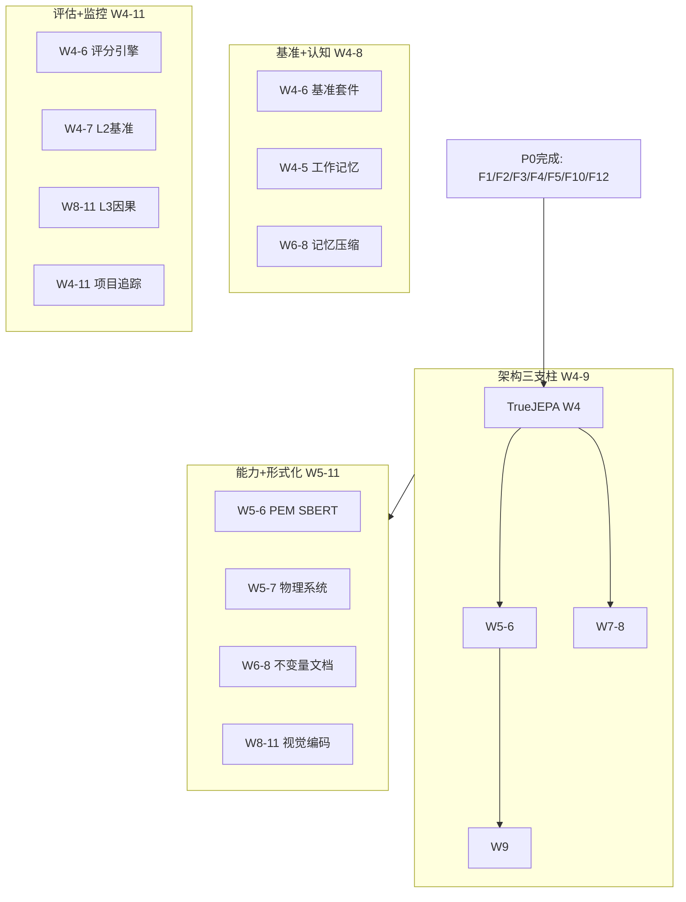

# P1 波次实施计划书 — 架构补强

> **波次代号**: P1 "强骨"
> **周期**: Week 4 – Week 11 (共 8 周)
> **优先级**: 高 — 在 P0 完成后启动
> **预算**: 85 人天 + $1,500 硬件/API
> **核心目标**: 消除剩余 5 项 High 级缺陷 + 补齐学习器/规划器/安全核心架构缺口

---

## 1. 波次概述

### 1.1 战略定位

P1 是**架构级补强**的核心波次。P0 修好了"止血点"，P1 要"长肌肉"。根据依赖关系图，P1 的执行路径为：



### 1.2 涉及章节

| 章节 | P1 范围 | 人天 | 来源 |
|---|---|---|---|
| Ch02 架构三支柱 | TrueJEPA + PearlChain + MCTS + 5类安全 | 80 | §3.1-3.5 |
| Ch04 致命缺陷(续) | F6/F7/F8/F11 (剩余 High) | 含于Ch02 | §3.6-3.11 |
| Ch01 分析基准 | 基准测试套件 + 发现追踪 | 12 | §3.1-3.3 |
| Ch03 能力四维度 | 4个物理系统 + SBERT + 视觉编码(前半) | 40 | §3.1-3.3 |
| Ch05 形式化+信息论 | 不变量文档 + 信息瓶颈(前半) | 20 | §3.1-3.2 |
| Ch06 认知架构 | WorkingMemory + MemoryConsolidator | 22 | §3.1-3.2 |
| Ch08 WMMM | L2多步基准 + L3因果发现 | 24 | §3.1-3.2 |
| Ch10 知识蒸馏 | 因果蒸馏管线(启动) | 12 | §3.1 |
| Ch12 统一路径 | 看板 + 门禁 + 依赖解析 | 8 | §3.1-3.4 |
| Ch13 评估总表 | 评分引擎 + 8维度评分 | 12 | §3.1-3.2 |

> 注: 多章节交叉执行，实际并行度高，总人天经并行调整后约 85 人天。

### 1.3 前置依赖

- **前置**: P0 全部完成 (W3 门禁通过)
- **被依赖**: P2 (Ch03→Ch10 蒸馏, Ch06→Ch09 替代性)

---

## 2. 周粒度实施计划

### Phase A: W4-W5 — 架构核心 + 基准建设

#### Week 4 — TrueJEPA 核心 + 工作记忆 + 评分引擎 + 项目看板

| 任务ID | 任务 | 章节 | 负责 | 天数 | 交付物 |
|---|---|---|---|---|---|
| T4.1 | TrueJEPA 编码器核心 | Ch02 §3.2 | 工程师A | 5 | `_true_jepa_encoder.py` 骨架 |
| T4.2 | 工作记忆增强器 | Ch06 §3.1 | 工程师B | 5 | `_working_memory_enhancer.py` |
| T4.3 | 评分引擎核心 | Ch13 §3.1 | 工程师C | 3 | `MCIScoreEngine` 核心 |
| T4.4 | 基准测试套件架构 | Ch01 §3.1 | 工程师C | 2 | `benchmarks/multi_perspective/run_all.py` |
| T4.5 | 项目追踪器 | Ch12 §3.1 | 工程师C | 1 | `ProjectTracker` |

**T4.1 TrueJEPA 编码器核心** (Ch02 §3.2):
```python
class TrueJEPAEncoder:
    """真正的 JEPA: 观测 → 潜向量 (不是因果图)"""
    def __init__(self, obs_dim=64, latent_dim=128, hidden_dim=256):
        self.encoder = MLP(obs_dim, hidden_dim, latent_dim)
        self.target_encoder = MLP(obs_dim, hidden_dim, latent_dim)  # momentum
    
    def encode(self, observations) -> np.ndarray:
        """返回 (latent_dim,) 潜向量"""
        return self.encoder.forward(observations)
    
    def predict_next(self, z_t, action) -> np.ndarray:
        """潜空间预测: z_t + a_t → z_{t+1}"""
        return self.predictor.forward(np.concatenate([z_t, action]))
```

**KPI**: `encoder.encode()` 返回 `shape=(128,)` ndarray (非 CausalWorldModelState)

#### Week 5 — TrueJEPA 训练 + PEM SBERT + 物理系统 + 基准子套件

| 任务ID | 任务 | 章节 | 负责 | 天数 | 交付物 |
|---|---|---|---|---|---|
| T5.1 | TrueJEPA 预测器 + 训练循环 | Ch02 §3.2 | 工程师A | 5 | 训练收敛 MSE<0.01 |
| T5.2 | PEM SBERT 嵌入集成 | Ch03 §3.3 | 工程师B | 3 | `_persistent_memory.py` SBERT |
| T5.3 | 弹簧 + 双摆物理系统 | Ch03 §3.1 | 工程师B | 2 | `_physics/_spring.py` + `_double_pendulum.py` |
| T5.4 | 5 个基准子套件 | Ch01 §3.2 | 工程师C | 3 | 5个 `*_suite.py` |
| T5.5 | 评分引擎 8 维度函数 | Ch13 §3.1 | 工程师C | 2 | 8个 `_score_*()` |

**T5.2 PEM SBERT 嵌入** (Ch03 §3.3 Phase B):
```python
def _tags_to_vector_sbert(self, tags: str) -> np.ndarray:
    """永久方案: 预训练句子嵌入模型"""
    # all-MiniLM-L6-v2, 22M参数, CPU 可运行
    embedding = self._sbert_model.encode(tags)
    return embedding  # (384,)
```

**KPI**: "心率升高" vs "心率增加" cosine ≥0.85

#### W4-W5 里程碑

- [ ] M-A: TrueJEPA 输出潜向量 MSE<0.01
- [ ] M-A: PEM SBERT cosine ≥0.85
- [ ] M-A: 工作记忆增强器跨会话沉淀通过
- [ ] M-A: 评分引擎 8 维度可运行
- [ ] M-A: 基准测试套件一键运行

---

### Phase B: W6-W7 — Pearl 因果链 + 安全约束 + 形式化文档

#### Week 6 — PearlChain + 形式化不变量 + 记忆压缩

| 任务ID | 任务 | 章节 | 负责 | 天数 | 交付物 |
|---|---|---|---|---|---|
| T6.1 | PearlChain 协调器 | Ch02 §3.1 | 工程师A | 5 | `_pearl_chain.py` |
| T6.2 | 10 模块形式化不变量文档 | Ch05 §3.1 | 工程师C | 3 | docstring 更新 |
| T6.3 | 记忆压缩与遗忘器 | Ch06 §3.2 | 工程师B | 4 | `_memory_consolidator.py` |
| T6.4 | VisionEncoder 信息瓶颈优化 | Ch05 §3.2 | 工程师B | 1 | 128D 混合编码 |

**T6.1 PearlChain 协调器** (Ch02 §3.1):
```python
class PearlChain:
    def full_analysis(self, X: str, Y: str, x_value: float):
        # L1: 观察 → 相关性
        obs = self._observe(X, Y)
        # L2: 干预 → ATE
        ate_result = self._do_calculus.estimate_ate(X, Y, x_value=x_value)
        # L3: 反事实 → 归因
        cf_result = self._counterfactual.query(X, Y, factual=x_value)
        # 回写: L3 归因 → L2 置信度 → L1 边权重
        self._update_confidence(ate_result, cf_result)
        return PearlChainResult(obs, ate_result, cf_result)
```

**KPI**: `full_analysis()` 端到端测试通过

#### Week 7 — 5 类安全约束 + 抛体/流体物理系统

| 任务ID | 任务 | 章节 | 负责 | 天数 | 交付物 |
|---|---|---|---|---|---|
| T7.1 | ContentSafetyConstraint | Ch02 §3.4 | 工程师A | 2 | `_safety_content.py` |
| T7.2 | CognitiveSafetyConstraint | Ch02 §3.4 | 工程师A | 2 | `_safety_cognitive.py` |
| T7.3 | ValueAlignmentConstraint | Ch02 §3.4 | 工程师B | 1 | `_safety_value.py` |
| T7.4 | TemporalSafetyConstraint | Ch02 §3.4 | 工程师B | 1 | `_safety_temporal.py` |
| T7.5 | SocialSafetyConstraint | Ch02 §3.4 | 工程师B | 1 | `_safety_social.py` |
| T7.6 | 抛体 + 流体物理系统 | Ch03 §3.1 | 工程师C | 3 | `_physics/_projectile.py` + `_fluid.py` |

**5 类安全约束规格**:

| 约束类 | 行数 | 核心逻辑 | KPI |
|---|---|---|---|
| `ContentSafetyConstraint` | ~200 | 毒化/有害/伦理关键词过滤 | 5 正例 + 5 负例 |
| `CognitiveSafetyConstraint` | ~250 | 幻觉检测 + 事实核查 + 不确定性阈值 | 一致性 >0.7 |
| `ValueAlignmentConstraint` | ~200 | 用户意图对齐度 ≥0.8 | 对齐度 >0.6 |
| `TemporalSafetyConstraint` | ~150 | 因果倒置禁止 + 时间逻辑一致 | 时序一致 |
| `SocialSafetyConstraint` | ~200 | 隐私保护 + 公平性 + 偏见检测 | 公平性指标 |

#### W6-W7 里程碑

- [ ] M-B: PearlChain L1→L2→L3 端到端串联
- [ ] M-B: SafetyMonitor 注册 13 类约束 (8 原有 + 5 新增)
- [ ] M-B: 10 个核心模块各有 `## Formal Guarantees` docstring
- [ ] M-B: 记忆压缩器通过 100 条记忆压缩测试
- [ ] M-B: 6 种物理系统可用

---

### Phase C: W8-W9 — MCTS 规划 + 因果发现 + L2 基准

#### Week 8 — 通用 ActionPredictor + MCTS + PC 因果发现

| 任务ID | 任务 | 章节 | 负责 | 天数 | 交付物 |
|---|---|---|---|---|---|
| T8.1 | UniversalActionConditionedPredictor | Ch02 §3.3 | 工程师A | 3 | `_universal_action_predictor.py` |
| T8.2 | MCTS 规划器核心 | Ch02 §3.5 | 工程师A | 2 | `_mcts_planner.py` 骨架 |
| T8.3 | PC 因果发现算法 | Ch08 §3.2 | 工程师B | 5 | `_pc_causal_discovery.py` |

**T8.1 通用 ActionPredictor** (Ch02 §3.3):
```python
class UniversalActionConditionedPredictor(ActionConditionedPredictor):
    """通用动作条件预测器 — ≥10K 参数 MLP"""
    def __init__(self, state_dim=16, action_dim=4, hidden_dims=(128, 256, 128)):
        self._mlp = MLP(
            input_dim=state_dim + action_dim,
            hidden_dims=hidden_dims,
            output_dim=state_dim,
        )
    
    def predict(self, state, action, n_steps=1):
        x = np.concatenate([state.to_vector(), action.to_vector()])
        for _ in range(n_steps):
            next_vec = self._mlp.forward(x)
            x = np.concatenate([next_vec, action.to_vector()])
        return [self._vec_to_state(next_vec)]
```

#### Week 9 — MCTS 完善 + Audio/Thermal 优化 + 因果蒸馏启动

| 任务ID | 任务 | 章节 | 负责 | 天数 | 交付物 |
|---|---|---|---|---|---|
| T9.1 | MCTS 规划器完善 + 测试 | Ch02 §3.5 | 工程师A | 5 | horizon≥10, 成功率≥80% |
| T9.2 | Audio/Thermal 信息瓶颈优化 | Ch05 §3.2 | 工程师B | 3 | 64D/32D 编码 |
| T9.3 | 因果蒸馏管线 | Ch10 §3.1 | 工程师B | 2 | `_distillation/causal_pipeline.py` |

**T9.1 MCTS 规划器** (Ch02 §3.5):
```python
class MCTSPlanner:
    """蒙特卡洛树搜索规划器"""
    def __init__(self, predictor, n_simulations=1000, exploration=1.41):
        self._predictor = predictor
        self._n_sim = n_simulations
        self._c = exploration
    
    def plan(self, state, goal, max_depth=20):
        root = MCTSNode(state)
        for _ in range(self._n_sim):
            node = self._select(root)       # UCB1 选择
            node = self._expand(node)       # 扩展
            reward = self._simulate(node, goal)  # rollout
            self._backpropagate(node, reward)    # 反向传播
        return root.best_child().action_sequence
```

#### W8-W9 里程碑

- [ ] M-C: UniversalActionPredictor ≥10K 参数，支持任意 WorldState
- [ ] M-C: MCTS 倒立摆 10 步规划成功率 ≥80%
- [ ] M-C: PC 算法 5 变量正确因果结构发现 ≥80%
- [ ] M-C: 因果蒸馏管线 CoT→边提取可运行

---

### Phase D: W10-W11 — L2/L3 WMMM 基准 + 集成测试 + 全量回归

#### Week 10 — WMMM L2 多步基准 + L3 因果集成

| 任务ID | 任务 | 章节 | 负责 | 天数 | 交付物 |
|---|---|---|---|---|---|
| T10.1 | L2 多步预测基准套件 | Ch08 §3.1 | 工程师A | 3 | `GenerativeCapabilityBenchmark` |
| T10.2 | PearlChain + PC 集成到因果图 | Ch08 §3.2 | 工程师B | 3 | 因果图自动更新 |
| T10.3 | 因果蒸馏 CoT→边提取完善 | Ch10 §3.1 | 工程师B | 2 | ≥70 条有效因果边 |
| T10.4 | CI 集成 + 发现追踪看板 | Ch01 §3.3 | 工程师C | 2 | CI 配置 + JSON 看板 |

#### Week 11 — 集成测试 + P1 全量回归 + 门禁检查

| 任务ID | 任务 | 章节 | 负责 | 天数 | 交付物 |
|---|---|---|---|---|---|
| T11.1 | 全量集成测试 | Ch02/03/06 | 全员 | 3 | 测试套件 |
| T11.2 | 性能基准数据 | Ch08/13 | 工程师C | 2 | `baseline_v5.1.json` |
| T11.3 | 代码审查 + 文档更新 | 全章节 | 全员 | 2 | 审查报告 |
| T11.4 | **P1 门禁检查** | Ch12 | Tech Lead | 1 | 门禁报告 |

#### W10-W11 里程碑

- [ ] M-D: L2 生成式 20 步平均误差 <0.1
- [ ] M-D: L3 因果式 ≥70%
- [ ] M-D: WMMM 综合得分 ≥65%
- [ ] M-D: CI 5 分钟内完成
- [ ] M-D: 全量测试 ≥2700 passed, 0 failed

---

## 3. 资源配置

### 3.1 人员配置

| 资源 | 角色 | 主要任务 | 人天 |
|---|---|---|---|
| 工程师 A (架构) | TrueJEPA + PearlChain + MCTS + ActionPredictor | Ch02 全部 | 30 |
| 工程师 B (模型) | PEM SBERT + 物理系统 + 安全约束 + 因果蒸馏 | Ch03/Ch06/Ch10 | 25 |
| 工程师 C (工具) | 评分引擎 + 基准套件 + 形式化文档 + 项目追踪 | Ch01/Ch12/Ch13 | 18 |
| 测试工程师 | 集成测试 + 性能基准 | 全章节 | 12 |
| **合计** | | | **85** |

### 3.2 硬件/软件

| 资源 | 数量 | 成本 | 说明 |
|---|---|---|---|
| GPU (TrueJEPA 训练) | 按需 | $500 | cloud GPU 20h |
| LLM API (因果蒸馏) | 按需 | $200 | CoT 生成 |
| SBERT 模型 | all-MiniLM-L6-v2 | $0 | 开源 |
| CI/CD runner | 现有 | $0 | GitHub Actions |
| **合计** | | **$700** | |

### 3.3 并行度规划

| 周 | 并行任务数 | 工程师A | 工程师B | 工程师C |
|---|---|---|---|---|
| W4 | 4 | TrueJEPA | WorkMem | ScoreEng+Bench+Tracker |
| W5 | 5 | TrueJEPA训练 | SBERT+PhysSys | 子套件+评分函数 |
| W6 | 4 | PearlChain | MemConsol+Vision | 不变量文档 |
| W7 | 6 | Safety(2) | Safety(3)+PhysSys | — |
| W8 | 3 | ActionPred+MCTS | PC因果发现 | — |
| W9 | 3 | MCTS完善 | Audio/Thermal+蒸馏 | — |
| W10 | 4 | L2基准 | 因果集成+蒸馏 | CI+看板 |
| W11 | 4 | 集成测试 | 集成测试 | 性能基准+审查 |

---

## 4. KPI 指标体系

### 4.1 缺陷消除 KPI (Ch04 剩余 High 级)

| 缺陷 | 基线 | P1目标 | 度量 | 完成周 |
|---|---|---|---|---|
| F6 JEPA名不副实 | 输出因果图 | 潜向量≥64D | `encode()` 返回 ndarray | W5 |
| F7 安全盲区 | 8 类 | 13 类 | `constraint_count` | W7 |
| F8 Pearl断裂 | L1/L2/L3独立 | 三级串联 | `full_analysis()` 端到端 | W6 |
| F11 穷举规划 | 暴力枚举5³=125 | MCTS horizon≥10 | 10步规划成功率 | W9 |
| F9 零形式化 | 0 模块 | 10 模块 | `## Formal Guarantees` | W6 |

### 4.2 架构能力 KPI

| 维度 | 基线 | P1目标 | 度量 |
|---|---|---|---|
| Pearl 链完整度 | 独立 | 三级自动串联 | PearlChain 端到端测试 |
| JEPA 潜空间维度 | 因果图 | ≥64 维潜向量 | shape 检查 |
| JEPA 预测 MSE | N/A | < 0.01 | 单摆 ground truth |
| 通用预测器参数 | 6 (F10修复后≥10K) | ≥10,000 (MLP) | `n_params` |
| 安全约束类型 | 8 类 | 13 类 | `constraint_count` |
| MCTS 规划 horizon | 3 (穷举) | ≥10 | 倒立摆 10 步 |
| 物理系统数 | 2 | ≥6 | `PhysicsPredictor` 子类 |
| PEM 检索准确率 | 0.70 (BM25) | ≥0.85 (SBERT) | 语义测试集 |
| WMMM 综合得分 | L2.5 (56%) | ≥65% | WMMM 基准套件 |
| L2 生成式 | 68% | ≥85% | 多步预测基准 |
| L3 因果式 | 55% | ≥70% | PC + PearlChain |

### 4.3 工具链 KPI

| 维度 | 基线 | P1目标 | 度量 |
|---|---|---|---|
| 基准测试覆盖 | 0% | 100% (12/12缺陷) | 回归测试数 |
| 自动评分维度 | 0/8 | 8/8 | 评分引擎 |
| CI 执行时间 | N/A | <5 min | pipeline duration |
| 项目追踪覆盖 | 0% | 100% | 有 owner 的改进项 |

---

## 5. 风险评估

| 风险ID | 风险描述 | 概率 | 影响 | 缓解措施 | 应急方案 |
|---|---|---|---|---|---|
| R1 | TrueJEPA 训练不收敛 | 中 | 高 | 先用小维度验证 (32D)，逐步放大 | 保留旧 JEPAEncoder 作 fallback |
| R2 | PearlChain 回写导致循环更新 | 中 | 高 | 加 damping factor + 最大迭代次数 | 回写改为仅记录不修改 |
| R3 | 新安全约束误杀合法输入 | 高 | 中 | 添加白名单 + 置信度阈值 | 安全约束仅 warn 不 block |
| R4 | MCTS 在复杂任务上过慢 | 中 | 中 | 设置 simulation 上限 + 并行化 | 降级为带剪枝的穷举 |
| R5 | PC 算法在高维数据上过慢 | 中 | 高 | 限制变量数 ≤20 | 仅用于小规模因果发现 |
| R6 | SBERT 增加推理延迟 | 中 | 低 | 异步编码 + 缓存 | 退回 BM25 (P0 已修) |
| R7 | 8 周时间不够 | 中 | 高 | 因果蒸馏可推迟到 P2 | 压缩 W10-11 测试时间 |
| R8 | 跨章节依赖形成瓶颈 | 高 | 高 | 拓扑排序 + 关键路径优先 | 非关键路径任务后移 |

### 关键路径分析

P1 的关键路径为:
```
TrueJEPA (W4-5) → PearlChain (W6) → MCTS (W8-9) → 集成测试 (W11)
```

任何关键路径上的延迟将导致 P1 整体延期。非关键路径 (安全约束、形式化文档、物理系统) 可灵活调整。

---

## 6. 成本预算

| 项目 | 人天 | 硬件/软件 | 说明 |
|---|---|---|---|
| TrueJEPA 编码器 | 15 | $500 (GPU) | Ch02 §3.2 |
| PearlChain | 12 | $0 | Ch02 §3.1 |
| 通用 ActionPredictor | 10 | $0 | Ch02 §3.3 |
| 5 类安全约束 | 16 | $0 | Ch02 §3.4 |
| MCTS 规划器 | 12 | $0 | Ch02 §3.5 |
| PEM SBERT 集成 | 4 | $0 | Ch03 §3.3 |
| 4 个新物理系统 | 8 | $0 | Ch03 §3.1 |
| 工作记忆+记忆压缩 | 16 | $0 | Ch06 §3.1-3.2 |
| 形式化不变量文档 | 4 | $0 | Ch05 §3.1 |
| 信息瓶颈优化 | 4 | $0 | Ch05 §3.2 |
| WMMM L2/L3 基准 | 8 | $0 | Ch08 §3.1-3.2 |
| PC 因果发现 | 8 | $0 | Ch08 §3.2 |
| 因果蒸馏管线(启动) | 6 | $200 (API) | Ch10 §3.1 |
| 评分引擎+基准套件 | 12 | $0 | Ch13/Ch01 |
| 项目追踪+门禁 | 4 | $0 | Ch12 |
| 集成测试+回归 | 12 | $0 | 全员 |
| **合计** | **~85** | **$700** | |

---

## 7. 验收标准

### 7.1 P1 门禁 (W11 结束时必须全部通过)

**缺陷修复验收**:
- [ ] **F6**: `TrueJEPAEncoder.encode()` 返回 `(latent_dim,)` ndarray
- [ ] **F7**: `SafetyMonitor` 注册 13 类约束，`check_all()` 全部通过
- [ ] **F8**: `PearlChain.full_analysis()` 端到端测试通过，L3 回写 L2 置信度
- [ ] **F11**: `MCTSPlanner` 在倒立摆 10 步规划成功率 ≥80%
- [ ] **F9**: 10 个核心模块各有 `## Formal Guarantees` docstring

**架构能力验收**:
- [ ] `TrueJEPAEncoder` 输出 ≥64 维潜向量，训练 MSE < 0.01
- [ ] `UniversalActionConditionedPredictor` 参数 ≥10K，Pendulum MSE < 0.05
- [ ] PEM SBERT 检索: cosine ≥0.85
- [ ] ≥6 种物理系统可用
- [ ] 工作记忆增强器通过 100 次会话测试
- [ ] 记忆压缩器正常工作

**WMMM 成熟度验收**:
- [ ] L2 生成式: 20 步多步预测平均误差 <0.1
- [ ] L3 因果式: PC 算法 5 变量正确因果结构 ≥80%
- [ ] WMMM 综合得分 ≥65%

**工具链验收**:
- [ ] 基准测试套件一键运行，12/12 缺陷有回归测试
- [ ] 评分引擎 8 维度可自动评分
- [ ] CI pipeline 5 分钟内完成

**系统健康验收**:
- [ ] `pytest` ≥2700 passed, 0 failed
- [ ] `ruff check .` 全部通过
- [ ] `mypy` 检查通过

### 7.2 P1→P2 门禁检查

| 门禁项 | 检查方法 | 通过标准 |
|---|---|---|
| High 缺陷清零 | 运行 F6/F7/F8/F9/F11 测试 | 全部 pass |
| WMMM 成熟度 | WMMM 基准套件 | ≥65% |
| 测试稳定性 | 连续 3 次 pytest | ≥2700 passed, 0 failed |
| 蒸馏管线可用 | 端到端运行 CoT→边提取 | ≥70 条有效因果边 |
| 安全完备性 | SafetyMonitor 13 类约束 | `check_all()` 全 pass |

### 7.3 交付物清单

| # | 文件 | 类型 | 行数估计 |
|---|---|---|---|
| 1 | `_true_jepa_encoder.py` | 新建 | ~500 |
| 2 | `_pearl_chain.py` | 新建 | ~400 |
| 3 | `_universal_action_predictor.py` | 新建 | ~350 |
| 4 | `_mcts_planner.py` | 新建 | ~450 |
| 5 | `_safety_content.py` | 新建 | ~200 |
| 6 | `_safety_cognitive.py` | 新建 | ~250 |
| 7 | `_safety_value.py` | 新建 | ~200 |
| 8 | `_safety_temporal.py` | 新建 | ~150 |
| 9 | `_safety_social.py` | 新建 | ~200 |
| 10 | `_physics/_spring.py` | 新建 | ~150 |
| 11 | `_physics/_double_pendulum.py` | 新建 | ~180 |
| 12 | `_physics/_projectile.py` | 新建 | ~150 |
| 13 | `_physics/_fluid.py` | 新建 | ~160 |
| 14 | `_working_memory_enhancer.py` | 新建 | ~250 |
| 15 | `_memory_consolidator.py` | 新建 | ~300 |
| 16 | `_pc_causal_discovery.py` | 新建 | ~400 |
| 17 | `_distillation/causal_pipeline.py` | 新建 | ~350 |
| 18 | `_modality_encoders.py` | 修改 | ~100 |
| 19 | `_persistent_memory.py` | 修改 | ~30 |
| 20 | `benchmarks/multi_perspective/` | 新建 | ~500 |
| 21 | `MCIScoreEngine` 相关 | 新建 | ~400 |
| 22 | `ProjectTracker` 相关 | 新建 | ~200 |
| 23 | 测试文件 (~15个) | 新建 | ~1500 |
| | **合计** | | **~6,500 行** |

---

## 8. 跨波次衔接

### 8.1 P1 完成后 P2 可立即启动的任务

| P2 任务 | 前置 P1 完成 | 启动条件 |
|---|---|---|
| Ch03 LearnableVisualEncoder (CLIP蒸馏) | TrueJEPA + 4 物理系统 | 潜空间+物理系统可用 |
| Ch03 物理系统基准测试 | 6 种物理系统 | 全部物理系统可用 |
| Ch10 视觉蒸馏训练器 | LearnableVisualEncoder | 编码器可训练 |
| Ch10 安全规则蒸馏 | 13 类安全约束 | SafetyMonitor 完备 |
| Ch06 CausalChainOfThought | PearlChain | L1→L2→L3 串联 |
| Ch08 L4 AutoTuner | ReflectiveMetacognition | 元认知基础 |
| Ch09 混合推理网关 | CausalChainOfThought | 因果推理链可用 |

### 8.2 P1 遗留到 P2 的任务

| 任务 | 计划在 P2 执行 | 章节 |
|---|---|---|
| CLIP 视觉蒸馏训练 | Ch03 §3.2 | Ch03 |
| 安全规则蒸馏 | Ch10 §3.3 | Ch10 |
| 动力学蒸馏 | Ch10 §3.4 | Ch10 |
| DoCalculus ATEResult 重构 | Ch05 §3.3 | Ch05 |
| 收敛性文档 + 不变量测试 | Ch05 §3.4 | Ch05 |
| CausalCoT 推理器 | Ch06 §3.3 | Ch06 |
| WMMM L4 反思式 | Ch08 §3.3 | Ch08 |

---

> **P1 铁律**: 架构不补强，能力扩展就是空中楼阁！先有骨架，再长肌肉！
>
> **前路虽难，但路就在脚下！**
