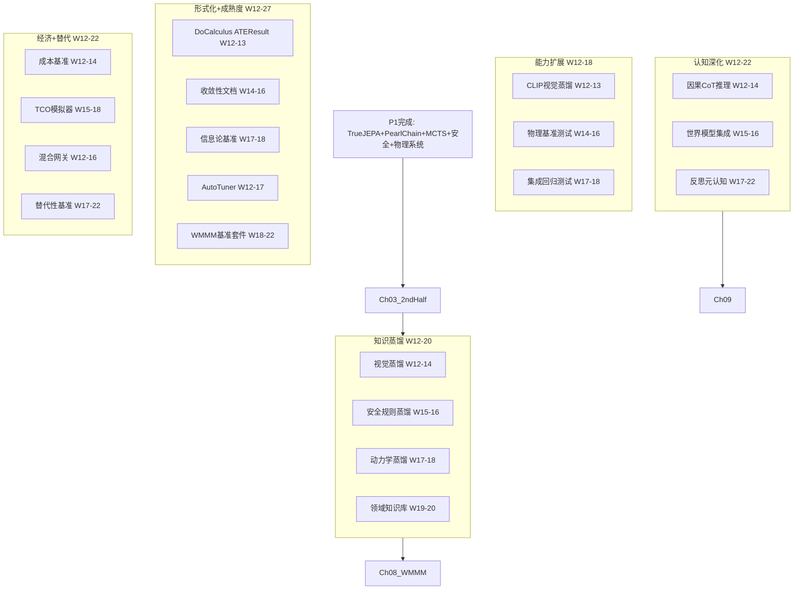

# P2 波次实施计划书 — 能力扩展

> **波次代号**: P2 "长肉"
> **周期**: Week 12 – Week 27 (共 16 周)
> **优先级**: 中 — 在 P1 完成后启动
> **预算**: 75 人天 + $2,850 硬件/API
> **核心目标**: 蒸馏管线完备 + 形式化验证 + 认知架构补强 + WMMM L4 突破

---

## 1. 波次概述

### 1.1 战略定位

P2 是从"架构可用"到"能力丰富"的**跨越波次**。P0 止了血，P1 补了骨，P2 要长肌肉和神经。根据依赖关系图，P2 的核心路径为：



### 1.2 涉及章节

| 章节 | P2 范围 | 人天 | 来源 |
|---|---|---|---|
| Ch03 能力四维度(后半) | CLIP蒸馏 + 物理基准 + 集成回归 | 38 | §3.2, §3.1(续), §4 W13-22 |
| Ch05 形式化+信息论(后半) | ATEResult + 收敛性 + 信息论基准 | 22 | §3.3, §3.4 |
| Ch06 认知架构(后半) | CausalCoT + 世界模型集成 + 元认知 | 35 | §3.3, §3.4, §3.5 |
| Ch07 经济成本 | 成本基准 + TCO 模拟器 + 推理优化 | 20 | §3.1, §3.2, §3.3 |
| Ch08 WMMM(后半) | AutoTuner + WMMM 基准套件 | 18 | §3.3, §3.4 |
| Ch09 替代性目标 | 混合网关 + 替代性基准 | 16 | §3.1, §3.2 |
| Ch10 知识蒸馏(后半) | 视觉/安全/动力学蒸馏 + 领域知识库 | 43 | §3.2-3.4 |
| Ch11 未解决(P2部分) | SurpriseDrivenLearner | 10 | §3.3 |
| Ch13 评估总表(后半) | 版本对比 + 持久化 + CI 集成 | 10 | §3.2, §3.3 |
| Ch12 统一路径(续) | 进度监控 + 门禁检查 | 8 | §3.2, §3.4 |

> 多章节高度并行，实际并行调整后约 **75 人天**。

### 1.3 前置依赖

- **前置**: P1 全部完成 (W11 门禁通过)
- **被依赖**: P3 (Ch09→Ch11 自主探索, Ch07→Ch14 战略结论)

---

## 2. 四阶段实施计划

### Stage 1: W12-W15 — 蒸馏管线 + 认知深化 + 形式化基础

#### Week 12-13 — CLIP 视觉蒸馏 + CausalCoT + ATEResult + 成本基准 + AutoTuner 启动 + 混合网关启动

| 任务ID | 任务 | 章节 | 负责 | 天数 | 交付物 |
|---|---|---|---|---|---|
| T12.1 | LearnableVisualEncoder 开发 | Ch03 §3.2 | 工程师A | 5 | `_learnable_visual.py` |
| T12.2 | CausalChainOfThought 推理器 | Ch06 §3.3 | 工程师B | 5 | `_causal_cot.py` |
| T12.3 | ATEResult 完整对象重构 | Ch05 §3.3 | 工程师C | 3 | `_do_calculus.py` 重构 |
| T12.4 | 成本基准测试框架 | Ch07 §3.1 | 工程师C | 2 | `benchmarks/economics/` |
| T12.5 | 混合推理网关启动 | Ch09 §3.1 | 工程师A (兼) | 2 | `_hybrid_gateway.py` 骨架 |
| T12.6 | AutoTuner 核心 | Ch08 §3.3 | 工程师A (兼) | 2 | `_auto_tuner.py` 骨架 |

**T12.1 LearnableVisualEncoder** (Ch03 §3.2):
```python
class LearnableVisualEncoder:
    """可学习视觉编码器 — 轻量 ViT"""
    def __init__(self, image_size=64, patch_size=8, embed_dim=256,
                 num_heads=4, num_layers=4, output_dim=512):
        self.patch_embed = PatchEmbed(image_size, patch_size, embed_dim)
        self.blocks = [TransformerBlock(embed_dim, num_heads) for _ in range(num_layers)]
        self.head = nn.Linear(embed_dim, output_dim)
    
    def encode(self, image: np.ndarray) -> np.ndarray:
        """image (H,W,C) → (output_dim,)"""
        patches = self.patch_embed(image)
        for block in self.blocks:
            patches = block(patches)
        return self.head(patches.mean(axis=0))  # global avg pool
```

**KPI**: 512D 输出，参数量 ≥100K

**T12.2 CausalChainOfThought** (Ch06 §3.3):
```python
class CausalChainOfThought:
    """因果链式推理 — Pearl 版 CoT"""
    def reason(self, question: str, evidence: dict) -> ReasoningChain:
        steps = []
        steps.append(ReasoningStep("parse", self._parse_question(question)))
        steps.append(ReasoningStep("identify_confounders", self._find_confounders(...)))
        steps.append(ReasoningStep("select_method", self._choose_method(steps[-1])))
        steps.append(ReasoningStep("estimate", self._do_estimate(steps[-1], evidence)))
        steps.append(ReasoningStep("conclude", self._generate_conclusion(steps)))
        return ReasoningChain(steps=steps)
```

**KPI**: 20 个因果问题上生成有效推理链

#### Week 14-15 — 视觉蒸馏训练 + 安全蒸馏 + 收敛性文档 + TCO 模拟器

| 任务ID | 任务 | 章节 | 负责 | 天数 | 交付物 |
|---|---|---|---|---|---|
| T14.1 | CLIP 视觉蒸馏训练 | Ch03/Ch10 | 工程师A | 5 | 训练脚本 + checkpoint |
| T14.2 | 安全规则蒸馏 | Ch10 §3.3 | 工程师B | 4 | 5 原则 → ≥25 条规则 |
| T14.3 | 收敛性文档 + 不变量测试 | Ch05 §3.4 | 工程师C | 4 | `test_invariants.py` |
| T14.4 | 混合 TCO 模拟器 | Ch07 §3.2 | 工程师C | 3 | `tools/tco_simulator.py` |
| T14.5 | 混合推理网关完善 | Ch09 §3.1 | 工程师B (兼) | 3 | 路由准确率 ≥85% |
| T14.6 | AutoTuner 失败恢复 | Ch08 §3.3 | 工程师A (兼) | 2 | 3 次失败自动调参 |

**T14.1 视觉蒸馏训练** (Ch10 §3.2):
```python
class VisualDistillationTrainer:
    """CLIP → MCI 视觉蒸馏训练器"""
    def train(self, images: list, n_epochs=50, lr=1e-4):
        for epoch in range(n_epochs):
            for img in images:
                z_teacher = self._teacher.encode(img)   # CLIP (frozen)
                z_student = self._student.encode(img)   # LearnableVisualEncoder
                loss = np.mean((z_student - z_teacher) ** 2)
                self._student.update(loss, lr)
```

**训练数据**: COCO-1K (1000 张代表性图像)
**KPI**: student MSE < 0.1 vs CLIP teacher

#### W12-W15 里程碑

- [ ] M-S1: LearnableVisualEncoder 512D 可学习，CPU 推理 <50ms/张
- [ ] M-S1: 视觉蒸馏 student MSE < 0.1 vs CLIP teacher
- [ ] M-S1: CausalCoT 在 20 个因果问题上生成有效推理链
- [ ] M-S1: 安全蒸馏 5 原则各 ≥5 条可检查规则
- [ ] M-S1: ATEResult 包含 strata_effects / weights / bottleneck_ratio
- [ ] M-S1: 混合网关 100 个测试查询 ≥85 个正确路由

---

### Stage 2: W16-W19 — 物理基准 + 动力学蒸馏 + 世界模型 + 推理优化

#### Week 16-17 — 物理系统基准测试 + 动力学蒸馏 + 世界模型集成

| 任务ID | 任务 | 章节 | 负责 | 天数 | 交付物 |
|---|---|---|---|---|---|
| T16.1 | 物理系统基准套件 | Ch03 §3.1 | 工程师A | 5 | `benchmarks/physics/` |
| T16.2 | 动力学蒸馏管线 | Ch10 §3.4 | 工程师B | 4 | ActionPredictor 初始化 |
| T16.3 | 世界模型增强集成 | Ch06 §3.4 | 工程师B | 3 | 通用预测器集成到 WM |
| T16.4 | 推理性能优化 | Ch07 §3.3 | 工程师C | 4 | CachedDoCalculus |
| T16.5 | WMMM 全层级基准套件 | Ch08 §3.4 | 工程师C | 3 | WMMM 报告自动生成 |

**T16.1 物理基准套件**:
```python
class PhysicsBenchmarkSuite:
    """物理系统基准测试"""
    SYSTEMS = ["pendulum", "cart", "spring", "double_pendulum", "projectile", "fluid"]
    
    def benchmark_all(self, predictor, ground_truth):
        results = {}
        for system in self.SYSTEMS:
            results[system] = self._benchmark_system(predictor, ground_truth, system)
        return results
    
    def _benchmark_system(self, predictor, gt, system):
        # 多步预测误差、能量守恒、长期稳定性
        return {
            "avg_error": ...,
            "energy_conservation": ...,
            "long_term_stability": ...,
        }
```

**KPI**: ≥3 种物理系统基准达标

#### Week 18-19 — 领域知识库 + 信息论基准 + 版本对比 + 替代性基准

| 任务ID | 任务 | 章节 | 负责 | 天数 | 交付物 |
|---|---|---|---|---|---|
| T18.1 | 领域知识库构建 (医疗/法律) | Ch10 §3.4 | 工程师A | 5 | 医疗≥50条/法律≥30条边 |
| T18.2 | 信息论基准套件 | Ch05 §3.4 | 工程师C | 3 | `benchmarks/info_theory/` |
| T18.3 | 版本对比 + 评分持久化 | Ch13 §3.2-3.3 | 工程师C | 3 | diff 报告 + JSON |
| T18.4 | 替代性基准测试 | Ch09 §3.2 | 工程师B | 4 | `benchmarks/replacement/` |
| T18.5 | 蒸馏质量评估 | Ch10 §3.4 | 工程师A (兼) | 2 | 蒸馏效果基准 |

**T18.1 领域知识库**:
```
医疗因果图: ≥50 条边
  - 症状→疾病 (20条)
  - 药物→效果 (15条)
  - 生活方式→风险因素 (15条)

法律因果图: ≥30 条边
  - 行为→法律责任 (15条)
  - 证据→判决 (10条)
  - 合同条款→义务 (5条)
```

**KPI**: 蒸馏后 MCI 因果准确率提升 ≥15%

#### W16-W19 里程碑

- [ ] M-S2: ≥3 种物理系统基准达标
- [ ] M-S2: 动力学蒸馏: MuZero→ActionPredictor 初始化可用
- [ ] M-S2: 医疗因果图 ≥50 条边，法律 ≥30 条边
- [ ] M-S2: 信息论瓶颈比: Vision ≥0.65, Audio ≥0.55
- [ ] M-S2: 版本对比报告自动生成
- [ ] M-S2: 替代性基准: 因果任务 MCI ≥ LLM (4/5 类)

---

### Stage 3: W20-W23 — 元认知深化 + WMMM L4 + 惊奇驱动学习

#### Week 20-21 — ReflectiveMetacognition + SurpriseDrivenLearner

| 任务ID | 任务 | 章节 | 负责 | 天数 | 交付物 |
|---|---|---|---|---|---|
| T20.1 | ReflectiveMetacognition 核心 | Ch06 §3.5 | 工程师A | 5 | `_reflective_metacognition.py` |
| T20.2 | SurpriseDrivenLearner | Ch11 §3.3 | 工程师B | 4 | 惊奇驱动学习器 |
| T20.3 | 因果任务 MCI vs LLM 对比 | Ch09 §3.2 | 工程师B (兼) | 2 | 对比报告 |
| T20.4 | WMMM L4 全量集成 | Ch08 §3.3 | 工程师A (兼) | 3 | L4 ≥40% |

**T20.1 ReflectiveMetacognition** (Ch06 §3.5):
```python
class ReflectiveMetacognition:
    """反思式元认知 — 从失败中学习"""
    def observe_outcome(self, action: str, outcome: dict, expected: dict):
        surprise = outcome.get("surprise_score", 0.0)
        if surprise > 0.5:
            self._failure_patterns.append({
                "action": action,
                "surprise": surprise,
                "diagnosis": self._diagnoser.diagnose(outcome),
            })
    
    def suggest_improvement(self) -> list[str]:
        for pattern in self._failure_patterns[-10:]:
            suggestion = self._pattern_to_suggestion(pattern)
            suggestions.append(suggestion)
        return suggestions
```

**KPI**: 10 个失败中生成 ≥5 个有用建议

**T20.2 SurpriseDrivenLearner** (Ch11 §3.3):
```python
class SurpriseDrivenLearner:
    def observe(self, predicted, actual, context):
        signal = self._detector.compute_surprise(predicted, actual)
        if signal.is_anomaly:
            self._training_queue.append({...})
    
    def learn_from_surprises(self, max_samples=100):
        self._training_queue.sort(key=lambda x: -x["surprise_score"])
        samples = self._training_queue[:max_samples]
        for sample in samples:
            self._predictor.update(sample["predicted"], sample["actual"])
```

**KPI**: 高惊奇样本学习后惊奇度下降 ≥30%

#### Week 22-23 — 四维度集成回归 + 持续优化

| 任务ID | 任务 | 章节 | 负责 | 天数 | 交付物 |
|---|---|---|---|---|---|
| T22.1 | 四维度集成回归测试 | Ch03 §4 | 工程师A | 4 | 全量测试 |
| T22.2 | 评分引擎 CI 集成 | Ch13 §3.3 | 工程师C | 3 | CI 自动评分 |
| T22.3 | WMMM 报告自动生成 | Ch08 §3.4 | 工程师B | 3 | WMMM 报告 |
| T22.4 | 推理优化调优 | Ch07 §3.3 | 工程师C (兼) | 2 | 单次推理 <5ms |
| T22.5 | 领域基准验证 (医疗) | Ch09 §3.2 | 工程师B (兼) | 2 | 医疗场景基准 |

#### W20-W23 里程碑

- [ ] M-S3: ReflectiveMetacognition 10 失败 → ≥5 有用建议
- [ ] M-S3: SurpriseDrivenLearner 高惊奇样本学习后惊奇度下降 ≥30%
- [ ] M-S3: WMMM L4 ≥40%
- [ ] M-S3: 四维度综合评分 ≥7.0/10
- [ ] M-S3: 评分引擎 CI 集成，每次发版自动评分
- [ ] M-S3: 单次推理 CPU 延迟 <5ms

---

### Stage 4: W24-W27 — 全量集成 + P2 门禁 + 版本发布

#### Week 24-25 — 全量集成测试 + 领域验证

| 任务ID | 任务 | 章节 | 负责 | 天数 | 交付物 |
|---|---|---|---|---|---|
| T24.1 | 全量集成测试 | 全章节 | 全员 | 5 | 测试套件 |
| T24.2 | 领域验证 (医疗+法律) | Ch09 | 工程师B | 4 | 领域基准数据 |
| T24.3 | 性能基准数据收集 | Ch07/Ch13 | 工程师C | 3 | `baseline_v5.2.json` |
| T24.4 | 蒸馏质量最终评估 | Ch10 | 工程师A | 3 | 蒸馏效果报告 |

#### Week 26-27 — 趋势图 + P2 门禁 + v5.2.0 发布

| 任务ID | 任务 | 章节 | 负责 | 天数 | 交付物 |
|---|---|---|---|---|---|
| T26.1 | 趋势图 + 仪表板 | Ch13 §3.3 | 工程师C | 3 | 可视化 |
| T26.2 | 代码审查 + 文档更新 | 全章节 | 全员 | 3 | 审查报告 |
| T26.3 | **P2 门禁检查** | Ch12 | Tech Lead | 2 | 门禁报告 |
| T26.4 | v5.2.0 版本发布 | Ch14 | Tech Lead | 1 | git tag |

#### W24-W27 里程碑

- [ ] M-S4: 全量测试 ≥2800 passed, 0 failed
- [ ] M-S4: 医疗因果推理准确率 ≥80%
- [ ] M-S4: WMMM 综合得分 ≥70%
- [ ] M-S4: 综合评分 ≥6.5/10
- [ ] M-S4: v5.2.0 发布 + 版本对比报告

---

## 3. 资源配置

### 3.1 人员配置

| 资源 | 角色 | 主要任务 | 人天 |
|---|---|---|---|
| 工程师 A (蒸馏/认知) | CLIP蒸馏 + CausalCoT + 元认知 + 领域知识库 | Ch03/Ch06/Ch10 | 28 |
| 工程师 B (模型/推理) | 安全蒸馏 + 动力学蒸馏 + 替代性基准 + 惊奇学习 | Ch07/Ch09/Ch10/Ch11 | 22 |
| 工程师 C (工具/基准) | ATEResult + 收敛性 + TCO + WMMM + 评分CI | Ch05/Ch07/Ch08/Ch13 | 18 |
| 测试工程师 | 全量集成 + 领域验证 | 全章节 | 7 |
| **合计** | | | **75** |

### 3.2 硬件/软件

| 资源 | 数量 | 成本 | 说明 |
|---|---|---|---|
| GPU (CLIP 视觉蒸馏) | 按需 | $800 | cloud GPU 30h |
| LLM API (蒸馏数据+领域知识库) | 按需 | $800 | CoT/安全/领域 |
| GPU (动力学蒸馏 MuZero) | 按需 | $500 | cloud GPU 20h |
| 树莓派 (边缘验证) | 1 台 | $50 | Ch07 边缘部署 |
| LLM API (替代性基准) | 按需 | $500 | MCI vs LLM 对比 |
| 领域专家 (医疗/法律标注) | 0.5人 × 4周 | 10 人天 | 因果图审核 |
| **合计** | | **$2,650** | |

### 3.3 并行度规划

| 周 | 并行任务 | 工程师A | 工程师B | 工程师C |
|---|---|---|---|---|
| W12-13 | 6 | VisualEnc + Gateway + AutoTuner | CausalCoT | ATEResult + CostBench |
| W14-15 | 6 | 视觉蒸馏 | 安全蒸馏 + Gateway | 收敛性 + TCO |
| W16-17 | 5 | 物理基准 | 动力学蒸馏 + 世界模型 | 推理优化 + WMMM |
| W18-19 | 5 | 领域知识库 + 蒸馏评估 | 替代性基准 | 信息论 + 版本对比 |
| W20-21 | 4 | ReflectiveMeta + L4 | SurpriseLearner + 对比 | — |
| W22-23 | 5 | 集成回归 | WMMM报告 + 领域 | 评分CI + 推理 |
| W24-25 | 4 | 全量测试 + 蒸馏评估 | 领域验证 | 性能基准 |
| W26-27 | 4 | 代码审查 | 代码审查 | 趋势图 + 仪表板 |

---

## 4. KPI 指标体系

### 4.1 能力维度 KPI

| 维度 | P1 基线 | P2 目标 | 度量 |
|---|---|---|---|
| 物理世界理解 | 7.0/10 | ≥8.0/10 | ≥3 种物理系统基准达标 |
| 多模态视觉感知 | 4.0/10 | ≥6.5/10 | CLIP 蒸馏 MSE<0.1, 512D |
| 开放域知识推理 | 3.5/10 | ≥5.0/10 | CausalCoT 20 题有效推理 |
| 大规模知识处理 | 5.5/10 | ≥7.0/10 | 医疗≥50/法律≥30 因果边 |
| 安全约束 | 7.0/10 | ≥8.0/10 | 安全蒸馏 ≥25 条规则 |
| 持续学习 | 5.0/10 | ≥6.5/10 | 惊奇驱动学习后惊奇度降 ≥30% |
| 四维度综合 | 5.5/10 | ≥7.0/10 | 综合评估脚本 |

### 4.2 蒸馏管线 KPI

| 管线 | 基线 | P2 目标 | 度量 |
|---|---|---|---|
| 因果结构蒸馏 | N/A | ≥70 条有效边 (人工评估) | CoT→边提取 |
| 视觉蒸馏 | N/A | MSE < 0.1 vs CLIP | student-teacher 距离 |
| 安全规则蒸馏 | 0 条 LLM 蒸馏 | ≥25 条 | 5 原则 × 5 条 |
| 动力学蒸馏 | N/A | ActionPredictor 初始化可用 | 训练后预测误差 |
| 领域知识库 | 0 条 | 医疗≥50/法律≥30 | 因果边计数 |
| 蒸馏后 MCI 提升 | 基线 | 准确率 +15% | 因果任务对比 |

### 4.3 形式化 + 信息论 KPI

| 维度 | P1 基线 | P2 目标 | 度量 |
|---|---|---|---|
| 有不变量文档的模块 | 10/10 | 10/10 + 自动化测试 | `test_invariants.py` |
| DoCalculus ATE 瓶颈比 | 0.25 | ≥0.45 | ATEResult.bottleneck_ratio |
| 收敛性文档 | 0 模块 | EWC/GAT/MLP | docstring |
| 自动化不变量测试 | 0 | 10 模块 | pytest |

### 4.4 认知架构 KPI

| 子系统 | P1 基线 | P2 目标 | 度量 |
|---|---|---|---|
| 工作记忆 | 85% | 85% (维持) | 跨会话测试 |
| 长期记忆 | 65% | 65% (维持) | 语义检索 |
| 推理引擎 | 55% | ≥75% | CausalCoT |
| 世界模型 | 85% | 85% (维持) | 通用预测器 |
| 元认知 | 28% | ≥55% | ReflectiveMeta |
| **综合覆盖率** | **63.6%** | **≥73%** | 五子系统平均 |

### 4.5 经济 + 替代性 KPI

| 维度 | 基线 | P2 目标 | 度量 |
|---|---|---|---|
| 单次推理延迟 | ~15ms | <5ms | CPU 基准 |
| 内存占用 | ~256MB | <128MB | 性能基准 |
| 混合路由准确率 | N/A | ≥85% | 100 个测试查询 |
| 因果任务 MCI ≥ LLM | N/A | ≥80% (4/5 类) | 替代性基准 |
| LLM 调用比例 | 100% | ≤20% | 混合网关日志 |
| TCO 节省量化 | 未测量 | 有数据 | TCO 模拟器 |

### 4.6 WMMM 成熟度 KPI

| 层级 | P1 基线 | P2 目标 | 度量 |
|---|---|---|---|
| L2 生成式 | ≥85% | ≥90% | 多步预测基准 |
| L3 因果式 | ≥70% | ≥80% | PC + PearlChain |
| L4 反思式 | 22% | ≥50% | AutoTuner + ReflectiveMeta |
| **WMMM 综合** | **≥65%** | **≥70%** | WMMM 基准套件 |

---

## 5. 风险评估

| 风险ID | 风险描述 | 概率 | 影响 | 缓解措施 | 应急方案 |
|---|---|---|---|---|---|
| R1 | CLIP 蒸馏 CPU 训练太慢 | 中 | 中 | 降采样到 64×64 + 减少层数 | 使用更小 teacher 模型 |
| R2 | LLM CoT 提取因果边不正确 | 高 | 高 | 人工审核 + DoCalculus 验证 | 仅保留高置信度边 |
| R3 | 领域验证数据难以获取 | 高 | 中 | 用合成数据 + 专家标注 | 缩小领域范围 |
| R4 | CausalCoT 推理链过长影响延迟 | 中 | 中 | 限制 max_steps + 缓存 | 简化推理链 |
| R5 | ReflectiveMeta 建议质量差 | 高 | 低 | 仅作为辅助，不自动执行 | 降级为日志记录 |
| R6 | 混合网关路由误判 | 中 | 中 | 回退机制 + 二次验证 | 提高阈值 (保守路由) |
| R7 | LLM API 成本超预算 | 中 | 中 | 分批蒸馏 + 本地小模型 | 优先蒸馏高价值领域 |
| R8 | 16 周时间不够 | 中 | 高 | Stage 4 可压缩 | 将 W26-27 测试并入 P3 |
| R9 | 动力学蒸馏 MuZero 复现困难 | 中 | 中 | 使用预训练权重 | 降级为随机初始化 + 微调 |

### 风险热力图

```
影响
高  │ R2 R9        R1
    │
中  │ R6 R7   R4   R3 R8
    │
低  │ R5
    └─────────────────────
       低    中    高    概率
```

---

## 6. 成本预算

| 项目 | 人天 | 硬件/软件 | 说明 |
|---|---|---|---|
| LearnableVisualEncoder + CLIP 蒸馏 | 12 | $800 (GPU) | Ch03/Ch10 |
| CausalChainOfThought | 8 | $0 | Ch06 |
| ReflectiveMetacognition | 8 | $0 | Ch06 |
| ATEResult + 收敛性 + 信息论基准 | 10 | $0 | Ch05 |
| 成本基准 + TCO 模拟器 + 推理优化 | 8 | $50 | Ch07 |
| AutoTuner + WMMM 基准套件 | 8 | $0 | Ch08 |
| 混合网关 + 替代性基准 | 8 | $500 (API) | Ch09 |
| 安全蒸馏 + 动力学蒸馏 | 8 | $500 (GPU) | Ch10 |
| 领域知识库 (医疗+法律) | 8 | $800 (API+标注) | Ch10 |
| SurpriseDrivenLearner | 5 | $0 | Ch11 |
| 版本对比 + CI 集成 + 趋势图 | 5 | $0 | Ch13 |
| 项目追踪 + 门禁 | 4 | $0 | Ch12 |
| 全量集成测试 + 领域验证 | 5 | $0 | 全员 |
| **合计** | **~75** | **$2,650** | |

---

## 7. 验收标准

### 7.1 P2 门禁 (W27 结束时必须全部通过)

**蒸馏管线验收**:
- [ ] 因果蒸馏: 100 个医疗 CoT 中提取 ≥70 条有效因果边
- [ ] 视觉蒸馏: student MSE < 0.1 vs CLIP teacher
- [ ] 安全蒸馏: 5 个原则各 ≥5 条可检查规则 (总计 ≥25 条)
- [ ] 领域知识: 医疗因果图 ≥50 条边，法律 ≥30 条边
- [ ] 蒸馏后 MCI 因果任务准确率提升 ≥15%

**认知架构验收**:
- [ ] CausalCoT: 20 个因果问题上生成有效推理链
- [ ] ReflectiveMetacognition: 10 个失败中 ≥5 个有用建议
- [ ] SurpriseDrivenLearner: 高惊奇样本学习后惊奇度下降 ≥30%
- [ ] 综合认知覆盖率 ≥73%

**形式化 + 信息论验收**:
- [ ] ATEResult: 包含 strata_effects / weights / bottleneck_ratio
- [ ] DoCalculus ATE 瓶颈比 ≥0.45
- [ ] test_invariants.py: 10 模块不变量自动检查
- [ ] 收敛性文档: EWC/GAT/MLP 各有收敛条件说明

**经济 + 替代性验收**:
- [ ] 单次推理 CPU 延迟 <5ms
- [ ] 内存占用 <128MB
- [ ] 混合网关: 100 查询 ≥85 个正确路由
- [ ] 因果任务: MCI 在 4/5 类任务上准确率 ≥ LLM
- [ ] TCO 模拟器可输出任意混合比例年度成本

**WMMM 成熟度验收**:
- [ ] L2 ≥90%, L3 ≥80%, L4 ≥50%
- [ ] WMMM 综合得分 ≥70%

**系统健康验收**:
- [ ] `pytest` ≥2800 passed, 0 failed
- [ ] `ruff check .` 全部通过
- [ ] `mypy` 检查通过
- [ ] 综合评分 ≥6.5/10

### 7.2 P2→P3 门禁检查

| 门禁项 | 检查方法 | 通过标准 |
|---|---|---|
| 蒸馏管线完备 | 端到端运行 4 条蒸馏管线 | 全部产出有效结果 |
| WMMM 成熟度 | WMMM 基准套件 | ≥70% |
| 形式化验证 | test_invariants.py | 10 模块全部通过 |
| 混合推理可用 | 混合网关端到端测试 | 路由准确率 ≥85% |
| 测试稳定性 | 连续 3 次 pytest | ≥2800 passed, 0 failed |
| 综合评分 | MCIScoreEngine | ≥6.5/10 |

### 7.3 交付物清单 (新增文件)

| # | 文件/目录 | 类型 | 行数估计 |
|---|---|---|---|
| 1 | `_learnable_visual.py` | 新建 | ~400 |
| 2 | `_causal_cot.py` | 新建 | ~400 |
| 3 | `_reflective_metacognition.py` | 新建 | ~350 |
| 4 | `_hybrid_gateway.py` | 新建 | ~300 |
| 5 | `_auto_tuner.py` | 新建 | ~250 |
| 6 | `_surprise_driven_learner.py` | 新建 | ~200 |
| 7 | `_distillation/visual_trainer.py` | 新建 | ~300 |
| 8 | `_distillation/safety_pipeline.py` | 新建 | ~250 |
| 9 | `_distillation/dynamics_pipeline.py` | 新建 | ~250 |
| 10 | `benchmarks/physics/` | 新建 | ~500 |
| 11 | `benchmarks/economics/` | 新建 | ~300 |
| 12 | `benchmarks/info_theory/` | 新建 | ~300 |
| 13 | `benchmarks/replacement/` | 新建 | ~350 |
| 14 | `tools/tco_simulator.py` | 新建 | ~200 |
| 15 | `_do_calculus.py` ATEResult 重构 | 修改 | ~80 |
| 16 | 收敛性文档 | docstring | ~100 |
| 17 | 测试文件 (~12个) | 新建 | ~1200 |
| | **合计** | | **~5,230 行** |

---

## 8. 跨波次衔接

### 8.1 P2 完成后 P3 可立即启动的任务

| P3 任务 | 前置 P2 完成 | 启动条件 |
|---|---|---|
| Ch11 AutonomousLawDiscoverer | SurpriseDrivenLearner | 惊奇驱动学习可用 |
| Ch11 SimpleMAML | ReflectiveMetacognition | 元认知基础 |
| Ch11 OnlineEWC | 自适应 EWC (P0) | 遗忘率 <25% |
| Ch09 领域验证(医疗/法律) | 领域知识库 | 因果图 ≥50/30 条边 |
| Ch14 战略定位 V2.0-V4.0 | 全部评估数据 | 评分引擎 + WMMM 报告 |
| Ch07 边缘部署测试 | 推理优化 | 单次推理 <5ms |

### 8.2 P2 遗留到 P3 的任务

| 任务 | 计划在 P3 执行 | 章节 |
|---|---|---|
| 自主物理规律发现 | Ch11 §3.1 | Ch11 |
| MAML 元学习器原型 | Ch11 §3.2 | Ch11 |
| Online EWC (替代标准 EWC) | Ch11 §3.4 | Ch11 |
| 领域级 TCO 对比报告 | Ch07 §3.3 | Ch07 |
| 边缘部署测试 (树莓派) | Ch07 §3.3 | Ch07 |
| 不可替代边界文档 | Ch09 §3.3 | Ch09 |
| 战略定位 V2.0-V4.0 | Ch14 §3.1 | Ch14 |
| 竞品分析 | Ch14 §3.2 | Ch14 |
| 外部评审 | Ch14 §3.3 | Ch14 |

---

## 9. P0→P1→P2 全局进度总览

| 波次 | 周期 | 人天 | 核心目标 | 关键交付 | WMMM |
|---|---|---|---|---|---|
| P0 止血 | W1-3 | 25 | Critical 缺陷清零 | F1/F2/F5/F10/F12 修复 | L2.5 (56%) |
| P1 强骨 | W4-11 | 85 | High 缺陷清零 + 架构补强 | TrueJEPA/PearlChain/MCTS/安全 | ≥65% |
| **P2 长肉** | **W12-27** | **75** | **蒸馏+认知+形式化+替代** | **4条蒸馏管线+CoT+元认知+混合网关** | **≥70%** |
| P3 自主 | W28-48 | ~60 | 自主探索 + 战略定位 | 物理规律发现+MAML+论文 | ≥75% |
| **总计** | **W1-48** | **~245** | **可验证因果增强层** | **v5.3.0 发布** | **≥75%** |

---

> **P2 铁律**: 能力不扩展，架构就是空壳子！蒸馏 LLM 的知识结构，而非知识内容！
>
> **前路虽难，但路就在脚下！**
