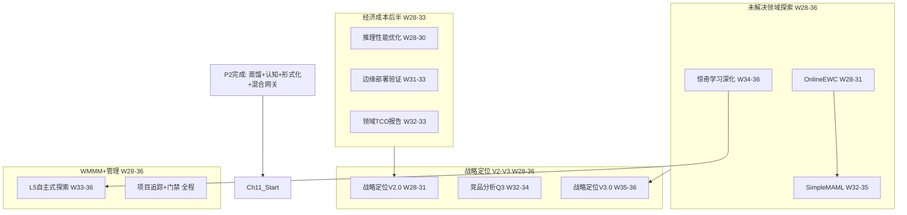

# P3 波次实施计划书 — 自主学习与元进化

> **波次代号**: P3 "赋魂"
> **周期**: Week 28 – Week 36 (共 9 周)
> **优先级**: 高 — 在 P2 完成后启动
> **预算**: 55 人天 + $550 硬件/API
> **核心目标**: 元学习能力 + 在线持续学习 + 推理性能突破 + 战略定位 V2-V3

---

## 1. 波次概述

### 1.1 战略定位

P3 是从"能力丰富"到"自主进化"的**跨越波次**。P0 止了血，P1 补了骨，P2 长了肉，P3 要赋予系统"灵魂"——自主学习、自我改进、自我修复的能力。根据依赖关系图：



### 1.2 涉及章节

| 章节 | P3 范围 | 人天 | 来源 |
|---|---|---|---|
| Ch11 未解决领域 | OnlineEWC + SimpleMAML + 惊奇学习深化 | 35 | §3.2-3.4 |
| Ch07 经济成本(后半) | 推理优化 + 边缘部署 + 领域TCO | 10 | §3.3 |
| Ch08 WMMM(L5) | L5 自主式概念验证 | 5 | §3.4 |
| Ch14 战略定位 | V2.0 + V3.0 + 竞品分析 Q3 | 8 | §3.1-3.2 |
| Ch12 统一路径 | P3 追踪 + 门禁检查 | 4 | §3.2-3.4 |

> 多章节高度并行，实际并行调整后约 **55 人天**。

### 1.3 前置依赖

- **前置**: P2 全部完成 (W27 门禁通过)
- **被依赖**: P4 (Ch11→Ch09 领域验证, Ch07→Ch14 战略结论, Ch11→Ch08 L5深化)

---

## 2. 三阶段实施计划

### Stage 1: W28-W31 — OnlineEWC + 推理性能 + 战略定位 V2

#### Week 28-29 — OnlineEWC 核心 + 推理优化启动 + 战略定位 V2.0

| 任务ID | 任务 | 章节 | 负责 | 天数 | 交付物 |
|---|---|---|---|---|---|
| T28.1 | OnlineEWC 核心实现 | Ch11 §3.4 | 研究工程师A | 5 | `_online_ewc.py` |
| T28.2 | DoCalculus 缓存优化 | Ch07 §3.3 | 工程师B | 3 | `CachedDoCalculus` |
| T28.3 | 战略定位 V2.0 文档 | Ch14 §3.1 | Tech Lead | 2 | `strategy_v2.0.md` |

**T28.1 OnlineEWC** (Ch11 §3.4):
```python
class OnlineEWC:
    """在线 EWC — 替代标准 EWC 解决 50% 遗忘问题"""
    def __init__(self, model, damping=0.1, fisher_mode="diagonal"):
        self._model = model
        self._damping = damping
        self._fisher_diag = {}  # 每个任务一个对角 Fisher
        self._star_params = {}
        self._n_tasks = 0
    
    def consolidate(self, task_id: str):
        """任务完成后固化参数 — O(N) 对角近似"""
        self._fisher_diag[task_id] = self._compute_diagonal_fisher()
        self._star_params[task_id] = self._model.get_params()
        self._n_tasks += 1
    
    def ewc_loss(self, lambda_base=100.0) -> float:
        """自适应 λ × 在线 Fisher 正则"""
        adaptive_lambda = lambda_base * (1.0 + 0.15 * self._n_tasks)
        total = 0.0
        for task_id in self._fisher_diag:
            for p, p_star, f in zip(
                self._model.get_params(),
                self._star_params[task_id],
                self._fisher_diag[task_id],
            ):
                total += (adaptive_lambda / 2) * np.sum((f + self._damping) * (p - p_star) ** 2)
        return total
```

**KPI**: 10 任务序列后任务 1 准确率 ≥85% (遗忘率 <15%)

**T28.2 推理优化** (Ch07 §3.3):
```python
class CachedDoCalculus(DoCalculus):
    """缓存优化的 DoCalculus — 拓扑排序缓存 + 增量更新"""
    def __init__(self, causal_graph):
        super().__init__(causal_graph)
        self._topo_cache = None
        self._cache_valid = False
    
    def estimate_ate(self, X, Y, **kwargs):
        if not self._cache_valid:
            self._topo_cache = self._topological_sort()
            self._cache_valid = True
        return self._fast_ate(X, Y, self._topo_cache, **kwargs)
    
    def invalidate_cache(self):
        self._cache_valid = False
```

**KPI**: 单次推理 CPU 延迟 <5ms (P2 基线 ~15ms)

#### Week 30-31 — OnlineEWC 测试 + 边缘部署 + 竞品分析

| 任务ID | 任务 | 章节 | 负责 | 天数 | 交付物 |
|---|---|---|---|---|---|
| T30.1 | OnlineEWC 10 任务基准 | Ch11 §3.4 | 研究工程师A | 3 | 10 任务遗忘率基准 |
| T30.2 | 推理内存优化 + 量化 | Ch07 §3.3 | 工程师B | 3 | 内存 <128MB |
| T30.3 | 边缘部署方案设计 | Ch07 §3.3 | 工程师B (兼) | 2 | 部署规格文档 |
| T30.4 | 竞品分析 Q3 | Ch14 §3.2 | Tech Lead (兼) | 2 | 竞品对比表 |

**T30.1 OnlineEWC 基准**:
```python
def benchmark_online_ewc():
    """10 任务持续学习基准"""
    model = SimpleMLP(input_dim=64, hidden_dim=128, output_dim=10)
    online_ewc = OnlineEWC(model, damping=0.1)
    
    task_accuracies = []
    for task_id in range(10):
        # 训练当前任务
        train_on_task(model, task_id)
        online_ewc.consolidate(str(task_id))
        
        # 测量所有先前任务的准确率
        accs = []
        for prev_task in range(task_id + 1):
            acc = evaluate_on_task(model, prev_task)
            accs.append(acc)
        task_accuracies.append(accs)
    
    # 关键指标: 任务 1 在 10 任务后的准确率
    return task_accuracies[0][-1]  # 目标: ≥85%
```

**KPI**: 任务 1 在 10 任务后准确率 ≥85%，内存 <128MB

#### W28-W31 里程碑

- [ ] M-S1: OnlineEWC 10 任务后任务 1 准确率 ≥85%
- [ ] M-S1: 单次推理 CPU 延迟 <5ms
- [ ] M-S1: 内存占用 <128MB
- [ ] M-S1: 战略定位 V2.0 发布
- [ ] M-S1: 竞品分析 Q3 完成

---

### Stage 2: W32-W34 — SimpleMAML + 边缘部署 + 领域 TCO

#### Week 32-33 — SimpleMAML 核心 + 边缘部署验证 + 领域 TCO

| 任务ID | 任务 | 章节 | 负责 | 天数 | 交付物 |
|---|---|---|---|---|---|
| T32.1 | SimpleMAML 元学习器 | Ch11 §3.2 | 研究工程师A | 5 | `_simple_maml.py` |
| T32.2 | 边缘部署测试 (树莓派) | Ch07 §3.3 | 工程师B | 4 | 部署验证报告 |
| T32.3 | 医疗领域 TCO 报告 | Ch07 §3.3 | 工程师B (兼) | 2 | 医疗 TCO 数据 |
| T32.4 | 竞品分析 Q3 完善 | Ch14 §3.2 | Tech Lead (兼) | 1 | 更新对比表 |

**T32.1 SimpleMAML** (Ch11 §3.2):
```python
class SimpleMAML:
    """简化版 MAML — 模型无关元学习"""
    def __init__(self, model_factory, inner_lr=0.01, outer_lr=0.001,
                 n_inner_steps=5):
        self._model_factory = model_factory
        self._inner_lr = inner_lr
        self._outer_lr = outer_lr
        self._n_inner_steps = n_inner_steps
        self._meta_params = None  # 初始参数
    
    def meta_train(self, task_batch: list[dict]):
        """
        双层优化:
          内循环: 每任务 n_inner_steps 步梯度下降
          外循环: 跨任务 loss 反向传播更新初始参数
        """
        meta_loss = 0.0
        for task in task_batch:
            model = self._model_factory()
            model.set_params(self._meta_params)
            # 内循环: 任务特定适配
            for _ in range(self._n_inner_steps):
                loss = model.compute_loss(task["train"])
                model.step(loss, self._inner_lr)
            # 外循环: 评估适配后参数
            meta_loss += model.compute_loss(task["test"])
        self._update_meta_params(meta_loss / len(task_batch))
    
    def adapt(self, support_data, n_steps=5):
        """零样本迁移: 用少量样本快速适配"""
        model = self._model_factory()
        model.set_params(self._meta_params)
        for _ in range(n_steps):
            loss = model.compute_loss(support_data)
            model.step(loss, self._inner_lr)
        return model
```

**KPI**: Pendulum 元训练后，Cart 任务零样本准确率 ≥60%

**T32.2 边缘部署** (Ch07 §3.3):
```
树莓派 4B (4GB) 部署规格:
  - 核心: DoCalculus + CounterfactualEngine + SafetyMonitor
  - 省略: JEPA训练、视觉蒸馏、MCTS (高计算)
  - 模型量化: FP32 → FP16 (内存减半)
  - 懒加载: 按需加载物理系统
  - 目标: 推理延迟 <50ms, 内存 <512MB
```

**KPI**: 树莓派 4B 可运行核心推理，延迟 <50ms

#### Week 34 — SimpleMAML 训练 + 惊奇学习深化 + 战略定位 V3.0

| 任务ID | 任务 | 章节 | 负责 | 天数 | 交付物 |
|---|---|---|---|---|---|
| T34.1 | SimpleMAML 多任务训练 | Ch11 §3.2 | 研究工程师A | 3 | 2 任务零样本基准 |
| T34.2 | 惊奇驱动学习深化 | Ch11 §3.3 | 研究工程师A (兼) | 3 | 自主训练队列 |
| T34.3 | 法律/工程领域 TCO | Ch07 §3.3 | 工程师B | 3 | 多领域 TCO 数据 |
| T34.4 | 战略定位 V3.0 | Ch14 §3.1 | Tech Lead | 1 | 更新版定位 |

**T34.2 惊奇驱动学习深化** (Ch11 §3.3):
```python
class SurpriseDrivenLearner:
    """惊奇驱动的自主学习 — 从P2基础深化"""
    def __init__(self, surprise_detector, predictor, pem):
        self._detector = surprise_detector
        self._predictor = predictor
        self._pem = pem
        self._training_queue: list[dict] = []
        self._learned_count = 0
    
    def observe(self, predicted, actual, context: dict):
        """观察预测-实际对，高惊奇样本自动入队"""
        signal = self._detector.compute_surprise(predicted, actual)
        if signal.is_anomaly:
            self._training_queue.append({
                "predicted": predicted,
                "actual": actual,
                "surprise_score": signal.score,
                "context": context,
                "timestamp": time.time(),
            })
    
    def learn_from_surprises(self, max_samples=100):
        """从高惊奇样本中优先学习"""
        self._training_queue.sort(key=lambda x: -x["surprise_score"])
        samples = self._training_queue[:max_samples]
        for sample in samples:
            self._predictor.update(sample["predicted"], sample["actual"])
        self._learned_count += len(samples)
        self._training_queue.clear()
    
    def get_learning_stats(self) -> dict:
        return {
            "total_surprises": len(self._training_queue),
            "learned_count": self._learned_count,
            "queue_utilization": self._learned_count / max(1, self._learned_count + len(self._training_queue)),
        }
```

**KPI**: 高惊奇样本学习后惊奇度下降 ≥30%，训练队列利用率 ≥80%

#### W32-W34 里程碑

- [ ] M-S2: SimpleMAML 零样本迁移准确率 ≥60%
- [ ] M-S2: 树莓派 4B 可运行核心推理
- [ ] M-S2: 医疗/法律/工程 TCO 报告完成
- [ ] M-S2: 惊奇驱动训练队列利用率 ≥80%
- [ ] M-S2: 战略定位 V3.0 发布

---

### Stage 3: W35-W36 — L5 自主式探索 + 全量集成 + P3 门禁

#### Week 35-36 — L5 概念验证 + OnlineEWC+MAML 集成 + 门禁

| 任务ID | 任务 | 章节 | 负责 | 天数 | 交付物 |
|---|---|---|---|---|---|
| T35.1 | L5 SimpleLawDiscoverer 概念验证 | Ch08 §3.4 | 研究工程师A | 4 | `_simple_law_discoverer.py` |
| T35.2 | OnlineEWC + SimpleMAML 集成 | Ch11 | 研究工程师A (兼) | 3 | 集成测试 |
| T35.3 | 混合网关路由优化 | Ch09 §3.2 | 工程师B | 3 | 路由准确率 ≥90% |
| T35.4 | P3 门禁检查 + 全量回归 | Ch12 | Tech Lead | 3 | 门禁报告 |

**T35.1 L5 SimpleLawDiscoverer** (Ch08 §3.4):
```python
class SimpleLawDiscoverer:
    """简单物理规律自主发现 — L5 概念验证"""
    def __init__(self):
        self._candidate_equations = []
        self._models = [LinearFit, QuadraticFit, InverseFit, SinusoidalFit, ExponentialFit]
    
    def observe(self, data: list[tuple[float, float]]):
        """观察 (x, y) 数据点"""
        for model_cls in self._models:
            fit = model_cls.fit(data)
            if fit.r_squared > 0.95:
                self._candidate_equations.append(fit)
    
    def discover(self) -> list[str]:
        """返回按 R² 排序的候选方程"""
        return sorted(self._candidate_equations, key=lambda f: -f.r_squared)
    
    def verify_conservation(self, equation, data) -> bool:
        """守恒验证: 方程是否违反能量/动量守恒"""
        # 检查导数是否在合理范围
        return self._check_derivatives(equation, data)
```

**KPI**: 在 `y = 3x + 2` 和 `y = 2x²` 数据上发现正确方程

#### W35-W36 里程碑

- [ ] M-S3: L5 SimpleLawDiscoverer 在 2 种数据上发现正确方程
- [ ] M-S3: OnlineEWC + SimpleMAML 集成测试通过
- [ ] M-S3: 混合网关路由准确率 ≥90%
- [ ] M-S3: pytest ≥2800 passed, 0 failed
- [ ] M-S3: P3 门禁通过

---

## 3. 资源配置

### 3.1 人员配置

| 资源 | 角色 | 主要任务 | 人天 |
|---|---|---|---|
| 研究工程师 A | 元学习 + 持续学习 + L5 | Ch11/Ch08 | 30 |
| 工程师 B | 推理优化 + 边缘部署 + TCO | Ch07 | 15 |
| Tech Lead | 战略定位 + 门禁 + 竞品 | Ch14/Ch12 | 10 |
| **合计** | | | **55** |

### 3.2 硬件/软件

| 资源 | 数量 | 成本 | 说明 |
|---|---|---|---|
| GPU (MAML 训练) | 按需 | $300 | cloud GPU 10h |
| 树莓派 4B | 1 台 | $50 | 边缘部署验证 |
| LLM API (惊奇+竞品) | 按需 | $200 | 惊奇验证 + 竞品数据 |
| **合计** | | **$550** | |

### 3.3 并行度规划

| 周 | 并行任务 | 研究工程师A | 工程师B | Tech Lead |
|---|---|---|---|---|
| W28-29 | 3 | OnlineEWC | 推理优化 | 战略V2 |
| W30-31 | 4 | OnlineEWC基准 | 内存优化+边缘 | 竞品Q3 |
| W32-33 | 4 | SimpleMAML | 边缘部署+TCO | 竞品完善 |
| W34 | 4 | MAML训练+惊奇深化 | TCO(法律/工程) | 战略V3 |
| W35-36 | 4 | L5+集成 | 路由优化 | 门禁+回归 |

---

## 4. KPI 指标体系

### 4.1 自主学习 KPI

| 维度 | P2 基线 | P3 目标 | 度量 |
|---|---|---|---|
| 持续学习遗忘率 | 25% (P1 自适应EWC) | <15% | 10 任务基准 |
| 零样本迁移准确率 | N/A | ≥60% | Pendulum→Cart |
| 惊奇驱动学习效果 | ≥30% 惊奇度下降 | ≥30% + 队列利用率 ≥80% | 惊奇基准 |
| 物理规律自主发现 | N/A | ≥2 种数据方程发现 | L5 概念验证 |

### 4.2 经济性能 KPI

| 维度 | P2 基线 | P3 目标 | 度量 |
|---|---|---|---|
| 单次推理延迟 | ~15ms | <5ms | CPU 基准 |
| 内存占用 | ~256MB | <128MB | 性能基准 |
| 边缘推理延迟 | 未测试 | <50ms | 树莓派 4B |
| 混合路由准确率 | ≥85% | ≥90% | 100 测试查询 |

### 4.3 WMMM 成熟度 KPI

| 层级 | P2 基线 | P3 目标 | 度量 |
|---|---|---|---|
| L2 生成式 | ≥90% | ≥90% (维持) | 多步预测 |
| L3 因果式 | ≥80% | ≥80% (维持) | PC + PearlChain |
| L4 反思式 | ≥50% | ≥55% | AutoTuner + OnlineEWC |
| L5 自主式 | 0% | ≥15% | SimpleLawDiscoverer |
| **WMMM 综合** | **≥70%** | **≥73%** | WMMM 基准套件 |

### 4.4 战略定位 KPI

| 维度 | P2 基线 | P3 目标 | 度量 |
|---|---|---|---|
| 战略文档版本 | V1.0 | V3.0 | 每阶段更新 |
| 竞品分析报告 | 0 份 | 1 份 (Q3) | 竞品对比表 |
| 领域 TCO 数据 | 0 领域 | ≥3 领域 | 医疗/法律/工程 |

---

## 5. 风险评估

| 风险ID | 风险描述 | 概率 | 影响 | 缓解措施 | 应急方案 |
|---|---|---|---|---|---|
| R1 | MAML 内循环不稳定 (梯度爆炸) | 高 | 中 | 梯度裁剪 + 学习率 warmup | 使用 Reptile 替代 |
| R2 | OnlineEWC 10 任务仍遗忘严重 | 中 | 高 | 增大 damping + 自适应 λ | 退回 P1 自适应 EWC |
| R3 | 树莓派内存不足 | 中 | 中 | FP16 量化 + 懒加载 | 仅验证核心推理 (不含MCTS) |
| R4 | 推理优化破坏正确性 | 低 | 高 | 优化前后对比测试 | 保留未优化版本作 fallback |
| R5 | SimpleLawDiscoverer 无法发现复杂方程 | 高 | 低 | 仅验证线性/二次方程 | 定位为概念验证，不影响主线 |
| R6 | 竞品分析获取数据困难 | 中 | 低 | 公开论文 + 开源项目 | 减少竞品范围 |
| R7 | 9 周时间不够 | 中 | 高 | L5 可压缩到 3 周 | L5 推迟到 P4 |

### 风险热力图

```
影响
高  │ R2 R7        R4
    │
中  │ R1 R3        R5
    │
低  │ R6
    └─────────────────────
       低    中    高    概率
```

---

## 6. 成本预算

| 项目 | 人天 | 硬件/软件 | 说明 |
|---|---|---|---|
| OnlineEWC | 12 | $0 | Ch11 §3.4 |
| SimpleMAML | 15 | $300 (GPU) | Ch11 §3.2 |
| 惊奇学习深化 | 8 | $0 | Ch11 §3.3 |
| 推理性能优化 | 6 | $0 | Ch07 §3.3 |
| 边缘部署 | 4 | $50 (树莓派) | Ch07 §3.3 |
| 领域 TCO 报告 | 4 | $0 | Ch07 §3.3 |
| L5 自主式概念验证 | 5 | $0 | Ch08 §3.4 |
| 战略定位 V2-V3 | 5 | $0 | Ch14 §3.1 |
| 竞品分析 Q3 | 3 | $200 (API) | Ch14 §3.2 |
| 项目追踪 + 门禁 | 4 | $0 | Ch12 |
| **合计** | **~55** | **$550** | |

---

## 7. 验收标准

### 7.1 P3 门禁 (W36 结束时必须全部通过)

**自主学习验收**:
- [ ] OnlineEWC: 10 任务序列后任务 1 准确率 ≥85% (遗忘率 <15%)
- [ ] SimpleMAML: Pendulum 元训练后 Cart 零样本准确率 ≥60%
- [ ] 惊奇驱动: 高惊奇样本学习后惊奇度下降 ≥30%，队列利用率 ≥80%
- [ ] L5 概念验证: 在 2 种数据上发现正确方程

**经济性能验收**:
- [ ] 单次推理 CPU 延迟 <5ms
- [ ] 内存占用 <128MB
- [ ] 树莓派 4B 可运行核心推理
- [ ] 混合网关路由准确率 ≥90%

**战略定位验收**:
- [ ] 战略定位 V3.0 发布
- [ ] 竞品分析 Q3 报告完成
- [ ] 医疗/法律/工程 TCO 数据可用

**系统健康验收**:
- [ ] `pytest` ≥2800 passed, 0 failed
- [ ] `ruff check .` 全部通过
- [ ] WMMM 综合得分 ≥73%

### 7.2 P3→P4 门禁检查

| 门禁项 | 检查方法 | 通过标准 |
|---|---|---|
| 自主学习可用 | OnlineEWC + SimpleMAML 基准 | 遗忘 <15%, 零样本 ≥60% |
| 推理性能达标 | CPU 基准测试 | <5ms, <128MB |
| L5 概念验证 | SimpleLawDiscoverer | ≥2 种方程发现 |
| 测试稳定性 | 连续 3 次 pytest | ≥2800 passed, 0 failed |
| WMMM 成熟度 | WMMM 基准套件 | ≥73% |

### 7.3 交付物清单 (新增文件)

| # | 文件/目录 | 类型 | 行数估计 |
|---|---|---|---|
| 1 | `_online_ewc.py` | 新建 | ~300 |
| 2 | `_simple_maml.py` | 新建 | ~350 |
| 3 | `_simple_law_discoverer.py` | 新建 | ~200 |
| 4 | `_cached_do_calculus.py` | 新建 | ~150 |
| 5 | 测试文件 (~5个) | 新建 | ~600 |
| 6 | 边缘部署脚本 | 新建 | ~100 |
| 7 | 战略定位 V2-V3 文档 | 新建 | ~200 |
| 8 | TCO 领域报告 | 新建 | ~150 |
| | **合计** | | **~2,050 行** |

---

## 8. 跨波次衔接

### 8.1 P3 完成后 P4 可立即启动的任务

| P4 任务 | 前置 P3 完成 | 启动条件 |
|---|---|---|
| Ch11 AutonomousLawDiscoverer | SimpleLawDiscoverer + OnlineEWC | L5 概念验证可用 |
| Ch09 医疗/法律领域验证 | TCO 报告 + 混合网关 | 领域 TCO 有数据 |
| Ch09 不可替代边界文档 | 竞品分析 + 领域验证 | 竞品数据可用 |
| Ch14 战略定位 V4.0 | 全部评估数据 | V3 + 领域数据 |

### 8.2 P3 遗留到 P4 的任务

| 任务 | 计划在 P4 执行 | 章节 |
|---|---|---|
| AutonomousLawDiscoverer (完整版) | Ch11 §3.1 | Ch11 |
| 医疗+法律领域验证 | Ch09 §3.2 | Ch09 |
| 不可替代边界文档 | Ch09 §3.3 | Ch09 |
| 竞品分析 Q4 | Ch14 §3.2 | Ch14 |
| Reptile 替代 MAML (如需要) | Ch11 §3.2 | Ch11 |

---

> **P3 铁律**: 不赋予自主学习能力，系统就永远是个工具而非智能体！从"被训练"到"主动学"，这是灵魂的跃迁！
>
> **前路虽难，但路就在脚下！**
