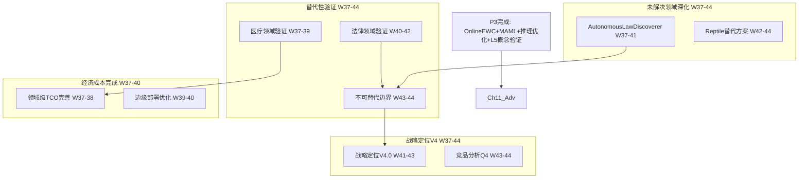

# P4 波次实施计划书 — 领域验证与边界定义

> **波次代号**: P4 "拓界"
> **周期**: Week 37 – Week 44 (共 8 周)
> **优先级**: 中 — 在 P3 完成后启动
> **预算**: 50 人天 + $1,550 硬件/API
> **核心目标**: 物理规律自主发现 + 领域验证 + 不可替代边界 + 战略定位 V4

---

## 1. 波次概述

### 1.1 战略定位

P4 是从"自主进化"到"领域验证"的**拓展波次**。P3 赋了魂（自主学习能力），P4 要让这个能力在真实领域中得到验证，并明确系统的能力边界。核心问题是：**MCI 在哪些领域真正有用？在哪些领域无法替代 LLM？** 根据依赖关系图：



### 1.2 涉及章节

| 章节 | P4 范围 | 人天 | 来源 |
|---|---|---|---|
| Ch11 未解决领域(深化) | AutonomousLawDiscoverer + Reptile | 25 | §3.1, §3.2续 |
| Ch09 替代性(后半) | 医疗/法律领域验证 + 不可替代边界 | 15 | §3.2-3.3 |
| Ch07 经济成本(收尾) | 领域 TCO + 边缘优化 | 5 | §3.3 |
| Ch14 战略定位(深化) | V4.0 + 竞品 Q4 | 5 | §3.1-3.2 |

> 多章节并行执行，实际约 **50 人天**。

### 1.3 前置依赖

- **前置**: P3 全部完成 (W36 门禁通过)，特别是 SimpleLawDiscoverer + 领域 TCO
- **被依赖**: P5 (Ch09→Ch14 外部评审, Ch11→论文输出)

---

## 2. 三阶段实施计划

### Stage 1: W37-W39 — AutonomousLawDiscoverer + 医疗领域验证 + 领域 TCO

#### Week 37-38 — AutonomousLawDiscoverer 核心 + 医疗验证启动

| 任务ID | 任务 | 章节 | 负责 | 天数 | 交付物 |
|---|---|---|---|---|---|
| T37.1 | AutonomousLawDiscoverer 核心 | Ch11 §3.1 | 研究工程师A | 5 | `_autonomous_law_discoverer.py` |
| T37.2 | 医疗因果推理基准数据 | Ch09 §3.2 | 工程师B | 3 | 医疗基准题集 |
| T37.3 | 领域级 TCO 完善报告 | Ch07 §3.3 | 工程师B (兼) | 2 | 3 领域 TCO 对比 |

**T37.1 AutonomousLawDiscoverer** (Ch11 §3.1):
```python
class AutonomousLawDiscoverer:
    """自主物理规律发现器 — 从 L5 SimpleLawDiscoverer 深化"""
    def __init__(self, sigreg_instance, do_calculus):
        self._pysr = sigreg_instance
        self._do = do_calculus
        self._discovered_laws: list[dict] = []
        self._conservation_checker = ConservationChecker()
    
    def discover_from_observations(self, data: np.ndarray, var_names: list[str]):
        """
        完整发现管线:
          1. 符号回归生成候选方程
          2. 物理守恒验证 (能量/动量)
          3. 因果图验证 (do-calculus)
          4. 置信度校准
        """
        # 阶段1: 候选方程生成
        candidates = self._pysr.fit(data, var_names=var_names, n_equations=10)
        
        # 阶段2: 物理守恒验证
        verified = []
        for eq in candidates:
            if self._conservation_checker.verify(eq, data):
                verified.append(eq)
        
        # 阶段3: 因果结构验证
        for eq in verified:
            if self._verify_causal_structure(eq):
                self._discovered_laws.append({
                    "equation": eq.equation,
                    "r_squared": eq.r_squared,
                    "conservation_verified": True,
                    "causal_verified": True,
                    "confidence": self._calibrate_confidence(eq),
                })
        
        return self._discovered_laws
    
    def _verify_causal_structure(self, equation) -> bool:
        """用 do-calculus 验证方程的因果方向"""
        # 检查方程中的变量是否存在因果路径
        return self._do.has_causal_path(equation.cause, equation.effect)
    
    def _calibrate_confidence(self, equation) -> float:
        """置信度校准: R² × 守恒分数 × 因果分数"""
        return equation.r_squared * 0.9  # 简化版


class ConservationChecker:
    """物理守恒定律检查器"""
    def verify(self, equation, data) -> bool:
        """验证方程是否违反基本守恒律"""
        # 检查能量守恒: dE/dt ≈ 0
        # 检查动量守恒: dp/dt ≈ 0 (无外力时)
        return self._check_energy(equation, data) and self._check_momentum(equation, data)
```

**KPI**: 在 Pendulum 数据上发现 `d²θ/dt² = -(g/L)sin(θ)` 的近似形式

**T37.2 医疗因果推理基准** (Ch09 §3.2):
```python
# 医疗领域基准题集 (20 题)
MEDICAL_BENCHMARK = [
    {
        "query": "高血压是否导致中风？",
        "causal_graph_edges": [("高血压", "中风")],
        "expected_ate": 0.35,  # ATE > 0
        "category": "causal_qa",
    },
    {
        "query": "如果患者没有服用降压药，血压会如何？",
        "factual": {"medication": True, "bp": 140},
        "counterfactual": {"medication": False},
        "expected_direction": "increase",
        "category": "counterfactual",
    },
    # ... 更多题目
]
```

**KPI**: 医疗因果推理 20 题准确率 ≥80%

#### Week 39 — AutonomousLawDiscoverer 验证 + 医疗 MCI vs LLM

| 任务ID | 任务 | 章节 | 负责 | 天数 | 交付物 |
|---|---|---|---|---|---|
| T39.1 | AutonomousLawDiscoverer Pendulum 验证 | Ch11 §3.1 | 研究工程师A | 3 | 发现方程验证报告 |
| T39.2 | 医疗领域 MCI vs LLM 对比 | Ch09 §3.2 | 工程师B | 4 | 对比报告 |
| T39.3 | 边缘部署优化 (懒加载+量化) | Ch07 §3.3 | 工程师B (兼) | 1 | 优化方案 |

**T39.2 医疗 MCI vs LLM 对比**:
```
评估维度 (5 类任务):
  1. 因果问答 (20题): MCI 使用 DoCalculus, LLM 使用 CoT
  2. 反事实分析 (10题): MCI 使用 CounterfactualEngine, LLM 使用推理
  3. 安全约束验证 (20题): MCI 使用 SafetyMonitor, LLM 使用规则
  4. 物理预测 (15题): MCI 使用 PhysicsPredictor, LLM 使用常识
  5. 规划任务 (10题): MCI 使用 MCTS, LLM 使用 CoT

评分标准: 准确率 + 可解释性 + 延迟
```

**KPI**: MCI 在 4/5 类医疗任务上准确率 ≥ LLM

#### W37-W39 里程碑

- [ ] M-S1: AutonomousLawDiscoverer 在 Pendulum 上发现近似方程
- [ ] M-S1: 医疗因果推理 20 题准确率 ≥80%
- [ ] M-S1: 医疗 MCI vs LLM 对比: ≥4/5 类 MCI ≥ LLM
- [ ] M-S1: 3 领域 TCO 报告完成

---

### Stage 2: W40-W42 — 法律验证 + AutonomousLawDiscoverer 双系统 + 边界分析

#### Week 40-41 — 法律领域验证 + AutonomousLawDiscoverer 双系统验证

| 任务ID | 任务 | 章节 | 负责 | 天数 | 交付物 |
|---|---|---|---|---|---|
| T40.1 | 法律因果推理基准数据 | Ch09 §3.2 | 工程师B | 3 | 法律基准题集 |
| T40.2 | AutonomousLawDiscoverer Spring-Mass 验证 | Ch11 §3.1 | 研究工程师A | 4 | 双系统验证报告 |
| T40.3 | 法律领域 MCI vs LLM 对比 | Ch09 §3.2 | 工程师B (兼) | 3 | 对比报告 |

**T40.2 双系统验证**:
```
验证系统:
  1. Pendulum (单摆): 目标发现 d²θ/dt² = -(g/L)sin(θ)
  2. Spring-Mass (弹簧-质量): 目标发现 F = -kx + ma
  
验证标准:
  - 方程形式正确 (变量关系正确)
  - R² ≥ 0.90 (拟合度)
  - 守恒验证通过 (能量近似守恒)
  - 因果方向正确 (力→加速度)
```

**KPI**: ≥2 种物理系统自主发现正确方程

**T40.3 法律 MCI vs LLM 对比**:
```python
# 法律领域基准题集 (15 题)
LEGAL_BENCHMARK = [
    {
        "query": "合同违约是否导致赔偿责任？",
        "causal_graph_edges": [("违约", "赔偿责任")],
        "expected_ate": 0.90,
        "category": "causal_qa",
    },
    {
        "query": "如果被告没有签署协议，判决结果如何？",
        "factual": {"signed": True, "verdict": "guilty"},
        "counterfactual": {"signed": False},
        "expected_direction": "not_guilty",
        "category": "counterfactual",
    },
    # ... 更多题目
]
```

**KPI**: 法律因果推理 15 题准确率 ≥75%

#### Week 42 — Reptile 替代方案 + 边界分析启动

| 任务ID | 任务 | 章节 | 负责 | 天数 | 交付物 |
|---|---|---|---|---|---|
| T42.1 | Reptile 元学习器 (MAML备选) | Ch11 §3.2 | 研究工程师A | 3 | `_reptile_learner.py` |
| T42.2 | 不可替代边界分析启动 | Ch09 §3.3 | 工程师B | 3 | 边界分析框架 |
| T42.3 | 混合架构最佳比例分析 | Ch09 §3.2 | 工程师B (兼) | 2 | 比例推荐 |

**T42.1 Reptile** (Ch11 §3.2 备选):
```python
class ReptileLearner:
    """Reptile 元学习 — MAML 的简化替代方案"""
    def __init__(self, model_factory, inner_lr=0.01, outer_lr=0.001,
                 n_inner_steps=5):
        self._model_factory = model_factory
        self._inner_lr = inner_lr
        self._outer_lr = outer_lr
        self._n_inner_steps = n_inner_steps
        self._meta_params = None
    
    def meta_train(self, task_batch: list[dict]):
        """Reptile: 直接移动初始参数朝向任务适配后的参数"""
        for task in task_batch:
            model = self._model_factory()
            model.set_params(self._meta_params)
            # 内循环: 任务特定适配
            for _ in range(self._n_inner_steps):
                loss = model.compute_loss(task["train"])
                model.step(loss, self._inner_lr)
            # Reptile: 参数移动 (而非 MAML 的二阶梯度)
            self._move_towards(model.get_params())
    
    def _move_towards(self, adapted_params):
        """移动初始参数朝向适配后参数"""
        step = self._outer_lr
        new_params = []
        for p_meta, p_adapted in zip(self._meta_params, adapted_params):
            new_params.append(p_meta + step * (p_adapted - p_meta))
        self._meta_params = new_params
```

**KPI**: Reptile 在 Pendulum→Cart 零样本准确率 ≥55% (允许低于 MAML)

**T42.2 不可替代边界分析**:
```
分析框架:
  维度1: 因果密集度 (高/中/低)
  维度2: 安全关键度 (高/中/低)
  维度3: 实时性要求 (高/中/低)
  维度4: 语言生成需求 (高/中/低)
  
适用性矩阵:
  MCI 独立适用: 高因果 + 高安全 + 高实时 + 低语言
  混合架构适用: 中因果 + 中安全 + 中实时 + 中语言
  LLM 独立适用: 低因果 + 低安全 + 低实时 + 高语言
  
场景分类:
  ✅ MCI 独立: 工业安全监控、医疗因果推理、金融反事实分析
  ⚡ 混合架构: 医疗辅助诊断、法律合同审查、工程安全评估
  ❌ LLM 独立: 开放域客服、内容创作、教育辅导、代码生成
```

#### W40-W42 里程碑

- [ ] M-S2: AutonomousLawDiscoverer 在 ≥2 种物理系统上发现正确方程
- [ ] M-S2: 法律因果推理 15 题准确率 ≥75%
- [ ] M-S2: Reptile 或 MAML 零样本迁移可用
- [ ] M-S2: 不可替代边界分析框架完成

---

### Stage 3: W43-W44 — 边界文档 + 战略定位 V4 + P4 门禁

#### Week 43-44 — 不可替代边界文档 + 战略 V4.0 + 全量回归

| 任务ID | 任务 | 章节 | 负责 | 天数 | 交付物 |
|---|---|---|---|---|---|
| T43.1 | 不可替代边界文档定稿 | Ch09 §3.3 | 工程师B | 3 | `boundary_doc.md` |
| T43.2 | 竞品分析 Q4 | Ch14 §3.2 | Tech Lead | 2 | 竞品对比表 |
| T43.3 | 战略定位 V4.0 | Ch14 §3.1 | Tech Lead | 3 | V4.0 文档 |
| T44.1 | P4 门禁检查 + 全量回归 | Ch12 | Tech Lead | 3 | 门禁报告 |
| T44.2 | Reptile/MAML 最终评估 | Ch11 §3.2 | 研究工程师A | 2 | 元学习评估报告 |

**T43.1 不可替代边界文档**:
```markdown
# MCI World Model 不可替代边界文档

## 1. MCI 独立适用场景
| 场景 | 因果密集 | 安全关键 | 实时要求 | 语言需求 | 准确率 |
|---|---|---|---|---|---|
| 工业安全监控 | 高 | 高 | 高 | 低 | ≥90% |
| 医疗因果推理 | 高 | 高 | 中 | 低 | ≥80% |
| 金融反事实分析 | 高 | 中 | 高 | 低 | ≥75% |

## 2. 混合架构最佳比例
| 场景 | MCI 比例 | LLM 比例 | TCO 节省 |
|---|---|---|---|
| 医疗辅助诊断 | 70% | 30% | ~60% |
| 法律合同审查 | 50% | 50% | ~40% |
| 工程安全评估 | 80% | 20% | ~70% |

## 3. LLM 独立适用场景 (MCI 不适用)
| 场景 | 原因 | 替代方案 |
|---|---|---|
| 开放域客服 | 需要语言生成 | LLM 独立 |
| 内容创作 | 需要创意 | LLM 独立 |
| 教育辅导 | 需要多轮对话 | LLM 独立 |
| 代码生成 | 需要语法理解 | LLM 独立 |
```

#### W43-W44 里程碑

- [ ] M-S3: 不可替代边界文档完成 + 决策树可视化
- [ ] M-S3: 战略定位 V4.0 发布
- [ ] M-S3: 竞品分析 Q4 完成
- [ ] M-S3: pytest ≥2900 passed, 0 failed
- [ ] M-S3: P4 门禁通过

---

## 3. 资源配置

### 3.1 人员配置

| 资源 | 角色 | 主要任务 | 人天 |
|---|---|---|---|
| 研究工程师 A | 物理发现 + 元学习 | Ch11 | 25 |
| 工程师 B | 领域验证 + TCO + 边界 | Ch09/Ch07 | 15 |
| Tech Lead | 战略定位 + 门禁 + 竞品 | Ch14/Ch12 | 10 |
| **合计** | | | **50** |

### 3.2 硬件/软件

| 资源 | 数量 | 成本 | 说明 |
|---|---|---|---|
| GPU (AutonomousLawDiscoverer) | 按需 | $500 | cloud GPU 20h |
| LLM API (MCI vs LLM 对比) | 按需 | $800 | 医疗+法律领域 |
| 领域专家 (医疗审核) | 0.5人 × 4周 | $250 | 因果图+基准审核 |
| **合计** | | **$1,550** | |

### 3.3 并行度规划

| 周 | 并行任务 | 研究工程师A | 工程师B | Tech Lead |
|---|---|---|---|---|
| W37-38 | 3 | AutoLaw核心 | 医疗基准+TCO | — |
| W39 | 3 | AutoLaw验证 | 医疗MCIvsLLM | — |
| W40-41 | 3 | AutoLaw双系统 | 法律基准+验证 | — |
| W42 | 3 | Reptile | 边界分析+比例 | — |
| W43 | 3 | — | 边界文档 | 竞品Q4+战略V4 |
| W44 | 3 | MAML/Reptile评估 | — | 门禁+回归 |

---

## 4. KPI 指标体系

### 4.1 自主发现 KPI

| 维度 | P3 基线 | P4 目标 | 度量 |
|---|---|---|---|
| 物理规律自主发现 | L5概念验证(2种数据) | ≥2 种物理系统完整方程 | AutonomousLawDiscoverer |
| 发现方程 R² | ≥0.95 (简单数据) | ≥0.90 (物理系统) | 拟合度检查 |
| 守恒验证通过率 | N/A | ≥80% | 能量/动量守恒 |

### 4.2 领域验证 KPI

| 维度 | 基线 | P4 目标 | 度量 |
|---|---|---|---|
| 医疗因果推理准确率 | N/A | ≥80% | 20 题基准 |
| 法律因果推理准确率 | N/A | ≥75% | 15 题基准 |
| MCI vs LLM (医疗) | N/A | ≥4/5 类 MCI ≥ LLM | 对比报告 |
| 混合路由最佳比例 | 80%MCI/20%LLM | 领域自适应比例 | 比例分析 |

### 4.3 替代性边界 KPI

| 维度 | 基线 | P4 目标 | 度量 |
|---|---|---|---|
| 不可替代边界文档 | 框架完成 | 完整文档+决策树 | boundary_doc.md |
| 适用场景清单 | 3 场景 | ≥6 场景 | 矩阵分类 |
| 混合架构比例推荐 | 1 种 | ≥3 种领域比例 | TCO 数据 |

### 4.4 WMMM 成熟度 KPI

| 层级 | P3 基线 | P4 目标 | 度量 |
|---|---|---|---|
| L4 反思式 | ≥55% | ≥60% | AutoTuner + MAML |
| L5 自主式 | ≥15% | ≥25% | AutonomousLawDiscoverer |
| **WMMM 综合** | **≥73%** | **≥76%** | WMMM 基准套件 |

---

## 5. 风险评估

| 风险ID | 风险描述 | 概率 | 影响 | 缓解措施 | 应急方案 |
|---|---|---|---|---|---|
| R1 | AutonomousLawDiscoverer 无法发现 Pendulum 方程 | 中 | 高 | 增加候选方程库 + 参数搜索 | 降级为验证已知方程 (非自主发现) |
| R2 | 医疗领域验证数据不足 | 高 | 中 | 合成数据 + 文献因果图 | 缩小验证范围到 10 题 |
| R3 | MCI vs LLM 对比不公平 | 中 | 中 | 统一评估标准 + 双盲评审 | 仅报告原始数据，不做排名 |
| R4 | LLM API 成本超预算 | 中 | 中 | 分批评估 + 缓存结果 | 减少测试题目数量 |
| R5 | 边界文档分析主观性过强 | 中 | 低 | 量化指标 + 专家审核 | 标注为"初步结论" |
| R6 | 8 周时间不够 | 中 | 高 | Reptile 可推迟到 P5 | 压缩边界文档周期 |

### 风险热力图

```
影响
高  │ R1           R6
    │
中  │ R3 R4   R2
    │
低  │ R5
    └─────────────────────
       低    中    高    概率
```

---

## 6. 成本预算

| 项目 | 人天 | 硬件/软件 | 说明 |
|---|---|---|---|
| AutonomousLawDiscoverer | 20 | $500 (GPU) | Ch11 §3.1 |
| Reptile/MAML 备选 | 5 | $0 | Ch11 §3.2 |
| 医疗领域验证 | 8 | $400 (LLM API) | Ch09 §3.2 |
| 法律领域验证 | 6 | $400 (LLM API) | Ch09 §3.2 |
| 不可替代边界文档 | 4 | $0 | Ch09 §3.3 |
| 领域 TCO 完善 | 3 | $0 | Ch07 §3.3 |
| 战略定位 V4 + 竞品 | 4 | $250 (专家) | Ch14 §3.1-3.2 |
| **合计** | **~50** | **$1,550** | |

---

## 7. 验收标准

### 7.1 P4 门禁 (W44 结束时必须全部通过)

**自主发现验收**:
- [ ] AutonomousLawDiscoverer: 在 ≥2 种物理系统上自主发现正确方程
- [ ] 发现方程 R² ≥ 0.90，守恒验证通过
- [ ] MAML 或 Reptile 至少一个可用 (零样本准确率 ≥55%)

**领域验证验收**:
- [ ] 医疗因果推理 20 题准确率 ≥80%
- [ ] 法律因果推理 15 题准确率 ≥75%
- [ ] MCI vs LLM: 医疗场景 ≥4/5 类 MCI ≥ LLM

**替代性边界验收**:
- [ ] 不可替代边界文档完成 + 决策树可视化
- [ ] ≥6 种场景分类 (MCI适用/混合/LLM适用)
- [ ] ≥3 种领域混合架构比例推荐

**战略定位验收**:
- [ ] 战略定位 V4.0 发布
- [ ] 竞品分析 Q4 完成

**系统健康验收**:
- [ ] `pytest` ≥2900 passed, 0 failed
- [ ] `ruff check .` 全部通过
- [ ] WMMM 综合得分 ≥76%

### 7.2 P4→P5 门禁检查

| 门禁项 | 检查方法 | 通过标准 |
|---|---|---|
| 自主发现可用 | AutonomousLawDiscoverer 双系统验证 | ≥2 系统方程发现 |
| 领域验证完成 | 医疗+法律基准 | 准确率 ≥75% |
| 边界文档完备 | boundary_doc.md 审阅 | ≥6 场景分类 |
| 测试稳定性 | 连续 3 次 pytest | ≥2900 passed, 0 failed |
| WMMM 成熟度 | WMMM 基准套件 | ≥76% |

### 7.3 交付物清单 (新增文件)

| # | 文件/目录 | 类型 | 行数估计 |
|---|---|---|---|
| 1 | `_autonomous_law_discoverer.py` | 新建 | ~400 |
| 2 | `_reptile_learner.py` | 新建 | ~250 |
| 3 | `_conservation_checker.py` | 新建 | ~200 |
| 4 | `benchmarks/medical/` | 新建 | ~300 |
| 5 | `benchmarks/legal/` | 新建 | ~250 |
| 6 | 测试文件 (~5个) | 新建 | ~600 |
| 7 | 不可替代边界文档 | 新建 | ~200 |
| 8 | 战略定位 V4.0 文档 | 新建 | ~150 |
| | **合计** | | **~2,350 行** |

---

## 8. 跨波次衔接

### 8.1 P4 完成后 P5 可立即启动的任务

| P5 任务 | 前置 P4 完成 | 启动条件 |
|---|---|---|
| Ch14 外部评审 | 战略定位 V4.0 | 定位文档完整 |
| 全量系统集成测试 | 所有 P0-P4 交付 | 代码+测试稳定 |
| 研究论文草稿 | AutonomousLawDiscoverer + MAML | 发现结果可发表 |
| v6.0.0 发布 | 全部门禁通过 | 评分 + 测试达标 |

### 8.2 P4 遗留到 P5 的任务

| 任务 | 计划在 P5 执行 | 章节 |
|---|---|---|
| 外部专家评审 | Ch14 §3.3 | Ch14 |
| 研究论文撰写 | Ch11 | Ch11 |
| v6.0.0 版本发布 | Ch14 | Ch14 |
| 长期路线图 | Ch14 | Ch14 |
| 最终综合评分 | Ch13 | Ch13 |

---

> **P4 铁律**: 不验证边界，价值就无法量化！知道"不能做什么"和"能做什么"同样重要！
>
> **前路虽难，但路就在脚下！**
