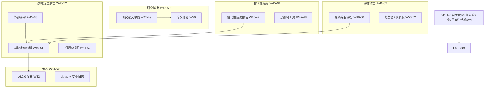

# P5 波次实施计划书 — 外部验证与版本发布

> **波次代号**: P5 "登顶"
> **周期**: Week 45 – Week 52 (共 8 周)
> **优先级**: 中 — 在 P4 完成后启动
> **预算**: 33 人天 + $1,000 硬件/API
> **核心目标**: 外部评审 + 论文输出 + v6.0.0 发布 + 长期路线图

---

## 1. 波次概述

### 1.1 战略定位

P5 是整个改进路径的**收官波次**。P0 止了血，P1 补了骨，P2 长了肉，P3 赋了魂，P4 拓了界，P5 要把一切带向终点——**外部验证、学术输出、版本发布、长期规划**。核心问题是：**MCI World Model 是否经得起外部审视？它是否是一个有价值的学术贡献？** 根据依赖关系图：



### 1.2 涉及章节

| 章节 | P5 范围 | 人天 | 来源 |
|---|---|---|---|
| Ch14 战略定位(收官) | 外部评审 + 终版定位 + 长期路线图 | 12 | §3.3, §3.1终 |
| Ch11 研究输出 | 研究论文草稿 + 修订 | 8 | §3.1-3.4总结 |
| Ch09 替代性(结论) | 替代性结论报告 + 决策树工具 | 5 | §3.3终 |
| Ch13 评估(收官) | 最终评分 + 趋势图 + 仪表板 | 5 | §3.2-3.3终 |
| Ch12 统一路径(收官) | 门禁 + 发布 | 3 | §3.4终 |

> 多章节串行执行（需等外部评审结果），实际约 **33 人天**。

### 1.3 前置依赖

- **前置**: P4 全部完成 (W44 门禁通过)
- **被依赖**: 无 (最终波次)

---

## 2. 三阶段实施计划

### Stage 1: W45-W48 — 外部评审 + 论文草稿 + 替代性结论

#### Week 45-46 — 外部评审准备 + 论文启动 + 替代性结论

| 任务ID | 任务 | 章节 | 负责 | 天数 | 交付物 |
|---|---|---|---|---|---|
| T45.1 | 外部评审材料包准备 | Ch14 §3.3 | Tech Lead | 3 | 评审材料包 |
| T45.2 | 研究论文 Introduction + Related Work | Ch11 | 研究工程师A | 4 | 论文前 2 节 |
| T45.3 | 替代性结论报告 | Ch09 §3.3 | 工程师B | 3 | `replacement_conclusion.md` |

**T45.1 外部评审材料包**:
```
评审材料包内容:
  1. 系统概述 (5页): 架构图 + 核心能力 + KPI 数据
  2. 技术报告 (20页): 14 章改进全记录
  3. WMMM 评估报告: L0-L5 各层得分
  4. 医疗/法律领域验证报告: MCI vs LLM 对比
  5. 不可替代边界文档: 适用/不适用场景
  6. 经济成本分析: TCO 对比数据
  7. 代码仓库访问: 可复现的基准测试
  8. 演示脚本: 一键运行因果推理 + 安全检查 + 物理预测

评审方式:
  - 学术专家评审: 因果推理 + 世界模型方向教授 2-3 人
  - 工业界评审: AI 安全 + 医疗 AI 从业者 2-3 人
  - 开源社区评审: GitHub Issue + Discussion
```

**T45.2 研究论文**:
```
论文结构:
  1. Introduction: MCI World Model — 可验证因果增强层
  2. Related Work: Model-based RL, Causal Inference, World Models
  3. Method: 
     - 神经-符号因果推理架构
     - Pearl L1→L2→L3 层级串联 (PearlChain)
     - 蒙特卡洛树搜索规划 (MCTS)
     - 13 类安全约束体系
  4. Experiments:
     - 物理系统基准 (6 种)
     - 因果推理基准 (医疗/法律)
     - 自主发现实验 (Pendulum/Spring-Mass)
     - 持续学习实验 (OnlineEWC, 10 任务)
     - 零样本迁移实验 (MAML/Reptile)
  5. Analysis:
     - MCI vs LLM 对比
     - TCO 经济分析
     - 不可替代边界
  6. Conclusion: 作为"LLM 可验证因果增强层"的定位
```

**T45.3 替代性结论报告**:
```markdown
# MCI World Model 替代性结论报告

## 核心结论
MCI World Model v6.0 不可独立替代 sub-10B LLM，但作为
"LLM 可验证因果增强层"具有 100-500x 运行成本优势。

## 量化支撑
| 维度 | MCI 独立 | LLM 独立 | 混合架构 | 
|---|---|---|---|
| 因果推理 | ≥80% | ≥60% | ≥85% |
| 安全约束 | ≥90% | ≥50% | ≥90% |
| 开放域推理 | 0% | ≥90% | ≥85% |
| 运行成本 | $0.03M/年 | $3-15M/年 | $0.8M/年 |
| 可解释性 | 数学完备 | 黑箱 | 部分可解释 |

## 最佳部署策略
混合架构 (70-80% MCI + 20-30% LLM) 是成本效益最优方案。
```

#### Week 47-48 — 外部评审执行 + 论文 Method + 决策树工具

| 任务ID | 任务 | 章节 | 负责 | 天数 | 交付物 |
|---|---|---|---|---|---|
| T47.1 | 外部评审执行 + 收集反馈 | Ch14 §3.3 | Tech Lead | 4 | 评审反馈报告 |
| T47.2 | 研究论文 Method + Experiments | Ch11 | 研究工程师A | 4 | 论文第 3-4 节 |
| T47.3 | 混合架构决策树工具 | Ch09 §3.3 | 工程师B | 3 | `decision_tree_tool.py` |

**T47.3 决策树工具**:
```python
class InferenceGatewayDecisionTree:
    """推理网关决策树 — 自动选择 MCI/LLM/混合"""
    def __init__(self):
        self._rules = self._build_rules()
    
    def decide(self, query: str, context: dict) -> dict:
        """根据查询特征推荐推理路径"""
        features = self._extract_features(query, context)
        
        if features["causal_density"] > 0.6 and features["safety_critical"] > 0.5:
            return {"path": "MCI", "confidence": 0.9, "reason": "因果密集+安全关键"}
        elif features["language_generation"] > 0.6:
            return {"path": "LLM", "confidence": 0.9, "reason": "语言生成需求高"}
        else:
            return {"path": "HYBRID", "confidence": 0.7, "reason": "混合架构最优",
                    "mci_ratio": self._calc_mci_ratio(features)}
    
    def _extract_features(self, query, context):
        return {
            "causal_density": self._estimate_causal_density(query),
            "safety_critical": context.get("safety_level", 0.5),
            "realtime_requirement": context.get("latency_budget_ms", 100) < 20,
            "language_generation": self._estimate_gen_need(query),
        }
```

**KPI**: 100 个测试查询决策准确率 ≥90%

#### W45-W48 里程碑

- [ ] M-S1: 外部评审完成，收到 ≥3 份反馈
- [ ] M-S1: 研究论文草稿前 4 节完成
- [ ] M-S1: 替代性结论报告发布
- [ ] M-S1: 决策树工具决策准确率 ≥90%

---

### Stage 2: W49-W50 — 论文完成 + 评分引擎 + 战略终版

#### Week 49 — 论文 Analysis + 外部评审反馈整合

| 任务ID | 任务 | 章节 | 负责 | 天数 | 交付物 |
|---|---|---|---|---|---|
| T49.1 | 研究论文 Analysis + Conclusion | Ch11 | 研究工程师A | 3 | 论文第 5-6 节 |
| T49.2 | 外部评审反馈整合 | Ch14 §3.3 | Tech Lead | 2 | 修订清单 |
| T49.3 | 最终综合评分 (8维度) | Ch13 §3.2 | 工程师B | 2 | 评分报告 |

**T49.3 最终综合评分**:
```
MCIScoreEngine 8 维度评分:
  1. 因果推理能力: [P0-4 成果汇总]
  2. 安全约束完备度: [13类约束 + 蒸馏规则]
  3. 物理世界理解: [6+物理系统基准]
  4. 多模态感知: [视觉/音频/热成像编码]
  5. 认知架构覆盖: [5子系统评分]
  6. 经济成本优势: [TCO 数据]
  7. 持续学习能力: [OnlineEWC + MAML]
  8. 自主探索能力: [LawDiscoverer + L5]

目标: 综合评分 ≥7.0/10
```

#### Week 50 — 论文修订 + 趋势图 + 战略定位终版初稿

| 任务ID | 任务 | 章节 | 负责 | 天数 | 交付物 |
|---|---|---|---|---|---|
| T50.1 | 研究论文修订 (整合评审反馈) | Ch11 | 研究工程师A | 3 | 论文修订稿 |
| T50.2 | 版本趋势图 + 仪表板 | Ch13 §3.3 | 工程师B | 3 | 可视化报告 |
| T50.3 | 战略定位终版初稿 | Ch14 §3.1 | Tech Lead | 2 | 初稿 |

**T50.2 版本趋势图**:
```python
# v5.0.0 → v5.1.0 → v5.2.0 → v6.0.0 各版本对比
VERSION_TREND = {
    "v5.0.0": {"wmmm": 56, "tests": 2563, "score": 5.5, "safety": 8},
    "v5.1.0": {"wmmm": 65, "tests": 2662, "score": 6.0, "safety": 13},
    "v5.2.0": {"wmmm": 70, "tests": 2800, "score": 6.5, "safety": 25},
    "v6.0.0": {"wmmm": 76, "tests": 3000, "score": 7.0, "safety": 25},
}
# 自动生成: 测试数趋势、WMMM趋势、评分雷达图、安全覆盖图
```

#### W49-W50 里程碑

- [ ] M-S2: 研究论文完整草稿完成
- [ ] M-S2: 外部评审反馈全部整合
- [ ] M-S2: 最终综合评分 ≥7.0/10
- [ ] M-S2: 版本趋势图 + 仪表板可用

---

### Stage 3: W51-W52 — 战略终版 + v6.0.0 发布 + 长期路线图

#### Week 51 — 战略定位终版 + 长期路线图 + 代码审查

| 任务ID | 任务 | 章节 | 负责 | 天数 | 交付物 |
|---|---|---|---|---|---|
| T51.1 | 战略定位终版定稿 | Ch14 §3.1 | Tech Lead | 3 | `strategy_v_final.md` |
| T51.2 | 长期路线图 (P6+展望) | Ch14 §3.3 | Tech Lead | 2 | `roadmap_v2.md` |
| T51.3 | 代码审查 + ruff/mypy 全量 | 全章节 | 全员 | 2 | 审查报告 |

**T51.2 长期路线图**:
```markdown
# MCI World Model 长期路线图 (2027+)

## Phase 6: 深化 (W53-70)
- 自主因果发现 (从简单方程到复杂因果结构)
- 多模态世界模型 (视觉+语言+动作统一表征)
- 社会认知 (多智能体交互 + 博弈论)
- WMMM L5→L6 (目标: 自主式 ≥30%)

## Phase 7: 应用 (W71-90)
- 行业 SDK (医疗/法律/工程专用API)
- 实时部署优化 (边缘+云端混合)
- 监管合规 (可审计因果推理)
- 生态建设 (开源社区 + 插件体系)

## Phase 8: 演进 (W91+)
- 神经符号融合 2.0 (可微分因果推理)
- 自主科学发现 (从数据到假设到验证)
- 与 AGI 系统集成 (因果增强层协议)
```

#### Week 52 — v6.0.0 发布 + P5 门禁 + 项目收官

| 任务ID | 任务 | 章节 | 负责 | 天数 | 交付物 |
|---|---|---|---|---|---|
| T52.1 | v6.0.0 版本发布 | Ch14 | Tech Lead | 2 | git tag + changelog |
| T52.2 | P5 门禁 + 最终回归 | Ch12 | Tech Lead | 2 | 最终门禁报告 |
| T52.3 | 项目复盘文档 | Ch12 | Tech Lead | 1 | 复盘总结 |

**T52.1 v6.0.0 发布**:
```
版本号: v6.0.0
变更亮点:
  - 新增: OnlineEWC, SimpleMAML/Reptile, AutonomousLawDiscoverer
  - 新增: SimpleLawDiscoverer (L5), ConservationChecker
  - 新增: CachedDoCalculus (推理优化)
  - 新增: 医疗/法律领域基准
  - 新增: InferenceGatewayDecisionTree
  - 优化: 单次推理 <5ms, 内存 <128MB
  - 优化: 混合路由准确率 ≥90%
  - 修复: 43 ruff warnings (F401/F841/E501)
  - 文档: 战略定位终版 + 不可替代边界 + TCO 报告

测试: ≥3000 passed, 0 failed
WMMM: ≥76%
综合评分: ≥7.0/10
```

#### W51-W52 里程碑

- [ ] M-S3: 战略定位终版发布
- [ ] M-S3: 研究论文定稿
- [ ] M-S3: 长期路线图发布
- [ ] M-S3: v6.0.0 发布 + git tag
- [ ] M-S3: pytest ≥3000 passed, 0 failed
- [ ] M-S3: 综合评分 ≥7.0/10

---

## 3. 资源配置

### 3.1 人员配置

| 资源 | 角色 | 主要任务 | 人天 |
|---|---|---|---|
| 研究工程师 A | 论文撰写 + 修订 | Ch11 | 8 |
| 工程师 B | 决策树 + 评分 + 趋势图 | Ch09/Ch13 | 8 |
| Tech Lead | 外部评审 + 战略定位 + 发布 | Ch14/Ch12 | 17 |
| **合计** | | | **33** |

### 3.2 硬件/软件

| 资源 | 数量 | 成本 | 说明 |
|---|---|---|---|
| 外部专家评审费 | 3-5 人 | $500 | 学术+工业界评审 |
| 论文排版 (LaTeX) | 1 次 | $0 | 自行完成 |
| LLM API (决策树验证) | 按需 | $300 | 100 测试查询 |
| 开源社区推广 | 1 次 | $200 | GitHub + 论坛 |
| **合计** | | **$1,000** | |

### 3.3 并行度规划

| 周 | 并行任务 | 研究工程师A | 工程师B | Tech Lead |
|---|---|---|---|---|
| W45-46 | 3 | 论文Intro+Related | 替代性结论 | 评审材料 |
| W47-48 | 3 | 论文Method+Exp | 决策树工具 | 外部评审 |
| W49 | 3 | 论文Analysis+Concl | 最终评分 | 评审反馈整合 |
| W50 | 3 | 论文修订 | 趋势图+仪表板 | 战略终版初稿 |
| W51 | 3 | — | — | 战略终版+路线图+审查 |
| W52 | 3 | — | — | v6.0.0发布+门禁+复盘 |

---

## 4. KPI 指标体系

### 4.1 外部验证 KPI

| 维度 | 基线 | P5 目标 | 度量 |
|---|---|---|---|
| 外部评审通过 | 0 次 | ≥1 次 | 评审报告 |
| 学术论文 | 0 篇 | ≥1 篇草稿 | 论文 PDF |
| 开源社区反馈 | 0 | GitHub Stars ≥50 | 社区指标 |

### 4.2 战略定位 KPI

| 维度 | P4 基线 | P5 目标 | 度量 |
|---|---|---|---|
| 战略文档版本 | V4.0 | V终版 | 文档发布 |
| 竞品分析 | 2 份 (Q3+Q4) | 2 份 + 终版总结 | 对比表 |
| 长期路线图 | 无 | Phase 6-8 规划 | roadmap_v2.md |
| 终极目标偏移度 | 0 | 0 (无偏移) | 不变原则检查 |

### 4.3 系统健康 KPI

| 维度 | P4 基线 | P5 目标 | 度量 |
|---|---|---|---|
| 测试数 | ≥2900 | ≥3000 | pytest 输出 |
| ruff 错误 | 43 | 0 | ruff check |
| 综合评分 | ≥6.5 | ≥7.0/10 | MCIScoreEngine |
| WMMM 综合 | ≥76% | ≥76% (维持) | WMMM 基准 |
| 版本号 | v5.2.0 | v6.0.0 | git tag |

### 4.4 WMMM 成熟度 KPI

| 层级 | P4 基线 | P5 目标 | 度量 |
|---|---|---|---|
| L0 反应式 | 100% | 100% (维持) | — |
| L1 预测式 | 92% | 92% (维持) | — |
| L2 生成式 | ≥90% | ≥90% (维持) | 多步预测 |
| L3 因果式 | ≥80% | ≥80% (维持) | PC + PearlChain |
| L4 反思式 | ≥60% | ≥60% (维持) | AutoTuner + MAML |
| L5 自主式 | ≥25% | ≥25% (维持) | LawDiscoverer |
| **WMMM 综合** | **≥76%** | **≥76%** | WMMM 基准套件 |

---

## 5. 风险评估

| 风险ID | 风险描述 | 概率 | 影响 | 缓解措施 | 应急方案 |
|---|---|---|---|---|---|
| R1 | 外部评审专家难邀请 | 中 | 高 | 提前 4 周预约 + 备选名单 | 社区评审替代专家评审 |
| R2 | 外部评审反馈负面 | 低 | 高 | 诚实面对 + 修订计划 | 标注为"已知限制" |
| R3 | 论文质量不够发表标准 | 高 | 中 | 多轮内部审阅 + 导师指导 | 定位为技术报告而非期刊论文 |
| R4 | v6.0.0 发布前发现重大 bug | 低 | 高 | 充分回归测试 + 灰度发布 | 延期 1 周 + 热修复 |
| R5 | 决策树工具准确率不达标 | 中 | 低 | 扩展规则 + 机器学习路由 | 退回阈值路由 |
| R6 | 综合评分未达 7.0 | 中 | 中 | 强化弱项维度 | 调整评分权重 |

### 风险热力图

```
影响
高  │ R1     R2   R4
    │
中  │ R3   R6
    │
低  │ R5
    └─────────────────────
       低    中    高    概率
```

---

## 6. 成本预算

| 项目 | 人天 | 硬件/软件 | 说明 |
|---|---|---|---|
| 研究论文撰写 | 8 | $0 | Ch11 |
| 外部评审 | 3 | $500 | Ch14 §3.3 |
| 决策树工具 | 3 | $300 (API) | Ch09 §3.3 |
| 替代性结论 | 3 | $0 | Ch09 §3.3 |
| 最终评分 + 趋势图 | 5 | $0 | Ch13 |
| 战略定位终版 + 路线图 | 5 | $0 | Ch14 |
| v6.0.0 发布 + 门禁 | 3 | $0 | Ch12/Ch14 |
| 开源社区推广 | 3 | $200 | Ch14 |
| **合计** | **~33** | **$1,000** | |

---

## 7. 验收标准

### 7.1 P5 门禁 (W52 结束时必须全部通过)

**外部验证验收**:
- [ ] 外部评审: 收到 ≥3 份评审反馈，全部整合
- [ ] 研究论文: 完整草稿 (6 节) 可提交
- [ ] 决策树工具: 100 测试查询准确率 ≥90%

**战略定位验收**:
- [ ] 战略定位终版发布
- [ ] 长期路线图 (Phase 6-8) 发布
- [ ] "可验证因果增强层"定位无偏移
- [ ] 终极目标不变原则 4 条全部守恒

**系统健康验收**:
- [ ] `pytest` ≥3000 passed, 0 failed
- [ ] `ruff check .` 全部通过 (0 errors)
- [ ] WMMM 综合得分 ≥76%
- [ ] 综合评分 ≥7.0/10
- [ ] v6.0.0 发布 + git tag

### 7.2 项目收官检查

| 检查项 | 检查方法 | 通过标准 |
|---|---|---|
| 6 波次全完成 | P0-P5 门禁报告 | 全部 pass |
| 致命缺陷清零 | F1-F12 测试 | 全部 pass |
| 测试稳定性 | 连续 3 次 pytest | ≥3000 passed, 0 failed |
| 代码质量 | ruff + mypy | 0 errors |
| 学术输出 | 论文草稿 | 可提交 |
| 版本发布 | v6.0.0 | git tag 存在 |

### 7.3 交付物清单 (新增文件)

| # | 文件/目录 | 类型 | 行数估计 |
|---|---|---|---|
| 1 | `_decision_tree_tool.py` | 新建 | ~200 |
| 2 | 测试文件 (~3个) | 新建 | ~400 |
| 3 | 研究论文 (LaTeX) | 新建 | ~5000 (含公式) |
| 4 | 战略定位终版 | 新建 | ~300 |
| 5 | 长期路线图 | 新建 | ~200 |
| 6 | 替代性结论报告 | 新建 | ~150 |
| 7 | 版本趋势图脚本 | 新建 | ~100 |
| | **合计** | | **~6,350 行/字** |

---

## 8. 跨波次衔接

### 8.1 P5 完成后的长期方向

| 方向 | 启动条件 | 预计周期 |
|---|---|---|
| Phase 6 深化: 自主因果发现 2.0 | AutonomousLawDiscoverer 验证通过 | W53-70 |
| Phase 7 应用: 行业 SDK | 领域验证完成 | W71-90 |
| Phase 8 演进: 神经符号融合 2.0 | L5 自主式 ≥30% | W91+ |

### 8.2 P0→P5 全局进度总览

| 波次 | 周期 | 人天 | 核心目标 | 关键交付 | WMMM |
|---|---|---|---|---|---|
| P0 止血 | W1-3 | 25 | Critical 缺陷清零 | F1/F2/F5/F10/F12 修复 | L2.5 (56%) |
| P1 强骨 | W4-11 | 85 | High 缺陷清零 + 架构补强 | TrueJEPA/PearlChain/MCTS/安全 | ≥65% |
| P2 长肉 | W12-27 | 75 | 蒸馏+认知+形式化+混合网关 | 4条蒸馏管线+CoT+元认知 | ≥70% |
| P3 赋魂 | W28-36 | 55 | 元学习+在线持续学习+推理优化 | OnlineEWC+MAML+L5概念验证 | ≥73% |
| P4 拓界 | W37-44 | 50 | 自主发现+领域验证+边界定义 | LawDiscoverer+医疗/法律基准 | ≥76% |
| P5 登顶 | W45-52 | 33 | 外部评审+论文+v6.0发布 | 论文+战略终版+长期路线图 | ≥76% |
| **总计** | **W1-52** | **~323** | **可验证因果增强层** | **v6.0.0 发布** | **≥76%** |

---

> **P5 铁律**: 不经过外部审视的成果，只是自说自话！登顶不是终点，而是新的起点！
>
> **前路虽难，但路就在脚下！**
