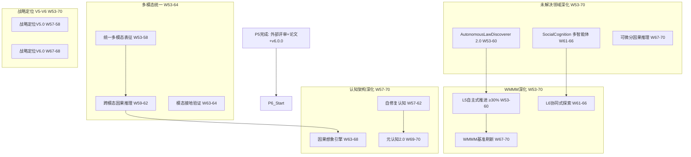

# P6 波次实施计划书 — 高级认知与多模态统一

> **波次代号**: P6 "入化"
> **周期**: Week 53 – Week 70 (共 18 周)
> **优先级**: 中 — 在 P5 完成后启动
> **预算**: 70 人天 + $2,500 硬件/API
> **核心目标**: 自主因果发现 2.0 + 多模态统一 + 社会认知 + WMMM L5→L6

---

## 1. 波次概述

### 1.1 战略定位

P6 是从"外部验证"到"高级进化"的**深化波次**。P5 登顶后系统已通过外部审视，P6 要让系统突破"孤立的因果推理器"定位，向**多模态统一表征**、**多智能体社会认知**和**自主因果发现 2.0** 跃迁。根据依赖关系图：



### 1.2 涉及章节

| 章节 | P6 范围 | 人天 | 来源 |
|---|---|---|---|
| Ch11 未解决领域(深化) | AutonomousLawDiscoverer 2.0 + SocialCognition + 可微分因果 | 30 | §3.1深化, 新增 |
| Ch03 能力四维度(深化) | 多模态统一表征 + 跨模态因果推理 | 18 | §3.2深化 |
| Ch08 WMMM(深化) | L5≥30% + L6探索 + 基准刷新 | 10 | §3.4深化 |
| Ch06 认知架构(深化) | 自修复认知 + 因果想象 + 元认知 2.0 | 10 | §3.5新增 |
| Ch14 战略定位(深化) | V5.0 + V6.0 | 5 | §3.1续 |

> 多章节高度并行，实际并行调整后约 **70 人天**。

### 1.3 前置依赖

- **前置**: P5 全部完成 (W52 门禁通过)，v6.0.0 发布
- **被依赖**: P7 (Ch03→行业SDK, Ch11→自主科学发现, Ch08→L6成熟)

---

## 2. 四阶段实施计划

### Stage 1: W53-W58 — AutonomousLawDiscoverer 2.0 + 多模态统一表征

#### Week 53-55 — AutonomousLawDiscoverer 2.0 + 统一表征核心

| 任务ID | 任务 | 章节 | 负责 | 天数 | 交付物 |
|---|---|---|---|---|---|
| T53.1 | AutonomousLawDiscoverer 2.0: 复杂因果结构 | Ch11 §3.1深化 | 研究工程师A | 5 | `_autonomous_law_discoverer_v2.py` |
| T53.2 | UnifiedModalEncoder 核心架构 | Ch03 §3.2深化 | 工程师B | 5 | `_unified_modal_encoder.py` |
| T53.3 | L5 自主式推进: 高维方程发现 | Ch08 §3.4深化 | 研究工程师A(兼) | 2 | 高维方程基准 |

**T53.1 AutonomousLawDiscoverer 2.0** (Ch11 §3.1深化):
```python
class AutonomousLawDiscovererV2:
    """自主因果发现 2.0 — 从简单方程到复杂因果结构"""
    def __init__(self, sigreg_instance, do_calculus, pc_discovery):
        self._pysr = sigreg_instance
        self._do = do_calculus
        self._pc = pc_discovery
        self._discovered_laws: list[dict] = []
        self._causal_structure: dict = {}
    
    def discover_causal_structure(self, data: np.ndarray, var_names: list[str]):
        """
        增强发现管线 (V1→V2):
          1. PC 算法学习因果骨架 (V2新增)
          2. 符号回归生成每个因果边的方程
          3. 守恒验证 + 因果方向验证
          4. 组合验证: 多方程系统一致性
        """
        # V2新增: 从数据学习因果骨架
        skeleton = self._pc.discover(data, var_names)
        
        # 对每个因果边做符号回归
        for edge in skeleton["edges"]:
            cause_idx = var_names.index(edge["from"])
            effect_idx = var_names.index(edge["to"])
            x = data[:, cause_idx:cause_idx+1]
            y = data[:, effect_idx:effect_idx+1]
            candidates = self._pysr.fit(
                np.hstack([x, y]), 
                var_names=[edge["from"], edge["to"]], 
                n_equations=5
            )
            for eq in candidates:
                if self._verify_conservation(eq, data):
                    self._discovered_laws.append({
                        "edge": edge,
                        "equation": eq.equation,
                        "r_squared": eq.r_squared,
                    })
        
        self._causal_structure = skeleton
        return self._build_system_report()
    
    def _build_system_report(self) -> dict:
        """构建多方程系统一致性报告"""
        return {
            "n_variables": len(self._causal_structure.get("nodes", [])),
            "n_edges": len(self._discovered_laws),
            "conservation_score": self._check_system_conservation(),
            "causal_dag": self._causal_structure,
            "laws": self._discovered_laws,
        }
```

**KPI**: 在 5 变量因果系统上自主发现完整因果结构 + 方程 (≥3 条边)

**T53.2 UnifiedModalEncoder** (Ch03 §3.2深化):
```python
class UnifiedModalEncoder:
    """统一多模态表征 — 视觉+语言+动作共享潜空间"""
    def __init__(self, shared_dim=256, n_modalities=3):
        self._shared_dim = shared_dim
        # 各模态编码器 (P0-P2已有)
        self._visual = LearnableVisualEncoder(output_dim=shared_dim)
        self._textual = TextEncoder(output_dim=shared_dim)  # SBERT
        self._action = ActionEncoder(output_dim=shared_dim)
        # 跨模态对齐投影头
        self._alignment_heads = {
            "visual_text": AlignmentHead(shared_dim),
            "text_action": AlignmentHead(shared_dim),
            "visual_action": AlignmentHead(shared_dim),
        }
    
    def encode(self, observation: dict) -> np.ndarray:
        """统一编码: 多模态观测 → 共享潜向量"""
        vectors = []
        if "image" in observation:
            vectors.append(self._visual.encode(observation["image"]))
        if "text" in observation:
            vectors.append(self._textual.encode(observation["text"]))
        if "action" in observation:
            vectors.append(self._action.encode(observation["action"]))
        # 加权融合
        weights = np.array([1.0 / len(vectors)] * len(vectors))
        return np.average(vectors, axis=0, weights=weights)
    
    def cross_modal_retrieve(self, query_modality, query_data, target_modality, k=5):
        """跨模态检索: 用一种模态查询另一种模态"""
        query_vec = self._encode_single(query_modality, query_data)
        aligned_vec = self._alignment_heads[f"{query_modality}_{target_modality}"].project(query_vec)
        return self._retrieve_from_index(target_modality, aligned_vec, k)
```

**KPI**: 3 种模态共享 256D 潜空间，跨模态检索 top-5 准确率 ≥60%

#### Week 56-58 — LawDiscoverer 验证 + 统一表征训练 + L5 推进

| 任务ID | 任务 | 章节 | 负责 | 天数 | 交付物 |
|---|---|---|---|---|---|
| T56.1 | LawDiscoverer 2.0: 5 变量验证 | Ch11 §3.1深化 | 研究工程师A | 4 | 5 变量因果系统报告 |
| T56.2 | 统一表征对比学习训练 | Ch03 §3.2深化 | 工程师B | 4 | 对比学习脚本 |
| T56.3 | 战略定位 V5.0 | Ch14 §3.1 | Tech Lead | 1 | V5.0 文档 |

**T56.2 统一表征对比学习**:
```python
class CrossModalContrastiveLoss:
    """跨模态对比学习损失 — 统一潜空间"""
    def __init__(self, temperature=0.07):
        self._temperature = temperature
    
    def compute(self, anchor, positive, negatives):
        """InfoNCE: 拉近匹配模态，推远非匹配模态"""
        pos_sim = np.dot(anchor, positive) / self._temperature
        neg_sims = [np.dot(anchor, neg) / self._temperature for neg in negatives]
        logits = np.array([pos_sim] + neg_sims)
        softmax = np.exp(logits) / np.sum(np.exp(logits))
        return -np.log(softmax[0])
```

**KPI**: 跨模态检索 top-5 准确率 ≥65%

#### W53-W58 里程碑

- [ ] M-S1: LawDiscoverer 2.0 在 5 变量因果系统上发现完整结构
- [ ] M-S1: UnifiedModalEncoder 3 模态共享 256D 潜空间
- [ ] M-S1: 跨模态检索 top-5 准确率 ≥65%
- [ ] M-S1: L5 自主式得分 ≥30%
- [ ] M-S1: 战略定位 V5.0 发布

---

### Stage 2: W59-W64 — 跨模态因果推理 + 社会认知 + 自修复

#### Week 59-62 — 跨模态因果推理 + SocialCognition 核心

| 任务ID | 任务 | 章节 | 负责 | 天数 | 交付物 |
|---|---|---|---|---|---|
| T59.1 | CrossModalCausalReasoner | Ch03 §3.2深化 | 工程师B | 5 | `_cross_modal_causal.py` |
| T59.2 | SocialCognition 多智能体核心 | Ch11 新增 | 研究工程师A | 5 | `_social_cognition.py` |
| T59.3 | 自修复认知核心 | Ch06 §3.5新增 | 工程师B(兼) | 3 | `_self_repair_cognition.py` |

**T59.1 CrossModalCausalReasoner** (Ch03 §3.2深化):
```python
class CrossModalCausalReasoner:
    """跨模态因果推理 — 在统一潜空间中做因果推断"""
    def __init__(self, unified_encoder, do_calculus):
        self._encoder = unified_encoder
        self._do = do_calculus
    
    def reason_cross_modal(self, observation: dict, query: str) -> dict:
        """
        跨模态因果推理流程:
          1. 多模态观测 → 统一潜向量
          2. 潜空间中定位因果图节点
          3. DoCalculus 因果推断
          4. 结果投射回目标模态
        """
        z = self._encoder.encode(observation)
        causal_query = self._parse_cross_modal_query(query, observation)
        result = self._do.estimate_ate(
            causal_query["cause"], causal_query["effect"],
            x_value=causal_query.get("x_value")
        )
        return {
            "cause_modality": causal_query["cause_modality"],
            "effect_modality": causal_query["effect_modality"],
            "ate": result.ate,
            "confidence": result.confidence,
            "latent_representation": z,
        }
```

**KPI**: 20 个跨模态因果查询准确率 ≥70%

**T59.2 SocialCognition** (Ch11 新增):
```python
class SocialCognition:
    """多智能体社会认知 — 博弈论 + 心智理论"""
    def __init__(self, n_agents=3, theory_of_mind_depth=2):
        self._n_agents = n_agents
        self._tom_depth = theory_of_mind_depth
        self._agent_models: dict[int, AgentModel] = {}
    
    def observe_interaction(self, agent_id: int, action: str, outcome: dict):
        """观察其他智能体的行为"""
        if agent_id not in self._agent_models:
            self._agent_models[agent_id] = AgentModel(agent_id)
        self._agent_models[agent_id].update(action, outcome)
    
    def predict_others(self, context: dict) -> dict:
        """心智理论: 预测其他智能体的行为"""
        predictions = {}
        for aid, model in self._agent_models.items():
            predictions[aid] = model.predict_action(context)
        return predictions
    
    def nash_equilibrium(self, payoff_matrix: np.ndarray) -> dict:
        """博弈论: 计算纳什均衡"""
        # 简化版: 2x2 矩阵博弈
        return self._solve_2x2_nash(payoff_matrix)
    
    def negotiate(self, my_preferences: dict, others_predicted: dict) -> dict:
        """社会协商: 基于心智理论的决策"""
        # 找到 Pareto 最优解
        return self._pareto_optimize(my_preferences, others_predicted)


class AgentModel:
    """其他智能体的内部模型"""
    def __init__(self, agent_id: int):
        self._agent_id = agent_id
        self._action_history: list[str] = []
        self._preference_model = {}
    
    def update(self, action: str, outcome: dict):
        self._action_history.append(action)
        # 更新偏好模型
        self._update_preferences(action, outcome)
    
    def predict_action(self, context: dict) -> str:
        """基于历史行为预测下一步"""
        return self._most_likely_action(context)
```

**KPI**: 在 3 智能体博弈中正确预测其他智能体行为 ≥60%

#### Week 63-64 — 模态接地验证 + 自修复认知 + L6 探索

| 任务ID | 任务 | 章节 | 负责 | 天数 | 交付物 |
|---|---|---|---|---|---|
| T63.1 | 模态接地验证基准 | Ch03 §3.2深化 | 工程师B | 3 | 接地基准数据 |
| T63.2 | 自修复认知: 异常检测+修复 | Ch06 §3.5新增 | 工程师B(兼) | 3 | 修复循环测试 |
| T63.3 | L6 协同式探索启动 | Ch08 §3.4深化 | 研究工程师A | 2 | L6 概念验证 |

**T63.2 自修复认知** (Ch06 §3.5新增):
```python
class SelfRepairCognition:
    """自修复认知 — 检测并修复推理链断裂"""
    def __init__(self, world_model, meta_diagnoser):
        self._wm = world_model
        self._diagnoser = meta_diagnoser
        self._repair_history: list[dict] = []
    
    def detect_anomaly(self, prediction, actual) -> dict:
        """检测推理异常"""
        error = np.linalg.norm(prediction - actual)
        if error > self._anomaly_threshold:
            diagnosis = self._diagnoser.diagnose(prediction, actual)
            return {"is_anomaly": True, "error": error, "diagnosis": diagnosis}
        return {"is_anomaly": False}
    
    def repair(self, anomaly_report: dict) -> dict:
        """自修复: 根据诊断调整推理链"""
        diagnosis = anomaly_report["diagnosis"]
        repair_action = self._select_repair_action(diagnosis)
        self._apply_repair(repair_action)
        self._repair_history.append({
            "anomaly": anomaly_report,
            "repair": repair_action,
            "timestamp": time.time(),
        })
        return {"repaired": True, "action": repair_action}
    
    def _select_repair_action(self, diagnosis) -> str:
        """选择修复策略"""
        if diagnosis["layer"] == "perception":
            return "recalibrate_encoder"
        elif diagnosis["layer"] == "prediction":
            return "increase_prediction_steps"
        elif diagnosis["layer"] == "causal":
            return "relearn_causal_structure"
        return "fallback_to_safe_state"
```

**KPI**: 10 次推理异常中 ≥7 次自修复成功

#### W59-W64 里程碑

- [ ] M-S2: 跨模态因果推理 20 题准确率 ≥70%
- [ ] M-S2: SocialCognition 3 智能体博弈预测 ≥60%
- [ ] M-S2: 自修复认知 10 次异常 ≥7 次修复
- [ ] M-S2: 模态接地验证基准通过
- [ ] M-S2: L6 协同式探索概念验证启动

---

### Stage 3: W65-W68 — 可微分因果推理 + 因果想象引擎

#### Week 65-68 — 可微分因果 + 因果想象 + L6 验证

| 任务ID | 任务 | 章节 | 负责 | 天数 | 交付物 |
|---|---|---|---|---|---|
| T65.1 | DifferentiableCausalInference | Ch11 新增 | 研究工程师A | 5 | `_differentiable_causal.py` |
| T65.2 | CausalImaginationEngine | Ch06 §3.5新增 | 工程师B | 5 | `_causal_imagination.py` |
| T65.3 | L6 协同式验证 | Ch08 §3.4深化 | 研究工程师A(兼) | 3 | L6 基准 |

**T65.1 DifferentiableCausalInference** (Ch11 新增):
```python
class DifferentiableCausalInference:
    """可微分因果推理 — 神经符号融合 2.0 前置"""
    def __init__(self, causal_graph, n_intervention_samples=1000):
        self._graph = causal_graph
        self._n_samples = n_intervention_samples
    
    def differentiable_ate(self, X: str, Y: str, x_value: float) -> dict:
        """
        可微分 ATE 估计:
          1. 用 do-calculus 图结构约束
          2. 用神经网络参数化条件分布 P(Y|do(X=x))
          3. 梯度可回传 → 端到端学习因果参数
        """
        # 干预采样
        intervened = self._sample_intervention(X, x_value)
        # 观测采样
        observed = self._sample_observational(X, x_value)
        # ATE = E[Y|do(X=x)] - E[Y|X=x]
        ate = np.mean(intervened) - np.mean(observed)
        # 梯度信息 (可微分)
        ate_gradient = self._compute_ate_gradient(X, Y, x_value)
        return {
            "ate": ate,
            "gradient": ate_gradient,
            "intervention_mean": np.mean(intervened),
            "observational_mean": np.mean(observed),
        }
    
    def _compute_ate_gradient(self, X, Y, x_value):
        """计算 ATE 对模型参数的梯度 (简化版)"""
        # 数值梯度近似
        eps = 1e-4
        ate_plus = self._ate_at(x_value + eps)
        ate_minus = self._ate_at(x_value - eps)
        return (ate_plus - ate_minus) / (2 * eps)
```

**KPI**: 可微分 ATE 估计与符号 ATE 误差 <10%

**T65.2 CausalImaginationEngine** (Ch06 §3.5新增):
```python
class CausalImaginationEngine:
    """因果想象引擎 — 在潜空间中模拟反事实场景"""
    def __init__(self, unified_encoder, do_calculus, counterfactual_engine):
        self._encoder = unified_encoder
        self._do = do_calculus
        self._cf = counterfactual_engine
    
    def imagine(self, factual: dict, intervention: dict, n_scenarios: int = 5) -> list[dict]:
        """
        因果想象: 生成多种可能的反事实场景
          1. 编码事实观测 → 潜空间 z_factual
          2. 施加干预 → 潜空间 z_counterfactual
          3. 解码反事实场景 → 多种可能结果
        """
        z_factual = self._encoder.encode(factual)
        scenarios = []
        for i in range(n_scenarios):
            z_cf = self._apply_intervention_in_latent(z_factual, intervention, seed=i)
            imagined = self._encoder.decode(z_cf)
            scenarios.append({
                "scenario_id": i,
                "intervention": intervention,
                "imagined_outcome": imagined,
                "plausibility": self._estimate_plausibility(z_factual, z_cf),
            })
        return sorted(scenarios, key=lambda s: -s["plausibility"])
    
    def imagine_causal_chain(self, initial_state, interventions: list[dict]) -> list[dict]:
        """因果链想象: 多步干预的时间展开"""
        chain = []
        state = initial_state
        for step, intervention in enumerate(interventions):
            scenarios = self.imagine(state, intervention, n_scenarios=3)
            best = scenarios[0]  # 取最合理的场景
            chain.append(best)
            state = best["imagined_outcome"]
        return chain
```

**KPI**: 10 个反事实想象中 ≥7 个结果合理 (与符号推理一致)

#### W65-W68 里程碑

- [ ] M-S3: 可微分 ATE 与符号 ATE 误差 <10%
- [ ] M-S3: 因果想象引擎 10 题中 ≥7 题合理
- [ ] M-S3: L6 协同式概念验证通过

---

### Stage 4: W69-W70 — 元认知 2.0 + WMMM 基准刷新 + P6 门禁

#### Week 69-70 — 元认知 2.0 + WMMM 基准 + 全量回归

| 任务ID | 任务 | 章节 | 负责 | 天数 | 交付物 |
|---|---|---|---|---|---|
| T69.1 | Metacognition 2.0: 自适应推理策略 | Ch06 §3.5深化 | 研究工程师A | 3 | `_metacognition_v2.py` |
| T69.2 | WMMM 基准刷新 (L0-L6) | Ch08 §3.4深化 | 工程师B | 3 | 更新基准报告 |
| T69.3 | 战略定位 V6.0 | Ch14 §3.1 | Tech Lead | 1 | V6.0 文档 |
| T70.1 | P6 门禁检查 + 全量回归 | Ch12 | Tech Lead | 3 | 门禁报告 |

**T69.1 Metacognition 2.0**:
```python
class MetacognitionV2:
    """元认知 2.0 — 自适应推理策略选择"""
    def __init__(self):
        self._strategies = {
            "fast": FastIntuitiveStrategy(),     # 快系统
            "slow": SlowDeliberateStrategy(),   # 慢系统
            "repair": SelfRepairStrategy(),      # 修复策略
        }
        self._strategy_stats: dict[str, dict] = {}
    
    def select_strategy(self, query: dict) -> str:
        """根据查询特征选择推理策略"""
        complexity = self._estimate_complexity(query)
        if complexity < 0.3:
            return "fast"   # 简单因果: 快直觉
        elif complexity < 0.7:
            return "slow"   # 复杂因果: 慢审慎
        else:
            return "repair" # 可能出错: 自修复模式
    
    def reflect_on_outcome(self, strategy: str, outcome: dict):
        """反思推理结果，更新策略偏好"""
        success = outcome.get("accuracy", 0) > 0.7
        if strategy not in self._strategy_stats:
            self._strategy_stats[strategy] = {"success": 0, "total": 0}
        self._strategy_stats[strategy]["total"] += 1
        if success:
            self._strategy_stats[strategy]["success"] += 1
```

**KPI**: 快慢系统切换准确率 ≥80%

#### W69-W70 里程碑

- [ ] M-S4: 元认知 2.0 快慢系统切换准确率 ≥80%
- [ ] M-S4: WMMM L5 ≥30%, L6 探索启动
- [ ] M-S4: 战略定位 V6.0 发布
- [ ] M-S4: pytest ≥3100 passed, 0 failed
- [ ] M-S4: P6 门禁通过

---

## 3. 资源配置

### 3.1 人员配置

| 资源 | 角色 | 主要任务 | 人天 |
|---|---|---|---|
| 研究工程师 A | 因果发现2.0 + 社会认知 + 可微分因果 | Ch11/Ch08 | 30 |
| 工程师 B | 多模态统一 + 跨模态推理 + 自修复 | Ch03/Ch06 | 25 |
| Tech Lead | 战略定位 + 门禁 | Ch14/Ch12 | 10 |
| 领域专家 (多模态验证) | 0.3人 × 8周 | 5 人天 | |
| **合计** | | | **70** |

### 3.2 硬件/软件

| 资源 | 数量 | 成本 | 说明 |
|---|---|---|---|
| GPU (LawDiscoverer 2.0 + 多模态训练) | 按需 | $1,500 | cloud GPU 50h |
| 多模态数据集 (COCO+ConceptNet) | 开源 | $0 | 公开数据 |
| 博弈论仿真环境 | 自建 | $0 | Python 实现 |
| LLM API (跨模态验证) | 按需 | $500 | 评估用途 |
| 领域专家审核 | 0.3人×8周 | $500 | 多模态+因果审核 |
| **合计** | | **$2,500** | |

### 3.3 并行度规划

| 周 | 研究工程师A | 工程师B | Tech Lead |
|---|---|---|---|
| W53-55 | LawDiscoverer 2.0 | UnifiedModalEncoder | — |
| W56-58 | LawDiscoverer 验证 + L5 | 对比学习训练 | 战略V5 |
| W59-62 | SocialCognition | 跨模态因果 + 自修复 | — |
| W63-64 | L6探索 | 模态接地 + 自修复验证 | — |
| W65-68 | 可微分因果 + L6验证 | 因果想象引擎 | — |
| W69-70 | 元认知2.0 | WMMM基准刷新 | V6.0+门禁 |

---

## 4. KPI 指标体系

### 4.1 自主发现 KPI

| 维度 | P5 基线 | P6 目标 | 度量 |
|---|---|---|---|
| 因果发现系统数 | 2 (Pendulum+Spring) | ≥3 (含5变量系统) | LawDiscovererV2 |
| 因果结构发现 | 单方程 | 完整DAG+方程 | 结构准确率 |
| 发现方程 R² | ≥0.90 | ≥0.85 (复杂系统) | 拟合度 |
| 可微分 ATE 误差 | N/A | <10% vs 符号ATE | 对比测试 |

### 4.2 多模态 KPI

| 维度 | P5 基线 | P6 目标 | 度量 |
|---|---|---|---|
| 统一潜空间维度 | 独立编码 | 256D 共享 | UnifiedModalEncoder |
| 跨模态检索 top-5 | N/A | ≥65% | 对比学习基准 |
| 跨模态因果推理 | N/A | ≥70% 准确率 | 20 题基准 |
| 模态接地验证 | N/A | 通过 | 接地基准 |

### 4.3 社会认知 KPI

| 维度 | 基线 | P6 目标 | 度量 |
|---|---|---|---|
| 多智能体预测 | N/A | ≥60% | 3 智能体博弈 |
| 纳什均衡计算 | N/A | 2x2 矩阵正确 | 博弈论基准 |
| 自修复成功率 | N/A | ≥70% | 10 次异常修复 |

### 4.4 WMMM 成熟度 KPI

| 层级 | P5 基线 | P6 目标 | 度量 |
|---|---|---|---|
| L5 自主式 | ≥25% | ≥30% | LawDiscovererV2 |
| L6 协同式 | 0% | ≥10% | SocialCognition概念验证 |
| **WMMM 综合** | **≥76%** | **≥80%** | WMMM 基准套件 |

---

## 5. 风险评估

| 风险ID | 风险描述 | 概率 | 影响 | 缓解措施 | 应急方案 |
|---|---|---|---|---|---|
| R1 | LawDiscoverer 2.0 高维失败 | 高 | 中 | 限制变量 ≤10 | 退回 V1 仅做方程发现 |
| R2 | 多模态统一表征训练不收敛 | 中 | 高 | 渐进式对齐 (先2模态→3模态) | 保留独立编码器 |
| R3 | SocialCognition 博弈策略过于简化 | 高 | 低 | 定位为研究原型 | 标注局限性 |
| R4 | 可微分因果推理梯度不稳定 | 中 | 中 | 梯度裁剪 + 学习率 warmup | 退回符号推理 |
| R5 | 因果想象引擎结果不合理 | 中 | 中 | 增加守恒约束 + 因果图验证 | 仅做单步反事实 |
| R6 | 18 周时间不够 | 中 | 高 | 社会认知可压缩到 P7 | 元认知2.0推迟到P7 |
| R7 | GPU 成本超预算 | 中 | 中 | 减少训练 epoch + 混合精度 | 缩小模型规模 |

### 风险热力图

```
影响
高  │ R2     R6
    │
中  │ R1 R4 R5 R7
    │
低  │ R3
    └─────────────────────
       低    中    高    概率
```

---

## 6. 成本预算

| 项目 | 人天 | 硬件/软件 | 说明 |
|---|---|---|---|
| AutonomousLawDiscoverer 2.0 | 12 | $500 (GPU) | Ch11 §3.1深化 |
| SocialCognition | 10 | $0 | Ch11 新增 |
| 可微分因果推理 | 8 | $500 (GPU) | Ch11 新增 |
| 统一多模态表征 | 10 | $500 (GPU) | Ch03 §3.2深化 |
| 跨模态因果推理 | 8 | $0 | Ch03 §3.2深化 |
| 自修复认知 | 5 | $0 | Ch06 §3.5新增 |
| 因果想象引擎 | 5 | $0 | Ch06 §3.5新增 |
| 元认知 2.0 | 3 | $0 | Ch06 §3.5深化 |
| L5/L6 + WMMM 基准 | 5 | $0 | Ch08 §3.4深化 |
| 战略定位 V5-V6 | 4 | $500 (API+专家) | Ch14 |
| **合计** | **~70** | **$2,500** | |

---

## 7. 验收标准

### 7.1 P6 门禁 (W70 结束时必须全部通过)

**自主发现验收**:
- [ ] LawDiscoverer 2.0: 5 变量因果系统完整结构发现
- [ ] 可微分 ATE 误差 <10% vs 符号推理
- [ ] SocialCognition: 3 智能体博弈预测 ≥60%

**多模态验收**:
- [ ] UnifiedModalEncoder: 3 模态共享 256D 潜空间
- [ ] 跨模态检索 top-5 ≥65%
- [ ] 跨模态因果推理 20 题准确率 ≥70%

**认知深化验收**:
- [ ] 自修复认知: 10 次异常 ≥7 次修复
- [ ] 因果想象引擎: 10 题中 ≥7 题合理
- [ ] 元认知 2.0: 快慢系统切换准确率 ≥80%

**WMMM 验收**:
- [ ] L5 ≥30%, L6 探索启动
- [ ] WMMM 综合 ≥80%

**系统健康验收**:
- [ ] `pytest` ≥3100 passed, 0 failed
- [ ] `ruff check .` 全部通过
- [ ] v7.0.0-alpha 发布

### 7.2 P6→P7 门禁检查

| 门禁项 | 检查方法 | 通过标准 |
|---|---|---|
| 自主发现 2.0 可用 | LawDiscovererV2 基准 | ≥3 因果系统 |
| 多模态统一 | UnifiedModalEncoder 测试 | 跨模态检索 ≥65% |
| 社会认知原型 | SocialCognition 博弈 | 预测 ≥60% |
| WMMM 成熟度 | WMMM 基准套件 | ≥80% |
| 测试稳定性 | 连续 3 次 pytest | ≥3100 passed, 0 failed |

### 7.3 交付物清单 (新增文件)

| # | 文件/目录 | 类型 | 行数估计 |
|---|---|---|---|
| 1 | `_autonomous_law_discoverer_v2.py` | 新建 | ~500 |
| 2 | `_unified_modal_encoder.py` | 新建 | ~400 |
| 3 | `_cross_modal_causal.py` | 新建 | ~350 |
| 4 | `_social_cognition.py` | 新建 | ~400 |
| 5 | `_differentiable_causal.py` | 新建 | ~300 |
| 6 | `_causal_imagination.py` | 新建 | ~300 |
| 7 | `_self_repair_cognition.py` | 新建 | ~250 |
| 8 | `_metacognition_v2.py` | 新建 | ~200 |
| 9 | 测试文件 (~8个) | 新建 | ~1200 |
| 10 | 多模态基准数据 | 新建 | ~300 |
| | **合计** | | **~4,200 行** |

---

## 8. 跨波次衔接

### 8.1 P6 完成后 P7 可立即启动的任务

| P7 任务 | 前置 P6 完成 | 启动条件 |
|---|---|---|
| Ch09 深化: 行业 SDK | 多模态统一 + 领域验证 | 统一表征可用 |
| Ch07 深化: 实时部署优化 | 可微分因果推理 | 推理管线稳定 |
| Ch11: 自主科学发现 | LawDiscoverer 2.0 | 高维因果发现可用 |
| Ch14: 生态建设 | 社会认知 + 战略V6 | 多智能体基础 |

### 8.2 P6 遗留到 P7 的任务

| 任务 | 计划在 P7 执行 | 章节 |
|---|---|---|
| 行业 SDK (医疗/法律/工程) | Ch09 深化 | Ch09 |
| 实时部署优化 + 边缘云混合 | Ch07 深化 | Ch07 |
| 监管合规框架 | Ch12 新增 | Ch12 |
| 生态建设 (开源社区+插件) | Ch14 新增 | Ch14 |
| 自主科学发现管线 | Ch11 深化 | Ch11 |

---

> **P6 铁律**: 不进化到多模态+多智能体，就永远只是单机工具！从"因果推理器"到"认知生态系统"，这是生命力的跃迁！
>
> **前路虽难，但路就在脚下！**
