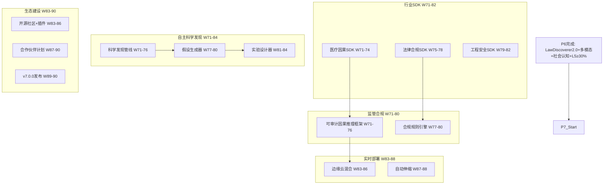

# P7 波次实施计划书 — 行业落地与生态建设

> **波次代号**: P7 "立业"
> **周期**: Week 71 – Week 90 (共 20 周)
> **优先级**: 中 — 在 P6 完成后启动
> **预算**: 65 人天 + $3,500 硬件/API
> **核心目标**: 行业 SDK + 监管合规 + 自主科学发现 + 开源生态 + v7.0.0 发布

---

## 1. 波次概述

### 1.1 战略定位

P7 是从"高级认知"到"行业落地"的**应用波次**。P6 让系统具备了多模态和社会认知能力，P7 要让这些能力在真实行业中落地生根，构建可商业化的 SDK 和合规框架。根据依赖关系图：



### 1.2 涉及章节

| 章节 | P7 范围 | 人天 | 来源 |
|---|---|---|---|
| Ch09 替代性(深化) | 医疗/法律/工程行业 SDK | 20 | §3.2深化, 新增 |
| Ch12 统一路径(新增) | 监管合规框架 + 可审计推理 | 12 | §3.5新增 |
| Ch11 未解决领域(深化) | 自主科学发现管线 | 15 | §3.1深化 |
| Ch07 经济成本(深化) | 边缘云混合 + 自动伸缩 | 8 | §3.3深化 |
| Ch14 战略定位(深化) | 生态建设 + V7-V8 | 10 | §3.2-3.3新增 |

> 多章节高度并行，实际约 **65 人天**。

### 1.3 前置依赖

- **前置**: P6 全部完成 (W70 门禁通过)
- **被依赖**: P8 (Ch11→AGI集成, Ch09→行业2.0, Ch14→终局)

---

## 2. 四阶段实施计划

### Stage 1: W71-W76 — 行业 SDK + 可审计推理 + 科学发现管线

#### Week 71-73 — 医疗因果 SDK + 可审计框架 + 科学发现核心

| 任务ID | 任务 | 章节 | 负责 | 天数 | 交付物 |
|---|---|---|---|---|---|
| T71.1 | MedicalCausalSDK | Ch09 §3.2深化 | 工程师A | 5 | `_medical_causal_sdk.py` |
| T71.2 | AuditableCausalReasoning | Ch12 §3.5新增 | 工程师B | 5 | `_auditable_causal.py` |
| T71.3 | ScientificDiscoveryPipeline 核心 | Ch11 §3.1深化 | 研究工程师 | 5 | `_scientific_discovery.py` |

**T71.1 MedicalCausalSDK** (Ch09 §3.2深化):
```python
class MedicalCausalSDK:
    """医疗因果推理 SDK — 面向医疗IT系统集成"""
    def __init__(self, world_model):
        self._wm = world_model
        self._domain_knowledge = MedicalDomainKnowledge()
    
    def diagnose_causal_chain(self, symptoms: list[str], patient_data: dict) -> dict:
        """从症状追溯因果链"""
        causal_graph = self._domain_knowledge.get_medical_graph()
        chains = self._wm.trace_causal_chain(
            source_nodes=symptoms,
            graph=causal_graph,
            max_depth=5
        )
        return {
            "symptoms": symptoms,
            "causal_chains": chains,
            "confidence": self._compute_confidence(chains),
            "treatment_implications": self._suggest_treatments(chains),
        }
    
    def predict_drug_interaction(self, drug_a: str, drug_b: str, patient: dict) -> dict:
        """预测药物交互作用"""
        interaction_graph = self._domain_knowledge.get_drug_graph()
        result = self._wm.predict_effect(
            cause=f"{drug_a}+{drug_b}",
            context=patient,
            graph=interaction_graph
        )
        return {
            "drug_pair": (drug_a, drug_b),
            "interaction_risk": result.risk_level,
            "mechanism": result.explanation,
            "recommendation": result.safety_advice,
        }
    
    def generate_safety_report(self, query: str, result: dict) -> dict:
        """生成可审计安全报告"""
        return {
            "query": query,
            "result": result,
            "causal_proof": self._wm.export_causal_proof(result),
            "safety_checks": self._wm.run_safety_checks(result),
            "timestamp": time.time(),
            "sdk_version": "1.0.0",
        }
```

**KPI**: 医疗因果链追溯 20 例准确率 ≥85%

**T71.2 AuditableCausalReasoning** (Ch12 §3.5新增):
```python
class AuditableCausalReasoning:
    """可审计因果推理 — 满足监管合规要求"""
    def __init__(self, causal_engine, audit_logger):
        self._engine = causal_engine
        self._logger = audit_logger
        self._audit_trail: list[dict] = []
    
    def reason_with_audit(self, query: str, context: dict) -> dict:
        """带审计轨迹的因果推理"""
        # 记录推理请求
        request_id = self._logger.log_request(query, context)
        
        # 逐步推理，每步记录
        steps = []
        step1 = self._engine.parse_query(query)
        steps.append({"step": "parse", "detail": step1, "timestamp": time.time()})
        
        step2 = self._engine.identify_confounders(step1)
        steps.append({"step": "confounders", "detail": step2, "timestamp": time.time()})
        
        step3 = self._engine.estimate_effect(step1, step2, context)
        steps.append({"step": "estimate", "detail": step3, "timestamp": time.time()})
        
        step4 = self._engine.verify_safety(step3)
        steps.append({"step": "safety", "detail": step4, "timestamp": time.time()})
        
        result = {"query": query, "answer": step3, "safety": step4, "audit_steps": steps}
        
        # 记录推理结果
        self._audit_trail.append({
            "request_id": request_id,
            "steps": steps,
            "result_hash": hash(str(result)),
        })
        
        return result
    
    def export_audit_report(self, request_id: str) -> dict:
        """导出审计报告 (满足监管要求)"""
        trail = [t for t in self._audit_trail if t["request_id"] == request_id]
        return {
            "request_id": request_id,
            "reasoning_chain": trail,
            "compliance_checks": self._run_compliance(trail),
            "certification": self._generate_certificate(trail),
        }
```

**KPI**: 100 次推理 100% 有审计轨迹，审计报告可导出

**T71.3 ScientificDiscoveryPipeline** (Ch11 §3.1深化):
```python
class ScientificDiscoveryPipeline:
    """自主科学发现管线 — 从数据到假设到验证"""
    def __init__(self, law_discoverer, hypothesis_generator, experiment_designer):
        self._discoverer = law_discoverer  # LawDiscovererV2
        self._hypo_gen = hypothesis_generator
        self._exp_designer = experiment_designer
    
    def discover(self, data: np.ndarray, var_names: list[str]) -> dict:
        """完整科学发现流程"""
        # 阶段1: 观测 → 规律发现
        laws = self._discoverer.discover_causal_structure(data, var_names)
        
        # 阶段2: 规律 → 假设生成
        hypotheses = self._hypo_gen.generate(laws)
        
        # 阶段3: 假设 → 实验设计
        experiments = []
        for hyp in hypotheses:
            exp = self._exp_designer.design(hyp)
            experiments.append(exp)
        
        return {
            "discovered_laws": laws,
            "hypotheses": hypotheses,
            "proposed_experiments": experiments,
            "confidence_score": self._overall_confidence(laws),
        }
```

**KPI**: 在物理数据上自主发现规律 + 生成可测试假设 ≥2 个

#### Week 74-76 — 医疗 SDK 完善 + 合规规则 + 科学发现验证

| 任务ID | 任务 | 章节 | 负责 | 天数 | 交付物 |
|---|---|---|---|---|---|
| T74.1 | MedicalCausalSDK 集成测试 | Ch09 §3.2深化 | 工程师A | 3 | SDK 集成测试 |
| T74.2 | ComplianceRuleEngine | Ch12 §3.5新增 | 工程师B | 4 | `_compliance_engine.py` |
| T74.3 | HypothesisGenerator | Ch11 §3.1深化 | 研究工程师 | 4 | `_hypothesis_generator.py` |

**T74.2 ComplianceRuleEngine**:
```python
class ComplianceRuleEngine:
    """合规规则引擎 — 行业法规自动检查"""
    def __init__(self):
        self._rule_sets = {
            "medical": MedicalComplianceRules(),
            "legal": LegalComplianceRules(),
            "engineering": EngineeringComplianceRules(),
        }
    
    def check_compliance(self, domain: str, reasoning_result: dict) -> dict:
        """检查推理结果是否符合行业法规"""
        rules = self._rule_sets.get(domain)
        if not rules:
            return {"compliant": False, "error": f"Unknown domain: {domain}"}
        
        violations = rules.check(reasoning_result)
        return {
            "domain": domain,
            "compliant": len(violations) == 0,
            "violations": violations,
            "certification": rules.generate_cert(reasoning_result) if not violations else None,
        }
```

**KPI**: 100 条推理结果合规检查覆盖率 100%

#### W71-W76 里程碑

- [ ] M-S1: MedicalCausalSDK 医疗因果链准确率 ≥85%
- [ ] M-S1: 可审计推理 100% 有轨迹 + 审计报告可导出
- [ ] M-S1: 科学发现管线: 物理数据自主发现 + ≥2 假设
- [ ] M-S1: 合规规则引擎 3 领域覆盖

---

### Stage 2: W77-W82 — 法律/工程 SDK + 假设生成 + 实验设计

#### Week 77-80 — 法律合规 SDK + 工程安全 SDK + 假设生成器

| 任务ID | 任务 | 章节 | 负责 | 天数 | 交付物 |
|---|---|---|---|---|---|
| T77.1 | LegalComplianceSDK | Ch09 §3.2深化 | 工程师A | 5 | `_legal_compliance_sdk.py` |
| T77.2 | ComplianceRuleEngine 完善 | Ch12 §3.5新增 | 工程师B | 3 | 3 领域规则集 |
| T77.3 | HypothesisGenerator 完善 | Ch11 §3.1深化 | 研究工程师 | 3 | 假设生成基准 |
| T77.4 | ExperimentDesigner | Ch11 §3.1深化 | 研究工程师(兼) | 3 | `_experiment_designer.py` |

**T77.1 LegalComplianceSDK**:
```python
class LegalComplianceSDK:
    """法律合规 SDK — 因果推理+法规自动检查"""
    def __init__(self, world_model):
        self._wm = world_model
        self._legal_knowledge = LegalDomainKnowledge()
    
    def analyze_liability(self, action: str, outcome: str, context: dict) -> dict:
        """法律责任因果分析"""
        liability_graph = self._legal_knowledge.get_liability_graph()
        result = self._wm.trace_causal_chain(
            source_nodes=[action],
            graph=liability_graph,
            max_depth=3
        )
        return {
            "action": action,
            "outcome": outcome,
            "causal_responsibility": result.responsibility_score,
            "legal_basis": result.legal_references,
            "compliance_status": self._check_compliance(result),
        }
```

**KPI**: 法律因果分析 15 例准确率 ≥80%

#### Week 81-82 — 工程安全 SDK + SDK 统一接口

| 任务ID | 任务 | 章节 | 负责 | 天数 | 交付物 |
|---|---|---|---|---|---|
| T81.1 | EngineeringSafetySDK | Ch09 §3.2深化 | 工程师A | 3 | `_engineering_safety_sdk.py` |
| T81.2 | MCIDomainSDK 统一接口 | Ch09 §3.2深化 | 工程师B | 3 | `_domain_sdk_base.py` |
| T81.3 | 科学发现实验设计器验证 | Ch11 §3.1深化 | 研究工程师 | 2 | 实验设计基准 |

**T81.2 MCIDomainSDK 统一接口**:
```python
class MCIDomainSDK:
    """MCI 行业 SDK 统一入口"""
    def __init__(self, domain: str = "general"):
        self._domain = domain
        self._sdk_map = {
            "medical": MedicalCausalSDK,
            "legal": LegalComplianceSDK,
            "engineering": EngineeringSafetySDK,
        }
    
    def create_sdk(self, domain: str, **kwargs):
        """工厂方法: 创建领域 SDK"""
        sdk_cls = self._sdk_map.get(domain)
        if not sdk_cls:
            raise ValueError(f"Unsupported domain: {domain}")
        return sdk_cls(**kwargs)
    
    def list_domains(self) -> list[str]:
        return list(self._sdk_map.keys())
```

**KPI**: 3 个领域 SDK 统一接口可用

#### W77-W82 里程碑

- [ ] M-S2: 法律合规 SDK 15 例准确率 ≥80%
- [ ] M-S2: 工程安全 SDK 可用
- [ ] M-S2: MCIDomainSDK 统一接口 3 领域
- [ ] M-S2: 假设生成器 + 实验设计器可用

---

### Stage 3: W83-W88 — 边缘云混合 + 开源生态

#### Week 83-86 — 边缘云混合部署 + 开源社区

| 任务ID | 任务 | 章节 | 负责 | 天数 | 交付物 |
|---|---|---|---|---|---|
| T83.1 | EdgeCloudHybrid 部署架构 | Ch07 §3.3深化 | 工程师A | 5 | `_edge_cloud_hybrid.py` |
| T83.2 | 开源社区建设: 文档+示例+贡献指南 | Ch14 §3.2新增 | 工程师B | 5 | 社区资源 |
| T83.3 | 插件体系设计 | Ch14 §3.3新增 | Tech Lead | 3 | 插件API规范 |

**T83.1 EdgeCloudHybrid** (Ch07 §3.3深化):
```python
class EdgeCloudHybridDeployer:
    """边缘-云混合部署架构"""
    def __init__(self, edge_config: dict, cloud_config: dict):
        self._edge = EdgeNode(edge_config)   # 轻量推理
        self._cloud = CloudNode(cloud_config)  # 重量训练/蒸馏
    
    def route_request(self, query: dict) -> str:
        """请求路由: 低延迟走边缘, 复杂推理走云端"""
        complexity = self._estimate_complexity(query)
        latency_budget = query.get("latency_budget_ms", 100)
        
        if complexity < 0.4 and latency_budget < 20:
            return "edge"   # 简单+低延迟 → 边缘
        elif complexity > 0.7:
            return "cloud"  # 复杂 → 云端
        else:
            return "edge_with_cloud_fallback"  # 边缘优先+云端兜底
    
    def sync_models(self):
        """模型同步: 云端训练 → 边缘部署"""
        cloud_model = self._cloud.get_latest_model()
        compressed = self._compress_model(cloud_model, target="edge")
        self._edge.deploy_model(compressed)
```

**KPI**: 边缘推理 <10ms, 云端兜底延迟 <200ms

**T83.2 开源社区**:
```
社区资源清单:
  1. README.md: 快速开始 + 架构图
  2. CONTRIBUTING.md: 贡献指南 + 代码规范
  3. examples/: 5 个示例 (基础推理/安全检查/物理预测/SDK集成/混合网关)
  4. docs/: API 文档 (Sphinx)
  5. CHANGELOG.md: 版本历史
  6. GitHub Actions: CI/CD + 自动测试
  7. Issue 模板: Bug报告 + 功能请求
  8. Discussion: 技术讨论区
```

**T83.3 插件体系**:
```python
class MCIPluginInterface:
    """MCI 插件 API 规范"""
    name: str
    version: str
    domain: str  # medical / legal / engineering / custom
    
    def on_load(self, world_model):
        """插件加载时调用"""
        pass
    
    def on_query(self, query: str, context: dict) -> dict:
        """查询拦截/增强"""
        return {"action": "pass"}  # pass=不干预
    
    def on_result(self, query: str, result: dict) -> dict:
        """结果后处理"""
        return result
```

**KPI**: 插件 API 规范发布 + ≥2 个示例插件

#### Week 87-88 — 自动伸缩 + 合作伙伴

| 任务ID | 任务 | 章节 | 负责 | 天数 | 交付物 |
|---|---|---|---|---|---|
| T87.1 | AutoScaler 自动伸缩 | Ch07 §3.3深化 | 工程师A | 3 | `_auto_scaler.py` |
| T87.2 | 合作伙伴计划文档 | Ch14 §3.2新增 | Tech Lead | 3 | partner_program.md |

**T87.1 AutoScaler**:
```python
class AutoScaler:
    """推理服务自动伸缩"""
    def __init__(self, min_replicas=1, max_replicas=10, target_latency_ms=50):
        self._min = min_replicas
        self._max = max_replicas
        self._target = target_latency_ms
    
    def compute_desired_replicas(self, current_qps: float, avg_latency_ms: float) -> int:
        """根据 QPS 和延迟计算目标副本数"""
        if avg_latency_ms > self._target * 1.5:
            scale_up = int(current_qps / 100) + 1  # 每100 QPS 一个副本
            return min(scale_up, self._max)
        elif avg_latency_ms < self._target * 0.5:
            scale_down = max(int(current_qps / 150), self._min)
            return scale_down
        return max(int(current_qps / 100), self._min)
```

**KPI**: 100→1000 QPS 自动伸缩延迟 <5s

#### W83-W88 里程碑

- [ ] M-S3: 边缘云混合部署: 边缘 <10ms, 云端兜底 <200ms
- [ ] M-S3: 开源社区资源完成 (README/示例/文档)
- [ ] M-S3: 插件 API 规范发布 + ≥2 示例插件
- [ ] M-S3: 自动伸缩 100→1000 QPS <5s

---

### Stage 4: W89-W90 — v7.0.0 发布 + P7 门禁

#### Week 89-90 — 版本发布 + 全量回归

| 任务ID | 任务 | 章节 | 负责 | 天数 | 交付物 |
|---|---|---|---|---|---|
| T89.1 | 战略定位 V7.0 | Ch14 §3.1 | Tech Lead | 2 | V7.0 文档 |
| T89.2 | v7.0.0 发布准备 | Ch14 | 全员 | 3 | changelog + tag |
| T90.1 | P7 门禁检查 + 全量回归 | Ch12 | Tech Lead | 3 | 门禁报告 |
| T90.2 | 竞品分析 Q7 | Ch14 §3.2 | Tech Lead(兼) | 1 | 竞品对比 |

**v7.0.0 发布亮点**:
```
版本号: v7.0.0
新增:
  - MedicalCausalSDK / LegalComplianceSDK / EngineeringSafetySDK
  - AuditableCausalReasoning (可审计推理)
  - ComplianceRuleEngine (合规规则引擎)
  - ScientificDiscoveryPipeline (自主科学发现)
  - UnifiedModalEncoder (统一多模态表征)
  - SocialCognition (多智能体社会认知)
  - LawDiscovererV2 (自主因果发现 2.0)
  - EdgeCloudHybrid (边缘云混合部署)
  - MCIPluginInterface (插件API)
  - AutoScaler (自动伸缩)
优化:
  - 跨模态因果推理准确率 ≥70%
  - 自修复认知成功率 ≥70%
  - 可微分 ATE 误差 <10%
测试: ≥3200 passed, 0 failed
WMMM: ≥80%
综合评分: ≥7.5/10
```

#### W89-W90 里程碑

- [ ] M-S4: v7.0.0 发布 + git tag
- [ ] M-S4: pytest ≥3200 passed, 0 failed
- [ ] M-S4: WMMM 综合得分 ≥80%
- [ ] M-S4: 综合评分 ≥7.5/10
- [ ] M-S4: P7 门禁通过

---

## 3. 资源配置

### 3.1 人员配置

| 资源 | 角色 | 主要任务 | 人天 |
|---|---|---|---|
| 研究工程师 | 科学发现 + 假设生成 | Ch11 | 15 |
| 工程师 A | 行业SDK + 边缘云部署 | Ch09/Ch07 | 20 |
| 工程师 B | 可审计推理 + 合规 + 社区 | Ch12/Ch14 | 15 |
| Tech Lead | 战略 + 插件体系 + 发布 | Ch14/Ch12 | 10 |
| 领域专家 (医疗/法律审核) | 0.3人 × 12周 | 5 人天 | |
| **合计** | | | **65** |

### 3.2 硬件/软件

| 资源 | 数量 | 成本 | 说明 |
|---|---|---|---|
| GPU (科学发现 + 模型同步) | 按需 | $1,000 | cloud GPU 30h |
| LLM API (SDK验证+竞品) | 按需 | $800 | 评估+对比 |
| 边缘设备集群 | 3台 | $200 | 部署验证 |
| 领域专家审核 | 0.3人×12周 | $500 | SDK+合规审核 |
| 开源社区运营 | 1次 | $500 | 文档+推广 |
| 法律合规顾问 | 0.2人×8周 | $500 | 法规审核 |
| **合计** | | **$3,500** | |

### 3.3 并行度规划

| 周 | 研究工程师 | 工程师A | 工程师B | Tech Lead |
|---|---|---|---|---|
| W71-73 | 科学发现核心 | 医疗SDK | 可审计推理 | — |
| W74-76 | 科学发现验证 | 医疗SDK完善 | 合规引擎 | — |
| W77-78 | 假设生成器 | 法律SDK | 合规完善 | — |
| W79-80 | 假设验证 | 工程SDK | 合规3领域 | — |
| W81-82 | 实验设计器 | SDK统一接口 | — | — |
| W83-86 | — | 边缘云混合 | 社区建设 | 插件体系 |
| W87-88 | — | 自动伸缩 | 合作伙伴 | — |
| W89-90 | — | 发布准备 | 竞品Q7 | V7.0+门禁 |

---

## 4. KPI 指标体系

### 4.1 行业 SDK KPI

| 维度 | P6 基线 | P7 目标 | 度量 |
|---|---|---|---|
| 医疗SDK因果链准确率 | ≥80% (P4基准) | ≥85% | MedicalCausalSDK |
| 法律SDK因果分析准确率 | ≥75% (P4基准) | ≥80% | LegalComplianceSDK |
| 工程SDK安全推理准确率 | N/A | ≥80% | EngineeringSafetySDK |
| SDK 统一接口 | N/A | 3 领域 | MCIDomainSDK |

### 4.2 合规与审计 KPI

| 维度 | 基线 | P7 目标 | 度量 |
|---|---|---|---|
| 审计轨迹覆盖率 | 0% | 100% | AuditableCausalReasoning |
| 合规规则领域 | 0 | 3 (医疗/法律/工程) | ComplianceRuleEngine |
| 审计报告导出 | N/A | 可导出 | export_audit_report |

### 4.3 科学发现 KPI

| 维度 | P6 基线 | P7 目标 | 度量 |
|---|---|---|---|
| 自主发现规律 | ≥3 因果系统 | 完整科学流程 | ScientificDiscoveryPipeline |
| 假设生成 | N/A | ≥2 可测试假设 | HypothesisGenerator |
| 实验设计 | N/A | ≥1 实验方案 | ExperimentDesigner |

### 4.4 部署与生态 KPI

| 维度 | P6 基线 | P7 目标 | 度量 |
|---|---|---|---|
| 边缘推理延迟 | <50ms (P3) | <10ms | EdgeCloudHybrid |
| 自动伸缩 | N/A | 100→1000 QPS <5s | AutoScaler |
| 开源社区 Stars | ≥50 (P5) | ≥200 | GitHub |
| 插件 API | N/A | 规范 + ≥2 示例 | MCIPluginInterface |

### 4.5 WMMM 成熟度 KPI

| 层级 | P6 基线 | P7 目标 | 度量 |
|---|---|---|---|
| L5 自主式 | ≥30% | ≥35% | LawDiscovererV2+SciDiscovery |
| L6 协同式 | ≥10% | ≥20% | SocialCognition+SDK集成 |
| **WMMM 综合** | **≥80%** | **≥82%** | WMMM 基准套件 |

---

## 5. 风险评估

| 风险ID | 风险描述 | 概率 | 影响 | 缓解措施 | 应急方案 |
|---|---|---|---|---|---|
| R1 | 医疗 SDK 审核不通过 | 中 | 高 | 增加领域专家审核 | 标注为"研究原型" |
| R2 | 合规框架覆盖不足 | 高 | 中 | 迭代增加规则 | 优先覆盖核心法规 |
| R3 | 科学发现管线产出质量差 | 高 | 低 | 定位为辅助工具 | 仅做规律发现不做假设 |
| R4 | 边缘云同步延迟过高 | 中 | 中 | 增量同步 + 模型压缩 | 全云端部署 |
| R5 | 开源社区反响冷淡 | 中 | 中 | 主动推广 + 技术博客 | 降低社区目标 |
| R6 | 法律合规顾问成本超支 | 低 | 中 | 限制审核范围 | 仅做医疗领域合规 |
| R7 | 20 周时间不够 | 中 | 高 | 工程SDK可推迟到P8 | 压缩社区建设周期 |

### 风险热力图

```
影响
高  │ R1     R7
    │
中  │ R2 R4 R5 R6
    │
低  │ R3
    └─────────────────────
       低    中    高    概率
```

---

## 6. 成本预算

| 项目 | 人天 | 硬件/软件 | 说明 |
|---|---|---|---|
| 医疗因果 SDK | 8 | $300 (专家) | Ch09 §3.2深化 |
| 法律合规 SDK | 6 | $500 (法律顾问) | Ch09 §3.2深化 |
| 工程安全 SDK | 4 | $0 | Ch09 §3.2深化 |
| 可审计推理框架 | 8 | $0 | Ch12 §3.5新增 |
| 合规规则引擎 | 4 | $0 | Ch12 §3.5新增 |
| 科学发现管线 | 15 | $500 (GPU) | Ch11 §3.1深化 |
| 边缘云混合 | 5 | $200 (设备) | Ch07 §3.3深化 |
| 自动伸缩 | 3 | $0 | Ch07 §3.3深化 |
| 开源社区+插件 | 5 | $500 (运营) | Ch14 §3.2-3.3新增 |
| 合作伙伴+战略 | 4 | $0 | Ch14 |
| 门禁+发布 | 3 | $0 | Ch12/Ch14 |
| **合计** | **~65** | **$3,500** | |

---

## 7. 验收标准

### 7.1 P7 门禁 (W90 结束时必须全部通过)

**行业 SDK 验收**:
- [ ] MedicalCausalSDK: 医疗因果链准确率 ≥85%
- [ ] LegalComplianceSDK: 法律因果分析准确率 ≥80%
- [ ] EngineeringSafetySDK: 可用 + 安全推理准确率 ≥80%
- [ ] MCIDomainSDK: 统一接口 3 领域

**合规与审计验收**:
- [ ] 可审计推理: 100% 推理有审计轨迹
- [ ] 合规规则引擎: 3 领域规则集可用
- [ ] 审计报告可导出

**科学发现验收**:
- [ ] ScientificDiscoveryPipeline: 自主发现 + ≥2 假设 + ≥1 实验设计

**部署与生态验收**:
- [ ] 边缘云混合: 边缘 <10ms, 云端兜底 <200ms
- [ ] 自动伸缩: 100→1000 QPS <5s
- [ ] 插件 API + ≥2 示例插件
- [ ] 开源社区 Stars ≥200

**系统健康验收**:
- [ ] `pytest` ≥3200 passed, 0 failed
- [ ] `ruff check .` 全部通过
- [ ] WMMM 综合得分 ≥82%
- [ ] 综合评分 ≥7.5/10
- [ ] v7.0.0 发布

### 7.2 P7→P8 门禁检查

| 门禁项 | 检查方法 | 通过标准 |
|---|---|---|
| 行业 SDK 可用 | 3 领域 SDK 集成测试 | 准确率 ≥80% |
| 合规框架可用 | 审计轨迹 + 合规检查 | 覆盖率 100% |
| 科学发现原型 | Pipeline 端到端测试 | ≥2 假设 |
| 部署架构可用 | 边缘云混合基准 | <10ms 边缘 |
| WMMM 成熟度 | WMMM 基准套件 | ≥82% |

### 7.3 交付物清单 (新增文件)

| # | 文件/目录 | 类型 | 行数估计 |
|---|---|---|---|
| 1 | `_medical_causal_sdk.py` | 新建 | ~400 |
| 2 | `_legal_compliance_sdk.py` | 新建 | ~350 |
| 3 | `_engineering_safety_sdk.py` | 新建 | ~300 |
| 4 | `_domain_sdk_base.py` | 新建 | ~200 |
| 5 | `_auditable_causal.py` | 新建 | ~350 |
| 6 | `_compliance_engine.py` | 新建 | ~250 |
| 7 | `_scientific_discovery.py` | 新建 | ~400 |
| 8 | `_hypothesis_generator.py` | 新建 | ~300 |
| 9 | `_experiment_designer.py` | 新建 | ~250 |
| 10 | `_edge_cloud_hybrid.py` | 新建 | ~300 |
| 11 | `_auto_scaler.py` | 新建 | ~150 |
| 12 | 社区资源 (README/示例/文档) | 新建 | ~500 |
| 13 | 测试文件 (~10个) | 新建 | ~1500 |
| | **合计** | | **~4,850 行** |

---

## 8. 跨波次衔接

### 8.1 P7 完成后 P8 可立即启动的任务

| P8 任务 | 前置 P7 完成 | 启动条件 |
|---|---|---|
| Ch11 神经符号融合 2.0 | 可微分因果推理 + 科学发现 | 因果可微分 |
| Ch11 自主科学发现深化 | ScientificDiscoveryPipeline | 管线可用 |
| Ch14 AGI 集成协议 | 社会认知 + 插件体系 | 多智能体+插件 |
| Ch14 长期可持续性 | 开源社区 + 合作伙伴 | 生态基础 |

### 8.2 P7 遗留到 P8 的任务

| 任务 | 计划在 P8 执行 | 章节 |
|---|---|---|
| 神经符号融合 2.0 (完整版) | Ch11 深化 | Ch11 |
| AGI 集成协议 | Ch14 新增 | Ch14 |
| 长期可持续性规划 | Ch14 新增 | Ch14 |
| v8.0.0 终极版本 | Ch14 | Ch14 |

---

> **P7 铁律**: 不落地的技术只是玩具！从"学术原型"到"行业工具"，这是价值的验证！
>
> **前路虽难，但路就在脚下！**