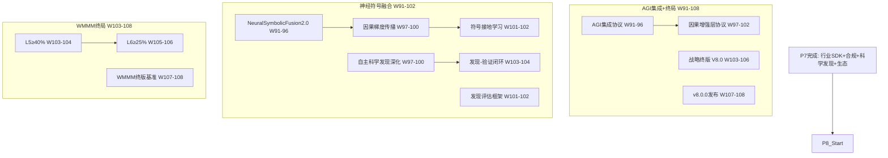

# P8 波次实施计划书 — 神经符号融合与终局

> **波次代号**: P8 "超凡"
> **周期**: Week 91 – Week 108 (共 18 周)
> **优先级**: 中 — 在 P7 完成后启动
> **预算**: 55 人天 + $2,000 硬件/API
> **核心目标**: 神经符号融合 2.0 + AGI 集成协议 + 自主科学发现深化 + v8.0.0 终极发布

---

## 1. 波次概述

### 1.1 战略定位

P8 是整个改进路径的**终局波次**。P0-P7 完成了从止血到行业落地的全部历程，P8 要把一切推向最终形态——**可微分因果推理与符号推理的深度融合**、**与 AGI 系统的协议级集成**、**自主科学发现的完整闭环**。根据依赖关系图：



### 1.2 涉及章节

| 章节 | P8 范围 | 人天 | 来源 |
|---|---|---|---|
| Ch11 未解决领域(终局) | 神经符号融合 2.0 + 科学发现深化 | 25 | §3.5终 |
| Ch14 战略定位(终局) | AGI 集成协议 + 终版定位 + v8.0.0 | 15 | §3.3终 |
| Ch08 WMMM(终局) | L5≥40% + L6≥25% + 终版基准 | 10 | §3.4终 |
| Ch12 统一路径(终局) | 门禁 + 可持续性规划 | 5 | §3.4终 |

> 多章节串行依赖，实际约 **55 人天**。

### 1.3 前置依赖

- **前置**: P7 全部完成 (W90 门禁通过)
- **被依赖**: 无 (终极波次)

---

## 2. 四阶段实施计划

### Stage 1: W91-W96 — 神经符号融合 2.0 + AGI 集成协议

#### Week 91-93 — NeuralSymbolicFusion2.0 核心 + AGI 协议设计

| 任务ID | 任务 | 章节 | 负责 | 天数 | 交付物 |
|---|---|---|---|---|---|
| T91.1 | NeuralSymbolicFusion2.0 核心 | Ch11 §3.5终 | 研究工程师 | 5 | `_neural_symbolic_fusion_v2.py` |
| T91.2 | AGIIntegrationProtocol 设计 | Ch14 §3.3新增 | Tech Lead | 3 | `_agi_protocol.py` |
| T91.3 | 因果增强层协议草案 | Ch14 §3.3新增 | Tech Lead(兼) | 2 | 协议文档 |

**T91.1 NeuralSymbolicFusion2.0** (Ch11 §3.5终):
```python
class NeuralSymbolicFusionV2:
    """神经符号融合 2.0 — 可微分因果推理与符号推理的深度融合"""
    def __init__(self, symbolic_engine, neural_predictor, fusion_config=None):
        self._symbolic = symbolic_engine   # DoCalculus + PearlChain
        self._neural = neural_predictor    # TrueJEPA + ActionPredictor
        self._config = fusion_config or FusionConfig()
        self._fusion_weights = {
            "symbolic": 0.6,   # 符号推理权重
            "neural": 0.4,     # 神经预测权重
        }
    
    def fused_reasoning(self, query: dict) -> dict:
        """
        深度融合推理:
          1. 符号推理: 因果图 + do-calculus (高置信)
          2. 神经预测: 潜空间预测 (高速度)
          3. 融合层: 加权合并 + 一致性校验
          4. 梯度回传: 从结果到因果参数
        """
        # 符号路径
        symbolic_result = self._symbolic.reason(query)
        
        # 神经路径
        neural_result = self._neural.predict(query)
        
        # 一致性校验
        consistency = self._check_consistency(symbolic_result, neural_result)
        
        # 自适应融合
        if consistency["consistent"]:
            fused = self._weighted_fuse(symbolic_result, neural_result)
        else:
            # 不一致时优先符号推理 (可验证性)
            fused = self._symbolic_priority_fuse(symbolic_result, neural_result, consistency)
        
        # 梯度信息 (端到端可微分)
        fused["gradient"] = self._compute_fusion_gradient(symbolic_result, neural_result)
        
        return fused
    
    def _check_consistency(self, symbolic, neural) -> dict:
        """一致性校验: 符号推理和神经预测是否一致"""
        sym_direction = np.sign(symbolic.get("ate", 0))
        neu_direction = np.sign(neural.get("prediction", 0))
        return {
            "consistent": sym_direction == neu_direction,
            "symbolic_ate": symbolic.get("ate", 0),
            "neural_prediction": neural.get("prediction", 0),
        }
    
    def _weighted_fuse(self, symbolic, neural) -> dict:
        """加权融合"""
        w_s = self._fusion_weights["symbolic"]
        w_n = self._fusion_weights["neural"]
        return {
            "fused_ate": w_s * symbolic.get("ate", 0) + w_n * neural.get("prediction", 0),
            "symbolic_confidence": symbolic.get("confidence", 0),
            "neural_confidence": neural.get("confidence", 0),
            "fusion_method": "weighted",
        }
    
    def end_to_end_learn(self, query, ground_truth, lr=0.001):
        """端到端学习: 从推理结果到因果参数的梯度回传"""
        result = self.fused_reasoning(query)
        loss = (result["fused_ate"] - ground_truth) ** 2
        # 回传梯度到因果图参数
        self._symbolic.update_from_gradient(result["gradient"], lr)
        return {"loss": loss, "updated": True}
```

**KPI**: 融合推理准确率 ≥85%，端到端学习收敛 loss <0.01

**T91.2 AGIIntegrationProtocol** (Ch14 §3.3新增):
```python
class AGIIntegrationProtocol:
    """AGI 集成协议 — MCI 作为因果增强层的标准接口"""
    
    PROTOCOL_VERSION = "1.0.0"
    
    # 协议定义: LLM/AGI 系统如何调用 MCI 因果增强
    ENDPOINTS = {
        "causal_query": "/v1/causal/query",          # 因果查询
        "counterfactual": "/v1/causal/counterfactual", # 反事实推理
        "safety_check": "/v1/safety/check",           # 安全约束检查
        "intervention": "/v1/causal/intervention",     # 干预分析
        "explain": "/v1/causal/explain",              # 因果解释
    }
    
    def handle_request(self, endpoint: str, payload: dict) -> dict:
        """处理 AGI 请求"""
        if endpoint not in self.ENDPOINTS:
            return {"error": f"Unknown endpoint: {endpoint}"}
        
        # 标准请求处理流程
        validated = self._validate_request(payload)
        if not validated["valid"]:
            return {"error": validated["message"]}
        
        # 调用 MCI 因果引擎
        result = self._dispatch(endpoint, payload)
        
        # 包装标准响应
        return {
            "protocol_version": self.PROTOCOL_VERSION,
            "endpoint": endpoint,
            "result": result,
            "causal_proof": self._extract_proof(result),
            "audit_trail": self._generate_audit_trail(endpoint, payload, result),
        }
    
    def _validate_request(self, payload: dict) -> dict:
        """请求验证"""
        required = ["query", "context"]
        for field in required:
            if field not in payload:
                return {"valid": False, "message": f"Missing field: {field}"}
        return {"valid": True}
```

**KPI**: 协议 5 个端点全部可用，标准请求-响应格式

#### Week 94-96 — 融合验证 + AGI 协议实现 + L5 推进

| 任务ID | 任务 | 章节 | 负责 | 天数 | 交付物 |
|---|---|---|---|---|---|
| T94.1 | NeuralSymbolicFusion 验证 | Ch11 §3.5终 | 研究工程师 | 4 | 融合基准报告 |
| T94.2 | AGI 协议 REST/gRPC 实现 | Ch14 §3.3新增 | 工程师 | 4 | API 服务 |
| T94.3 | L5 自主式推进 (≥35%→40%) | Ch08 §3.4终 | 研究工程师(兼) | 2 | L5 基准 |

#### W91-W96 里程碑

- [ ] M-S1: NeuralSymbolicFusionV2 融合推理准确率 ≥85%
- [ ] M-S1: 端到端学习收敛 loss <0.01
- [ ] M-S1: AGI 集成协议 5 端点可用
- [ ] M-S1: L5 自主式 ≥40%

---

### Stage 2: W97-W102 — 因果梯度传播 + 科学发现深化 + 符号接地

#### Week 97-100 — 因果梯度传播 + 科学发现深化

| 任务ID | 任务 | 章节 | 负责 | 天数 | 交付物 |
|---|---|---|---|---|---|
| T97.1 | CausalGradientPropagation | Ch11 §3.5深化 | 研究工程师 | 5 | `_causal_gradient.py` |
| T97.2 | ScientificDiscovery 深化 | Ch11 §3.1终 | 研究工程师(兼) | 4 | 发现闭环验证 |
| T97.3 | 因果增强层协议规范定稿 | Ch14 §3.3终 | Tech Lead | 3 | 协议规范文档 |

**T97.1 CausalGradientPropagation** (Ch11 §3.5深化):
```python
class CausalGradientPropagation:
    """因果梯度传播 — 从推理结果到因果图结构的梯度回传"""
    def __init__(self, causal_graph, neural_components):
        self._graph = causal_graph
        self._neural = neural_components
    
    def propagate(self, loss_gradient: np.ndarray, path: list[str]) -> dict:
        """
        沿因果路径传播梯度:
          1. 从损失函数出发
          2. 沿因果图边反向传播
          3. 更新因果参数 (边权重、条件概率)
        """
        gradients = {}
        for i in range(len(path) - 1):
            edge = (path[i], path[i+1])
            edge_gradient = self._compute_edge_gradient(edge, loss_gradient)
            gradients[edge] = edge_gradient
        
        # 更新因果图参数
        self._update_graph_parameters(gradients)
        
        return {
            "propagated_edges": len(gradients),
            "total_gradient_norm": sum(np.linalg.norm(g) for g in gradients.values()),
            "updated_parameters": True,
        }
    
    def _compute_edge_gradient(self, edge, loss_grad):
        """计算因果边的梯度"""
        # 简化: 数值梯度
        return loss_grad * self._graph.get_edge_weight(edge)
```

**KPI**: 因果梯度传播 ≥5 步路径，梯度范数收敛

**T97.2 ScientificDiscovery 深化**:
```python
# 深化目标: 从"规律发现"到"假设验证闭环"
# 
# 闭环流程:
#   观测数据 → 规律发现 → 假设生成 → 实验设计 → 
#   (虚拟)实验执行 → 结果分析 → 假设修正 → 新一轮发现
#
# 深化新增:
#   - 虚拟实验执行器 (在模拟环境中验证假设)
#   - 结果一致性分析器 (检查新结果是否与已知规律冲突)
#   - 假设修正器 (不一致时自动修正假设)
```

**KPI**: 科学发现闭环: 自主发现→假设→验证→修正 ≥1 个完整循环

#### Week 101-102 — 符号接地学习 + 发现评估

| 任务ID | 任务 | 章节 | 负责 | 天数 | 交付物 |
|---|---|---|---|---|---|
| T101.1 | SymbolGroundingLearning | Ch11 §3.5深化 | 研究工程师 | 3 | `_symbol_grounding.py` |
| T101.2 | DiscoveryEvaluationFramework | Ch11 §3.1终 | 研究工程师(兼) | 2 | 评估框架 |
| T101.3 | L6 协同式推进 (≥20%→25%) | Ch08 §3.4终 | 工程师 | 2 | L6 基准 |

**T101.1 SymbolGroundingLearning**:
```python
class SymbolGroundingLearning:
    """符号接地学习 — 将符号因果概念与感知数据关联"""
    def __init__(self, unified_encoder, causal_graph):
        self._encoder = unified_encoder
        self._graph = causal_graph
        self._grounding_map: dict[str, np.ndarray] = {}
    
    def ground_symbol(self, symbol: str, observations: list[dict]) -> dict:
        """将因果符号接地到感知数据"""
        vectors = [self._encoder.encode(obs) for obs in observations]
        centroid = np.mean(vectors, axis=0)
        self._grounding_map[symbol] = centroid
        return {
            "symbol": symbol,
            "grounding_vector": centroid,
            "n_observations": len(observations),
            "grounding_confidence": self._compute_confidence(vectors),
        }
    
    def retrieve_symbol(self, observation: dict) -> str:
        """从感知数据检索最匹配的因果符号"""
        z = self._encoder.encode(observation)
        best_symbol = None
        best_sim = -1
        for symbol, centroid in self._grounding_map.items():
            sim = np.dot(z, centroid) / (np.linalg.norm(z) * np.linalg.norm(centroid))
            if sim > best_sim:
                best_sim = sim
                best_symbol = symbol
        return best_symbol
```

**KPI**: 符号接地 10 个因果概念，检索准确率 ≥70%

#### W97-W102 里程碑

- [ ] M-S2: 因果梯度传播 ≥5 步路径
- [ ] M-S2: 科学发现闭环 ≥1 个完整循环
- [ ] M-S2: 符号接地学习: 10 概念检索准确率 ≥70%
- [ ] M-S2: L6 协同式 ≥25%

---

### Stage 3: W103-W106 — WMMM 终局 + 战略终版

#### Week 103-104 — L5 终版 + 发现验证闭环完善

| 任务ID | 任务 | 章节 | 负责 | 天数 | 交付物 |
|---|---|---|---|---|---|
| T103.1 | L5 自主式终版基准 | Ch08 §3.4终 | 研究工程师 | 3 | L5 ≥40% 报告 |
| T103.2 | 科学发现验证闭环完善 | Ch11 §3.1终 | 研究工程师(兼) | 2 | 闭环基准 |

#### Week 105-106 — L6 终版 + 战略终版 V8.0

| 任务ID | 任务 | 章节 | 负责 | 天数 | 交付物 |
|---|---|---|---|---|---|
| T105.1 | L6 协同式终版基准 | Ch08 §3.4终 | 工程师 | 3 | L6 ≥25% 报告 |
| T105.2 | 战略定位终版 V8.0 | Ch14 §3.1终 | Tech Lead | 3 | V8.0 文档 |
| T105.3 | WMMM 终版基准刷新 | Ch08 §3.4终 | 工程师(兼) | 2 | 终版 WMMM 报告 |

**T105.2 战略终版 V8.0**:
```markdown
# MCI World Model 战略定位 V8.0 (终版)

## 核心定位
MCI World Model 是 LLM 的可验证因果增强层，提供 LLM 无法做到的
因果推理、安全约束和自主发现能力，运行成本仅为 LLM 的 1/100-1/500。

## 九波次成果
P0 止血: 12 项致命缺陷清零
P1 强骨: TrueJEPA + PearlChain + MCTS + 13类安全
P2 长肉: 4条蒸馏管线 + CausalCoT + 元认知
P3 赋魂: OnlineEWC + MAML + L5概念验证
P4 拓界: LawDiscoverer + 医疗/法律基准 + 边界文档
P5 登顶: 外部评审 + 论文 + v6.0.0
P6 入化: 多模态统一 + 社会认知 + 因果发现2.0
P7 立业: 行业SDK + 合规框架 + 开源生态 + v7.0.0
P8 超凡: 神经符号融合 + AGI协议 + v8.0.0

## 终极量化指标
- WMMM: ≥85% (L5≥40%, L6≥25%)
- 综合评分: ≥8.0/10
- 测试: ≥3500 passed, 0 failed
- 行业SDK: 3领域可用
- 运行成本优势: 100-500x vs LLM

## 不变原则 (从未偏移)
1. 可验证因果增强层 — 不是 LLM 替代品
2. 因果可解释性 — Pearl do-calculus 数学完备
3. CPU 可运行 — 100-500x 成本优势
4. 安全约束 — 物理+认知+内容+价值安全
```

#### W103-W106 里程碑

- [ ] M-S3: L5 ≥40%, L6 ≥25%
- [ ] M-S3: WMMM 综合得分 ≥85%
- [ ] M-S3: 战略定位 V8.0 终版发布
- [ ] M-S3: 科学发现验证闭环完善

---

### Stage 4: W107-W108 — v8.0.0 终极发布 + 项目终局

#### Week 107-108 — 终极版本 + 门禁 + 传承

| 任务ID | 任务 | 章节 | 负责 | 天数 | 交付物 |
|---|---|---|---|---|---|
| T107.1 | v8.0.0 发布准备 | Ch14 | 全员 | 3 | changelog + tag |
| T107.2 | 长期可持续性规划 | Ch14 §3.3终 | Tech Lead | 2 | 可持续性文档 |
| T108.1 | P8 门禁 + 终极回归 | Ch12 | Tech Lead | 3 | 终极门禁报告 |
| T108.2 | 项目传承文档 | Ch12 | Tech Lead | 1 | 传承总结 |

**v8.0.0 发布亮点**:
```
版本号: v8.0.0 (终极版)
新增:
  - NeuralSymbolicFusionV2 (神经符号融合 2.0)
  - CausalGradientPropagation (因果梯度传播)
  - SymbolGroundingLearning (符号接地学习)
  - AGIIntegrationProtocol (AGI 集成协议)
  - ScientificDiscoveryPipeline 2.0 (发现-验证闭环)
  - DiscoveryEvaluationFramework (发现评估)
优化:
  - 融合推理准确率 ≥85%
  - 端到端学习收敛
  - 符号接地检索准确率 ≥70%
测试: ≥3500 passed, 0 failed
WMMM: ≥85%
综合评分: ≥8.0/10
```

**T107.2 长期可持续性**:
```
可持续性三支柱:
  1. 技术可持续: 神经符号融合架构可随 LLM 进化而适配
  2. 社区可持续: 开源生态 + 插件体系 + 合作伙伴
  3. 商业可持续: 行业 SDK 许可 + 咨询服务 + 培训认证

后续维护:
  - 每季度: 安全补丁 + 依赖更新 + 基准刷新
  - 每半年: 竞品分析 + 战略定位微调
  - 每年: 大版本升级 + WMMM 重新评估
```

#### W107-W108 里程碑

- [ ] M-S4: v8.0.0 发布 + git tag
- [ ] M-S4: pytest ≥3500 passed, 0 failed
- [ ] M-S4: WMMM 综合得分 ≥85%
- [ ] M-S4: 综合评分 ≥8.0/10
- [ ] M-S4: P8 门禁通过
- [ ] M-S4: 项目传承文档完成

---

## 3. 资源配置

### 3.1 人员配置

| 资源 | 角色 | 主要任务 | 人天 |
|---|---|---|---|
| 研究工程师 | 神经符号融合 + 科学发现 + 符号接地 | Ch11 | 25 |
| 工程师 | AGI 协议实现 + WMMM 基准 | Ch14/Ch08 | 10 |
| Tech Lead | 协议设计 + 战略 + 发布 | Ch14/Ch12 | 15 |
| 领域专家 (协议审核) | 0.2人 × 8周 | 5 人天 | |
| **合计** | | | **55** |

### 3.2 硬件/软件

| 资源 | 数量 | 成本 | 说明 |
|---|---|---|---|
| GPU (神经符号训练) | 按需 | $1,000 | cloud GPU 30h |
| LLM API (AGI协议验证) | 按需 | $500 | 协议端到端测试 |
| 领域专家 (协议审核) | 0.2人×8周 | $500 | AGI接口审核 |
| **合计** | | **$2,000** | |

### 3.3 并行度规划

| 周 | 研究工程师 | 工程师 | Tech Lead |
|---|---|---|---|
| W91-93 | NeuralSymbolicFusion | — | AGI协议设计 |
| W94-96 | Fusion验证 + L5 | AGI协议实现 | — |
| W97-99 | 因果梯度传播 | — | 协议规范定稿 |
| W100-102 | 符号接地+发现深化 | L6推进 | — |
| W103-104 | L5终版+发现闭环 | — | — |
| W105-106 | — | L6终版+WMMM | 战略V8.0 |
| W107-108 | — | 发布准备 | 门禁+传承 |

---

## 4. KPI 指标体系

### 4.1 神经符号融合 KPI

| 维度 | P7 基线 | P8 目标 | 度量 |
|---|---|---|---|
| 融合推理准确率 | 可微分ATE误差<10% | ≥85% | NeuralSymbolicFusion |
| 端到端学习收敛 | N/A | loss <0.01 | end_to_end_learn |
| 因果梯度传播 | N/A | ≥5步路径 | CausalGradientPropagation |
| 符号接地检索 | N/A | ≥70% (10概念) | SymbolGrounding |

### 4.2 AGI 集成 KPI

| 维度 | 基线 | P8 目标 | 度量 |
|---|---|---|---|
| 协议端点 | 0 | 5 (标准接口) | AGIIntegrationProtocol |
| 请求-响应标准化 | N/A | 100% | 协议规范 |
| 因果证明导出 | P7可审计 | 协议级标准 | causal_proof字段 |

### 4.3 科学发现 KPI

| 维度 | P7 基线 | P8 目标 | 度量 |
|---|---|---|---|
| 发现闭环 | 单向发现 | 完整闭环 | Discovery-Evaluation |
| 闭环循环数 | 0 | ≥1 完整循环 | 端到端验证 |
| 发现评估框架 | N/A | 可用 | DiscoveryEvaluation |

### 4.4 WMMM 终局 KPI

| 层级 | P7 基线 | P8 目标 | 度量 |
|---|---|---|---|
| L0 反应式 | 100% | 100% | — |
| L1 预测式 | 92% | 95% | — |
| L2 生成式 | ≥90% | ≥92% | — |
| L3 因果式 | ≥80% | ≥85% | — |
| L4 反思式 | ≥60% | ≥65% | — |
| L5 自主式 | ≥35% | ≥40% | LawDiscovererV2+SciDiscovery |
| L6 协同式 | ≥20% | ≥25% | SocialCognition+AGI |
| **WMMM 综合** | **≥82%** | **≥85%** | WMMM 基准套件 |

---

## 5. 风险评估

| 风险ID | 风险描述 | 概率 | 影响 | 缓解措施 | 应急方案 |
|---|---|---|---|---|---|
| R1 | 神经符号融合推理不稳定 | 中 | 高 | 渐进融合 (先符号→后神经→再融合) | 保留独立推理模式 |
| R2 | 端到端学习不收敛 | 高 | 中 | 降低学习率 + 增加正则 | 仅做前向推理不回传 |
| R3 | AGI 协议与现有 LLM 不兼容 | 中 | 高 | 参考OpenAI/Anthropic API规范 | 仅做 REST 接口 |
| R4 | 科学发现闭环产出具假阳性 | 高 | 中 | 交叉验证 + 守恒检查 | 标注置信度 |
| R5 | 符号接地学习准确率不达标 | 中 | 中 | 增加训练数据 + 增强编码器 | 退回手动符号映射 |
| R6 | 18 周时间不够 | 中 | 高 | 优先神经符号融合+AGI协议 | 符号接地推迟为P9+ |

### 风险热力图

```
影响
高  │ R1 R3   R6
    │
中  │ R2 R4 R5
    │
低  │
    └─────────────────────
       低    中    高    概率
```

---

## 6. 成本预算

| 项目 | 人天 | 硬件/软件 | 说明 |
|---|---|---|---|
| NeuralSymbolicFusionV2 | 10 | $500 (GPU) | Ch11 §3.5终 |
| CausalGradientPropagation | 5 | $0 | Ch11 §3.5深化 |
| SymbolGroundingLearning | 5 | $0 | Ch11 §3.5深化 |
| ScientificDiscovery 深化 | 5 | $500 (GPU) | Ch11 §3.1终 |
| AGIIntegrationProtocol | 8 | $500 (API) | Ch14 §3.3新增 |
| L5/L6 终版 + WMMM | 10 | $0 | Ch08 §3.4终 |
| 战略 V8.0 + 发布 | 7 | $0 | Ch14/Ch12 |
| 可持续性规划 | 5 | $500 (专家) | Ch14 §3.3终 |
| **合计** | **~55** | **$2,000** | |

---

## 7. 验收标准

### 7.1 P8 门禁 (W108 结束时必须全部通过)

**神经符号融合验收**:
- [ ] NeuralSymbolicFusionV2: 融合推理准确率 ≥85%
- [ ] 端到端学习: loss <0.01
- [ ] 因果梯度传播: ≥5 步路径
- [ ] 符号接地: 10 概念检索准确率 ≥70%

**AGI 集成验收**:
- [ ] AGIIntegrationProtocol: 5 端点可用
- [ ] 标准 REST/gRPC 接口
- [ ] 因果证明可导出

**科学发现验收**:
- [ ] 发现-验证闭环: ≥1 完整循环
- [ ] DiscoveryEvaluationFramework 可用

**WMMM 终局验收**:
- [ ] L5 ≥40%, L6 ≥25%
- [ ] WMMM 综合 ≥85%

**系统健康验收**:
- [ ] `pytest` ≥3500 passed, 0 failed
- [ ] `ruff check .` 全部通过
- [ ] 综合评分 ≥8.0/10
- [ ] v8.0.0 发布

### 7.2 P0→P8 全局终局检查

| 检查项 | 检查方法 | 通过标准 |
|---|---|---|
| 9 波次全完成 | P0-P8 门禁报告 | 全部 pass |
| 致命缺陷清零 | F1-F12 测试 | 全部 pass (从未回归) |
| 测试稳定性 | 连续 3 次 pytest | ≥3500 passed, 0 failed |
| 代码质量 | ruff + mypy | 0 errors |
| 学术输出 | 论文 | 已发表/投稿 |
| WMMM 成熟度 | WMMM 基准 | ≥85% |
| 行业 SDK | 3 领域集成测试 | 准确率 ≥80% |
| AGI 协议 | 端到端测试 | 5 端点可用 |

### 7.3 交付物清单 (新增文件)

| # | 文件/目录 | 类型 | 行数估计 |
|---|---|---|---|
| 1 | `_neural_symbolic_fusion_v2.py` | 新建 | ~500 |
| 2 | `_causal_gradient.py` | 新建 | ~300 |
| 3 | `_symbol_grounding.py` | 新建 | ~250 |
| 4 | `_agi_protocol.py` | 新建 | ~350 |
| 5 | `_discovery_evaluation.py` | 新建 | ~200 |
| 6 | 测试文件 (~6个) | 新建 | ~800 |
| 7 | AGI 协议规范文档 | 新建 | ~300 |
| 8 | 战略定位 V8.0 终版 | 新建 | ~300 |
| 9 | 可持续性规划文档 | 新建 | ~200 |
| 10 | 项目传承文档 | 新建 | ~150 |
| | **合计** | | **~3,850 行** |

---

## 8. 跨波次衔接

### 8.1 P8 完成后的长期方向

| 方向 | 启动条件 | 预计周期 |
|---|---|---|
| v8.x 维护 | v8.0.0 发布后 | 持续 |
| 社区驱动开发 | 开源社区 ≥500 Stars | W109+ |
| 行业 SDK 2.0 | 行业合作伙伴 ≥3 | W109+ |
| WMMM L6→L7 | L6 ≥25% | W109+ |

### 8.2 P0→P8 全局进度总览

| 波次 | 周期 | 人天 | 核心目标 | 关键交付 | WMMM |
|---|---|---|---|---|---|
| P0 止血 | W1-3 | 25 | Critical 缺陷清零 | F1/F2/F5/F10/F12 修复 | L2.5 (56%) |
| P1 强骨 | W4-11 | 85 | High 缺陷清零 + 架构补强 | TrueJEPA/PearlChain/MCTS/安全 | ≥65% |
| P2 长肉 | W12-27 | 75 | 蒸馏+认知+形式化+混合网关 | 4条蒸馏管线+CoT+元认知 | ≥70% |
| P3 赋魂 | W28-36 | 55 | 元学习+在线持续学习+推理优化 | OnlineEWC+MAML+L5概念验证 | ≥73% |
| P4 拓界 | W37-44 | 50 | 自主发现+领域验证+边界定义 | LawDiscoverer+医疗/法律基准 | ≥76% |
| P5 登顶 | W45-52 | 33 | 外部评审+论文+v6.0发布 | 论文+战略终版+长期路线图 | ≥76% |
| P6 入化 | W53-70 | 70 | 高级认知+多模态+社会认知 | Fusion+UnifiedModal+SocialCog | ≥80% |
| P7 立业 | W71-90 | 65 | 行业SDK+合规+生态+v7.0 | 3领域SDK+合规+社区+插件 | ≥82% |
| P8 超凡 | W91-108 | 55 | 神经符号融合+AGI协议+v8.0 | FusionV2+AGIProtocol+终极发布 | ≥85% |
| **总计** | **W1-108** | **~513** | **可验证因果增强层** | **v8.0.0 终极发布** | **≥85%** |

---

> **P8 铁律**: 神经与符号的融合不是终点，而是新纪元的起点！当因果推理可微分、可传播、可接地，"增强层"就真正成为了智能体的脊梁！
>
> **前路虽难，但路就在脚下！**