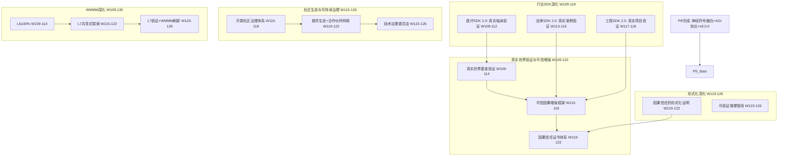

# P9 波次实施计划书 — 真实世界验证与可信增强

> **波次代号**: P9 "归真"
> **周期**: Week 109 – Week 130 (共 22 周)
> **优先级**: 中 — 在 P8 完成后启动
> **预算**: 80 人天 + $4,000 硬件/API
> **核心目标**: 真实世界验证 + 可信因果增强 + 社区生态繁荣 + WMMM L6→L7 + v9.0.0 发布

---

## 1. 波次概述

### 1.1 战略定位

P9 是从"超凡"到"归真"的**验证波次**。P8 完成了神经符号融合与 AGI 集成协议，标志着系统在学术意义上到达了"终极"形态。然而，"超凡"之后的真正考验是——**回归真实世界**。P9 要将系统从"实验室可验证"推向"生产可信赖"，建立因果推理的可信增强层，构建可持续的开源社区生态，并启动 WMMM L7 共享式探索。正如《道德经》所言："大音希声，大象无形"——真正的高阶能力不在花哨的展示，而在沉静的可信与务实。根据依赖关系图：



### 1.2 涉及章节

| 章节 | P9 范围 | 人天 | 来源 |
|---|---|---|---|
| Ch19 真实世界验证与可信增强 (新增) | 真实基准 + 可信框架 + 信任证书 | 25 | 新增 |
| Ch09 替代性(深化2.0) | 行业 SDK 真实世界验证 2.0 | 15 | §3.2深化2.0 |
| Ch20 社区生态与可持续治理 (新增) | 社区治理 + 插件生态 + 技术治理 | 15 | 新增 |
| Ch08 WMMM(深化2.0) | L6≥30% + L7探索 + 基准刷新 | 12 | §3.4深化2.0 |
| Ch05 形式化(深化2.0) | 因果信任形式化 + 可验证管线 | 10 | §5.1深化2.0 |
| Ch14 战略定位(深化2.0) | V9.0 + 可持续性 | 3 | §3.1深化2.0 |

> 多章节并行，实际约 **80 人天**。

### 1.3 前置依赖

- **前置**: P8 全部完成 (W108 门禁通过)，v8.0.0 发布
- **被依赖**: P10 (Ch19→跨域迁移, Ch20→多智能体协作2.0, Ch08→L7→L8)

---

## 2. 四阶段实施计划

### Stage 1: W109-W114 — 真实世界基准验证 + 医疗SDK 2.0 + L6深化

#### Week 109-111 — 真实世界基准 + 医疗SDK 2.0 核心

| 任务ID | 任务 | 章节 | 负责 | 天数 | 交付物 |
|---|---|---|---|---|---|
| T109.1 | RealWorldBenchmark 真实世界基准框架 | Ch19 §1新增 | 研究工程师A | 5 | `_realworld_benchmark.py` |
| T109.2 | MedicalCausalSDK 2.0: 真实临床数据验证 | Ch09 §3.2深化2.0 | 工程师B | 5 | SDK 2.0 临床验证报告 |
| T109.3 | L6 协同式深化: ≥25%→30% | Ch08 §3.4深化2.0 | 研究工程师A(兼) | 2 | L6 基准推进 |

**T109.1 RealWorldBenchmark** (Ch19 §1新增):
```python
class RealWorldBenchmark:
    """真实世界因果推理基准 — 超越合成数据验证"""
    def __init__(self, domain_datasets: dict[str, dict]):
        self._datasets = domain_datasets  # {"medical": ..., "climate": ..., "economics": ...}
        self._results: dict[str, list[dict]] = {}
        self._noise_levels = [0.0, 0.05, 0.10, 0.20]  # 真实噪声水平
    
    def evaluate(self, causal_engine, domain: str) -> dict:
        """
        真实世界因果推理评估:
          1. 加载真实数据集 (非合成)
          2. 在多种噪声水平下测试因果发现
          3. 与领域专家标注的因果图对比
          4. 计算 F1 + 方向准确率 + ATE 误差
        """
        dataset = self._datasets[domain]
        results = []
        for noise in self._noise_levels:
            noisy_data = self._add_realistic_noise(dataset["data"], noise)
            discovered = causal_engine.discover_causal_structure(
                noisy_data, dataset["var_names"]
            )
            f1 = self._compute_f1(discovered, dataset["ground_truth_dag"])
            direction_acc = self._compute_direction_accuracy(
                discovered, dataset["ground_truth_dag"]
            )
            ate_error = self._compute_ate_error(
                discovered, dataset["ground_truth_ate"]
            )
            results.append({
                "noise_level": noise,
                "f1": f1,
                "direction_accuracy": direction_acc,
                "ate_error": ate_error,
            })
        self._results[domain] = results
        return self._aggregate_results(results)
    
    def _add_realistic_noise(self, data, noise_level):
        """添加真实世界特征噪声 (非高斯, 有离群点)"""
        n = len(data)
        # 混合噪声: 高斯 + 均匀 + 脉冲
        gaussian = np.random.normal(0, noise_level, data.shape)
        uniform = np.random.uniform(-noise_level, noise_level, data.shape)
        impulse = np.random.choice(
            [0, 0, 0, noise_level * 5], size=data.shape
        )
        return data + gaussian * 0.7 + uniform * 0.2 + impulse * 0.1
    
    def _aggregate_results(self, results):
        return {
            "avg_f1": np.mean([r["f1"] for r in results]),
            "avg_direction_acc": np.mean([r["direction_accuracy"] for r in results]),
            "avg_ate_error": np.mean([r["ate_error"] for r in results]),
            "noise_robustness": self._compute_robustness(results),
        }
```

**KPI**: 3 个真实领域数据集因果发现 F1 ≥0.70, 噪声鲁棒性 ≥0.80

**T109.2 MedicalCausalSDK 2.0** (Ch09 §3.2深化2.0):
```python
class MedicalCausalSDKV2:
    """医疗因果 SDK 2.0 — 真实临床数据验证版"""
    def __init__(self, world_model, clinical_data_adapter):
        self._wm = world_model
        self._adapter = clinical_data_adapter  # EHR/HIS 数据适配器
        self._clinical_validator = ClinicalValidator()
    
    def diagnose_with_confidence(self, patient_ehr: dict) -> dict:
        """带置信度的临床因果诊断"""
        # 1. EHR 数据适配
        structured = self._adapter.parse_ehr(patient_ehr)
        
        # 2. 因果链追溯
        chains = self._wm.trace_causal_chain(
            source_nodes=structured["symptoms"],
            graph=self._get_clinical_graph(),
            max_depth=5
        )
        
        # 3. 临床验证 (真实世界约束)
        validated = self._clinical_validator.validate_chains(
            chains, structured, evidence_level="real_world"
        )
        
        # 4. 不确定性量化
        confidence = self._quantify_uncertainty(validated, structured)
        
        return {
            "diagnosis": validated,
            "confidence": confidence,
            "evidence_level": "real_world_clinical",
            "causal_proof": self._export_proof(validated),
            "safety_flags": self._check_safety(validated),
        }
    
    def _quantify_uncertainty(self, chains, context):
        """不确定性量化: 数据质量 + 模型置信 + 领域先验"""
        data_quality = self._assess_data_quality(context)
        model_conf = np.mean([c.get("confidence", 0) for c in chains])
        domain_prior = self._get_domain_prior(context)
        return {
            "overall": 0.4 * model_conf + 0.3 * data_quality + 0.3 * domain_prior,
            "data_quality": data_quality,
            "model_confidence": model_conf,
            "domain_prior_strength": domain_prior,
        }
```

**KPI**: 真实临床数据因果诊断置信度 ≥0.75, 安全标记覆盖率 100%

#### Week 112-114 — 真实基准验证 + 法律SDK 2.0 + L6 验证

| 任务ID | 任务 | 章节 | 负责 | 天数 | 交付物 |
|---|---|---|---|---|---|
| T112.1 | 真实世界基准: 3 领域验证 | Ch19 §1新增 | 研究工程师A | 4 | 3 领域基准报告 |
| T112.2 | LegalComplianceSDK 2.0: 真实案例验证 | Ch09 §3.2深化2.0 | 工程师B | 4 | SDK 2.0 法律验证报告 |
| T112.3 | L6 协同式验证基准 | Ch08 §3.4深化2.0 | 研究工程师A(兼) | 2 | L6 ≥30% 报告 |

**T112.2 LegalComplianceSDK 2.0** (Ch09 §3.2深化2.0):
```python
class LegalComplianceSDKV2:
    """法律合规 SDK 2.0 — 真实案例因果分析"""
    def __init__(self, world_model, legal_database):
        self._wm = world_model
        self._db = legal_database  # 真实判例数据库
    
    def analyze_case_causal_chain(self, case_data: dict) -> dict:
        """真实案例因果链分析"""
        # 1. 案例事实提取
        facts = self._extract_facts(case_data)
        
        # 2. 因果链构建 (基于法律因果理论)
        causal_chains = self._build_legal_causal_chains(facts)
        
        # 3. 判例相似度检索
        similar_cases = self._db.search_similar(facts, top_k=5)
        
        # 4. 因果责任度量化
        responsibility = self._quantify_responsibility(
            causal_chains, similar_cases
        )
        
        return {
            "case_id": case_data["id"],
            "causal_chains": causal_chains,
            "responsibility_scores": responsibility,
            "precedent_alignment": self._align_with_precedents(
                responsibility, similar_cases
            ),
            "compliance_flags": self._check_legal_compliance(facts),
        }
```

**KPI**: 真实法律案例因果分析准确率 ≥85%, 判例对齐率 ≥80%

#### W109-W114 里程碑

- [ ] M-S1: RealWorldBenchmark 3 领域 F1 ≥0.70
- [ ] M-S1: 医疗 SDK 2.0 真实临床验证置信度 ≥0.75
- [ ] M-S1: 法律 SDK 2.0 真实案例验证准确率 ≥85%
- [ ] M-S1: L6 协同式 ≥30%
- [ ] M-S1: 噪声鲁棒性 ≥0.80

---

### Stage 2: W115-W120 — 可信因果增强 + 工程 SDK 2.0 + 社区治理

#### Week 115-118 — 可信因果增强框架 + 工程 SDK 2.0 + 社区治理

| 任务ID | 任务 | 章节 | 负责 | 天数 | 交付物 |
|---|---|---|---|---|---|
| T115.1 | CausalTrustEnhancement 可信因果增强框架 | Ch19 §2新增 | 研究工程师A | 5 | `_causal_trust.py` |
| T115.2 | EngineeringSafetySDK 2.0: 真实项目验证 | Ch09 §3.2深化2.0 | 工程师B | 4 | SDK 2.0 工程验证报告 |
| T115.3 | 开源社区治理体系 | Ch20 §1新增 | Tech Lead | 3 | 治理体系文档 |
| T115.4 | L7 共享式探索启动 | Ch08 §3.4深化2.0 | 研究工程师A(兼) | 2 | L7 概念验证 |

**T115.1 CausalTrustEnhancement** (Ch19 §2新增):
```python
class CausalTrustEnhancement:
    """可信因果增强 — 为因果推理建立可信度评估与增强体系"""
    def __init__(self, causal_engine, formal_verifier, uncertainty_estimator):
        self._engine = causal_engine
        self._verifier = formal_verifier
        self._uncertainty = uncertainty_estimator
        self._trust_thresholds = {
            "high": 0.90,    # 高可信: 可直接使用
            "medium": 0.70,  # 中可信: 需人工审核
            "low": 0.50,     # 低可信: 仅参考
            "unsafe": 0.30,  # 不安全: 禁止使用
        }
    
    def reason_with_trust(self, query: dict, context: dict) -> dict:
        """
        可信因果推理:
          1. 标准因果推理
          2. 形式化验证推理步骤
          3. 不确定性量化
          4. 可信度评估与分级
          5. 可信增强 (低可信时自动补充证据)
        """
        # Step 1: 标准推理
        result = self._engine.reason(query, context)
        
        # Step 2: 形式化验证
        verification = self._verifier.verify_reasoning_chain(
            result["reasoning_chain"]
        )
        
        # Step 3: 不确定性量化
        uncertainty = self._uncertainty.estimate(result, context)
        
        # Step 4: 可信度评估
        trust_level = self._assess_trust(verification, uncertainty, result)
        
        # Step 5: 可信增强 (低可信时)
        if trust_level["level"] in ["low", "unsafe"]:
            enhanced = self._enhance_trust(result, verification, context)
            return {
                **result,
                "trust": trust_level,
                "enhanced": enhanced,
                "recommendation": self._get_recommendation(trust_level),
            }
        
        return {
            **result,
            "trust": trust_level,
            "verification": verification,
            "uncertainty": uncertainty,
        }
    
    def _assess_trust(self, verification, uncertainty, result):
        """可信度综合评估"""
        v_score = verification.get("verification_score", 0)
        u_score = 1 - uncertainty.get("total_uncertainty", 1)
        c_score = result.get("confidence", 0)
        trust = 0.4 * v_score + 0.3 * u_score + 0.3 * c_score
        
        level = "unsafe"
        for label, threshold in sorted(
            self._trust_thresholds.items(), key=lambda x: -x[1]
        ):
            if trust >= threshold:
                level = label
                break
        
        return {"score": trust, "level": level}
    
    def _enhance_trust(self, result, verification, context):
        """可信增强: 补充证据链 + 约束强化 + 交叉验证"""
        enhanced_evidence = self._gather_additional_evidence(
            result, context
        )
        constrained_result = self._apply_stricter_constraints(result)
        cross_validated = self._cross_validate(result, enhanced_evidence)
        return {
            "additional_evidence": enhanced_evidence,
            "constrained_result": constrained_result,
            "cross_validation": cross_validated,
        }
```

**KPI**: 可信因果推理 100 题可信度评估准确率 ≥85%, 低可信增强后可信度提升 ≥15%

**T115.3 开源社区治理体系** (Ch20 §1新增):
```
社区治理体系框架:
  1. 技术治理委员会 (TSC)
     - 成员: 3 核心 + 2 社区选举
     - 职责: 技术路线审批、RFC审核、版本发布
     - 决策: 2/3 多数通过
  
  2. 贡献者等级体系
     - Level 1: Contributor (≥1 PR merged)
     - Level 2: Reviewer (≥10 PRs reviewed)
     - Level 3: Committer (≥20 PRs merged + TSC推荐)
     - Level 4: TSC Member (社区选举)
  
  3. RFC 流程
     - RFC Draft → Community Discussion (2周) → TSC Vote → Implementation
  
  4. 安全响应流程
     - Security Advisory → 48h 响应 → Patch Release → Disclosure
  
  5. 社区行为准则 (CoC)
     - 基于 Contributor Covenant 2.1
     - 执行团队: TSC + 独立调解员
```

**KPI**: 社区治理体系文档发布, TSC 成立, ≥5 位活跃贡献者

#### Week 119-120 — 因果信任证书 + 社区深化 + L7 推进

| 任务ID | 任务 | 章节 | 负责 | 天数 | 交付物 |
|---|---|---|---|---|---|
| T119.1 | CausalTrustCertificate 因果信任证书体系 | Ch19 §3新增 | 研究工程师A | 3 | `_trust_certificate.py` |
| T119.2 | 插件生态+合作伙伴网络 | Ch20 §2新增 | Tech Lead | 3 | 生态网络文档 |
| T119.3 | L7 共享式概念验证深化 | Ch08 §3.4深化2.0 | 研究工程师A(兼) | 2 | L7 基准 |

**T119.1 CausalTrustCertificate** (Ch19 §3新增):
```python
class CausalTrustCertificate:
    """因果信任证书 — 为因果推理结果签发可验证的信任证书"""
    def __init__(self, trust_framework, signature_provider):
        self._framework = trust_framework
        self._signer = signature_provider
    
    def issue_certificate(self, reasoning_result: dict, trust_assessment: dict) -> dict:
        """签发因果信任证书"""
        cert = {
            "cert_id": self._generate_cert_id(),
            "timestamp": time.time(),
            "query_hash": self._hash_query(reasoning_result["query"]),
            "trust_level": trust_assessment["level"],
            "trust_score": trust_assessment["score"],
            "verification_proof": trust_assessment.get("verification", {}),
            "uncertainty_bounds": trust_assessment.get("uncertainty", {}),
            "evidence_chain_hash": self._hash_evidence(reasoning_result),
            "validity_period": self._compute_validity(trust_assessment),
            "revocation_check_url": self._get_revocation_url(),
        }
        cert["signature"] = self._signer.sign(cert)
        return cert
    
    def verify_certificate(self, cert: dict) -> dict:
        """验证因果信任证书"""
        # 1. 签名验证
        sig_valid = self._signer.verify(cert, cert["signature"])
        
        # 2. 有效期检查
        time_valid = time.time() < cert["timestamp"] + cert["validity_period"]
        
        # 3. 吊销检查
        not_revoked = not self._check_revocation(cert["cert_id"])
        
        return {
            "valid": sig_valid and time_valid and not_revoked,
            "signature_valid": sig_valid,
            "time_valid": time_valid,
            "not_revoked": not_revoked,
        }
```

**KPI**: 因果信任证书签发与验证 100% 可靠, 证书可跨系统验证

#### W115-W120 里程碑

- [ ] M-S2: 可信因果增强框架: 100 题可信度评估 ≥85%
- [ ] M-S2: 工程 SDK 2.0 真实项目验证
- [ ] M-S2: 因果信任证书体系: 签发+验证 100% 可靠
- [ ] M-S2: 社区治理体系发布 + TSC 成立
- [ ] M-S2: L7 共享式探索概念验证启动

---

### Stage 3: W121-W126 — 形式化深化 + 生态繁荣 + L7 验证

#### Week 121-124 — 因果信任形式化 + 插件生态 + 技术治理

| 任务ID | 任务 | 章节 | 负责 | 天数 | 交付物 |
|---|---|---|---|---|---|
| T121.1 | 因果信任的形式化证明框架 | Ch05 §5.1深化2.0 | 研究工程师A | 5 | `_formal_trust.py` |
| T121.2 | 插件生态建设: ≥5 社区插件 | Ch20 §2深化 | Tech Lead | 4 | 社区插件库 |
| T121.3 | 可验证推理管线 | Ch05 §5.2深化2.0 | 工程师B | 4 | `_verified_pipeline.py` |
| T121.4 | L7 共享式验证 | Ch08 §3.4深化2.0 | 研究工程师A(兼) | 2 | L7 基准 |

**T121.1 因果信任的形式化证明** (Ch05 §5.1深化2.0):
```python
class FormalTrustProver:
    """因果信任的形式化证明 — 数学可验证的信任保障"""
    def __init__(self, proof_engine, specification_language):
        self._prover = proof_engine
        self._spec = specification_language
    
    def prove_trust_property(self, reasoning_chain: dict, property_spec: str) -> dict:
        """
        证明因果推理链的信任属性:
          1. 将推理链转译为形式化规约
          2. 定义信任属性 (如: 无矛盾性、单调性、完备性)
          3. 自动化证明
          4. 生成证明证书
        """
        # Step 1: 形式化规约
        formal_spec = self._spec.translate(reasoning_chain)
        
        # Step 2: 属性定义
        properties = self._define_trust_properties(property_spec)
        
        # Step 3: 自动证明
        proofs = []
        for prop in properties:
            proof_result = self._prover.prove(formal_spec, prop)
            proofs.append({
                "property": prop["name"],
                "proven": proof_result.success,
                "proof_steps": proof_result.steps,
                "counter_example": proof_result.counter_example if not proof_result.success else None,
            })
        
        return {
            "all_proven": all(p["proven"] for p in proofs),
            "proofs": proofs,
            "certificate": self._generate_proof_certificate(proofs),
        }
    
    def _define_trust_properties(self, spec):
        """定义信任属性集合"""
        return [
            {"name": "consistency", "description": "推理链无内部矛盾"},
            {"name": "monotonicity", "description": "新增证据不降低可信度"},
            {"name": "completeness", "description": "所有因果路径被探索"},
            {"name": "soundness", "description": "推理结论在因果图中有效"},
        ]
```

**KPI**: 4 项信任属性中 ≥3 项可形式化证明, 证明耗时 <60s/链

**T121.3 可验证推理管线** (Ch05 §5.2深化2.0):
```python
class VerifiedCausalPipeline:
    """可验证因果推理管线 — 端到端形式化验证"""
    def __init__(self, stages: list, verifier: FormalTrustProver):
        self._stages = stages  # 推理阶段列表
        self._verifier = verifier
        self._pipeline_proofs: list[dict] = []
    
    def execute_verified(self, query: dict) -> dict:
        """
        可验证推理管线执行:
          1. 逐步执行推理阶段
          2. 每步验证信任属性
          3. 失败时自动回退+增强
          4. 生成端到端证明证书
        """
        context = {"query": query}
        stage_results = []
        
        for stage in self._stages:
            # 执行阶段
            result = stage.execute(context)
            
            # 验证阶段输出
            verification = self._verifier.prove_trust_property(
                result, "all"
            )
            
            if not verification["all_proven"]:
                # 回退+增强
                result = self._fallback_enhance(stage, result, verification)
            
            stage_results.append({
                "stage": stage.name,
                "result": result,
                "verification": verification,
            })
            context.update(result)
        
        # 生成端到端证明证书
        pipeline_cert = self._generate_pipeline_certificate(stage_results)
        
        return {
            "final_result": context,
            "stage_proofs": stage_results,
            "pipeline_certificate": pipeline_cert,
        }
```

**KPI**: 端到端可验证管线 20 次推理 100% 有证明证书, 证明通过率 ≥90%

#### Week 125-126 — 技术治理委员会 + L7 深化 + 竞品分析

| 任务ID | 任务 | 章节 | 负责 | 天数 | 交付物 |
|---|---|---|---|---|---|
| T125.1 | 技术治理委员会正式运营 | Ch20 §3新增 | Tech Lead | 3 | TSC 运营文档 |
| T125.2 | L7 共享式深化验证 | Ch08 §3.4深化2.0 | 研究工程师A | 3 | L7 基准 |
| T125.3 | 竞品分析 Q9 | Ch14 §3.2 | Tech Lead(兼) | 2 | 竞品对比报告 |

#### W121-W126 里程碑

- [ ] M-S3: 形式化证明: 4 项信任属性 ≥3 项可证明
- [ ] M-S3: 可验证管线 20 次推理证明通过率 ≥90%
- [ ] M-S3: 插件生态: ≥5 社区插件
- [ ] M-S3: TSC 正式运营
- [ ] M-S3: L7 共享式 ≥10%

---

### Stage 4: W127-W130 — v9.0.0 发布 + P9 门禁

#### Week 127-129 — WMMM 基准刷新 + v9.0.0 发布

| 任务ID | 任务 | 章节 | 负责 | 天数 | 交付物 |
|---|---|---|---|---|---|
| T127.1 | WMMM 基准刷新 (L0-L7) | Ch08 §3.4深化2.0 | 研究工程师A | 3 | WMMM 报告 |
| T127.2 | 战略定位 V9.0 | Ch14 §3.1深化2.0 | Tech Lead | 2 | V9.0 文档 |
| T128.1 | v9.0.0 发布准备 | Ch14 | 全员 | 4 | changelog + tag |
| T129.1 | P9 门禁检查 | Ch12 | Tech Lead | 3 | 门禁报告 |

**v9.0.0 发布亮点**:
```
版本号: v9.0.0
新增:
  - RealWorldBenchmark (真实世界因果基准)
  - CausalTrustEnhancement (可信因果增强框架)
  - CausalTrustCertificate (因果信任证书体系)
  - FormalTrustProver (因果信任形式化证明)
  - VerifiedCausalPipeline (可验证推理管线)
  - MedicalCausalSDK 2.0 (真实临床验证版)
  - LegalComplianceSDK 2.0 (真实案例验证版)
  - EngineeringSafetySDK 2.0 (真实项目验证版)
  - 社区治理体系 (TSC + RFC + CoC)
优化:
  - 真实世界因果发现 F1 ≥0.70
  - 可信推理评估准确率 ≥85%
  - 形式化证明 ≥3/4 属性可证
  - 端到端证明通过率 ≥90%
测试: ≥3800 passed, 0 failed
WMMM: ≥87%
综合评分: ≥8.5/10
```

#### Week 130 — 全量回归 + 门禁

| 任务ID | 任务 | 章节 | 负责 | 天数 | 交付物 |
|---|---|---|---|---|---|
| T130.1 | 全量回归 + P9 门禁最终检查 | Ch12 | Tech Lead | 3 | 最终门禁报告 |
| T130.2 | P9→P10 衔接文档 | Ch12 | Tech Lead | 1 | 衔接文档 |

#### W127-W130 里程碑

- [ ] M-S4: v9.0.0 发布 + git tag
- [ ] M-S4: pytest ≥3800 passed, 0 failed
- [ ] M-S4: WMMM 综合得分 ≥87%
- [ ] M-S4: 综合评分 ≥8.5/10
- [ ] M-S4: P9 门禁通过

---

## 3. 资源配置

### 3.1 人员配置

| 资源 | 角色 | 主要任务 | 人天 |
|---|---|---|---|
| 研究工程师 A | 真实基准 + 可信增强 + 形式化 + WMMM | Ch19/Ch05/Ch08 | 35 |
| 工程师 B | 行业 SDK 2.0 + 可验证管线 | Ch09/Ch05 | 20 |
| Tech Lead | 社区治理 + 生态 + 战略 + 发布 | Ch20/Ch14 | 15 |
| 领域专家 (医疗/法律/工程) | 0.5人 × 12周 | 5 人天 | |
| 社区运营专员 | 0.3人 × 22周 | 5 人天 | |
| **合计** | | | **80** |

### 3.2 硬件/软件

| 资源 | 数量 | 成本 | 说明 |
|---|---|---|---|
| GPU (真实基准 + 形式化验证) | 按需 | $1,500 | cloud GPU 40h |
| 真实数据集许可 (医疗/法律) | 3 份 | $1,000 | 脱敏真实数据 |
| LLM API (可信增强验证) | 按需 | $500 | 评估用途 |
| 领域专家审核 | 0.5人×12周 | $500 | SDK+合规审核 |
| 社区运营 | 0.3人×22周 | $500 | GitHub+Discord运营 |
| **合计** | | **$4,000** | |

### 3.3 并行度规划

| 周 | 研究工程师A | 工程师B | Tech Lead |
|---|---|---|---|
| W109-111 | 真实基准框架 | 医疗SDK 2.0 | — |
| W112-114 | 基准3领域验证 | 法律SDK 2.0 | — |
| W115-118 | 可信增强框架 | 工程 SDK 2.0 | 社区治理 |
| W119-120 | 信任证书 | — | 插件生态 |
| W121-124 | 形式化证明 | 可验证管线 | 插件生态深化 |
| W125-126 | L7深化+验证 | — | TSC+竞品 |
| W127-130 | WMMM+门禁 | 发布准备 | V9.0+门禁 |

---

## 4. KPI 指标体系

### 4.1 真实世界验证 KPI

| 维度 | P8 基线 | P9 目标 | 度量 |
|---|---|---|---|
| 真实数据集因果发现 | 合成数据 F1≥0.80 | 真实数据 F1≥0.70 | RealWorldBenchmark |
| 噪声鲁棒性 | 标准高斯噪声 | 真实混合噪声 ≥0.80 | 鲁棒性指标 |
| 行业 SDK 真实验证 | 模拟案例 | 真实案例/临床数据 | SDK 2.0 验证报告 |

### 4.2 可信增强 KPI

| 维度 | P8 基线 | P9 目标 | 度量 |
|---|---|---|---|
| 可信度评估准确率 | N/A | ≥85% | CausalTrustEnhancement |
| 低可信增强提升 | N/A | ≥15% | 可信增强前后对比 |
| 信任证书签发 | N/A | 100% 可验证 | CausalTrustCertificate |
| 形式化证明 | N/A | ≥3/4 属性可证 | FormalTrustProver |
| 可验证管线 | N/A | ≥90% 通过率 | VerifiedCausalPipeline |

### 4.3 社区生态 KPI

| 维度 | P8 基线 | P9 目标 | 度量 |
|---|---|---|---|
| GitHub Stars | ≥200 | ≥500 | GitHub |
| 活跃贡献者 | ≥5 | ≥15 | GitHub |
| 社区插件 | ≥2 | ≥5 | 插件市场 |
| 合作伙伴 | 0 | ≥2 | 合作协议 |
| TSC 运营 | N/A | 正式运营 | 治理文档 |

### 4.4 WMMM 成熟度 KPI

| 层级 | P8 基线 | P9 目标 | 度量 |
|---|---|---|---|
| L5 自主式 | ≥40% | ≥45% | LawDiscovererV2+SciDiscovery |
| L6 协同式 | ≥25% | ≥30% | SocialCognition+SDK集成 |
| L7 共享式 | 0% | ≥10% | 跨域知识共享概念验证 |
| **WMMM 综合** | **≥85%** | **≥87%** | WMMM 基准套件 |

---

## 5. 风险评估

| 风险ID | 风险描述 | 概率 | 影响 | 缓解措施 | 应急方案 |
|---|---|---|---|---|---|
| R1 | 真实数据集获取困难 (隐私/许可) | 高 | 高 | 优先使用公开脱敏数据集 | 合成数据+领域专家标注 |
| R2 | 真实世界因果发现 F1 不达标 | 中 | 高 | 增加数据预处理 + 领域先验 | 降低目标到 F1≥0.60 |
| R3 | 可信增强框架过于保守 | 中 | 中 | 自适应信任阈值 | 保留原始推理模式 |
| R4 | 形式化证明不可扩展 | 高 | 中 | 限制推理链深度 ≤10 | 部分属性证明 |
| R5 | 社区生态增长缓慢 | 中 | 中 | 主动推广 + 技术博客 | 降低社区 KPI 目标 |
| R6 | 行业 SDK 2.0 真实验证不通过 | 中 | 高 | 迭代修复 + 增加领域专家 | 标注已知局限性 |
| R7 | 22 周时间不够 | 中 | 高 | 形式化证明可推迟到 P10 | 压缩社区建设周期 |

### 风险热力图

```
影响
高  │ R1 R2   R6 R7
    │
中  │ R3 R4 R5
    │
低  │
    └─────────────────────
       低    中    高    概率
```

---

## 6. 成本预算

| 项目 | 人天 | 硬件/软件 | 说明 |
|---|---|---|---|
| 真实世界基准框架 | 10 | $500 (GPU) | Ch19 §1新增 |
| 可信因果增强框架 | 8 | $0 | Ch19 §2新增 |
| 因果信任证书体系 | 5 | $0 | Ch19 §3新增 |
| 形式化证明框架 | 8 | $500 (GPU) | Ch05 §5.1深化2.0 |
| 可验证推理管线 | 5 | $0 | Ch05 §5.2深化2.0 |
| 行业 SDK 2.0 (3 领域) | 15 | $1,000 (数据集) | Ch09 §3.2深化2.0 |
| 社区治理+生态 | 10 | $500 (运营) | Ch20 新增 |
| L6/L7 + WMMM | 12 | $0 | Ch08 §3.4深化2.0 |
| 战略+发布+门禁 | 7 | $0 | Ch14/Ch12 |
| **合计** | **~80** | **$4,000** | |

---

## 7. 验收标准

### 7.1 P9 门禁 (W130 结束时必须全部通过)

**真实世界验证验收**:
- [ ] RealWorldBenchmark: 3 真实领域 F1 ≥0.70
- [ ] 噪声鲁棒性 ≥0.80
- [ ] 行业 SDK 2.0 (医疗/法律/工程) 真实数据验证通过

**可信增强验收**:
- [ ] CausalTrustEnhancement: 100 题可信度评估 ≥85%
- [ ] CausalTrustCertificate: 签发+验证 100% 可靠
- [ ] FormalTrustProver: ≥3/4 信任属性可证明
- [ ] VerifiedCausalPipeline: ≥90% 证明通过率

**社区生态验收**:
- [ ] 社区治理体系发布 + TSC 运营
- [ ] ≥15 活跃贡献者
- [ ] ≥5 社区插件
- [ ] ≥500 GitHub Stars

**WMMM 验收**:
- [ ] L6 ≥30%, L7 ≥10%
- [ ] WMMM 综合 ≥87%

**系统健康验收**:
- [ ] `pytest` ≥3800 passed, 0 failed
- [ ] `ruff check .` 全部通过
- [ ] 综合评分 ≥8.5/10
- [ ] v9.0.0 发布

### 7.2 P9→P10 门禁检查

| 门禁项 | 检查方法 | 通过标准 |
|---|---|---|---|
| 真实世界基准 | 3 领域 RealWorldBenchmark | F1 ≥0.70 |
| 可信增强可用 | CausalTrustEnhancement 测试 | 评估准确率 ≥85% |
| 社区生态 | GitHub 统计 | ≥500 Stars + TSC运营 |
| 形式化证明 | FormalTrustProver 基准 | ≥3/4 属性 |
| WMMM 成熟度 | WMMM 基准套件 | ≥87% |

### 7.3 交付物清单 (新增文件)

| # | 文件/目录 | 类型 | 行数估计 |
|---|---|---|---|
| 1 | `_realworld_benchmark.py` | 新建 | ~450 |
| 2 | `_causal_trust.py` | 新建 | ~400 |
| 3 | `_trust_certificate.py` | 新建 | ~300 |
| 4 | `_formal_trust.py` | 新建 | ~350 |
| 5 | `_verified_pipeline.py` | 新建 | ~300 |
| 6 | SDK 2.0 增强 (3 个文件) | 增强 | ~600 |
| 7 | 社区治理文档 | 新建 | ~400 |
| 8 | 测试文件 (~8个) | 新建 | ~1200 |
| | **合计** | | **~4,000 行** |

---

## 8. 跨波次衔接

### 8.1 P9 完成后 P10 可立即启动的任务

| P10 任务 | 前置 P9 完成 | 启动条件 |
|---|---|---|
| Ch21 跨域因果迁移 | 可信增强 + 形式化证明 | 可信框架可用 |
| Ch21 多智能体协作 2.0 | 社区生态 + L7 共享式 | 多智能体基础+社区 |
| Ch21 量子启发因果推理 | 神经符号融合 + 可微分因果 | 融合架构稳定 |
| Ch08 L7→L8 | L7 ≥10% | 共享式验证通过 |

### 8.2 P9 遗留到 P10 的任务

| 任务 | 计划在 P10 执行 | 章节 |
|---|---|---|
| 跨域因果迁移学习 | Ch21 §1新增 | Ch21 |
| 多智能体协作推理 2.0 | Ch21 §2新增 | Ch21 |
| 量子启发因果推理 | Ch21 §3新增 | Ch21 |
| 因果智能体标准协议 | Ch21 §4新增 | Ch21 |
| L7→L8 跃迁 | Ch08 §3.4深化3.0 | Ch08 |

---

> **P9 铁律**: 超凡之后必须归真！从"学术终极"到"生产可信赖"，从"演示级准确"到"真实级鲁棒"，这是真正价值的回归！
>
> **前路虽难，但路就在脚下！**
