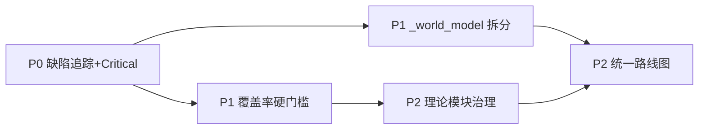

# MCI World Model P0-P2 实施计划书

> **基线版本**: v4.6.0（`main @ 7c82c48`，2026-08-19）
> **评估依据**: 2026-08-20 项目综合评估报告（7.6/10，B+）
> **规划周期**: 2026-08-24 ~ 2026-10-16（共 8 周）
> **总预算**: ~39 人天
> **配套资产**: `docs/improvement-plans/04_fatal_defects.md`、`docs/CEWM-_world_model.py模块拆分设计文档.md`、`docs/ROADMAP_V3.0.0.md`、`docs/ROADMAP_V3.0.7-V3.1.0.md`

---

## 总览

本计划书承接 2026-08-20 综合评估结论，针对评估建议中的 **P0-P2 五项任务** 制定可执行方案。五项任务按"先堵漏、再补墙、后整理"的顺序推进：

| 优先级 | 任务 | 编号 | 周期 | 人天 | 验收标准（硬性） |
|--------|------|------|------|------|------------------|
| **P0** | 致命缺陷追踪表 + Critical 闭环 | T1 | W1-2 | 10 | 12 项缺陷全部有状态/证据，Critical 归零 |
| **P1** | 覆盖率硬门槛 | T2 | W3 | 3 | `fail_under` 生效并入 CI，覆盖率不再"转人工" |
| **P1** | `_world_model.py` 拆分 | T3 | W4-6 | 15 | 单文件 ≤1500 行，测试全绿，外部导入零破坏 |
| **P2** | 理论模块分类治理 | T4 | W7-8 | 8 | 28 个模块打标 `experimental`，smoke 降级 |
| **P2** | 统一路线图 | T5 | W8 | 3 | 单份权威 `ROADMAP.md`，旧版归档 |

---

## 1. 背景与动机

2026-08-20 综合评估（实测数据）发现五个必须处理的治理缺口：

1. **缺陷无闭环**：2026-06-15 自评识别 12 项致命缺陷（4 Critical），当时全部 open；2 个月后抽查 F1 已修复、F8 已闭合、F6 有实质进展，但**没有版本化追踪表**，无法回答"Critical 还剩几个"。
2. **覆盖率门禁虚置**：`scripts/ai-verify/quality-gate.sh` 定义了 L2 阈值（核心≥95% / 分支≥90% / 工具≥85%），但实际执行长期"转人工确认"；`pyproject.toml [tool.coverage.report]` 无 `fail_under`。
3. **巨型文件**：`_world_model.py` 3,771 行（全仓最大），拆分设计文档已存在但未执行。
4. **理论模块失管**：28 个理论命名模块（13.5%）多数仅 smoke 级测试，与生产路径无隔离，可验证性弱。
5. **路线图多源**：`ROADMAP_V3.0.0.md`、`ROADMAP_V3.0.7-V3.1.0.md`、`docs/v4.0.0_cewm_iteration_plan.md` 并存，版本号 v3.0.0→v4.6.0 三个月跳 1.6 个大版本，历史曾承认"版本号混乱"。

## 2. 现状基线（实测，2026-08-19）

| 指标 | 数值 |
|------|------|
| 源码 | 213 文件 / 97,873 行 |
| 测试 | 168 文件 / 52,417 行 / 4,628 用例全绿（2 skip） |
| 质量门禁 | ruff 0 错误；mypy `--strict` 213 文件 0 错误；TODO/FIXME 0 |
| 复杂度 | C901 超限 62 处（`_autonomous_law_discoverer_v2.py` 8 处、`_world_model.py` 6 处） |
| 覆盖率 | 无自动阈值；ai-guard 覆盖率门禁长期转人工 |
| 门禁执行 | ai-guard 报告 124 份；CI 4-Gate（ruff/format/mypy/ai-guard）+ governance |
| 最大文件 | `_world_model.py` 3,771 行；`_autonomous_law_discoverer_v2.py` 2,377 行 |

---

## 3. T1（P0）：致命缺陷追踪表 + Critical 闭环

### 3.1 目标

建立**版本化缺陷追踪表**，12 项致命缺陷逐项验证并落状态，Critical 级全部修复或显式降级。

### 3.2 缺陷追踪表（初始状态）

来源：`docs/improvement-plans/04_fatal_defects.md`（F1-F12）。

| ID | 缺陷 | 级别 | 初始状态 | 证据位置（待验证） | 目标 |
|----|------|------|----------|---------------------|------|
| F1 | NSWM hash 路由 | Critical | 🟢 已修复 | `_neurosymbolic_world_model.py` L529/L622（"P0-F1 修复"标注） | 补回归测试后 closed |
| F2 | PEM char-hash 检索 | Critical | 🟢 已修复 | `_persistent_memory.py` L567（"P0-F2 修复"标注） | 补回归测试后 closed |
| F3 | Fisher 信息矩阵 O(N²) | High | 🟡 待验证 | 在线学习模块 | 降级技术债或修复 |
| F4 | EWC 50% 遗忘 | High | 🟡 待验证 | `_online_ewc.py` | 修复 |
| F5 | 多模态维度坍塌 | Critical | 🟡 待验证 | 多模态编码器 | closed |
| F6 | JEPA 名不副实 | High | 🟢 实质推进 | `_true_jepa_encoder.py::TrueJEPAEncoder.predict_next` | 补契约测试后 closed |
| F7 | 安全盲区 | High | 🟡 待验证 | 安全评估模块 | 降级技术债或修复 |
| F8 | Pearl 层级断裂 | High | 🟢 已闭合 | `_world_model.py` `intervene()`/`query_counterfactual()`/反事实图 | closed |
| F9 | 零形式化保证 | Medium | 🟡 待验证 | 核心算法 docstring | 降级技术债（标注） |
| F10 | 6 参数线性 JEPA | Critical | 🟡 待验证 | JEPA 预测器 | closed |
| F11 | 穷举规划 | High | 🟡 待验证 | 规划器 | 降级技术债或修复 |
| F12 | VAE 反事实维度错误 | High | 🟡 待验证 | 反事实模块 | 修复 |

> 🟢=已确认修复/闭合（代码证据） 🟡=待验证 🟠=降级为技术债 🔴=确认未修复

### 3.3 验证方法（每项缺陷必须满足）

| 步骤 | 内容 | 产出 |
|------|------|------|
| 1 | 代码证据：`rg` 定位缺陷代码段，确认修复/未修 | 文件:行号引用 |
| 2 | 测试证据：运行或新增针对性测试（oracle/invariant 级） | 测试名 + 通过记录 |
| 3 | 状态判定：closed / 降级技术债 / 未修复 | 追踪表状态更新 |
| 4 | 归档：每周五更新 `docs/defect-tracker.md` | git 可追溯提交 |

### 3.4 Critical 修复执行顺序

1. **W1**：F1/F8 补回归测试（`test_nswm_routing_semantic.py` 类）→ 转 closed。
2. **W1**：F2/F5/F10 验证；确认未修的在 04 规划书方案中选型（BM25 / 维度守卫 / 参数化 JEPA），单独立 `fix` 笔提交（≤800 行/笔）。
3. **W2**：F3/F4/F6/F7/F11/F12 验证并分级：可快速修复的修，需设计权衡的显式降级为技术债（在追踪表标 🟠 + 原因）。
4. **W2 末**：F9 统一补 docstring 不变量说明，降级技术债。

### 3.5 验收标准

- [ ] `docs/defect-tracker.md` 上线，12 项全有状态与证据链接
- [ ] Critical（F1/F2/F5/F10）全部 closed（F1/F2 已修复待补回归测试，F5/F10 验证后修复）
- [ ] High 级全部 closed 或显式降级（含理由）
- [ ] 全量 pytest 通过数不降（≥4,628）

---

## 4. T2（P1）：覆盖率硬门槛

### 4.1 目标

让覆盖率从"转人工确认"变为**机器可测、CI 阻断**。

### 4.2 现状

- `quality-gate.sh` 已有阈值（L2: 核心≥95% / 分支≥90% / 工具≥85%），但 L1/L2 强制逻辑下"无测试配置/未装 pytest"时转人工。
- `pyproject.toml [tool.coverage.report]` 空，无 `fail_under`。
- `Makefile cov` 存在但未接入 CI。

### 4.3 实施步骤

| 步骤 | 内容 | 产出 |
|------|------|------|
| 1 | 跑基线：`pytest --cov=mci_world_model --cov-report=term` 全量，记录核心/分支/工具真实值 | `docs/coverage-baseline-202608.md` |
| 2 | 定门槛：核心 ≥80%（分阶段：80% → 85% → 90%，每阶段 1 个版本周期） | `pyproject.toml [tool.coverage.report] fail_under` |
| 3 | CI 接入：`ci.yml` Gate 4 增加 `--cov --cov-report=term-missing --cov-fail-under=<阈值>` | CI 绿 |
| 4 | 缺口治理：按 `term-missing` 补核心路径测试（优先 sdk 主体 + algebra） | 覆盖率 ≥80% 持续绿 |

### 4.4 验收标准

- [ ] `fail_under` 写入 `pyproject.toml` 且全量 cov 通过
- [ ] CI Gate 4 覆盖率达到即阻断
- [ ] ai-guard 报告不再出现"覆盖率转人工确认"（L2）

---

## 5. T3（P1）：`_world_model.py` 拆分

### 5.1 目标

`_world_model.py` 从 3,771 行拆分至 **≤1,500 行**，外部导入路径零破坏。

### 5.2 方案（复用既有设计）

拆分设计文档已定义：65 方法分类、目标模块（`_cewm_engine.py` / `_energy_flow.py` 等）、re-export 兼容策略、isinstance 多重继承方案。本计划直接执行，不重新设计。

### 5.3 分阶段执行

| 阶段 | 内容 | 产出模块 | 风险 | 验证 |
|------|------|----------|------|------|
| 3a | 数据类提取（低风险） | 独立 dataclass 模块 | 低 | `test_world_model_e2e.py` 等全绿 |
| 3b | 方法迁出为 Mixin（按 CEWM/能量流/干预/反事实分组） | `_cewm_engine.py` 等 2-3 个 Mixin | 中 | 全部引用走 re-export，`__init__` 导出不变 |
| 3c | 能量流与 JEPA 桥接拆分 | `_energy_flow.py` | 中 | JEPA/能量测试全绿 |
| 3d | 主文件收敛：重复片段合并、`_world_model.py` 只留编排层 | `_world_model.py` ≤1,500 行 | 高 | 全量 4,628 用例 + mypy strict |

### 5.4 提交纪律

- 每笔 ≤800 原始行（ai-guard 上限），每阶段 2-4 笔 `refactor(world-model)` 提交。
- 每笔先跑 `test_world_model_*.py` + `test_energy_*.py`，阶段末跑全量。
- 禁止与功能修复混批。

### 5.5 验收标准

- [ ] `_world_model.py` ≤1,500 行（`wc -l` 实测）
- [ ] `from mci_world_model.sdk import MCIWorldModel` 及既有全部导入路径不变
- [ ] 全量 pytest ≥4,628 通过；mypy `--strict` 0 错误
- [ ] C901 中 `_world_model.py` 的 6 处超限函数随拆分自然下沉或显式重构

---

## 6. T4（P2）：理论模块分类治理

### 6.1 目标

28 个理论命名模块与生产路径物理隔离，测试分级显式化，消除"宏大叙事 vs 弱验证"落差。

### 6.2 模块候选清单（28 个 + P 系列 bridge）

> 候选清单按命名关键词审计（eternal/quantum/genesis/transcendence/cosmic/universe/ultimate/existence/federation/theorem/consciousness/creation/civilization/agi），**最终分级以 T4 步骤 1 依赖审计为准**（含 `_p15_causal_universe_bridge`~`_p19_transcendence_bridge` 系列）。

`_agi_protocol` `_causal_consciousness` `_causal_creation_engine` `_causal_federation_protocol` `_causal_universe_theory` `_cosmic_awareness` `_cosmic_trust` `_creative_consciousness` `_eternal_protocol` `_existence_axioms` `_existence_realization` `_existence_theorem` `_existence_verify` `_federated_consciousness` `_federation_arch` `_federation_audit` `_final_theorem` `_knowledge_civilization` `_p15_causal_universe_bridge` `_p16_eternal_intelligence_bridge` `_p18_genesis_bridge` `_p19_transcendence_bridge` `_protocols` `_quantum_causal_inference` `_quantum_classical_bridge` `_ultimate_causal_intelligence` `_ultimate_unification` `_unified_consciousness`

### 6.3 分级治理方案

| 等级 | 判定 | 处置 |
|------|------|------|
| A 生产 | 被 sdk 主干/业务（nutrition/server）实际调用且测试 ≥ contract 级 | 保留现状，纳入覆盖率硬门槛 |
| B 实验 | 有真实算法（如量子启发、联邦）但验证弱 | 模块 docstring 加 `Experimental` 标头 + 构造时 `warnings.warn`；测试标 `@pytest.mark.slow` |
| C 探索 | 纯理论/叙事（如 genesis/transcendence/ultimate）无业务调用 | 移入 `src/mci_world_model/_exploratory/`（新目录），sdk `__init__` 不再默认导出，仅显式导入 |

### 6.4 实施步骤

1. **依赖审计**：`rg "from mci_world_model.sdk._xxx" src/` 绘制 28 模块调用图 → 分 A/B/C 级。
2. **B/C 级打标**：docstring 标头 + `warnings.warn`（B 级）；移动目录 + 更新引用（C 级）。
3. **测试降级**：B/C 级 smoke 测试统一标 `@pytest.mark.slow`（CI 默认 `-m "not slow"`），oracle/invariant 级保留。
4. **README/文档标注**：实验模块清单与启用方式。

### 6.5 验收标准

- [ ] 28 模块全部有 A/B/C 分级（表格入 `docs/module-classification.md`）
- [ ] B 级全部有 `Experimental` 告警；C 级全部移出 sdk 默认导出
- [ ] CI 默认排除 slow 后仍全绿；显式跑 slow 亦全绿

---

## 7. T5（P2）：统一路线图

### 7.1 目标

废除多份 ROADMAP，收敛为**单份权威路线图** + 版本策略。

### 7.2 现状问题

- `ROADMAP_V3.0.0.md` / `ROADMAP_V3.0.7-V3.1.0.md` / `docs/v4.0.0_cewm_iteration_plan.md` 并存且内容过时（仍写 v3.x 版本引用）。
- 无版本升级策略（3.0→4.6 三个月跳 1.6 个大版本）。

### 7.3 实施步骤

1. **内容盘点**：合并三份文档的仍有效条目（架构加固 KPI、P0 波次目标）。
2. **定版本策略**：采用 语义化版本：minor 每 2 周发布节奏，`4.7.0` 起（4.6.0 为当前基线）；破坏性变更前必须 RFC 文档。
3. **产出 `docs/ROADMAP.md`**：v4.7 → v5.0 三窗口（每个窗口 3-5 个 KPI 条目，全部来自本计划书 + 04 缺陷规划书）。
4. **归档**：旧 ROADMAP 移入 `docs/archive/`，README 链接指向新 ROADMAP。

### 7.4 验收标准

- [ ] 仅 `docs/ROADMAP.md` 一处权威，README 引用更新
- [ ] 旧 ROADMAP 全部归档并标注"已废弃"
- [ ] `__version__` 与 pyproject/CHANGELOG 单一来源（`health_check` 已收敛，版本策略文档化）

---

## 8. 执行顺序与依赖

- **T1 先行**：Critical 修复会触碰 `_world_model.py`/JEPA，先于 T3 拆分避免冲突。
- **T2 与 T3 并行风险**：覆盖率基线先于拆分测量（拆分不改变行为，覆盖率应稳定）。
- **T5 收尾**：路线图依赖前四项的产出（KPI 来源），最后统一写。

## 9. 风险与对策

| 风险 | 等级 | 对策 |
|------|------|------|
| T3 拆分破坏外部导入（sdk 202 个导出符号） | 高 | re-export 逐笔验证；`__init__.py` 导出测试先行；阶段 3b/3c 用 Mixin 隔离 |
| F2/F5/F10 修复引入新回归 | 中 | 每缺陷独立 `fix` 笔 + oracle/invariant 级测试；ai-guard 全程把关 |
| 覆盖率门槛暴露大面积缺口，治理蔓延 | 中 | 分阶段 80→85→90；先保核心路径（algebra/sdk 主干），缺口入 backlog |
| C 级模块移动导致引用断裂 | 中 | 依赖审计先行；移动笔与引用更新笔同批 |
| 全量测试时长（9 分钟）拖慢迭代 | 低 | CI 拆分 unit/fast 与 full 两级；本地默认 fast |

## 10. 验收总清单（最终）

- [ ] `docs/defect-tracker.md`：12 项缺陷全状态、Critical 归零
- [ ] 覆盖率：`fail_under` 生效、CI 阻断、基线 ≥80%
- [ ] `_world_model.py` ≤1,500 行，外部导入零破坏，4,628+ 测试全绿
- [ ] 28 理论模块全分级，B/C 级打标或隔离，CI 默认排除 slow 仍绿
- [ ] 单份 `docs/ROADMAP.md` 权威，旧版归档，版本策略文档化
- [ ] ruff 0 / mypy `--strict` 0 / ai-guard 全绿（贯穿全程）
